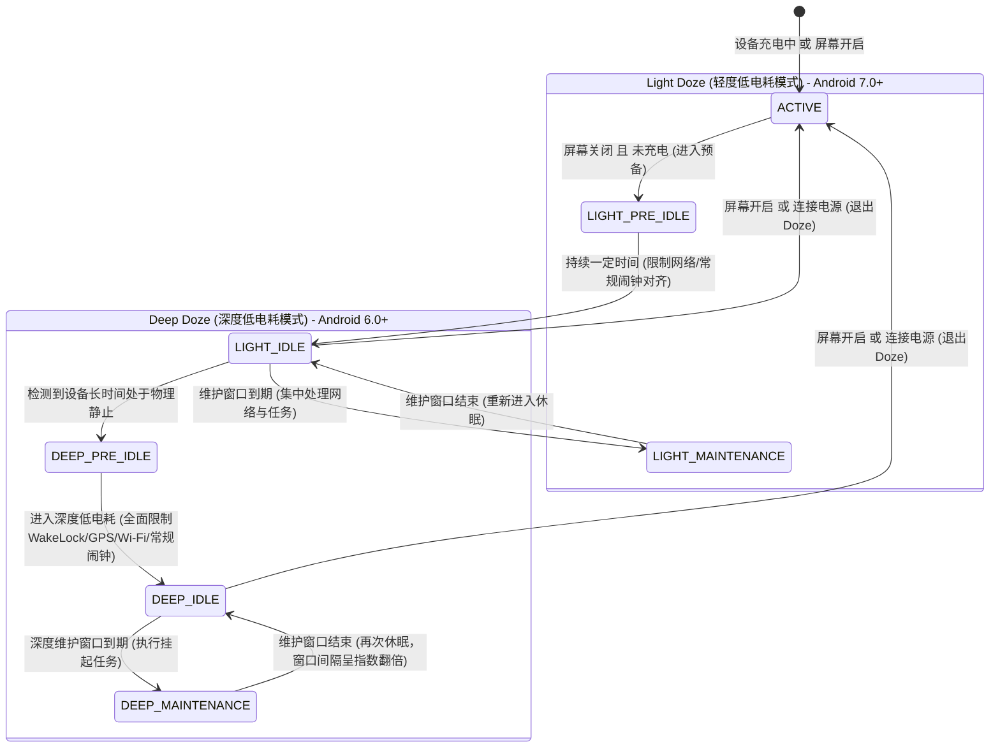
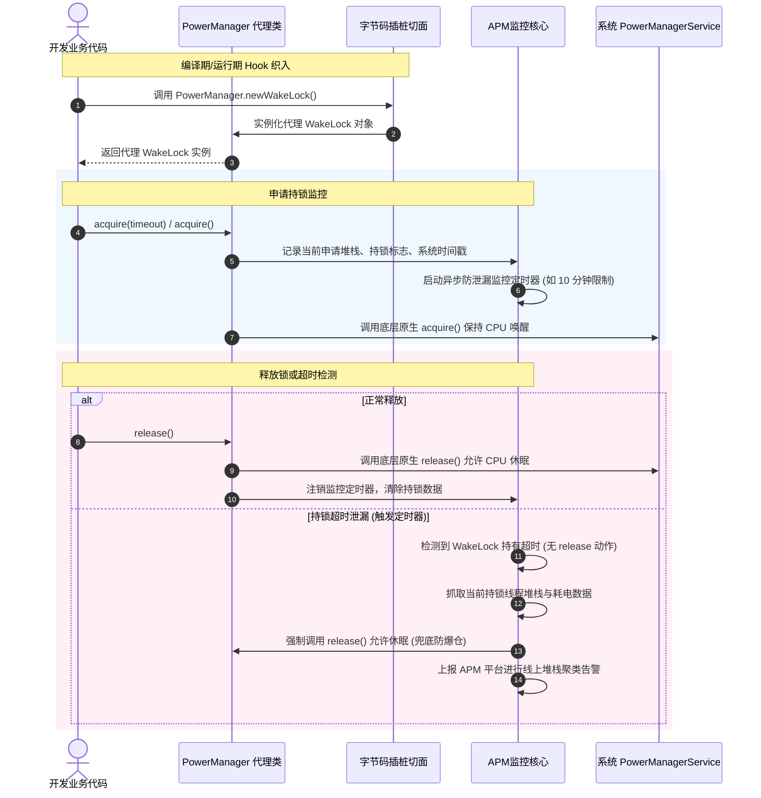

# 5.4.6.4 耗电优化

在移动设备中，电量是极其宝贵且敏感的硬件资源。随着 Android 系统版本的演进，Google 对后台行为的限制手段愈发严苛，其核心目标就是为了降低整体功耗，延长设备的续航时间。耗电优化不同于内存优化或卡顿优化，它不仅是一个“纯软件层”的问题，更是**软件逻辑与底层硬件（CPU、射频芯片、屏幕、传感器等）能耗特性进行深度博弈**的结果。

本篇将从 Android 应用后台功耗基础、硬件能耗分配模型、关键系统机制（WakeLock / AlarmManager）、后台任务对齐（WorkManager）、定位服务治理，以及电量度量与监控体系等维度，展开全方位的深度解析。

---

## 第一部分：Android 应用后台功耗基础与硬件能耗分配

### 1.1 硬件功耗构成与计算模型

要实现精准的耗电优化，首先必须理解移动设备硬件的功耗构成。Android 设备上的硬件能耗分配通常由以下几个核心部件主导：

```
                              ┌────────────────────────┐
                              │     移动设备整机功耗     │
                              └───────────┬────────────┘
                                          │
        ┌───────────────────┬─────────────┼─────────────┬──────────────────┐
        ▼                   ▼             ▼             ▼                  ▼
  ┌───────────┐       ┌───────────┐ ┌───────────┐ ┌───────────┐      ┌───────────┐
  │  CPU/GPU  │       │  显示屏幕  │ │  蜂窝射频  │ │ Wi-Fi射频 │      │ 定位/Sensor│
  └─────┬─────┘       └─────┬─────┘ └─────┬─────┘ └─────┬─────┘      └─────┬─────┘
        │                   │             │             │                  │
  ┌─────┴─────┐       ┌─────┴─────┐ ┌─────┴─────┐ ┌─────┴─────┐      ┌─────┴─────┐
  │ C-states  │       │LCD 背光板 │ │ DCH / FACH│ │PSM模式与  │      │GNSS星历下载│
  │ P-states  │       │OLED 自发光│ │ Tail Time │ │DTIM对齐   │      │FIFO/Hub分流│
  └───────────┘       └───────────┘ └───────────┘ └───────────┘      └───────────┘
```

#### 1. CPU 占空比（Duty Cycle）与 EAS 能耗调度模型
CPU 的功耗是非线性的，主要受**运行主频与电压（P-States）**以及**休眠深度（C-States）**的影响。
*   **P-States（Performance States）**：指 CPU 在工作状态下的电压与频率组合。根据半导体物理学原理，动态功耗公式为 $P = C \cdot V^2 \cdot f$（其中 $C$ 为负载电容，$V$ 为工作电压，$f$ 为工作频率）。由于工作电压 $V$ 通常随频率 $f$ 同步拉高，功耗与主频的增长呈非线性的立方关系。这意味着，当 CPU 运行在高频（例如大核满载）时，功耗会成倍飙升。
*   **C-States（Cpu States）**：指 CPU 的省电休眠状态。从 C0（正常工作）到 C1（暂停执行指令 HALT）、C2（关闭核时钟）、甚至更深的 C6（彻底切断核心电压、清空 L1/L2 缓存），休眠越深，静态漏电流越小，功耗越低。然而，深休眠的切换也伴随着硬件上下文保存与恢复的显著延迟和能量开销。
*   **EAS（Energy Aware Scheduling）能耗感知调度器**：现代 Android 内核采用 EAS 调度算法。EAS 的核心是在保证性能的前提下，寻找整机功耗最小的 CPU 核心来运行当前线程。EAS 依赖于两个核心技术：
    *   **PELT（Per-Entity Load Tracking）**或 **WALT（Window-Assisted Load Tracking）**：用于精确计算每个线程对 CPU 算力的需求（负载估算）。
    *   **Energy Model (EM)**：内核中存储的 CPU 功耗表，定义了每个核心在每个频率下的能耗代价。调度器在分配任务时，会预测任务放入某个核心后整机能耗的变化，从而避免盲目唤醒大核。
*   **CPU 占空比（Duty Cycle）**：指 CPU 处于 Active 状态的时间占总时间的比例。在后台优化中，我们的目标是**让 CPU 尽可能快地完成工作，并迅速、长时间地滑入深度的 C-State，避免 CPU 被零碎的任务频繁唤醒（即所谓的“打碎休眠”）**。因为每次唤醒 CPU，不仅有 C-State 切换本身的硬件电压迁移开销，还会拉起相关的外设总线，带来额外的功耗毛刺。

#### 2. 屏幕亮度、刷新率与背光功耗
屏幕是设备前台运行时的耗电大户，其功耗模型因屏幕材质而异：
*   **LCD 屏幕**：采用背光板点亮的方式。无论屏幕上显示的是白色还是纯黑色，背光板都是全亮工作的，液晶分子的偏转仅用于阻挡光线。因此 LCD 的功耗几乎仅由**背光亮度**决定。
*   **OLED / AMOLED 屏幕**：属于自发光像素。显示纯黑色时，像素点直接关闭，功耗降为零；显示高亮度白色时，像素点全功率发光，功耗达到峰值。因此，**暗色模式（Dark Mode）**在 OLED 屏幕上具有极其显著的物理省电效应（在 OLED 屏下，将应用界面切换为深色系可使屏幕功耗降低 10% ~ 60% 不等）。
*   **PSR（Panel Self Refresh，屏幕自刷新）**：当屏幕显示的是静态画面时（如阅读小说），SoC 的 Display Link（显示通道总线）会暂停向屏幕发送像素帧数据，转而由屏幕面板自带的专有帧缓冲区和 DDIC（屏幕驱动芯片）进行本地刷新。这允许主 SoC 的显示模块进入休眠，从而节省高达 100mW 的功耗。
*   **显示刷新率与 VRR（Variable Refresh Rate）**：在 60Hz 提升到 90Hz/120Hz 甚至更高刷新率时，不仅屏幕驱动芯片（T-CON）功耗会增加，GPU 的渲染负载与 Display Pipeline 的传输开销也会等比例增加。通过自适应调整刷新率（非交互状态下降到 10Hz/1Hz），可以有效挽回部分功耗。

#### 3. 蜂窝/Wi-Fi 射频（Radio）尾流功耗
网络传输的功耗主要由射频芯片（Radio）贡献，这里存在极其关键的**蜂窝网络状态机（RRC State Machine）**与**尾流效应（Tail Time）**：
*   **RRC 状态转换**：
    *   **DCH (Dedicated Channel)**：专用信道状态。射频发射机全功率运行，数据传输速率最高，功耗也最大（通常为 100mA ~ 300mA 甚至更高）。
    *   **FACH (Forward Access Channel)**：前向接入信道状态。射频以较低功率运行，用于小流量数据传输，功耗约为 DCH 的一半。
    *   **PCH (Paging Channel) / IDLE**：寻呼信道/空闲状态。不发送数据，仅周期性监听寻呼信号，功耗极低（通常小于 5mA）。
*   **尾流效应（Tail Time）**：当应用完成一次网络数据发送后，射频芯片并不会立即退回到 IDLE 状态，而是会保持在 DCH 状态一段时间（通常为 5 ~ 10 秒），以防后续还有数据需要紧接着发送，从而避免频繁重新握手建链。如果在 DCH 尾流结束后仍无数据，芯片才会降级到 FACH 状态，再经过一段尾流时间（通常为 5 ~ 15 秒），最后降级到 PCH / IDLE 状态。
*   **功耗陷阱**：**零碎的小包心跳或频繁的数据上报是耗电杀手**。如下图所示，即使应用只发送 1 字节的数据，也会拉起射频芯片进入高能耗的 DCH 状态，并在数据发送完毕后强行产生 10 多秒的尾流高功耗。如果每隔 15 秒发送一次小包心跳，蜂窝射频芯片将**永远被钉在高功耗的尾流状态中**，无法返回 IDLE。

```
心跳包发送时射频功耗状态图：
功耗 (mA)
  ▲
DCH│  ┌─┐数据传输              ┌─┐数据传输
   │  │ │                  │ │
   │  │ └─────────┐        │ └─────────┐
FACH│  │          │尾流时间 │           │尾流时间
   │  │          └─┐       │           └─┐
IDLE│──┘            └──────┘             └──────► 时间 (s)
      │◄── 5s ──►│◄─── 10s ───►│
```

*   **Wi-Fi PSM（Power Save Mode）与 DTIM 对齐**：在 Wi-Fi 网络下，芯片同样有省电机制。当没有数据传输时，Wi-Fi 芯片会进入休眠，仅周期性地通过 DTIM（Delivery Traffic Indication Message，传输指示消息）间隔被 AP 唤醒以接收广播数据。如果应用高频发送小包，就会破坏 DTIM 的睡眠周期，导致 Wi-Fi 射频芯片频繁拉起。

#### 4. GPS 搜星及 Sensor 持续采样等硬件功耗
*   **GPS / GNSS 定位**：GPS 芯片在工作时需要拉起高频射频接收机，并利用基带处理器对微弱的卫星信号进行相关性解调（冷启动时还需要下载星历数据，计算量巨大）。在遮挡严重的室内或城市峡谷环境下，GPS 芯片为了捕捉信号会不断加大低噪声放大器（LNA）的增益，导致功耗暴增并严重发热，电流可高达 80mA ~ 150mA。
*   **Sensor 采样与分流（Sensor Hub）**：加速度计、陀螺仪、磁力计等传感器本身的功耗通常在微安（$\mu\text{A}$）级别，本身并不高。然而，如果传感器每产生一个事件都要唤醒 CPU 进行业务逻辑处理，那么功耗的源头就变成了 CPU 频繁唤醒的开销。
*   **硬件分流（FIFO/Sensor Hub）**：现代 Android 硬件利用底层的 **Sensor Hub 协处理器**（如基于 ARM Cortex-M 的微控制器）来接管传感器事件。在休眠状态下，主 CPU 完全断电，传感器采集的数据暂时存放在芯片自带的硬件 FIFO 缓冲区中。只有当缓冲区满（或者检测到步数、显著运动等特定中断）时，Sensor Hub 才会发送硬件中断唤醒主 CPU。

### 1.2 系统功耗评估模型（Power Profile）

Android 系统本身无法直接通过硬件电流表物理测量每个应用的实时电流，它是通过**软件积分累加模型**来估算每个应用和硬件的电量消耗的。

在系统源码中，该计算工作由 `BatteryStatsService` 和 `PowerCalculator` 家族（如 `CpuPowerCalculator`、`MobileRadioPowerCalculator`、`WakelockPowerCalculator` 等）共同完成。其底层的物理计算依据是存储在设备 ROM 中的配置文件：
`power_profile.xml`（路径通常为 `/frameworks/base/core/res/res/xml/power_profile.xml`，由各设备厂商根据出厂时对硬件实测的电流数据进行硬编码配置）。

我们来看一个典型的 `power_profile.xml` 片段：

```xml
<device name="Android">
  <!-- 屏幕在全黑和最亮状态下的电流值 (mA) -->
  <item name="screen.on">120.0</item>
  <item name="screen.full">450.0</item>
  
  <!-- CPU 处于 Idle 状态下的底电流 (mA) -->
  <item name="cpu.idle">4.5</item>
  <!-- CPU 各个簇(Cluster)在不同频率下的运行电流 (mA) -->
  <array name="cpu.active.cluster0">
    <value>25.0</value>  <!-- 频率1 -->
    <value>45.0</value>  <!-- 频率2 -->
    <value>80.0</value>  <!-- 频率3 -->
  </array>
  
  <!-- GPS 定位激活时的电流值 (mA) -->
  <item name="gps.on">90.0</item>
  
  <!-- 蜂窝无线电处于不同信号强度下的电流值 (mA) -->
  <array name="radio.on">
    <value>120.0</value> <!-- 弱信号 -->
    <value>80.0</value>  <!-- 强信号 -->
  </array>
  <item name="radio.scanning">150.0</item>
</device>
```

#### 功耗估算计算模型公式
系统对于某一应用 $A$ 在时间段 $T$ 内的功耗估算公式如下：

$$E_A = \sum_{h \in \text{Hardware}} \int_{0}^{T} I_h(\text{state}(t)) \cdot \omega_{A,h}(t) \, dt \times V_{\text{battery}}$$

其中：
*   $E_A$：应用 $A$ 消耗的能量（单位：焦耳或毫安时 mAh）。
*   $I_h(\text{state}(t))$：硬件部件 $h$ 在时刻 $t$ 的状态下对应的标准电流值（来自 `power_profile.xml`）。
*   $\omega_{A,h}(t)$：权重系数，代表时刻 $t$ 硬件 $h$ 的功耗中有多少比例应当归属给应用 $A$。例如，如果 CPU 此时有 30% 的时间在执行应用 $A$ 的线程，则 $\omega_{A,\text{cpu}}(t) = 0.3$；如果是应用 $A$ 持有了一个 WakeLock 强行阻止系统休眠，则这段时间内系统 CPU 的底电流消耗将 100% 算在应用 $A$ 头上。
*   $V_{\text{battery}}$：电池当前的工作电压。

系统通过 `BatteryStatsService` 周期性读取内核的 `/proc/uid_cputime/show_uid_stat` 等节点，获取各 UID 的 CPU 运行时间片，再结合上述公式进行离散累加，最终呈现在“系统设置 -> 电池使用情况”列表中。

---

## 第二部分：WakeLock 唤醒锁与 AlarmManager 机制

### 2.1 WakeLock 唤醒锁原理与滥用治理

#### 1. WakeLock 的分类与适用场景
`WakeLock` 是 Android 框架提供的一种机制，允许应用控制设备的电源状态。最核心的分类如下：

| 唤醒锁级别 / 标志 | CPU 状态 | 屏幕状态 | 键盘背景灯 | 替代方案与推荐实践 |
| :--- | :--- | :--- | :--- | :--- |
| `PARTIAL_WAKE_LOCK` | **保持 Active** | 可关闭 | 可关闭 | **后台唯一合法的锁**，但需严格控制生命周期，推荐用 `WorkManager` 代替。 |
| `SCREEN_DIM_WAKE_LOCK` | 保持 Active | 变暗 | 关闭 | *已弃用*。应转用 `WindowManager.LayoutParams.FLAG_KEEP_SCREEN_ON`。 |
| `SCREEN_BRIGHT_WAKE_LOCK` | 保持 Active | 变亮 | 关闭 | *已弃用*。应转用 `WindowManager.LayoutParams.FLAG_KEEP_SCREEN_ON`。 |
| `FULL_WAKE_LOCK` | 保持 Active | 变亮 | 变亮 | *已弃用*。应转用 `WindowManager.LayoutParams.FLAG_KEEP_SCREEN_ON` |

> [!IMPORTANT]
> 对于任何前台界面的常量显示（如播放视频、游戏画面、导航地图），**强烈禁止**使用 `WakeLock`。因为一旦持有 UI 相关的 WakeLock，如果 Activity 发生异常退出或销毁而未能释放锁，屏幕将永远保持点亮，导致设备在几个小时内彻底放空电量。推荐使用 `WindowManager.LayoutParams.FLAG_KEEP_SCREEN_ON`，其生命周期由 Window 自动接管，页面销毁时锁自动失效，绝无泄漏风险。

#### 2. 底层机理：不合理持锁导致 CPU 无法进入深睡眠 C-State
在 Linux 内核电源管理（PM）机制中，CPU 深度休眠主要依赖系统级的 `suspend-to-RAM`。
1.  当用户按下电源键熄灭屏幕后，Android 的 `PowerManagerService`（简称 PMS）会发起系统休眠流程。
2.  PMS 会向下调用内核空间的 `state_store` 节点，向 Linux 内核写入 `mem` 触发 suspend。
3.  内核的电源管理驱动在执行 suspend 之前，会检查所有注册的 `wakeup_sources`（在旧版 Linux 内核中被称为 `wakelocks` 节点，位于 `/sys/kernel/debug/wakeup_sources`）。
4.  如果应用层通过 `PowerManager.WakeLock` 持有了 `PARTIAL_WAKE_LOCK`，PMS 就会向内核注册或激活一个对应的 `wakeup_source` 节点。
5.  内核的 `suspend` 主循环在扫描时发现有活跃（Active）的 `wakeup_source`，会**立即中断休眠流程**，退回工作状态。
6.  其底层结果是：**CPU 被迫保持在 P-State（工作状态）以响应代码执行，无法降级到低能耗的 C-State（C3 到 C6），各硬件总线也无法关闭，导致整机待机电流由正常的 2mA ~ 5mA 瞬间飙升至 100mA ~ 300mA，电池寿命急剧缩水。**

```
WakeLock 阻止内核休眠的底层链路：
┌─────────────────┐       acquire()       ┌──────────────────────┐
│  应用层 APP 代码 │ ───────────────────► │ PowerManagerService  │
└─────────────────┘                       └──────────┬───────────┘
                                                     │ 写入 wakeup_sources 节点
                                                     ▼
┌─────────────────┐  检查 wakeup_sources   ┌──────────────────────┐
│  Linux 内核 PM   │ ◄───────────────────  │ /sys/class/wakeup/...│
└────────┬────────┘                       └──────────────────────┘
         │
         ├─── 存在活跃 the wakeup_source ─► [中断 suspend 流程] ──► CPU 保持 P-State (高功耗)
         │
         └─── 无任何活跃 the wakeup_source ─► [进入 suspend-to-RAM] ─► CPU 降入深度 C-State (低功耗)
```

*   **内核级别的挂起拦截流程**：
    在 Linux 内核中，当写入 `mem` 到 `/sys/power/state` 时，内核电源管理模块会调用 `pm_suspend()`。在执行到 `suspend_enter()` 阶段，系统会调用 `pm_wakeup_pending()`。该函数会遍历 `wakeup_sources` 链表。如果有任何一个 source 处于 `active` 状态（即其 `active_count > 0` 且未释放），`pm_wakeup_pending()` 会返回 `true`，此时内核会立即停止冻结用户空间进程和外设，放弃当前挂起事务并开始唤醒流程。

#### 3. 规范化持锁与动态防御
治理 WakeLock 的第一步是**规范编码**，第二步是**运行时安全网**。

*   **规范一：必须使用带超时机制的 `acquire(timeout)`**
    千万不要使用无参的 `acquire()`，哪怕业务逻辑里有对应的 `release()`。因为如果持有锁的线程在执行任务时发生未捕获异常、ANR、甚至死锁，`release()` 代码将永远不会被执行，导致锁发生永久性泄漏。
*   **规范二：加锁代码防御结构**
    持锁与释放锁必须成对出现，且务必包裹在 `try-finally` 中：

```kotlin
val wakeLock = powerManager.newWakeLock(PowerManager.PARTIAL_WAKE_LOCK, "MyApp:ResourceSyncTag")
try {
    // 强制设置超时保护，如最大限制 5 分钟，防止业务挂死导致永久持锁
    wakeLock.acquire(5 * 60 * 1000L) 
    doHeavyNetworkSync() // 核心后台任务
} catch (e: Exception) {
    Log.e("Sync", "Task failed", e)
} finally {
    if (wakeLock.isHeld) {
        try {
            wakeLock.release()
        } catch (e: RuntimeException) {
            // 防止重复释放抛出 RuntimeException: WakeLock under-locked
        }
    }
}
```

#### 4. 后台执行限制（Background Execution Limits）历史演进
为了对抗恶意保活和失控持锁，Android 系统强制限制了后台服务的运行：
*   **Android 8.0 (API 26)**：引入了后台执行限制（Background Execution Limits）。当应用退入后台几分钟后，系统会视其为空闲，限制其通过 `startService()` 启动后台服务，否则抛出 `IllegalStateException`。此时必须使用前台服务（Foreground Service）并显示通知，或使用任务调度器。更多历史详情见 [AndroidVersionChangeLog.md](../../../../../AndroidVersionChangeLog.md#android-80--81api-26--27)。
*   **Android 12 (API 31)**：前台服务启动限制。除了特定情况（如高优广播接收器、闹钟等），应用处于后台时无法启动前台服务，强行启动会抛出 `ForegroundServiceStartNotAllowedException`。这彻底扼杀了通过伪造前台服务进行无限后台保活与耗电的行为。
*   **Android 14 (API 34)**：引入了严格的前台服务类型声明要求（`android:foregroundServiceType`）。每个前台服务必须关联特定类型，若声明与实际行为不符或未在 Manifest 注册，系统将直接终止其运行，进一步规范了后台能耗。

### 2.2 AlarmManager 唤醒机制与 Doze 模式

`AlarmManager` 提供了一种在应用进程生命周期之外、由系统级硬件时钟触发定时任务的能力。它通过向 Linux 内核的 `/dev/rtc` 设备写入闹钟时间，使得即便在 CPU 处于深度睡眠（suspend）状态时，硬件 RTC 闹钟产生的中断也能强制将 CPU 唤醒，拉起对应的广播或服务。

#### 1. Doze Mode（低电耗模式）对 Alarm 的对齐限制与豁免边界
为了解决应用滥用 RTC 唤醒锁导致系统无法长眠的问题，Android 系统在不同版本中持续收紧了对 Alarm 的控制。

*   **Android 6.0 (API 23) 引入低电耗模式（Doze Mode）**：
    当设备未插电源、屏幕关闭且静止不动时，系统会进入 Doze 模式。此时，系统会停止所有的网络访问，同步任务（SyncAdapter）被挂起，所有的普通 Alarm（如通过 `set()`、`setExact()` 设置的闹钟）都会被**拦截并推迟**，直到系统周期性打开的**维护窗口（Maintenance Window）**时，才会将所有被推迟的任务集中合并执行。关于 Doze 模式的更多历史演进，可参见 [AndroidVersionChangeLog.md](../../../../../AndroidVersionChangeLog.md#android-60api-23)。
*   **Android 7.0 (API 24) 增强型 Doze**：
    引入了“双层 Doze”。第一层 Light Doze 只要屏幕关闭且未充电即可触发（无需物理静止），限制网络访问并对齐普通 Alarm；第二层 Deep Doze 则需保持静止，限制更为彻底。
*   **Doze 模式的流转状态机**如下所示：



*   **对齐限制与豁免 API 边界**：
    由于普通 Alarm 被延迟，对于一些强时效性的业务（如即时通讯心跳、日程提醒、闹钟类 App），Google 提供了豁免 API，但有极严格的时间流控（Throttling）：
    *   `setAndAllowWhileIdle(type, triggerAtMillis, pendingIntent)` : 在 Doze 模式下允许唤醒设备，但系统会强制对触发频率进行流控。例如，在 Android 9.0 之后，**同个应用在后台每 9 分钟（甚至在特定低电量下 15 分钟）最多只能触发一次此类 Alarm**。
    *   `setExactAndAllowWhileIdle(type, triggerAtMillis, pendingIntent)`：高精度的豁免闹钟。除了具有上述的低电耗豁免外，它还保证了毫秒级的精确时间点触发。但同样受到 9-15 分钟的频次流控限制。
    *   `setAlarmClock(alarmClockInfo, pendingIntent)`：**最强豁免 API**。专门面向用户物理闹钟。系统会将此闹钟视为最高优先级，完全豁免 Doze 模式的延迟和频次流控。然而，它的代价是：系统会在状态栏右侧强制显示一个闹钟图标，并且系统设置中能够明确看到该应用设置了物理闹钟。若非真正的时钟类应用，滥用该 API 会被用户立刻卸载。

#### 2. AlarmManagerService 的 Batching 对齐原理
在 Android Framework 中，`AlarmManagerService`（Ams）并非为每个 Alarm 单独向驱动层注册一个硬件定时器。
*   Ams 内部维护了一个 `mAlarmBatches` 列表。
*   当应用通过 `set()` 或 `setExact()` 提交闹钟时，Ams 会计算该闹钟允许的窗口时间差（Window Time）。
*   Ams 内部使用对齐算法，扫描现有的各个 Batch。如果新闹钟的时间窗口与某个已有 Batch 的触发时间范围重叠，Ams 就会将新闹钟合并（Coalesce）到这个已有的 Batch 中。
*   最终，只有每个 Batch 中的第一个闹钟时间到期时，系统才会真正向底层 Linux 内核的 RTC 驱动注册警报唤醒。这种批处理极大地减少了硬件唤醒的总次数。

---

## 第三部分：后台任务对齐机制

为了防止每个 App 自行定义定时器拉起 CPU 和射频造成的电量雪崩，Android 系统在 API 21 引入了 `JobScheduler`，并在此之上由 Jetpack 衍生出了 `WorkManager`。它们的核心哲学是：**变主动拉起为被动响应，将后台任务在系统级进行对齐、合并和延迟执行。**

### 3.1 JobScheduler 与 WorkManager 系统级任务对齐与合并策略

传统的轮询架构是电量的天敌。如果有 5 个 App，各自每隔 20 分钟向服务器上报一次日志，在最坏的情况下，系统每隔 4 分钟就会被其中一个 App 唤醒一次，每次唤醒都会使 CPU 运转，使射频 Radio 产生 10 多秒的尾流时间。设备几乎无法进入休眠。

`JobScheduler` 的系统级对齐策略通过**任务推迟与合并（Batching & Coalescing）**彻底改写了这一局面。

*   **批处理（Batching）**：系统不会在应用提交任务后立刻执行，而是将任务暂存。系统会根据任务的性质（如非紧急性日志上报），把不同应用的任务打包在一起，在未来的某一个时间点一次性全部拉起执行。
*   **条件对齐（Coalescing）**：将任务的触发时机与系统状态（如充电、Wi-Fi 连接、屏幕关闭）绑定。只有当系统由于某种原因（如用户开启屏幕、系统收到一条微信消息、设备开始充电）被唤醒时，系统才会**顺便**将这些处于等待队列中的后台任务拉出来合并执行。这相当于“顺风车”机制，把单独拉起射频和 CPU 的次数降到了最低。

```
传统轮询任务执行模式 (射频芯片频繁唤醒)：
App1   ───[执行]────────────────────[执行]───────────────────►
App2   ──────────────[执行]───────────────────[执行]─────────►
App3   ───────────────────────[执行]────────────────────────►
射频   █████████████████████████████████████████████████████► (几乎无休眠)

JobScheduler/WorkManager 批处理合并模式 (射频仅唤醒一次)：
App1   ───────────┐
App2   ───────────┼───────► [合并到Wi-Fi+充电窗口执行]
App3   ───────────┘
射频   ░░░░░░░░░░░░░░░░░░░░████████████████░░░░░░░░░░░░░░░░░► (长时间处于 IDLE 休眠)
```

*   **JobSchedulerService (JSS) 底层调度**：
    在 JSS 中，当应用调用 `schedule()` 时，系统会将任务封装为 `JobStatus` 对象并保存到 `/data/system/job/jobs.xml` 中，以实现进程自杀后的持久化。
    系统服务内部包含数个 `StateTracker`（如 `BatteryController`、`ConnectivityController`、`DeviceIdleJobsController` 等），它们通过注册 Binder 回调来持续跟踪系统的底层硬件状态。
    当状态改变时，JSS 内部的 `ConstraintEvaluator` 会扫描当前处于等待状态的任务，判断其所需的 Constraints 是否全部满足。若满足，JSS 会调用 `JobServiceContext`，通过 Binder 跨进程拉起应用的 `JobService` 并在系统线程池中分发执行，从而完成系统级的被动触发。

#### 各种后台调度机制演进比对
在 Android 历史中，Google 提出过多种后台调度技术，其版本支持及技术取舍对比如下表：

| 技术框架 | 适用系统版本 | 是否依赖 GMS | 功耗批处理能力 | 机制与退化取舍 |
| :--- | :--- | :--- | :--- | :--- |
| **SyncAdapter** | Android 2.0+ | 否 | 弱 (仅同步账户数据) | 依赖系统 AccountManager，配置极其繁琐，无法响应网络约束，目前已淘汰。 |
| **GcmNetworkManager** | Android 2.3+ | **是** | 强 | 依赖 Google Play Services。在国内非 GMS 环境下完全不可用。 |
| **FirebaseJobDispatcher**| Android 2.3+ | **是** | 强 | 官方已完全废弃，其底层同样依赖 GPlay 服务的持久连接。 |
| **JobScheduler** | Android 5.0+ | 否 | **极强 (系统原生级)** | Android 原生支持，可在系统层级对齐所有 App。但在 5.0 以下系统无法兼容。 |
| **WorkManager** | Android 4.0+ | 否 | **极强 (自动适配)** | **官方推荐方案**。高版本使用 JobScheduler，在低于 5.0 的老设备上优雅自动退化为 AlarmManager + BroadcastReceiver。 |

### 3.2 WorkManager 触发约束机制底层原理与线程模型

我们常用的约束条件（`Constraints`）在底层的触发机制有着清晰的系统级链路：

```kotlin
val constraints = Constraints.Builder()
    .setRequiredNetworkType(NetworkType.UNMETERED) // 必须是 Wi-Fi 这种非计费网络
    .setRequiresCharging(true)                  // 必须在充电时
    .setRequiresDeviceIdle(true)                // 必须在设备空闲时
    .build()

val syncWorkRequest = OneTimeWorkRequestBuilder<SyncWorker>()
    .setConstraints(constraints)
    .build()
WorkManager.getInstance(context).enqueue(syncWorkRequest)
```

这些约束在 Android Framework 层的具体实现并非依靠应用在后台跑循环检测，而是依赖系统级的注册回调和观察者模式：

1.  **充电约束（`RequiresCharging`）**：
    在底层的 `ChargingTracker` 中，WorkManager 会在设备上注册一个针对 `Intent.ACTION_POWER_CONNECTED` 和 `Intent.ACTION_POWER_DISCONNECTED` 的广播接收器（BroadcastReceiver）。此外，它还会通过读取 `BatteryManager` 的属性来确认当前是否正在进行有线或无线充电。
2.  **网络约束（`RequiredNetworkType.UNMETERED`）**：
    在 `NetworkStateTracker` 中，WorkManager 利用系统的 `ConnectivityManager.registerNetworkCallback(NetworkRequest, NetworkCallback)` 方法注册网络状态回调。当底层的网络类型发生切换（如从 4G 变为 Wi-Fi，且 Wi-Fi 确认为非计费网络）时，系统会通过 Binder 回调通知应用，进而判定网络约束是否达成。
3.  **设备空闲约束（`RequiresDeviceIdle`）**：
    对于 `DeviceIdleConstraint`，底层主要是利用系统的 `DeviceIdleJobs` 或者是监听 `Intent.ACTION_SCREEN_OFF`（屏幕关闭）和 `Intent.ACTION_SCREEN_ON`（屏幕开启）广播。结合一定的延迟估算（确认用户最近几分钟内确实没有触摸屏幕且没有亮屏交互），此时系统会派发空闲信号，触发等待中的任务。

#### 1. WorkManager 线程模型与超时截断
*   **基于线程池的分发**：WorkManager 默认使用底层的 `Configuration.Executor` 线程池（通常具有核心线程数为 CPU 核心数的并发）来调度 Worker。如果是 Kotlin 协程开发的 `CoroutineWorker`，则会自动运行在指定的协程调度器（默认为 `Dispatchers.Default`）上，避免了主线程阻塞。
*   **10 分钟运行限制与 `onStopped` 响应**：
    为了防范应用在后台无限期运转导致耗电，系统的 `JobScheduler` 对每一个 `JobService` 都有最长 **10 分钟** 的强制运行限制（在某些深度省电机制下，限制时间可能更短）。如果任务超过了 10 分钟，WorkManager 的底层会触发任务终止流程，将任务状态标为已终止，并跨进程回调应用的 `onStopped()` 函数。如果开发人员在协程中**没有正确检测 isActive 标志**，或者在 Worker 中没有响应 `isStopped` 标志并及时退出演算循环，进程将被系统底层发送 `SIGKILL` 信号强行抹杀。

#### 2. Foreground Service 的代理模式与功耗边界
在某些特殊业务中（如后台大文件传输、运动跑步轨迹记录），应用必须在后台突破 10 分钟的强制限制。为此，WorkManager 提供了 `setForeground()` 机制。
*   **代理运作机制**：当 Worker 调用 `setForeground(getForegroundInfo())` 时，WorkManager 会在后台跨进程启动一个系统级的代理服务——`SystemForegroundService`。该代理服务会向系统调用 `startForeground(id, notification)`，将 WorkManager 包装的任务强行提升为“前台服务”优先级。
*   **功耗代价与警示**：一旦进入前台服务级别，该应用的进程优先级将被置为 `VISIBLE` 或 `PERCEPTIBLE`，系统将不再对其应用常规的后台 CPU 和网络 Throttling。然而，这对电池的消耗同样是灾难性的。在开发中，必须在 `getForegroundInfo()` 返回的 Notification 中向用户展示清晰的工作进度条，且在任务结束后必须立刻结束 Worker，切断前台服务，让 CPU 得以休眠。

---

## 第四部分：定位与无线传感器治理

定位服务（尤其是 GPS 芯片）是除屏幕和 3D GPU 之外的单体耗电冠军。高精度的 GPS 定位不仅会迅速耗尽电量，还会因为射频天线和射频前端放大器的持续发热而导致设备“烫手”。

### 4.1 GPS/GNSS 硬件定位发热功耗痛点

GPS（全球定位系统）或更泛指的 GNSS（全球导航卫星系统）的定位原理是：设备射频天线必须同时接收来自至少 4 颗卫星（为了确定经度、纬度、高度和时间偏差）发送的高频电磁波信号。
*   **搜星功耗失控**：GPS 信号从两万公里的太空传回，到达地面时极其微弱（通常在 -125dBm 到 -160dBm 之间）。当用户处于高楼林立的“城市峡谷”、高架桥下或室内时，由于多径效应和严重的建筑阻挡，射频接收芯片的低噪声放大器（LNA）会全功率运转，不断提高信号增益尝试捕捉卫星载波。在这个过程中，定位芯片会维持在 **100mA ~ 180mA** 的极高电流，且由于搜不到足够的卫星，定位无法收敛，芯片会**无限期保持在搜索状态**，引发严重发热与电量雪崩。

### 4.2 FLP (Fused Location Provider) 混合定位策略

在大部分非专业导航场景下，应用无需达到米级的 GPS 定位精度。通过使用 Google 提供的 **Fused Location Provider (FLP)**，或者国内厂商的混合定位 SDK，可以将 GPS 降级为基于网络（基站与 Wi-Fi 信号）的混合定位。

#### 1. FLP 定位机制与数据融合原理
FLP 在系统层面将 GPS、蜂窝网络定位、Wi-Fi 扫描（通过 RTT 往返时间和信号强度估算）以及内置惯性传感器（如步数传感器、重力传感器）的数据整合在一起。
*   **卡尔曼滤波（Kalman Filter）算法**：FLP 底层利用卡尔曼滤波算法，将不同来源、不同测量精度的状态数据进行动态加权融合。
    *   例如，在户外运动时，FLP 会利用加速度计的数据来预测设备下一步的位移，并与 GPS 信号进行卡尔曼预测修正。
    *   当检测到用户静止或进入室内时，卡尔曼增益会自动倾向于使用低功耗 we Wi-Fi 定位，并立刻切断 GPS 的供电，防止 GPS 在室内搜星无果引起的电量暴跌。

#### 2. 各定位提供者功耗对比
*   **GPS_PROVIDER (高功耗)**：强行拉起 GPS 芯片搜星。精度高（3m ~ 10m），但耗电极大。
*   **NETWORK_PROVIDER (中/低功耗)**：利用当前的基站小区 ID（Cell ID）和附近扫描到的 Wi-Fi SSID 列表，向定位服务器发送请求，通过服务器端的数据库查表与三角定位算法估算当前位置。精度中等（30m ~ 500m），耗电极低（仅需一次短暂的网络请求，电流微乎其微）。
*   **PASSIVE_PROVIDER (零额外功耗)**：**“被动定位监听”**。自身完全不主动触发任何定位硬件，仅仅作为监听者。当系统内其他应用（如高德地图、美团）拉起 GPS 触发定位时，系统会将获取到的位置坐标同步分发给注册了被动定位的应用。这属于纯粹的“搭便车”省电手段。

#### 3. FLP 混合定位参数设置代码示例

```kotlin
val locationRequest = LocationRequest.Builder(Priority.PRIORITY_BALANCED_POWER_ACCURACY, 10000)
    .apply {
        // 设置最快定位时间间隔，防止高频触发
        setMinUpdateIntervalMillis(5000)
        // 设置最大等待时间，用于批处理定位数据
        setMaxUpdateDelayMillis(30000)
    }.build()

// PRIORITY_BALANCED_POWER_ACCURACY 代表平衡功耗模式：
// 系统会优先使用 Wi-Fi 和基站定位，只有在绝对必要时才会极短时间拉起 GPS 辅助，功耗大为下降。
```

### 4.3 地理围栏（Geofencing）底层硬件加速

地理围栏允许应用设定一个虚拟的地理边界，当设备进入或离开该边界时触发特定的业务逻辑（如到达商圈推送优惠券）。

#### 硬件加速地理围栏（Hardware Geofencing）
现代移动 SoC（如高通骁龙、联发科天玑平台）内部都集成了一个极低功耗的协处理器——**Sensor Hub**（或称低功耗岛 LPI）。
1.  当应用通过 API 注册地理围栏时，系统会将围栏的经纬度坐标、半径和约束条件直接下发（Offload）到 Sensor Hub / GNSS 芯片的硬件寄存器中。
2.  主应用进程可以安全地自杀，主 CPU 也可以进入最深度的 C-State 睡眠。
3.  Sensor Hub 会以极低的功耗周期性读取传感器（如计步器确认设备是否移动）和附近的基站/Wi-Fi SSID 变化。
4.  **只有当 Sensor Hub 硬件引擎判定设备越界时，才在硬件层级产生一个硬中断唤醒主 CPU**。主 CPU 醒来后，系统服务通过 Binder 发送广播给我们的应用。
5.  这样，围栏监控的日常功耗从数十毫安陡降到微安级别，实现了全天候围栏监控而“零耗电”的体验。

```
硬件地理围栏与软件地理围栏对比图：
【软件地理围栏模式】
  [主CPU] ──定时唤醒──► [启动GPS定位] ──► [计算距离] ──► [继续休眠] ──(循环往复，极其耗电)

【硬件加速地理围栏模式】
  [主CPU] ──下发围栏参数──► [主CPU进入深度休眠] (功耗近乎为 0)
                                 │
                            [Sensor Hub / GNSS 硬件引擎监控基站/Wi-Fi/步数] (微安级超低功耗)
                                 │
                            越界中断信号触发
                                 ▼
                          [唤醒主CPU派发事件]
```

### 4.4 定位复用与无线扫描治理策略

在实际开发中，我们应当尽可能压榨系统缓存的定位数据，避免触发真实的射频定位。

```kotlin
fun obtainLowPowerLocation(context: Context, callback: (Location?) -> Unit) {
    val locationManager = context.getSystemService(Context.LOCATION_SERVICE) as LocationManager
    
    // 策略一：尝试获取系统缓存的上一次定位 (LastKnownLocation)
    // 这一步没有任何硬件启动开销，完全是内存/数据库查表，功耗为 0
    val lastKnownGps = locationManager.getLastKnownLocation(LocationManager.GPS_PROVIDER)
    val lastKnownNetwork = locationManager.getLastKnownLocation(LocationManager.NETWORK_PROVIDER)
    
    val bestLocation = getMoreAccurateLocation(lastKnownGps, lastKnownNetwork)
    if (bestLocation != null && (System.currentTimeMillis() - bestLocation.time) < 5 * 60 * 1000) {
        // 如果缓存的位置在 5 分钟以内，直接复用，认为有效
        callback(bestLocation)
        return
    }
    
    // 策略二：缓存失效，降级使用低功耗的单次定位
    // 单次定位在获取到第一个位置后会立即自动关闭硬件，避免持续监听
    val locationRequest = LocationRequest.Builder(Priority.PRIORITY_LOW_POWER, 1000)
        .setMaxUpdates(1) // 强制只更新一次
        .build()
        
    // 策略三：在后台使用 PASSIVE_PROVIDER
    // 仅仅被动接收别的应用拉起的高精度定位结果，实现免费搭便车
    locationManager.requestLocationUpdates(
        LocationManager.PASSIVE_PROVIDER, 
        10000L, 
        10f, 
        passiveLocationListener
    )
}
```

#### Wi-Fi 与蓝牙扫描（BLE）功耗治理
除了定位之外，Wi-Fi 和蓝牙扫描也是无线电功耗流失的重灾区。
*   **低功耗蓝牙（BLE）扫描模式（ScanMode）**：在调用蓝牙扫描 API 时，有三种核心扫描模式，耗电差距巨大：
    *   `SCAN_MODE_LOW_POWER`：只在极低占空比下进行周期性短时间扫描（例如：每隔几秒才扫 500 毫秒）。功耗极低，推荐作为后台扫描的唯一默认值。
    *   `SCAN_MODE_BALANCED`：平衡模式（例如：每秒扫描 250 毫秒）。适用于前台非连续交互。
    *   `SCAN_MODE_LOW_LATENCY`：**持续、不间断地全功率扫描**。此时蓝牙芯片射频一直处于接收模式，耗电高达 30mA ~ 50mA，这与 GPS 搜星功耗在同一个数量级。**在后台必须严禁使用此模式**。
*   **硬件级过滤（Offloaded Filtering）**：
    在执行 BLE 扫描时，应强制配置 `ScanFilter`。现代蓝牙控制芯片支持硬件级过滤。当我们将特定的 UUID 或 Mac 地址写入 `ScanFilter` 后，应用进程可以进入休眠，只有在蓝牙控制器真正扫描到匹配的包时，硬件控制器才会产生硬件中断信号唤醒 CPU。若传入空的 `ScanFilter`，则任何路过的蓝牙设备发送的广播包都会频繁将 CPU 从深度休眠中唤醒，造成严重后台耗电。

---

## 第五部分：电量监控与度量闭环

电量优化是一项需要长期保持的工程。如果在开发阶段缺乏量化手段，或者在线上没有监控闭环，随着业务版本的迭代，耗电问题必然会迅速劣化。因此，必须建立“离线深度诊断”与“线上 APM 监控预警”双重闭环体系。

### 5.1 Battery Historian 离线电量诊断工具原理与实战

`BatteryHistorian` 是 Google 官方推出的电量分析工具，它通过图形化界面解析系统 bugreport 日志，是离线分析功耗问题的“银弹”。

#### 1. 采集流程与底层原理
当设备运行时，Android 系统的 `batterystats` 模块会在内存中持续记录所有硬件状态变化、应用拉起、持锁历史以及警报触发事件。我们需要通过 `adb` 命令将这些日志导出：

```bash
# 1. 重置电量收集历史数据，排除干扰
adb shell dumpsys batterystats --reset

# 2. 开启 full-wake-history 记录，记录 WakeLock 的详细获取堆栈与时间线（极重要）
adb shell dumpsys batterystats --enable full-wake-history

# 3. 拔掉 USB 线，开始测试应用后台场景（拔线是为了模拟真实待机，防止充电对电量统计的干扰）
# ... 进行各种后台静置、网络同步、定位等用例测试 ...

# 4. 测试结束后，重新连接 USB，导出系统的 bugreport 压缩包
# 对于 Android 7.0 及以上系统：
adb bugreport bugreport.zip
```

#### 2. Battery Historian 核心指标解读
将导出的 `bugreport.zip` 上传到本地运行的 Battery Historian Docker 容器服务中，即可看到极具价值的功耗时间轴。我们需要重点盯住以下几个指标：

```
                              ┌────────────────────────┐
                              │ Battery Historian 分析 │
                              └───────────┬────────────┘
                                          │
         ┌────────────────────────┬───────┴────────┬────────────────────────┐
         ▼                        ▼                ▼                        ▼
  ┌─────────────┐          ┌─────────────┐  ┌─────────────┐          ┌─────────────┐
  │ Top App &   │          │ Running CPU │  │ Userspace   │          │  Job & Sync │
  │ Foreground  │          │             │  │ Wakelocks   │          │             │
  └──────┬──────┘          └──────┬──────┘  └──────┬──────┘          └──────┬──────┘
         │                        │                │                        │
  确认应用是否在前         判断 CPU 唤醒是否        揪出长时间持有且         查看任务是否密集
  台运行或发生泄漏         呈现出密集“毛刺”        未主动释放的锁           触发，是否未对齐
```

*   **Top App / Foreground**：确认我们的应用是否在不该处于前台的时候（如屏幕关闭后）依然有前台 Activity 或 Activity 未正确进入 `onStop`。
*   **Running CPU**：系统 CPU 是否一直在运转。如果屏幕关闭后，Running CPU 依然是密集的蓝色条状，说明系统有严重的无法休眠倾向。
*   **Userspace Wakelocks**：**重中之重**。这里会详细列出是哪个 App 的哪个 WakeLock Tag 持锁时间最长。如果发现某个名为 `MyApp:DataUpload` 的 WakeLock 持续持锁几百秒甚至数小时，就抓到了锁泄漏的铁证。
*   **JobScheduler & SyncManager**：查看后台任务是否按照预期进行合并与对齐，有没有出现高频、零碎触发的异常 Job。
*   **GPS & Sensors**：定位芯片和传感器是否在后台处于常开状态，有没有出现由于未调用 `unregisterListener` 导致的传感器“长尾泄漏”。

#### 3. Battery Historian 经典案例分析
*   **案例一：唤醒锁引发的“功耗长尾”**
    *   **现象**：用户反馈在拔掉充电线的一整夜待机后，手机电量从 90% 跌至 50%。导入 bugreport 后发现，时间线上的 `Running CPU` 呈现一整条连续不断的实蓝色块，而 `Userspace Wakelocks` 对应的一栏中，属于我们应用的 `MyApp:DailyReport` 锁处于持续 active 状态，持锁时长高达 8 小时。
    *   **定位归因**：排查代码发现，该 WakeLock 在一个后台日志上传的线程里被 acquire。然而，由于夜间网络异常，HTTP 接口发生超时挂死，而该锁使用的是无参 `acquire()`，导致 release 逻辑永远被拦截，CPU 整夜高主频空跑。
    *   **优化方案**：改为使用带有 3 分钟自动释放的 `acquire(3 * 60 * 1000L)`，并在 HTTP 请求拦截器中添加强硬的 Read/Write Timeout，确保在异常状态下依然能正常通过 `finally` 释放锁。
*   **案例二：Job 异常重试引发射频暴走**
    *   **现象**：在 Historian 报告中，蜂窝网络射频 `Mobile Radio Active` 占用比例极高，甚至达到了 40%，伴随着设备发热。
    *   **定位归因**：分析 JobScheduler 时间轴，发现某一个用于上传崩溃日志的 Job，其触发频率极其恐怖。由于每次上传时服务器均返回 500 报错，而开发人员在 `JobService` 的退出代码中，错误地写成了 `jobFinished(params, true)`（第二个参数 `true` 代表任务失败后需要系统立即进行重试），导致系统在退避指数算法失效或策略不当的情况下，高频触发唤醒，导致蜂窝 Radio 一直处于高能耗的 DCH 状态。
    *   **优化方案**：修改重试逻辑，加入最大重试次数限制（如最多 3 次），并在失败时设置指数退避时间间隔（Exponential Backoff Policy，初始间隔至少设定在 5 分钟以上）。

### 5.2 APM 线上监控与黑科技插桩

离线测试只能覆盖有限的测试用例，真实用户的后台环境极其复杂（各家 ROM 厂商的保活机制、网络环境的剧烈波动、多进程运行状态等）。因此，我们需要在应用中集成 APM（应用性能监控）SDK 进行线上电量检测。

由于 Android 官方对于 PowerManager 和 SensorManager 没有直接暴露全局的监听 Listener，我们需要采用**动态代理**、**反射**或**编译期字节码插桩（如 ASM）**等技术手段，来动态拦截相关调用。

#### 1. Hook 代理 PowerManager 治理 WakeLock
为了监控全局的 WakeLock 获取与释放，防止开发人员编写出未释放的 WakeLock，我们可以通过编译期字节码插桩直接修改 `PowerManager.newWakeLock()` 的调用点，重载返回包装过代理类的 WakeLock 实例，重写其 `acquire` 和 `release` 逻辑。

以下是一个代理 WakeLock 的核心逻辑实现：

```kotlin
class WakelockProxy(private val delegate: PowerManager.WakeLock, val tag: String) : PowerManager.WakeLock by delegate {

    // 记录持锁堆栈与初始持锁时间戳
    private var acquireStack: String? = null
    private var acquireTime: Long = 0L

    override fun acquire() {
        trackAcquire(0L) // 记录无参 acquire 警告
        delegate.acquire()
    }

    override fun acquire(timeout: Long) {
        trackAcquire(timeout)
        delegate.acquire(timeout)
    }

    override fun release() {
        if (delegate.isHeld) {
            delegate.release()
            val holdDuration = System.currentTimeMillis() - acquireTime
            APMTracker.onWakeLockReleased(tag, holdDuration)
        }
    }

    private fun trackAcquire(timeout: Long) {
        acquireTime = System.currentTimeMillis()
        acquireStack = Log.getStackTraceString(Throwable()) // 抓取调用堆栈
        
        // 向 APM 监控核心注册该锁，启动后台超时泄漏检测
        APMTracker.onWakeLockAcquired(this, tag, timeout, acquireStack)
    }
}
```

*   **APM 监控核心（`APMTracker`）**：在收到 `onWakeLockAcquired` 后，如果 `timeout` 为 0（代表永久持锁），则在后台启动一个延迟 10 分钟的 Handler 任务。如果 10 分钟后该代理 WakeLock 对象仍未调用 `release()`，则说明**极大可能发生了 WakeLock 泄漏**。此时 APM SDK 会抓取当时的 `acquireStack` 堆栈，并将其上报至后台，甚至在 Debug 环境下直接抛出 Local Crash 阻断开发。
*   **APM 动态插桩监控流程**如下所示：



#### 2. Hook 代理 SensorManager 治理传感器泄漏
相似地，开发人员经常在 Activity 的 `onResume` 中注册了传感器监听（如摇一摇），但由于 Activity 异常重建或开发疏忽，在 `onPause` 或 `onDestroy` 中**忘记了注销监听器**。这会导致 SensorManager 持续持有该 Listener 的强引用，不仅造成内存泄漏，还会导致底层的 Sensor 物理芯片持续全功率采样，不断向 CPU 发送中断唤醒事件，造成后台严重耗电。

我们同样可以通过编译期字节码插桩，Hook `SensorManager.registerListener()` 方法：

```kotlin
object SensorHookManager {
    // 弱引用存储所有当前活跃的传感器监听器及其注册源信息
    private val activeListeners = ConcurrentHashMap<SensorEventListener, SensorRecord>()

    fun registerListenerProxy(
        sensorManager: SensorManager,
        listener: SensorEventListener,
        sensor: Sensor,
        samplingPeriodUs: Int
    ): Boolean {
        val result = sensorManager.registerListener(listener, sensor, samplingPeriodUs)
        if (result) {
            // 记录注册时的堆栈与时间
            activeListeners[listener] = SensorRecord(
                sensorType = sensor.type,
                registerStack = Log.getStackTraceString(Throwable()),
                registerTime = System.currentTimeMillis()
            )
        }
        return result
    }

    fun unregisterListenerProxy(sensorManager: SensorManager, listener: SensorEventListener) {
        sensorManager.unregisterListener(listener)
        activeListeners.remove(listener)
    }

    // 后台守护任务：当检测到应用退到后台超过 3 分钟，且 activeListeners 依然不为空时
    // 强制调用 unregister 释放所有传感器，防止后台“偷跑”功耗，并抓取 registerStack 进行告警
    fun checkAndReleaseSensorsOnBackground() {
        if (isAppInBackground()) {
            for ((listener, record) in activeListeners) {
                // 排除一些需要在后台持续运行的特权传感器（例如后台计步，需前台服务声明）
                if (isContinuousSensorInBgAllowed(record.sensorType)) continue
                
                // 强行注销，实施动态熔断
                forceUnregister(listener)
                APMTracker.reportSensorLeak(record.registerStack, record.sensorType)
            }
        }
    }
}
```

*   **Hook 方案的异常与性能考量**：
    由于是在应用最底层的 API 拦截，所有的 Hook 类必须具备极高的鲁棒性。
    *   **异常处理**：在代理类的 `release()` 等逻辑中，必须包裹全面的 `try-catch` 块。例如，在 Android 某些 ROM 上，调用底层 WakeLock 的释放会因为底层的 Binder 状态同步延迟，抛出 `RuntimeException: WakeLock under-locked`。如果不加拦截捕获，监控本身将引发崩溃。
    *   **反射与分配优化**：避免在 `acquire()` 或 `registerListener()` 的调用路径中高频创建临时对象，减少 GC 频次。对于获取调用栈的操作（`Log.getStackTraceString`），其底层涉及 native 帧遍历与大量的 String 拼接，十分消耗 CPU。APM SDK 应采取前后台过滤机制：在前台或者正常交互状态下，不进行堆栈抓取；只有当检测到后台非法持锁、或超过设定时间阈值时，才通过抛出异常并捕获的方式（`Throwable().fillInStackTrace()`）惰性获取一次堆栈。

#### 3. 线上后台线程 CPU 耗用监控（Thread Profiling）
除了持锁和定位外，**后台死循环或死锁导致的 CPU 空转**也是功耗流失的重要来源。
*   **proc 节点监控原理**：在 Linux 系统中，每个线程在系统内核都有一个独立的统计状态节点：
    `/proc/self/task/<tid>/stat`
*   APM SDK 在后台会拉起一个低优先级线程，定期（例如每 2 分钟）扫描该路径。
*   读取该文件中第 14 个字段 `utime`（用户态运行的 CPU 时间片数）和第 15 个字段 `stime`（内核态运行的 CPU 时间片数）。
*   **泄漏判定**：如果在连续 3 个采样周期中，某个后台工作线程的 `utime + stime` 持续以满载速率增长（例如 2 分钟内占用了超过 110 秒的 CPU 时间），则可判定该线程**发生了后台死循环（CPU 泄漏）**。
*   此时，APM SDK 会向 JVM 发送指令，通过 `Thread.getAllStackTraces()` 获取该线程当前的运行方法堆栈，从而实现后台死循环线程的线上自动定位归因。

#### 4. 线上功耗预警分发闭环机制
当 APM SDK 搜集到了上述各种功耗事件（包括：**后台 CPU 时间片超标、WakeLock 待机持锁过长、后台 GPS 持续高频定位、Sensor 未释放**）后，应当建立完整的线上监控闭环：

```
                ┌────────────────────────────────────────────────┐
                │             APM 线上功耗预警闭环机制             │
                └───────────────────────┬────────────────────────┘
                                        │
        ┌───────────────────────────────┼───────────────────────────────┐
        ▼                               ▼                               ▼
┌──────────────┐                ┌──────────────┐                ┌──────────────┐
│  一、动态熔断  │                │  二、阈值过滤  │                │  三、聚类分析  │
└──────┬───────┘                └──────┬───────┘                └──────┬───────┘
       │                               │                               │
若检测到后台严重泄漏            根据当前电量与前后台状          按“锁Tag / 定位堆栈”聚
直接在客户端执行 release        态，动态调整数据上报阈          类，剔除低频偶发，聚焦
和 unregister 降维打击          值，降低监控本身功耗            高频功耗核心问题
       │                               │                               │
       └───────────────────────────────┼───────────────────────────────┘
                                        │
                                        ▼
                        ┌────────────────────────┐
                        │ 四、告警分发与工单指派  │
                        └───────────┬────────────┘
                                    │
                            后台自动指派工单给
                            对应模块的开发负责人
                                    │
                                    ▼
                            [ 修复并验证上线 ]
```

1.  **动态熔断（Self-Healing）**：
    在客户端，APM SDK 不仅充当监控角色，还应该充当安全网。例如，当检测到某个无超时保护的 WakeLock持有超过 15 分钟，或者 GPS 定位在后台持续运行超过 10 分钟且当前设备处于非充电状态，APM 可以**在客户端执行强行 release 或 unregister 调用**，挽救用户当下的电池。
2.  **阈值过滤与上报流控**：
    功耗数据的上报本身也消耗网络射频和电量。因此，APM 必须非常谨慎地控制自身的上报机制：
    *   仅在 Wi-Fi 且充电状态下上报异常功耗日志。
    *   根据当前电池剩余电量动态调整采样率：如果设备电量低于 20%，停止一切 APM 数据上报，避免监控本身成为“压死骆驼的最后一根稻草”。
3.  **云端堆栈聚类与智能告警**：
    收集到上报后，后台服务会对 `acquireStack`（持锁堆栈）或者 `registerStack`（传感器注册堆栈）进行聚类分析，统计出哪些模块在何种 Android 系统版本上最容易导致功耗问题。
4.  **工单指派闭环**：
    平台会将聚类出的 Top 功耗问题自动指派工单给对应业务线的开发负责人，推动修复，完成“线上监控 -> 告警分发 -> 问题归因 -> 修复验证”的研发全链路闭环。

---

## 第六部分：功耗优化的常见误区与避坑指南

在实际进行功耗治理的开发过程中，开发人员常因为对 Android 待机机制缺乏物理理解而踩坑。以下整理出两个最典型的认知误区：

### 6.1 误区一：使用 Handler / 协程 delay() 可以在后台安全定时

*   **认知偏差**：许多开发者认为，如果要在后台每隔 5 分钟检查一次服务器配置，只需要启动一个后台子线程，使用 `Handler.postDelayed(runnable, 5 * 60 * 1000)` 或者在 Kotlin 协程中使用 `delay(300000L)` 循环即可。
*   **物理现实**：当屏幕关闭且没有充电时，Android 系统在数十秒后会发起挂起（suspend）指令，使 CPU 核心时钟停止。
    *   在 Android 中，Handler 的延迟队列和协程的挂起恢复，底层严重依赖系统的 `SystemClock.uptimeMillis()`。
    *   而 `uptimeMillis()` 记录的是 **CPU 处于工作状态的时间**。当 CPU 挂起休眠时，该时钟会**完全停止计数**！
    *   这就导致你的 Handler 任务在待机状态下可能被无限顺延，本该 5 分钟执行一次的任务，最终过了 5 个小时才被执行（只有在别的重要通知唤醒了 CPU 时，时钟才会继续走完剩下的时间）。
    *   如果为了保持这个定时器精准，开发者在后台强行申请了 `PARTIAL_WAKE_LOCK` 以防止 CPU 挂起，确实能保证 Handler 精确运行，但代价是整机无法进入 suspend 状态，造成极其严重的后台电量“大放血”。
*   **正确做法**：在后台进行定时轮询或唤醒，**唯有使用 `AlarmManager` 或 `WorkManager`**。因为它们的底层是利用 Linux 的 `RTC_WAKEUP` 时钟。在挂起状态下，RTC 硬件依然在走时，且时间到期时，是由硬件产生硬中断信号来唤醒 CPU，安全性与功耗特征极佳。

### 6.2 误区二：低电省电模式下应用行为一成不变

*   **认知偏差**：很多应用在后台网络同步失败时，会一味地进行重试，假设网络状况好转后就能请求成功。
*   **物理现实**：Android 5.0+ 引入了系统“省电模式”（Battery Saver Mode），在 Android 9.0 之后其限制策略更是被大幅强化。
    *   一旦系统进入省电模式（通常电量低于 15% 或 20% 时由用户手动或系统强制开启），即使设备屏幕亮起，系统也会**强制剥夺所有非前台应用的网络权限**。
    *   此时，后台应用发送任何 HTTP 网络请求，系统都会立刻通过 iptables 或下层防火墙直接拦截，返回 `SocketException` 或网络超时连接失败。
    *   如果应用不加检测，固执地进行失败重试，其结果只能是**徒劳拉高 CPU 占空比，消耗仅存的宝贵电量，导致手机更快速地关机**。
*   **正确做法**：
    1.  通过 `PowerManager.isPowerSaveMode()` 检查当前是否处于系统省电模式。
    2.  动态注册广播监听 `PowerManager.ACTION_POWER_SAVE_MODE_CHANGED`。
    3.  一旦省电模式被触发，应用必须立刻**启动降级运行策略**：停止一切非时效性的后台上报、关闭后台心跳、推迟日志同步直到退出省电模式。与系统电量管理器保持紧密契合是功耗优化的极高境界。

---

## 总结：功耗治理的黄金准则与设计权衡

耗电优化从来不是孤立的。在进行功耗治理时，我们必须在**用户体验、时效性与电池寿命**之间做出合理的技术权衡：

| 业务场景 | 传统高能耗方案 | 优化后的低能耗方案 | 设计取舍与体验差异 |
| :--- | :--- | :--- | :--- |
| **后台数据同步** | 开启前台 Service / 使用 Alarm 轮询 | 使用 `WorkManager`，绑定 Wi-Fi 充电约束 | 时效性降低（数据同步可能被推迟数小时），但换来极高的待机省电效果。 |
| **地理围栏定位** | 定时拉起 GPS 进行距离计算 | 使用 `Hardware Geofencing` 芯片级加速 | 依赖设备 SoC 硬件支持，对极其偏远的无基站 Wi-Fi 盲区精度有所下降，但省电效果提升千倍。 |
| **即时心跳维持** | 后台常驻，每 30 秒发送一次网络 Ping 包 | 使用 `WorkManager` 对齐 / 结合系统推送（FCM） | 需要依赖推送通道，心跳感知变为事件驱动，极大降低射频 Tail Time 耗电。 |
| **前台展示页面** | 使用 `WakeLock` 强行保持屏幕常亮 | 使用 Window 级别的 `FLAG_KEEP_SCREEN_ON` | 锁随 Activity 自动消亡，防范应用崩溃导致屏幕长亮泄漏。 |

功耗治理的核心策略可以概括为三步：
1.  **能省则省**：退到后台时，坚决停掉一切不必要的定位、传感器采样和动画渲染；
2.  **能迟则迟**：将非时效性任务推迟到充电、连接 Wi-Fi 时，利用 `WorkManager` 进行系统级合并与对齐；
3.  **搭便车**：利用 `getLastKnownLocation` 或 `PASSIVE_PROVIDER` 复用系统现有定位，避免重复拉起射频。

通过将这套机制深度融入开发规范和 APM 线上闭环体系中，我们将能以最稳妥、最精细的方式为应用的功耗表现保驾护航。
