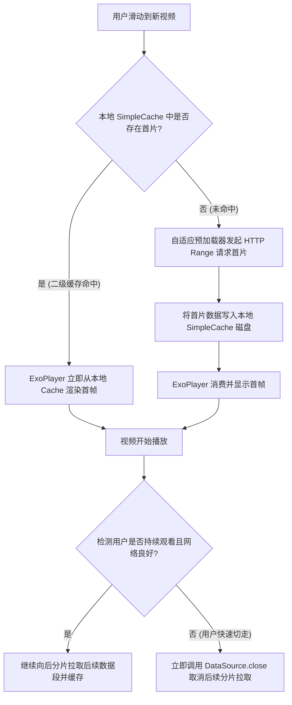
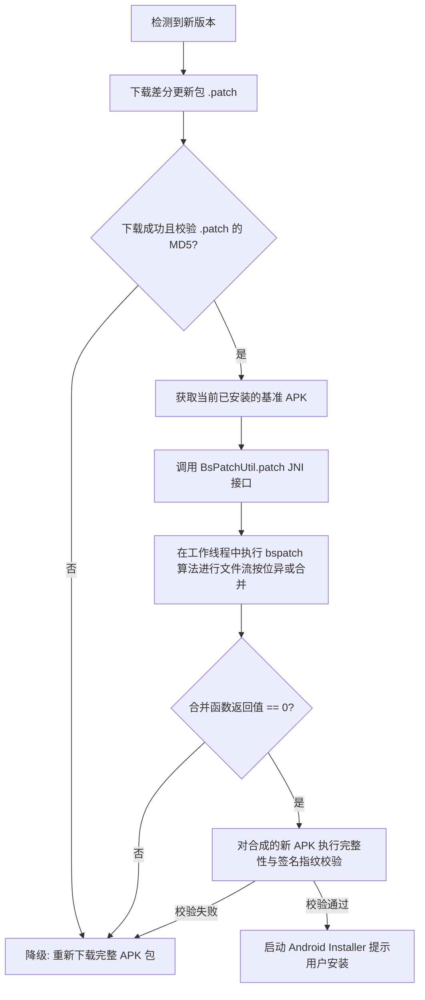
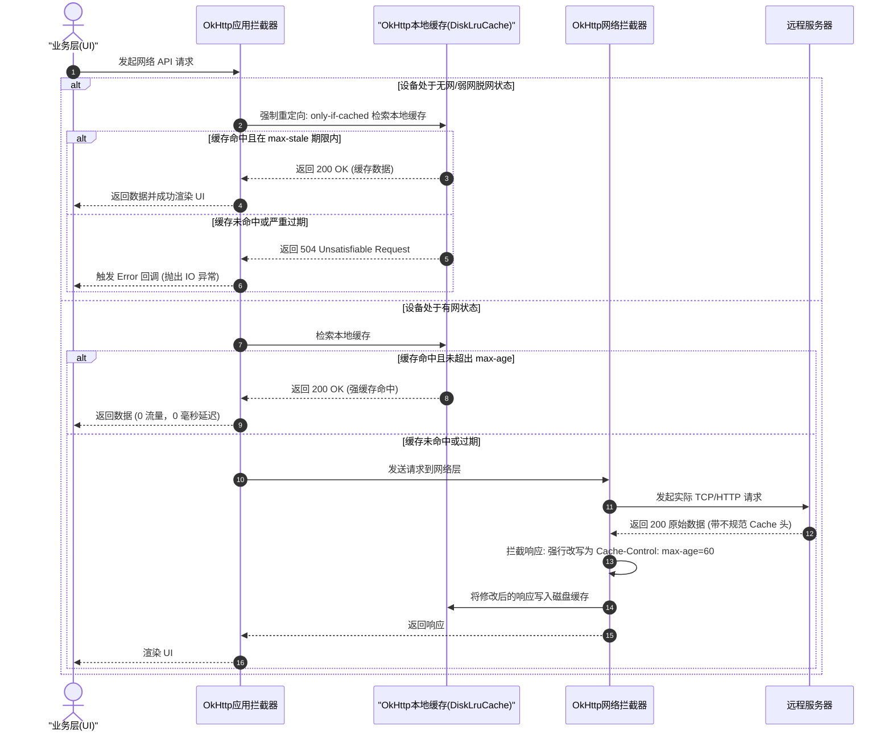

# 流量优化

网络流量优化是 Android 应用性能优化中至关重要的一环。在移动互联网时代，应用对网络数据的请求和传输量呈指数级增长，多媒体内容的丰富以及网络协议的复杂化，使得网络流量的消耗不仅直接关系到用户的直接经济成本（如手机套餐扣费），更深层地影响着系统的功耗（电量）、服务器端的运营成本（带宽与 CDN 费用）以及核心的业务指标（如用户流失率、留存率等）。

本篇文档将从底层原理、机制设计、系统演进、工程实践等多个维度，对 Android 平台下的流量优化进行系统、深度的剖析。

---

## 流量优化的全景视角

在切入具体优化策略之前，我们需要理清流量优化的核心目标。从工程落地的角度来看，网络流量优化主要围绕两个核心公式展开：

$$\text{总消耗流量} = \sum (\text{单次请求包体大小} \times \text{请求次数})$$
$$\text{总传输能耗} = \sum (\text{无线射频唤醒时间} \times \text{射频工作功耗})$$

基于这两个公式，流量优化可以被划分为三个层级：
1. **数据瘦身层**（减少单次请求包体大小）：通过更高效的图片与视频压缩格式、服务端自适应裁剪、增量差分更新、协议层高比例压缩等手段，将传输的裸数据精炼到极致。
2. **通道控制层**（减少请求次数与网络激活频次）：通过多级缓存机制（如 HTTP 协议缓存、离线脱网缓存、视频本地分流缓存）、高频小包拦截与合并上报、自适应预加载等手段，消除重复请求，平抑高频交互。
3. **监控闭环层**（可观测性与长效防线）：通过系统层流量统计机制（从 `/proc` 到 `NetworkStatsManager`）、自适应测速反馈与降级、线上 APM 流量异常监控等手段，确保流量黑天鹅事件能够被及时预警和处理。

---

## 第一部分：移动端流量消耗大户与痛点

在大型移动应用中，通常有超过 80% 的流量消耗集中在图片、视频等大文件数据传输上，其余的 20% 则是接口 API、日志埋点以及动态更新资源。为了系统化推进流量优化，我们必须理解这些消耗背后的深层痛点。

### 1. 图片与视频数据传输对用户留存的隐患
* **用户套餐超限与隐性扣费**：由于国内外的蜂窝网络计费策略不一，特别是未接入无限流量套餐的用户，超额的流量消耗会带来高额的套餐外话费账单，或被运营商执行限速。这会引发强烈的负面用户情绪，直接导致用户卸载应用。
* **高流失率与弱网痛点**：在蜂窝网络信号较弱（如地铁、电梯、偏远地区）或高拥堵（如火车站、体育馆）场景下，过大的图片和视频数据会极大地拉长首帧显示时间（Time-to-First-Frame）。较长的加载等待时间会使用户失去耐心，带来高额的用户即时流失。
* **物理延迟与重试开销**：当网络包体过大时，一旦在无线传输信道上遇到瞬时丢包或抖动，整个 TCP 窗口就需要重传，这会带来成倍的延迟和额外的流量开销。小包体的网络传输则对丢包有着天然的免疫力和更快的恢复速度。

### 2. 高流量对电量消耗的冲击（射频芯片能耗模型）
移动网络通信是耗电大户，其根本原因在于移动终端内置的蜂窝射频芯片（Radio Transceiver）具有独特的**状态机运行机制**。
在 3G/4G/5G 网络下，射频芯片状态主要由移动网关控制（如 RRC - Radio Resource Control 状态机）：

```
   [ RRC_IDLE (空闲) ] -- 发送数据/网络请求 --> [ RRC_CONNECTED (激活/全速) ]
           ^                                         |
           |                                     传输完成
           |                                         |
           +----- 经历 Tail Time (几秒到十几秒) <-----+
```

#### RRC 状态转移与定时器机制深度剖析
移动网络状态机通常包含以下三种核心状态，它们在功耗和时延方面有极大的差异：
* **RRC_CONNECTED (连接激活状态)**：射频芯片完全工作，分配有高速共享信道。此时工作电流高达 `150mA - 350mA`。5G 网络由于引入了载波聚合（Carrier Aggregation）、高频段（Sub-6GHz 和毫米波）以及更高阶的 MIMO 调制解调技术，其射频最大功耗可达 `500mA - 800mA`。
* **RRC_INACTIVE (5G 新增挂起状态) / Cell_FACH (4G 低速状态)**：射频芯片保持部分连接，仅能传输低速率控制信息。工作电流约为连接状态的 `20% - 40%`。
* **RRC_IDLE (空闲状态)**：没有任何无线承载，芯片仅在预定的寻呼周期（Paging Cycle）唤醒监听基站信号。此时工作电流极低，通常小于 `5mA`。

在底层协议中，RRC 状态的跃迁是由不活动定时器（Inactivity Timer，通常称为 T1 和 T2 定时器）控制的。当上层协议栈（TCP/UDP）不再向网卡写入数据包后，T1 定时器启动。若在 T1 倒计时（例如 5 秒）内没有数据收发，基站会指示终端由高功耗的 `RRC_CONNECTED` 降级到中等功耗的 `RRC_INACTIVE` 或 `Cell_FACH`。如果在此状态下持续 T2 定时器（例如 10 秒）无数据交互，射频芯片才会退回到最省电的 `RRC_IDLE` 状态。

此外，DRX（Discontinuous Reception，非连续接收）周期同样会影响射频的唤醒能耗。当射频芯片处于活跃期时，如果开启了 DRX，芯片会在微秒级的时间片内周期性地进入深度休眠，从而避免持续工作带来的电量崩塌。

#### Tail Time 尾随效应与小包危机
* **Tail Time**：由于 T1 和 T2 定时器的存在，即使数据传输已经完毕，射频芯片仍必须在此后的几秒至十几秒的时间内保持在高功耗状态。这段时间被称为尾随时间（Tail Time）。
* **高频小包的“电量谋杀”**：如果一个应用每隔 `8` 秒发送一个几百字节的埋点或心跳数据包，由于 8 秒小于 Tail Time 长度，射频芯片的 Inactivity Timer 会不断被重置，导致射频芯片被迫**一直保持在 RRC_CONNECTED 激活或挂起状态**，永远无法退回到 RRC_IDLE 状态。虽然其消耗的**总流量非常小**，但其消耗的**电能却相当于持续满速下载**。因此，流量通道优化直接决定了设备的电池续航时间。

不同网络环境下射频芯片典型功耗及延迟对比表：

| 网络类型 | 状态 | 典型工作电流 | 状态转换到 Active 的延迟 |
| :--- | :--- | :--- | :--- |
| **LTE (4G)** | RRC_CONNECTED | 150mA - 250mA | 0ms |
| **LTE (4G)** | RRC_IDLE | < 5mA | 100ms - 200ms |
| **5G (Sub-6)** | RRC_CONNECTED | 350mA - 600mA | 0ms |
| **5G (Sub-6)** | RRC_INACTIVE | 30mA - 80mA | 10ms - 30ms |
| **5G (Sub-6)** | RRC_IDLE | < 8mA | 150ms - 300ms |
| **Wi-Fi** | Active (Tx/Rx) | 80mA - 150mA | < 5ms (DTIM 唤醒) |

#### 传输层协议演进对能耗与流量的改变
在协议层面，传统的 HTTP/1.1 使用长连接，但依然存在队头阻塞（Head-of-Line Blocking）的问题，且多个 TCP 握手和 TLS 握手会产生冗余握手字节流。HTTP/2 通过多路复用（Multiplexing）减少了 TCP 连接数，但如果底层 TCP 丢包，仍会导致所有流阻塞。
近年来兴起的 HTTP/3 (基于 QUIC 协议) 则是流量和功耗优化的集大成者：
1. **消除了冗余握手**：QUIC 将传输层握手（UDP）与加密层握手（TLS 1.3）合并，能够在 1 个 RTT（甚至 0 RTT）内完成连接建立，极大地精简了在建连阶段的流量开销。
2. **解决队头阻塞与减少重发**：QUIC 的单向递增 Packet Number 机制彻底解决了传统 TCP 的“重传歧义”问题。当某条流的包丢失时，仅影响当前流的传输，其他流可以无序解压和读取。这避免了因为局部丢包导致整个 TCP 连接的滑动窗口停滞，消除了大量无意义的重试。
3. **连接迁移（Connection Migration）**：用户从 Wi-Fi 切换到 4G/5G 蜂窝网时，无需重新进行 TCP + TLS 握手，直接通过 Connection ID 识别，使数据传输几乎无缝衔接，省去了因重连产生的重试流量和射频芯片唤醒。

---

### 3. 服务端带宽与 CDN 分发成本的冲击
对于日活（DAU）千万级或亿级的互联网企业，网络带宽是固定成本中的最大支出之一。
* **CDN 流量计费**：各大云厂商的 CDN 主要是根据下行流量（GB）或带宽峰值（Mbps）来计费的。
* **成本估算**：假设一个日活 1000 万的短视频/社区应用，每位用户每天平均消费 50 张图片（单张均值 300KB）和 20 个短视频（单个均值 3MB）。
  * 每日总流量为：$$10,000,000 \times (50 \times 0.3\text{MB} + 20 \times 3\text{MB}) \approx 750\text{TB}$$
  * 按国内主流 CDN 阶梯计费均价 0.1 元/GB 估算，每天的流量成本大约为 7.5 万元，一年就是 2700 多万元。
  * 如果通过技术手段将图片整体体积压缩 50%，视频通过缓存与预加载策略减少 20% 的重复拉取，则每年可直接为企业节省数百万元的带宽运营成本。

---

## 第二部分：图片与多媒体流量治理

作为应用流量消耗的头号源头，图片与多媒体的治理必须秉持“按需加载、极致压缩、本地复用”的原则。

### 1. 图片格式演进：PNG/JPEG vs. WebP vs. AVIF
在 Android 平台中，选择合适的图片压缩格式是降低流量的根本手段。

| 格式 | 压缩类型 | 相比 JPEG 压缩率提升 | 解码 CPU 开销 | 内存占用（内存中 ARGB 展开） | Android 系统原生支持版本 |
| :--- | :--- | :--- | :--- | :--- | :--- |
| **JPEG** | 仅有损 | 0% (基准) | Low | 一致（取决于像素宽高） | 全版本 |
| **PNG** | 仅无损 | 较差 (适合简单图标) | Low | 一致 | 全版本 |
| **WebP (有损)**| 有损 | ~30% | 中等 | 一致 | Android 4.0 (API 14) + |
| **WebP (无损)**| 无损 | ~26% (相比 PNG) | 较高 | 一致 | Android 4.2.1 (API 17) + |
| **AVIF** | 有损/无损 | ~50% | 极高 (解码开销大) | 一致 | Android 12 (API 31) + |

#### 深度解析与算法机制：
* **WebP**：WebP 综合了有损和无损压缩技术。有损 WebP 算法基于 VP8 视频编码的帧内预测，通过预测块和残差进行编码，不仅支持亮度预测，还能够基于临近像素重构高频细节；无损 WebP 则使用变熵编码、色彩变换等空间局部性压缩技术。需要注意，虽然 WebP 相比 PNG/JPEG 在体积上大幅缩减，但由于其算法复杂度高，在老旧的低端设备上进行大图解码时，会比 JPEG 消耗更多的 CPU 时间，可能导致 UI 掉帧。
* **AVIF**：AVIF 采用了新一代的 AV1 视频编码技术，其通过非等方向性帧内预测、多达 56 种不同的方向模式以及基于 Tile 的图像并发拆分机制，实现了极佳的细节重现。相比 WebP 同样高出 20%~30% 的压缩率，尤其在高对比度、渐变色区域，其保真度极高且不易出现色彩断层（Color Banding）。AVIF 完美支持 10位/12位 的 HDR 色彩，且支持 YUV 4:4:4 无损采样。然而，由于 AVIF 的编码与解码复杂度极高，目前主要依赖硬件加速。在不支持 AV1 硬解的低端机上，软解 AVIF 会导致明显的卡顿和发热。
* **低端设备与旧版本的兼容性处理**：
  In Android application development, clients should negotiate image formats transparently. 请求图片时，通常会在请求头的 `Accept` 字段中携带自身支持的最高格式（例如：`Accept: image/avif,image/webp,*/*`）。服务端 CDN 收到请求后，会根据此首部动态返回相应的高效图片格式。
  对于不支持原生 AVIF 且又需要极致压缩的旧版本（Android 12 以下），通常需要在客户端中打包基于 C/C++ 交叉编译的 `libavif` 和 `dav1d` 动态库。通过 JNI 接口注入到图片框架（如 Glide/Coil）的解码组件中实现软解。由于软解在老旧设备上可能引发 CPU 过载，故需要结合设备的 CPU 核心数和可用内存大小，制定动态降级到有损 WebP 的策略。

### 2. CDN 自适应裁剪与压缩机制
很多时候，流量的浪费是因为“大材小用”——即在一个宽 100px 的 `ImageView` 中，加载了一张宽 1000px 的原始图片。为了杜绝这种现象，必须推行 **CDN 动态自适应裁剪**。

#### 工作机制与客户端动态拼接：
为了获得 View 的实际宽高，客户端通常需要在图片库拦截器中监听 View 的布局状态。如果 View 还未完成 Measure，可采用 ViewTreeObserver 或预定义兜底尺寸。
根据设备的物理像素密度（Density），我们将像素尺寸转换为符合 CDN 参数的物理像素：

$$\text{物理像素宽度} = \text{View 的 DP 宽度} \times \text{设备屏幕缩放因子 (Density)}$$

例如，原图 URL 为：`https://media.example.com/images/avatar.png`
拼接后的 URL 为：`https://media.example.com/images/avatar.png?x-oss-process=image/resize,w_300,h_300/format,webp/quality,q_75`

#### 客户端核心拦截器实现（以 Coil 图片加载框架为例）：
在 Coil 中，我们可以通过自定义 `Interceptor` 来拦截并重写 `ImageRequest` 对应的 URL，实现更加优雅的自适应拼接：

```kotlin
class CoilCdnAdaptiveInterceptor(private val context: Context) : coil.intercept.Interceptor {
    override suspend fun intercept(chain: coil.intercept.Interceptor.Chain): coil.request.ImageResult {
        val request = chain.request
        val originalUrl = request.data
        
        if (originalUrl is String && originalUrl.contains("media.example.com")) {
            val size = chain.size
            // 获取 View 的实际物理宽度与高度
            val widthPx = size.width.pxOrElse { 480 } // 兜底 480 像素
            val heightPx = size.height.pxOrElse { 480 }
            
            // 进行步长离散化，防止 CDN 参数过于碎片化降低缓存命中率
            val discreteWidth = getDiscreteStep(widthPx)
            val discreteHeight = getDiscreteStep(heightPx)
            
            val quality = getNetworkQualityParam()
            val format = if (android.os.Build.VERSION.SDK_INT >= android.os.Build.VERSION_CODES.S) "avif" else "webp"
            
            val adaptiveUrl = "$originalUrl?image_process=resize,w_$discreteWidth,h_$discreteHeight/format,$format/quality,q_$quality"
            val newRequest = request.newBuilder()
                .data(adaptiveUrl)
                .build()
            return chain.proceed(newRequest)
        }
        
        return chain.proceed(request)
    }

    private fun getDiscreteStep(size: Int): Int {
        val steps = intArrayOf(120, 240, 360, 480, 720, 1080)
        for (step in steps) {
            if (step >= size) return step
        }
        return steps.last()
    }

    private fun getNetworkQualityParam(): Int {
        return when (NetworkStateMonitor.currentQuality) {
            NetworkQuality.POOR -> 50
            NetworkQuality.NORMAL -> 75
            NetworkQuality.EXCELLENT -> 85
        }
    }
}
```

---

### 3. 短视频预加载与分流缓存控制
短视频类应用中，用户“快速下滑翻页”的行为会导致极其恐怖的流量浪费。如果用户在一个视频仅播放了 1 秒时就下滑切走，而此时客户端已经预下载了 10MB 的内容，这 10MB 的流量就完全被浪费了。

#### ExoPlayer 缓存架构设计
ExoPlayer 提供了高度定制的缓存 API。我们应当采用 **“二级缓存 + 分片预加载”** 的策略：
1. **分片下载（Chunk-based Cache）**：视频不一次性拉取整片，而是将视频切分为若干分片（如每个分片 2-5 秒）。首帧首片（如前 800KB - 1.5MB）进行高优先级同步预加载，保证秒开；剩余分片在视频开始播放后再平滑向后加载。
2. **本地代理与 CacheDataSource**：使用 ExoPlayer 的 `SimpleCache` 搭配 `CacheDataSource` 实现边下边播与缓存共享。

```kotlin
// 初始化全局的 ExoPlayer 缓存管理器
object VideoCacheManager {
    private const val MAX_CACHE_SIZE = 512 * 1024 * 1024L // 512MB 磁盘上限
    private lateinit var databaseProvider: DatabaseProvider
    lateinit var simpleCache: SimpleCache
        private set

    fun init(context: Context) {
        databaseProvider = StandaloneDatabaseProvider(context)
        val cacheDir = File(context.cacheDir, "video_cache")
        // 使用 LeastRecentlyUsedCacheEvictor 自动清理最久未使用的缓存
        val evictor = LeastRecentlyUsedCacheEvictor(MAX_CACHE_SIZE)
        simpleCache = SimpleCache(cacheDir, evictor, databaseProvider)
    }

    // 构建支持缓存的数据源工厂
    fun createDataSourceFactory(context: Context, upstreamFactory: DataSource.Factory): DataSource.Factory {
        return CacheDataSource.Factory()
            .setCache(simpleCache)
            .setUpstreamDataSourceFactory(upstreamFactory)
            .setCacheWriteDataSinkFactory(null) // 只读或需精细控制写，可在此配置
            .setFlags(CacheDataSource.FLAG_IGNORE_CACHE_ON_ERROR)
    }
}
```

#### 工业级预加载优先队列调度算法
在多视频滑动列表下，为了杜绝无效网络拉取，我们可以定义一个优先级队列，根据用户滑动速度（Velocity）和与当前页面的 Index 距离，计算每个视频的拉取权重：

$$W = \text{Distance} \times \lambda - \text{ScrollSpeed} \times \mu$$

离当前位置越近、滑动速度适中时，权重最高。如果滑动速度极高（用户处于疯狂下滑刷列表的状态），权重会降级到阈值以下，直接**挂起或取消**所有的预加载任务，等滑动静止后才开始加载。

```kotlin
class VideoPreloadManager(private val context: Context) {
    private val executor = Executors.newFixedThreadPool(2)
    private val activeTasks = ConcurrentHashMap<String, DataSourceContract>()
    
    // 滑动队列窗口大小
    private var currentPlayIndex = 0

    // 更新当前的播放位置，动态调整预加载任务
    fun onPageSelected(newIndex: Int, videoList: List<VideoItem>) {
        val isScrollDown = newIndex > currentPlayIndex
        currentPlayIndex = newIndex

        // 1. 停止距离过远的预加载任务（防止流量浪费）
        cancelOutdatedTasks(newIndex)

        // 2. 调度预加载任务：仅加载下一个视频的前 1MB 字节
        val nextIndex = newIndex + 1
        if (nextIndex < videoList.size) {
            val nextVideo = videoList[nextIndex]
            preloadVideo(nextVideo.url, 1024 * 1024) // 预载 1MB
        }
    }

    private fun preloadVideo(videoUrl: String, preloadSize: Long) {
        if (activeTasks.containsKey(videoUrl)) return

        executor.execute {
            val cache = VideoCacheManager.simpleCache
            val cacheKey = CacheKeyFactory.DEFAULT.buildCacheKey(DataSpec(Uri.parse(videoUrl)))
            
            // 校验本地是否已经存在该缓存段
            val cachedBytes = cache.getCachedBytes(cacheKey, 0, preloadSize)
            if (cachedBytes >= preloadSize) {
                // 已有缓存，无需请求
                return@execute
            }

            // 发起 HTTP Range 请求拉取首段
            val dataSource = HttpDataSourceFactory.createDataSource()
            val dataSpec = DataSpec.Builder()
                .setUri(Uri.parse(videoUrl))
                .setPosition(0)
                .setLength(preloadSize)
                .build()

            try {
                dataSource.open(dataSpec)
                val buffer = ByteArray(8192)
                var bytesRead = 0
                var totalRead = 0L
                
                while (totalRead < preloadSize && bytesRead != -1) {
                    bytesRead = dataSource.read(buffer, 0, buffer.size)
                    if (bytesRead > 0) {
                        // 写入本地 Cache
                        cache.startReadWrite(cacheKey, totalRead, bytesRead.toLong())
                        cache.commitFile(File(cache.cacheDir, "chunk_$totalRead"))
                        totalRead += bytesRead
                    }
                }
            } catch (e: Exception) {
                e.printStackTrace()
            } finally {
                dataSource.close()
            }
        }
    }

    private fun cancelOutdatedTasks(currentIndex: Int) {
        // 取消 index < currentIndex - 1 或者 index > currentIndex + 2 范围的活跃任务
        // 及时释放 Socket 链接，彻底阻断无效网络消耗
    }
}
```

下面是短视频预加载与 ExoPlayer 二级缓存命中的逻辑示意图：



**流程解析**：
* 当用户滑动到新视频时，播放器首先检查本地 `SimpleCache` 是否存在首片数据。如果命中，则省去网络请求，实现真正的 0 流量耗费秒开。
* 如果未命中，自适应预加载器（Preloader）会发起范围请求（HTTP Range Request）仅拉取视频的第一阶段切片（如前 1MB），防止拉取过多。
* 当用户在当前视频停留时间超过阈值，且网络状况允许时，后台线程才触发下一阶段的分片拉取；一旦用户快速切走，则立刻关闭连接，将无效流量降到最低。

---

## 第三部分：增量包与更新流

应用包体（APK）的大小不仅影响用户在应用商店的首次下载意愿，还直接决定了应用内强更/热修复更新时的流量消耗。

### 1. BsDiff / Patch 差分合并算法物理实现机制
增量更新（Incremental Update）的核心思想是：**不下载完整的 APK 包，只下载新旧两个 APK 差异生成的差分包（Patch），然后在客户端通过算法将差分包与旧 APK 合并，生成新的完整 APK。**

这一过程的底层算法通常使用 `bsdiff` 与 `bspatch`。
* **BsDiff 算法原理**：
  1. **后缀数组（Suffix Array）构建**：利用 Larsson-Sadakane 算法对旧文件的数据进行后缀排序，生成后缀数组。该过程的计算复杂度为 $O(N \log N)$ 级别。这一步开销极大（时间与内存占用高），但该过程全部在**服务端完成**，对客户端无影响。
  2. **子串匹配与差异提取**：对比新旧两个文件，在新文件中寻找在旧文件中出现过的最长公共子串。由于已经构建了后缀数组，这里可以使用二分搜索快速寻找到公共子串。
  3. **数据块输出**：将差异输出为三个核心块：
     * **Ctrl Block（控制块）**：包含三个数字，表示接下来要读取的 diff 块长度、extra 块长度，以及旧文件中指针的偏移位置。
     * **Diff Block（差异块）**：存储新旧文件内容的按位异或值（因为新旧文件大部分代码类似，按位异或后会产生大量连续的 0，用 BZip2 等压缩算法能够得到极其恐怖的压缩比）。
     * **Extra Block（额外块）**：存储新文件中完全新增的内容（即在旧文件中找不到的部分）。
* **BsPatch 算法原理**：
  客户端的工作是合并（`bspatch`）。其基本逻辑为：读取旧 APK，依次读取差分包中的控制块、差异块和额外块，将旧 APK 的数据与差异块的数据进行按位异或相加，然后追加额外块的数据，最终写入生成新 APK。这一步**计算复杂度较低**，非常适合在客户端运行。

#### 客户端 NDK 编译与 JNI 物理合并实现
在 Android 工程中，我们需要通过 NDK 引入 `bspatch.c` 源码，并通过 JNI 暴露出合并接口。为了避免合并大包（例如几百兆的 APK）时触发内存溢出（OOM），我们需要使用基于文件读写流（Streaming）的文件流式合并，而非一次性全部读入内存。

首先是 C++ 侧的 JNI 实现文件 `bspatch_jni.cpp`：

```cpp
#include <jni.h>
#include <cstdlib>
#include <cstring>

// 声明外部的 bspatch 标准 C 函数
extern "C" {
    int bspatch_main(int argc, char* argv[]);
}

extern "C"
JNIEXPORT jint JNICALL
Java_com_example_app_updater_BsPatchUtil_patch(JNIEnv *env, jobject thiz,
                                               jstring old_path_str,
                                               jstring new_path_str,
                                               jstring patch_path_str) {
    const char* old_path = env->GetStringUTFChars(old_path_str, nullptr);
    const char* new_path = env->GetStringUTFChars(new_path_str, nullptr);
    const char* patch_path = env->GetStringUTFChars(patch_path_str, nullptr);

    // 组装命令行参数，模拟执行标准的 bspatch 命令行工具
    char* argv[4];
    argv[0] = const_cast<char*>("bspatch");
    argv[1] = const_cast<char*>(old_path);
    argv[2] = const_cast<char*>(new_path);
    argv[3] = const_cast<char*>(patch_path);

    int result = bspatch_main(4, argv);

    // 释放资源
    env->ReleaseStringUTFChars(old_path_str, old_path);
    env->ReleaseStringUTFChars(new_path_str, new_path);
    env->ReleaseStringUTFChars(patch_path_str, patch_path);

    return result; // 0 表示合并成功，非零为失败
}
```

JNI 底层 NDK 编译的 `CMakeLists.txt` 构建文件写法：
```cmake
cmake_minimum_required(VERSION 3.10.2)
project("bspatch_jni")

# 引入 NDK 自动集成的 bzip2 压缩库（bspatch.c 依赖 bzip2）
find_package(BZip2 REQUIRED)

add_library(bspatch_jni SHARED
            bspatch_jni.cpp
            bspatch.c) # bspatch.c 为 BSD 官方源码，需加入工程中

target_link_libraries(bspatch_jni
                      ${BZIP2_LIBRARIES}
                      log)
```

在 Java/Kotlin 侧定义对应的 Native 类：

```kotlin
object BsPatchUtil {
    init {
        System.loadLibrary("bspatch_jni")
    }

    /**
     * @param oldApkPath 当前设备上已安装的 APK 文件路径（可以通过 context.packageCodePath 获取）
     * @param newApkPath 合并后即将生成的全新 APK 目标路径
     * @param patchPath 从网络下载下来的差分包路径
     * @return 0 代表合并成功
     */
    external fun patch(oldApkPath: String, newApkPath: String, patchPath: String): Int
}
```

下图展示了客户端通过 JNI 执行 BsDiff 增量更新与合并校验的完整生命周期：



**安全防线**：
1. **防范篡改**：在客户端合成新 APK 后，**必须**对生成的新 APK 计算 MD5 / SHA-256 签名，并与服务端下发的目标 APK 签名进行一致性比对。如果被篡改或者合并错误，则必须回退到“整包下载”，否则会导致用户安装失败，甚至被植入恶意代码。
2. **IO 异常与空间预检**：`bspatch` 过程会进行大量磁盘读写，客户端必须在合并前预检磁盘剩余空间。空间大小至少要大于 `旧 APK 体积 + 新 APK 体积 + 差分包体积`，否则极易发生磁盘写入爆满（ENOSPC 错误）引发崩溃。

### 2. Google Play Archive 与 Play Feature Delivery
在海外市场，借助 Google 官方的动态分发机制，可以从架构层面大幅精简用户的下载流量。
* **Google Play Archive (应用归档)**：当用户较长时间不使用某个应用，且系统空间不足时，Android 系统会自动调用归档功能（自 Android 12+ 起系统支持）。它会移除应用的主体运行代码与资源，仅保留用户数据和应用的空壳入口。当用户再次点击该应用图标时，系统会仅从 Google Play 下载被移除的部分，相比重新完整安装，能减少近 60% 的包体网络消耗。
* **Play Feature Delivery (动态 Feature Module)**：这是一种基于 Android App Bundle (AAB) 的按需加载方案。例如，一个视频应用中包含了“视频播放（核心功能）”和“AR 搞怪滤镜（高级功能）”。开发阶段可将 AR 滤镜拆分为独立的 `dynamic feature module`。
  * 用户首次从应用商店下载的仅是核心基础包（Base APK）。
  * 当用户在应用内首次点击“AR 滤镜”入口时，客户端通过 Play Core SDK 异步向服务端请求下载该 Module，实现网络流量的“按需支付”。

#### Kotlin 代码演示动态 Feature 模块加载：
```kotlin
fun installDynamicModule(context: Context, moduleName: String) {
    val splitInstallManager = SplitInstallManagerFactory.create(context)
    val request = SplitInstallRequest.newBuilder()
        .addModule(moduleName)
        .build()

    splitInstallManager.startInstall(request)
        .addOnSuccessListener { sessionId ->
            // 安装开始
        }
        .addOnFailureListener { exception ->
            // 处理网络异常
        }
        
    // 监听安装进度与状态机
    splitInstallManager.registerListener { state ->
        when (state.status()) {
            SplitInstallSessionStatus.DOWNLOADING -> {
                val progress = (state.bytesDownloaded() * 100 / state.totalBytesToDownload())
                // 更新下载进度 UI
            }
            SplitInstallSessionStatus.INSTALLED -> {
                // 动态 Feature 安装完毕，即可使用 Reflection 或 API 打开组件
            }
            SplitInstallSessionStatus.FAILED -> {
                // 处理网络异常或签名不符导致的失败
            }
        }
    }
}
```

---

## 第四部分：数据通道与协议层调优

在降低了图片和安装包这两大流量实体之后，接下来我们需要深入到网络传输的协议和通道层面，挤压每一个字节的冗余。

### 1. 压缩算法对比：Gzip vs. Brotli 协商机制
在 HTTP 请求中，对文本内容（如 JSON、XML、HTML）进行压缩是标准的降流做法。传统的压缩方式是 **Gzip**，而 Google 推出新一代的压缩算法 **Brotli**（在 HTTP 协议中标识为 `br`）正在成为业内的主流选择。

* **压缩效率对比**：
  * Brotli 采用了类似于 LZ77 和哈夫曼编码的变体，最关键的是它内置了一个静态字典，这个字典包含了超过 13000 个常用词汇（包含多种语言的常见单词、HTML 标签、JSON 键等）。
  * 在相同的 CPU 解码开销下，Brotli 的压缩比通常比 Gzip 高出 **17%~25%**。这意味着同样的 JSON 数据，如果用 Brotli 传输，能直接省掉五分之一以上的流量。
* **HTTP 协商机制**：
  客户端发起请求时，必须在请求头中明确告知服务端自身支持 Brotli：
  `Accept-Encoding: gzip, deflate, br`
  如果服务端（如 Nginx、CDN）同样支持 Brotli，在响应头中会返回：
  `Content-Encoding: br`
  此时，OkHttp 等网络框架会在协议层自动使用 Brotli 解压算法对数据包进行解压，这一过程对业务层是完全透明的。
* **OkHttp 引入 Brotli 支持**：
  由于标准的 OkHttp 核心包并没有包含 Brotli 的解压机制，在工程中我们需要引入 `okhttp-brotli` 的扩展包，并在客户端初始化中配置 `BrotliInterceptor`：
  ```kotlin
  // 引入 okhttp-brotli 依赖后配置
  val okHttpClient = OkHttpClient.Builder()
      .addInterceptor(okhttp3.brotli.BrotliInterceptor) // 自动添加 Accept-Encoding 并处理解压
      .build()
  ```

不同类型数据在 Gzip 与 Brotli 算法下压缩率及性能耗时对比（测试数据集为 1MB 纯文本）：

| 数据类型 | 算法 | 压缩后大小 | 压缩率 | 客户端解压耗时 |
| :--- | :--- | :--- | :--- | :--- |
| **标准 JSON API** | 原包 (裸传输) | 1024 KB | 100% | 0ms |
| **标准 JSON API** | Gzip (Level 6)| 210 KB | 20.5% | 8ms |
| **标准 JSON API** | Brotli (Quality 5) | 165 KB | 16.1% | 7ms |
| **Protobuf 数据** | 原包 (二进制) | 512 KB | 100% | 0ms |
| **Protobuf 数据** | Gzip (Level 6)| 180 KB | 35.1% | 6ms |
| **Protobuf 数据** | Brotli (Quality 5) | 148 KB | 28.9% | 5ms |

### 2. 基于 HTTP/2 和 HTTP/3 的头部压缩开销分析
许多开发者只关注响应体（Response Body）的大小，而忽略了请求头（Request Header）和响应头（Response Header）的大小。在移动端高频请求（例如首页多个卡片的零碎数据刷新）中，如果每次请求都携带长达 1KB 的 Cookie、User-Agent 等 HTTP 头部，其累加起来的流量消耗也极其惊人。
* **协议层优化**：
  * HTTP/2 引入了 **HPACK** 算法，通过静态表和动态表缓存已经发送过的头部键值对。后续请求中如果头部未变，只需发送一个索引 ID，极大地节省了头部流量。
  * HTTP/3 则升级为 **QPACK** 算法。它延续了 HPACK 的思路，但为了配合 QUIC 协议的乱序传输，QPACK 可以在控制流与数据流之间无序地完成动态表的更新，从而解决了 HPACK 在丢包场景下动态表同步被阻塞的弊端。通过这些头部压缩协议，可以让每个小包的 Header 从 1KB 压缩至十几个字节，在极高频的网络请求中能够减少 90% 以上的协议头消耗。

### 3. OkHttp 拦截器代理的多级缓存与离线脱网模式
合理设置 HTTP 缓存，能让客户端省去大量重复数据拉取的流量。然而，很多服务器的 `Cache-Control` 配置并不规范，或者出于业务安全考虑，服务端开发人员不敢开启强缓存。此时，客户端可以通过 **OkHttp 拦截器拦截机制** 强制改写缓存策略，并实现优雅的**离线脱网模式**。

#### OkHttp DiskLruCache 底层 Journal 文件机制解析
OkHttp 的缓存实现依赖于本地磁盘的 `DiskLruCache`。为了保证在多线程读写、突然 Crash、物理断电等异常状况下不破坏缓存数据的原子性，`DiskLruCache` 引入了一个 `journal` 日志文件机制。
`journal` 文件是一个纯文本文件，用来记录每一项缓存记录的生命状态变化。其内部包含五种关键的操作行：
* `DIRTY`：表示当前有一条缓存记录正在被创建或修改（写入中）。
* `CLEAN`：表示该缓存写入成功，并且记录了它的每一段文件长度（如 `CLEAN 340203 2340 1204`）。
* `REMOVE`：表示该缓存被主动删除或触发 LRU 淘汰机制清除。
* `READ`：表示该缓存正在被读取。
* 如果在应用启动初始化 `DiskLruCache` 时，读取到某项 key 对应的最后一条记录是 `DIRTY`，或者 `journal` 文件本身因意外损坏（通常会生成 `journal.bkp` 备份），OkHttp 将自动判定该项缓存失效并清理相关脏数据，从而完全避免了读写冲突和损坏文件被加载。

#### 带有缓存验证（ETag / Last-Modified）的拦截器设计：
除了强缓存，我们应当通过网络拦截器强化**协商缓存**。如果本地缓存过期，我们带上 `If-None-Match` (ETag) 或 `If-Modified-Since` 发起协商请求。若服务端返回 `304 Not Modified`，说明数据无变化，客户端继续复用本地缓存。这种做法不仅精简了下行包体流量，还保证了数据的一致度。

```kotlin
class AdvancedCacheInterceptor(private val context: Context) : Interceptor {
    override fun intercept(chain: Interceptor.Chain): Response {
        val originalRequest = chain.request()
        val networkAvailable = isNetworkAvailable(context)

        // 1. 离线判断：无网络时强制只使用缓存
        var request = originalRequest
        if (!networkAvailable) {
            request = request.newBuilder()
                .cacheControl(CacheControl.FORCE_CACHE) // 强制使用缓存，无网首选
                .build()
        }

        val response = chain.proceed(request)

        // 2. 在网络拦截器侧（有网），强制规范没有缓存控制头的服务端数据
        return if (networkAvailable) {
            val serverCacheControl = response.header("Cache-Control")
            if (serverCacheControl == null || serverCacheControl.contains("no-store") || serverCacheControl.contains("no-cache")) {
                // 强制改写：强缓存 30 秒，并支持协商缓存
                response.newBuilder()
                    .removeHeader("Pragma")
                    .header("Cache-Control", "public, max-age=30, must-revalidate")
                    .build()
            } else {
                response
            }
        } else {
            response
        }
    }

    private fun isNetworkAvailable(context: Context): Boolean {
        val connectivityManager = context.getSystemService(Context.CONNECTIVITY_SERVICE) as ConnectivityManager
        val activeNetwork = connectivityManager.activeNetwork ?: return false
        val capabilities = connectivityManager.getNetworkCapabilities(activeNetwork) ?: return false
        return capabilities.hasCapability(NetworkCapabilities.NET_CAPABILITY_INTERNET)
    }
}
```

基于上述配置，OkHttp 在多级缓存命中及离线状态下的决策时序如下：



### 4. 数据合并上报与高频小包拦截
如第一部分所述，频繁发送几百字节的小包会对移动设备的电量造成毁灭性打击，同时因为每个请求都有 HTTP 握手、请求头的开销，流量浪费也极高。

#### 优化策略：
1. **聚合上报（Batch & Push）**：
   * **埋点和日志系统**：在本地建立 SQLite 数据库或轻量级 MMKV/SharedPreferences 缓冲区。当埋点触发时，先将其写入本地缓冲区，直到满足“数量达到 30 条”或“时间间隔达到 5 分钟”的条件，再将多条数据合并为一个 JSON 包，执行一次 Gzip 压缩后整体上报。
2. **对齐系统状态调度**：
   * 在网络传输上，应避开用户正在高频互动的敏感时期。我们可以使用 Android 系统的 `JobScheduler` 或 `WorkManager`（它们在后台会智能对齐网络唤醒时机）。
   * 关联 [AndroidVersionChangeLog.md](../../../../../AndroidVersionChangeLog.md)：自 Android 9+ 起，系统的功耗与网络限制更加严格。特别地，自 Android 14/15 起，`JobScheduler` 对后台网络成本（Metred/Unmetered）的感知得到显著增强。利用 `WorkManager` 并设置约束条件（如：`NetworkType.UNMETERED`（仅限 Wi-Fi 下上报）且 `RequiresCharging`（充电时上报）），能最大限度地让出蜂窝网络带宽，并减少射频芯片状态转换带来的耗电。

---

## 第五部分：流量监控、测速与异常拦截

一个卓越的流量优化体系必须有稳固的防线，即能够精准统计、自动告警并能够在紧急时刻执行自适应降级。

### 1. Android 系统流量监控接口演进与替代

在 Android 系统的发展进程中，获取应用自身或系统级别流量数据的 API 经历了几次非常关键的安全与架构演进，具体变化也在系统变更中持续体现（详见 [AndroidVersionChangeLog.md](../../../../../AndroidVersionChangeLog.md)）。

#### 演进一：直接读取 `/proc/` 节点的废弃与侧信道漏洞
* **早期做法 (Android 8.0 之前)**：开发人员可以通过直接读取 `/proc/net/dev` 文件获取网卡的累计接收与发送字节数，或通过读取 `/proc/net/xt_qtaguid/stats` 获取特定 UID 级别详细的 socket 流量统计。
* **物理文件内部格式解析**：
  `/proc/net/xt_qtaguid/stats` 的每一行均记录了极其敏感的网络 socket 调用行为，包含以下核心参数：
  * `idx`：索引行号。
  * `iface`：具体的网卡适配器名称（如 `wlan0` 表示 Wi-Fi，`rmnet0` 表示蜂窝移动网络）。
  * `acct_tag_hex`：应用在 Socket 上打上的标记（Tag），可通过 `TrafficStats.setThreadStatsTag(tag)` 自定义打标，用于区分图片、API、视频等不同的业务子通道。其中 32 位标记的高 24 位用于写入用户自定义的 tag 区分业务，低 8 位由系统内部自动管理分配。
  * `uid`：进程所属的用户 ID。
  * `rx_bytes` / `tx_bytes`：接收和发送的物理字节数。
* **侧信道攻击（Side-Channel Attack）漏洞**：
  在 Android 9.0 之前，即使应用不申请网络访问权限（INTERNET），也可以自由读取 `/proc/net/` 下的网卡流量文件。恶意软件可以在后台高频地读取此网卡统计文件，分析用户发送和接收的网络包大小随时间变化的时间序列图。通过与已知热门应用（如银行登录界面、社交消息界面、视频库）在特定操作下的“流量波形指纹”进行模式识别（如 Dynamic Time Warping 动态时间规整算法匹配），攻击者能够以 90% 以上的准确率推算当前用户正在访问哪家银行或浏览哪些视频内容，带来了严重的侧信道攻击漏洞。
* **系统封锁**：在 Android 9.0 (API 28) 以后，系统对 `/proc/net/` 的访问权限进行了严格的 SELinux 封锁。应用如果尝试读取该路径，会直接收到 `Permission Denied` 异常。

#### 演进二：`TrafficStats` 的局限性
Android 从早期版本就提供了 `android.net.TrafficStats` 类。
* **优点**：使用极其简单，例如：
  * `TrafficStats.getUidRxBytes(android.os.Process.myUid())` 可获取当前应用自开机以来接收的总字节数。
* **缺点**：
  1. **无法区分时间区间**：它返回的是“自手机开机以来”的累计值。如果应用需要统计“今天消耗了多少流量”或者“某次网络请求消耗了多少”，需要应用在本地自行持久化并进行差值计算。
  2. **数据易丢失**：一旦手机重启，该数值会被清空。
  3. **统计精度受限**：由于内部 socket 缓存等原因，在高频调用时，数据可能不实时。

#### 演进三：新一代 `NetworkStatsManager` 的引入与适配
自 Android 6.0 (API 23) 起，系统引入了 `NetworkStatsManager`。它是目前最精准、最安全的系统级流量监控工具。它不仅能提供高精度的 UID 级统计，还能区分网络类型（蜂窝网络 vs. Wi-Fi）以及时间区间。

使用 `NetworkStatsManager` 获取本应用蜂窝网络历史流量的方法：

```kotlin
fun getAppMobileTrafficUsage(context: Context, startTime: Long, endTime: Long): Long {
    val networkStatsManager = context.getSystemService(Context.NETWORK_STATS_SERVICE) as NetworkStatsManager
    
    // 获取当前的主动蜂窝网络订阅 ID（SubId），主要针对双卡双待设备
    val subscriberId: String? = null // 在 Android 10+ 以后由于隐私限制限制获取 IMSI，可传 null 进行全局蜂窝统计
    
    var totalBytes = 0L
    try {
        // queryDetailsForUid 精确查询当前应用 UID 的使用情况
        val uid = android.os.Process.myUid()
        val stats = networkStatsManager.queryDetailsForUid(
            NetworkCapabilities.TRANSPORT_CELLULAR,
            subscriberId,
            startTime,
            endTime,
            uid
        )
        
        val bucketOut = NetworkStats.Bucket()
        while (stats.hasNextBucket()) {
            stats.getNextBucket(bucketOut)
            totalBytes += (bucketOut.rxBytes + bucketOut.txBytes) // 累计接收与发送
        }
        stats.close()
    } catch (e: SecurityException) {
        // 自 Android 10 起，查询非自身应用或调用全局统计，必须申请以下权限：
        // android.permission.PACKAGE_USAGE_STATS
        // 该权限属于系统设置页的“有权查看使用情况的应用”特殊权限，需要通过以下 Intent 引导用户授权：
        // startActivity(Intent(Settings.ACTION_USAGE_ACCESS_SETTINGS))
    }
    return totalBytes
}
```

#### 双保险兜底设计 (MIUI/ColorOS 等特殊 ROM 兼容)：
在国内定制 ROM 上，有时候即使申请了权限，`NetworkStatsManager` 也会因为底层服务缺失抛出未知异常。我们需要设计双保险结构：
```kotlin
object DoubleGuaranteedTrafficMonitor {
    fun getTrafficBytes(context: Context, startTime: Long, endTime: Long): Long {
        return try {
            getAppMobileTrafficUsage(context, startTime, endTime)
        } catch (e: Exception) {
            // 发生异常时，兜底回退到 TrafficStats 累加值统计
            val rx = TrafficStats.getUidRxBytes(android.os.Process.myUid())
            val tx = TrafficStats.getUidTxBytes(android.os.Process.myUid())
            if (rx == TrafficStats.UNSUPPORTED || tx == TrafficStats.UNSUPPORTED) 0L else rx + tx
        }
    }
}
```

---

### 2. 流量测速算法与自适应降级
为了给用户提供最佳的体验，应用必须具备“网络测速”与“自适应调优”的能力。

#### 测速算法原理：
不建议在运行期间通过额外下载一个测试文件来进行测速，这会产生极大的流量浪费。应当采用 **“业务数据传输被动测速”** 机制：
* **数据收集**：在网络库（如 OkHttp）的拦截器中，监听每一个实际 API 或图片请求的开始时间和结束时间，计算其传输速率：
  $$\text{速率} = \frac{\text{数据长度 (Byte)}}{\text{耗时 (Second)}}$$
* **滑动窗口与 EMA（指数移动平均）滤波**：
  直接计算单次网络请求的速率并不可靠，因为网络存在剧烈的抖动。我们需要使用加权指数移动平均算法来平滑网络速率估值：
  $$\text{EMA}_t = \alpha \times \text{CurrentSpeed} + (1 - \alpha) \times \text{EMA}_{t-1}$$
  * 其中 $\alpha$ 为平滑因子（通常取 0.1 ~ 0.2）。$\text{EMA}_t$ 能更准确地反映当前一段时间的平均网速趋势。

#### 自适应降级决策链：
当 EMA network speed 跌落到指定阈值（例如低于 100KB/s，判定为弱网）时，客户端触发全局**自适应降级逻辑**：
1. **图片加载降级**：通知图片库加载低清缩略图，甚至完全停止列表中的大图自动加载，仅在用户点击时才加载。
2. **视频播放降级**：在视频播放器（如 ExoPlayer）中切换 HLS / DASH 多码率网络视频流的分辨率，从 1080P/720P 降级到 480P 或 360P。
3. **长连接降级**：降低 WebSocket 维持心跳的频率，拉长后台 API 轮询的间隔时间。

### 3. 线上 APM 流量监控与异常防线
在大型工程中，线上可能随时会因为某位开发者的代码失误，在后台引入一个“网络请求死循环”或“重复多次加载超大图”的 Bug。此时，必须有一套线上 APM 监控体系来守住最后一道防线。

#### Webview 灰色地带流量拦截与缓存控制：
移动应用中还有一大流量黑洞——Webview。H5 页面经常包含重复的大量静态资源（CSS、JS、字体文件）。
* **拦截与强缓存控制**：我们可以在客户端中注册自定义 `WebViewClient` 并重写 `shouldInterceptRequest`，实现本地资源映射拦截（离线包机制），或者利用 Webview 内部的 `ServiceWorker` 对所有静态资源直接从 Native 侧或 SQLite 缓存库读取，避免多次重复拉取资源。

#### 线上 APM 异常流量治理闭环架构：
1. **细粒度数据采集**：
   * 在 OkHttp 拦截器中，对每个网络请求进行埋点上报，记录 `Host`、`Path`、`ReqSize`、`RespSize`、`HttpStatusCode` 等关键维度。
2. **本地流量突发告警**：
   * 客户端在本地内存中对流量进行实时累计统计（例如：每 5 分钟累加一次流量）。
   * 一旦检测到设备在 5 分钟内的蜂窝网络消耗超过 50MB，或者单个域名的调用频次达到 500 次，立即触发**断路器机制（Circuit Breaker）**，并在前台抛出警示或向 APM服务器发送高优先级告警日志。
3. **防雪崩熔断控制**：
   * 客户端必须支持通过**动态配置开关（Apollo/MConfig）**对非核心网络接口进行临时下线或限流熔断。一旦发生线上接口被高频死循环调用的重大 Bug，运营人员可在一分钟内下发禁用指令，使客户端网络库拦截器直接拦截对该接口的请求，防止因流量被扣费遭到用户集中投诉。

### 4. 本地网络权限收紧与 Android 17 适配展望
* 关联 [AndroidVersionChangeLog.md](../../../../../AndroidVersionChangeLog.md)：在 Android 17 (API 36) 中，本地网络访问（Local Network Access）的要求被进一步收紧。应用在未获得相应本地网络权限时，将无法向本地局域网（如内网联调的测试服务器、开发测试阶段的私有 CDN 节点）发起网络访问。这主要是为了防范恶意应用通过扫描本地局域网（如路由器、智能家居设备）窃取用户局域网的隐私拓扑结构。
* **工程适配**：在开发和灰度阶段，若需要对本地局域网的测试服务器执行抓包、网络测速或打桩，开发人员需要在 `AndroidManifest.xml` 中妥善声明本地网络使用权限，并在运行时引导用户授权。如果在 Android 17+ 忽视此适配，会导致所有内网测试接口直接抛出 `ConnectException`，这在开发和内网性能基准测试（Benchmarking）阶段是需要格外防范的。

---

## 流量优化的设计取舍与常见误区

1. **缓存大小与磁盘 IO 空间的矛盾**：
   * **误区**：有人认为“缓存设得越大越省流量”，于是把图片和视频缓存上限设为数个 GB。
   * **现实**：过大的缓存会导致磁盘碎片增加，清理算法在后台遍历目录时会带来极大的 CPU 消耗和磁盘 IO 竞争，降低 App 运行时的整体流畅度。
   * **取舍**：缓存大小必须根据设备剩余存储空间动态计算。对于老旧、低配置且剩余空间小于 10% 的设备，必须大幅收缩缓存上限。
2. **预加载提前量与无效损耗的博弈**：
   * **误区**：预加载动作做得越激进，界面显示越快，体验似乎越完美。
   * **现实**：这会导致极高的“带宽浪费率”（即用户没看完就划走所产生的无效下载量）。
   * **取舍**：在 Wi-Fi 网络下可以适当放开预加载阈值；在蜂窝网络下，应当只预加载极其微小的首包（如前 500KB），甚至在系统检测到开启了 `Data Saver`（流量节省程序）时，完全关闭预加载功能。
3. **文本序列化协议的选用**：
   * **误区**：认为只要对 JSON 进行了 Gzip 压缩，就不再需要优化数据协议。
   * **现实**：尽管 Gzip 能够大幅缩减 JSON 的体量，但 JSON 的纯文本性质和多余的 Key 仍然占用了可观的带宽。同时，客户端反序列化 JSON 的 CPU 开销和内存分配同样很高。
   * **取舍**：在超大型应用的核心接口上，应当升级使用 Protocol Buffers (Protobuf) 或 FlatBuffers 等二进制序列化协议。由于其天然没有重复的字符串 Key 且不需要通过文本解析来构造对象，不仅能够将流量再次精炼 20%~40%，还能显著缩短 CPU 反序列化时间，直接平抑峰值功耗。
4. **单次网络请求的合理并发数**：
   * **误区**：认为并发发起的网络请求越多，界面渲染越快。
   * **现实**：蜂窝网下的 TCP/UDP 连接数过多，不仅会导致带宽被竞争而延迟拉长，还会频繁刷新射频芯片的状态转换，造成严重的瞬时功耗尖峰。
   * **取舍**：应该在客户端限制最大并发网络连接数（例如 OkHttp 默认是 5 个并发请求）。对于非核心的次级请求，采用延迟排队加载的策略。

---

## 流量优化总结

流量优化绝不是一个单一功能或简单改个图片格式就能完成的，它是一个贯穿了应用全生命周期的系统性治理项目。
通过**数据格式精炼（WebP/AVIF/BsDiff）**进行包体与资源瘦身，通过**OkHttp 多级缓存与离线脱网模式**阻断冗余请求，通过**动态裁剪与按需下载**实现精准按需分配，最终利用 **`NetworkStatsManager` 与 APM 防线** 形成常态化的监控闭环。只有将这些手段有机结合，才能在保障用户卓越交互体验的同时，最大化地为用户和企业节省流量与功耗开销。
