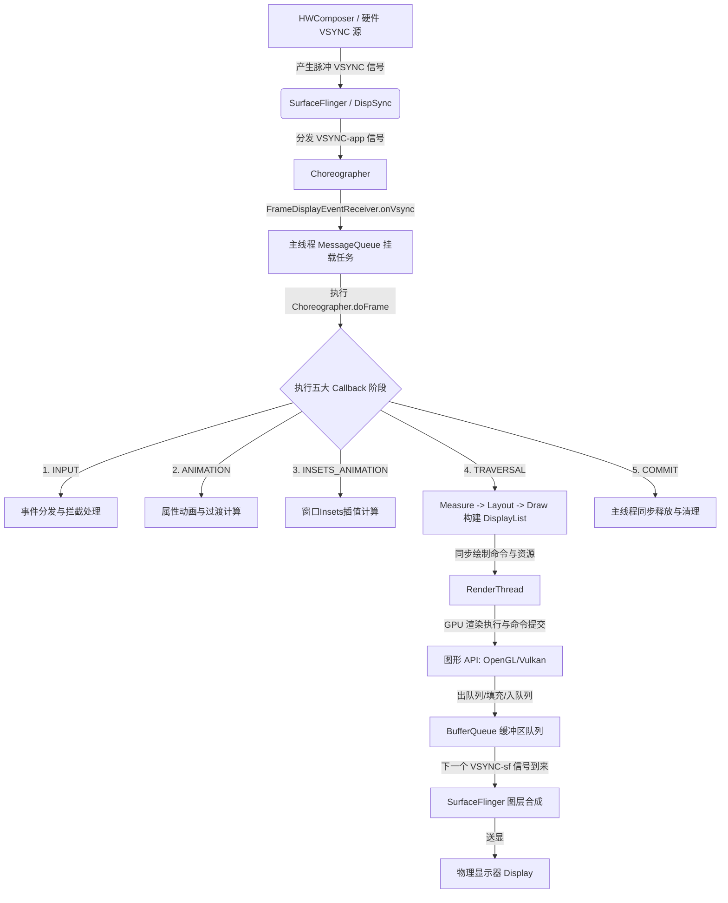
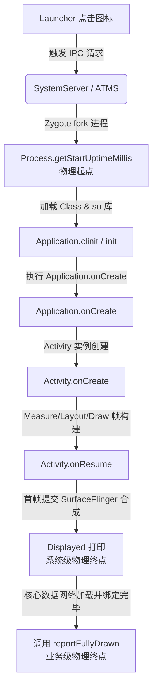
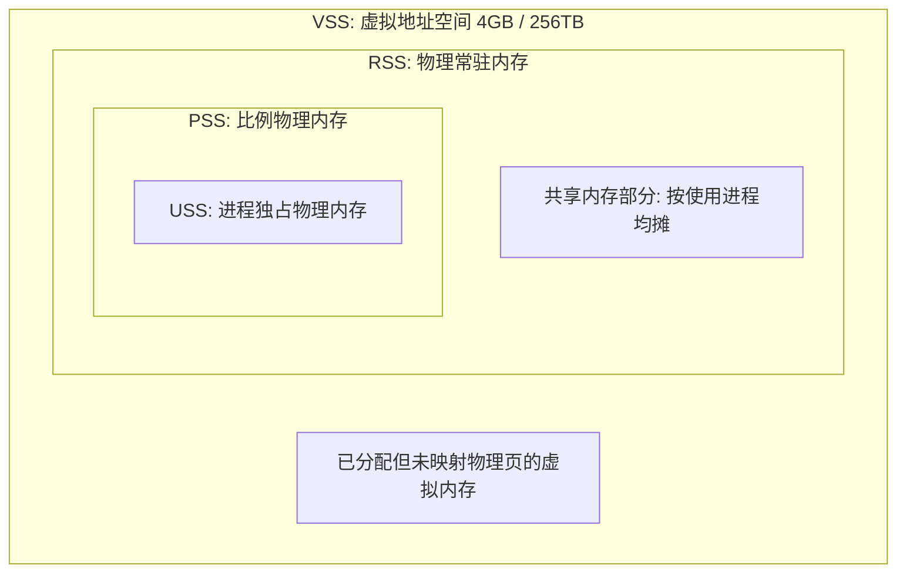
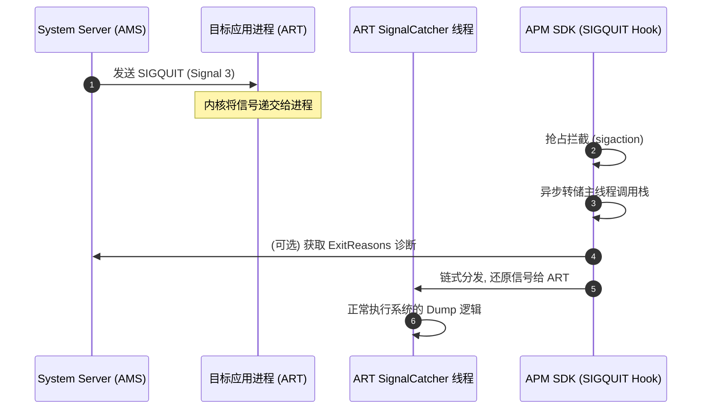
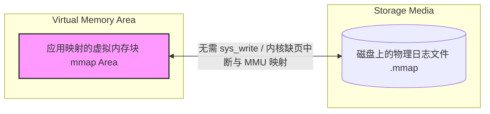
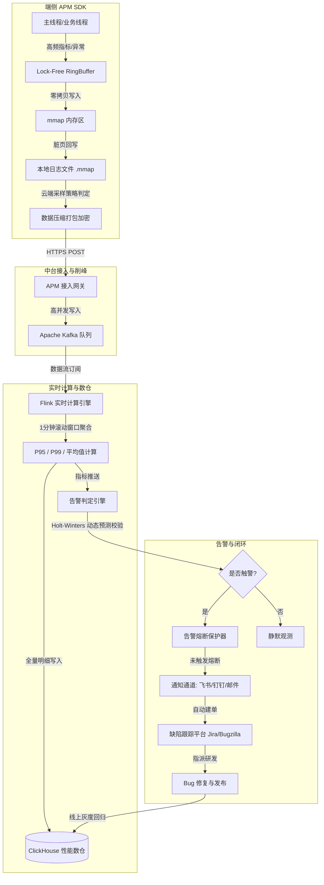
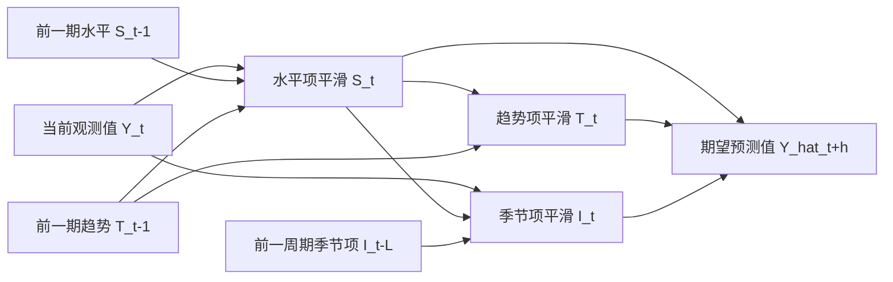

# APM 性能监控度量体系：指标定义与底层原理

在移动互联网进入深水区后，Android 应用的性能表现直接决定了用户的留存率、转化率以及业务的最终生命线。为了实现性能的系统性优化，必须建立一套科学、严谨、低损耗的线上应用性能监控（Application Performance Monitoring, APM）度量体系。本文将从学术与工程实践的双重维度，对 Android 核心性能指标的架构体系、数学模型、系统底层原理、版本对齐标准、端侧卡控损耗以及告警闭环模型进行系统性的深度剖析。

---

## 第一部分：APM 性能监控度量体系架构

### 1. 什么是 APM 监控度量体系
APM（Application Performance Monitoring，应用性能监控）是一套贯穿端到端（Client-to-Server）的运行时性能状态感知、量化、诊断与告警的系统工程。在 Android 客户端，APM 框架的核心任务是通过低侵入性、低损耗的埋点、插桩和系统调用捕获，实时收集应用运行期间的流畅度、启动耗时、内存状态、网络开销、功耗表现以及稳定性异常等指标。

度量（Measurement）不仅仅是数据的简单收集，更是在特定上下文（如设备分级、网络环境、业务路径）下，对用户真实体验的数学建模。一个合格 of APM 指标必须具备以下三个核心属性：
1. **可量化性（Quantifiability）**：能够通过精确的物理时间、空间单位或无量纲的统计比率进行表达，避免模糊的主观描述。
2. **归因性（Attributability）**：当指标恶化时，能够关联到明确的代码上下文、系统行为或资源争抢状态，为开发人员指明优化方向。
3. **敏感性（Sensitivity）**：指标的波动能够真实反映用户体验的微小劣化或优化收益，不存在统计学的“盲区”。

### 2. 线上监控度量的必要性
许多团队在开发初期过度依赖线下性能测试，然而线下测试往往无法涵盖线上环境的复杂性。线上性能监控的必要性根源于以下“三大混沌因素”：

#### 2.1 设备碎片化与 OEM 调度机制的黑盒化
Android 生态包含成千上万种不同的硬件组合。各家 OEM 厂商（如华为、小米、OPPO、vivo 等）为了延长电池寿命或控制机身发热，对 Linux 内核的 CPU 调度器（例如 EAS，Energy Aware Scheduling）、温控组件（Thermal Daemon）以及低内存杀手（Low Memory Killer, LMK）进行了深度定制。线下受控环境（Lab）无法模拟这些复杂的系统在低电量、高机身温度、重载等极端工况下的真实表现。

#### 2.2 真实网络与物理环境的不可预测性
线下模拟的弱网通常是静态的（如限速 100kb/s，丢包率 10%）。但在真实世界中，用户可能在高速移动的地铁上、电梯内或信号交替的盲区。网络协议栈的重传机制、TLS 握手延迟、DNS 解析耗时以及底层的无线电链路控制（RLC）状态变化，都会在线上呈现出极端的长尾效应。

#### 2.3 用户行为路径与并发状态的无限性
用户的使用习惯是随机的。连续点击、多任务切换、后台静默下载、长生命周期页面的内存累积等复杂路径，是线下人工或自动化脚本难以穷尽的。线上度量通过海量样本的统计学规律（中位数、P95、P99 等分位数），能够排除单次偶然误差，递呈出整体用户群中的真实体验。

### 3. 平衡线下与线上（Lab vs. Field）
性能优化不可偏废其一，必须建立线下测试（Lab Testing）与线上度量（Field Measurement）的互补闭环。

| 维度 | 线下度量 (Lab) | 线上度量 (Field) |
| :--- | :--- | :--- |
| **主要目标** | 深度归因、锁竞争分析、方法级调用栈剖析、内存泄漏回溯。 | 趋势监控、性能恶化防线、多维交叉分析、热点告警。 |
| **数据精度** | 极高（微秒级精度，获取完整 Trace / CPU 周期）。 | 中等（需通过采样、聚合限制数据体积与上报带宽）。 |
| **运行损耗** | 不敏感（可以使用高损耗的插桩、Systrace/Perfetto 追踪）。 | 极度敏感（严格限制 CPU 占用率、内存分配与 I/O 频次）。 |
| **核心工具** | Profile, Perfetto, Systrace, LeakCanary, LayoutInspector. | 轻量级端侧 APM SDK, Flink 实时聚合中台, ClickHouse 大盘。 |
| **方法论** | **控制变量法**：在标准测试序列下，对比优化前后的物理数据。 | **统计学分析**：利用分位数控制长尾问题，排查特定设备集群的性能劣化。 |

两者之间的协作模型通常为：线上监控作为“吹哨人”，当大盘指标发生异常（如 P99 卡顿率升高）时，触发动态采样上报或通过线上收集到的堆栈与属性进行初步聚类。随后，研发人员在线下通过复现环境，使用高精度的工具（如 Perfetto 抓取内核调度轨迹）进行“深水区”调试，找到根因并修复，最后再回馈到线上大盘进行数据验证。

---

## 第二部分：核心 APM 指标的学术级定义与计算公式

### 1. 流畅度（Fluency & Smoothness）

#### 1.1 Choreographer 机制与 SurfaceFlinger 交互原理
理解流畅度指标，必须首先厘清 Android 的渲染管线。Android 系统的画面渲染是一个由硬件垂直同步信号（VSYNC）驱动的复杂时序流程，主要涉及 `Choreographer`（编舞者）、`RenderThread`（渲染线程）以及 `SurfaceFlinger`（系统合成服务）。



在上述架构中：
1. **VSYNC 信号源**：由 Hardware Composer（HWC）硬件产生，以固定频率（如 60Hz 对应约 16.6ms 周期，120Hz 对应约 8.33ms 周期）发出。
2. **Choreographer 接收**：应用进程的 `Choreographer` 通过 `FrameDisplayEventReceiver`（一个 Native 的 `DisplayEventReceiver` 子类）监听 `VSYNC-app` 信号。一旦信号抵达，它会向主线程的 `MessageQueue` 头部插入一个异步消息，以触发下一帧的绘制。
3. **doFrame 执行**：主线程在处理该消息时，调用 `Choreographer.doFrame()`。在此方法中，系统依次处理以下五类 Callback：
   - **`CALLBACK_INPUT`**：响应触摸、按键等输入事件。
   - **`CALLBACK_ANIMATION`**：计算属性动画的新状态。
   - **`CALLBACK_INSETS_ANIMATION`**：更新窗口插入区（如输入法面板弹出过渡）。
   - **`CALLBACK_TRAVERSAL`**：核心排版与渲染阶段，触发顶级 View 树的 `performTraversals()`。该阶段执行 `measure()`、`layout()` 和 `draw()`。在 `draw()` 过程中，CPU 将 View 的绘制指令记录到 `DisplayList`（显示列表）中。
   - **`CALLBACK_COMMIT`**：用于主线程与渲染线程之间的某些同步清理任务。
4. **RenderThread 与 GPU**：自 Android 5.0 起，`RenderThread` 接管了与 GPU 的直接交互。主线程完成 `CALLBACK_TRAVERSAL` 后，将 `DisplayList` 中的指令包以及纹理资源同步（Sync）给 `RenderThread`。主线程随即释放，可以继续响应其他消息。`RenderThread` 通过 OpenGL 或 Vulkan 接口向 GPU 发送渲染指令。
5. **BufferQueue 交互**：当 `RenderThread` 完成画面渲染后，会将填充好的图形 Buffer（通过 `eglSwapBuffers()` 或 Vulkan Equivalent）提交到与 `SurfaceFlinger` 共享的 `BufferQueue`。
6. **SurfaceFlinger 合成**：当下一个 VSYNC（具体的 `VSYNC-sf` 信号）到来时，`SurfaceFlinger` 会唤醒，从 `BufferQueue` 中取出最新的 Buffer，与系统其他窗口（如 StatusBar、NavigationBar）的图层进行混排（Composition），最终写入帧缓冲区送达屏幕显示。

#### 1.2 FPS（Frames Per Second）定义与极限
**FPS（每秒帧数）**是最直观的流畅度指标。其学术级数学定义如下：

设在观测时间窗口 $T$（单位：秒）内，屏幕实际完成渲染并显示的帧总数为 $N$，则该时段内的平均 FPS 为：

$$FPS = \frac{N}{T}$$

**FPS 指标的局限性**：
在监控流畅度时，FPS 会产生严重的“均值掩盖效应”。例如，在 1 秒（1000ms）的观测窗口内，前 500ms 应用因为执行了主线程的 I/O 操作而完全卡死（第 1 帧绘制耗时 500ms），但在后 500ms 内，应用以 60fps 的满帧率快速补充渲染了 30 帧。最终计算出的 FPS 为：

$$FPS = \frac{1 + 30}{1} = 31 \text{ frames/sec}$$

对于用户而言，31fps 本应是一个可以接受的轻微卡顿感，但实际体验中却发生了长达 500ms 的完全无响应（Freeze）。因此，线上 APM 绝不能仅靠 FPS 评估流畅度，必须引入能够感知时间分布不均的指标。

#### 1.3 丢帧数（Dropped Frames）计算公式
丢帧数能更精确地度量卡顿的具体程度。当显示器刷新周期为 $T_{vsync}$ 时，若某帧从开始触发 `doFrame` 准备绘制，到最终画面送显的实际耗时为 $\Delta t$，则该帧的**丢帧数 $Dropped\_Frames$** 满足以下数学关系：

$$Dropped\_Frames = \max \left( 0, \left\lfloor \frac{\Delta t}{T_{vsync}} \right\rfloor - 1 \right)$$

*注：其中 $\lfloor x \rfloor$ 表示向下取整函数。之所以减 1，是因为耗时在 1 个 VSYNC 周期内属于正常，没有丢帧。*

在 Android 系统中，我们可以通过 `FrameMetrics`（Android 7.0+ 引入）获取每帧在主线程及渲染线程的精确时间戳：
- `INTENDED_VSYNC_TIMESTAMP`：Choreographer 期望该帧开始绘制的时间戳。
- `VSYNC_TIMESTAMP`：实际开始绘制的时间戳。
- `LAYOUT_MEASURE_DURATION`：排版耗时。
- `DRAW_DURATION`：构建绘制指令耗时。
- `SYNC_DURATION`：主线程向渲染线程同步数据耗时。
- `COMMAND_ISSUE_DURATION`：向 GPU 发送指令耗时。
- `SWAP_BUFFERS_DURATION`：提交 Buffer 耗时。
- `GPU_DURATION`（Android 10+ 支持）：GPU 实际渲染该帧的耗时。

一帧的完整物理耗时 $\Delta t$ 为上述各阶段耗时的总和（包含 CPU 与 GPU 耗时）。当 $\Delta t$ 超过 $T_{vsync}$ 时，就会发生丢帧，并在下一次 SurfaceFlinger 试图合成时继续使用前一帧的旧缓存，导致画面停顿。

#### 1.4 滑滑流畅度比率（Sliding Fluency Ratio）
为了屏蔽应用在静态页面（无需绘制）下的极高流畅度伪象，必须针对高交互场景（如 `RecyclerView` 滚动、`ViewPager` 滑动）定义**滑动流畅度比率**。
设在一次列表滚动交互中（事件从 `MotionEvent.ACTION_DOWN` 开始，经历多次 `ACTION_MOVE`，到 `ACTION_UP` 或 `ACTION_CANCEL` 结束，且触发了 View 的位置改变），总渲染帧数为 $M$，其中**流畅帧**（定义为丢帧数 $Dropped\_Frames \le 1$ 且帧耗时 $\Delta t < 2 \cdot T_{vsync}$）的帧数为 $M_{fluent}$。
滑动流畅度比率 $SFR$ 的计算公式为：

$$SFR = \frac{M_{fluent}}{M} \times 100\%$$

对于 60Hz 屏幕，$SFR$ 高于 95% 代表极度流畅；若低于 85%，用户则能明显感知到滑动过程中的微小阻滞感与跳跃感。

#### 1.5 卡顿（Jank）与严重卡顿（Freeze）的数学模型与计算法则
为了准确分类线上用户的痛点，APM 必须通过数学模型严格区分“轻微抖动”、“单次卡顿”与“严重冻结”。

##### A. 绝对卡顿判定模型（Jank）
单帧物理耗时 $\Delta t$ 超过固定阈值的判定法。通常设定：

$$Jank\_Condition \iff \Delta t > \beta \cdot T_{vsync}$$

在主流 APM 实践中，通常取 $\beta = 3$（在 60Hz 屏幕下对应 $\Delta t > 50\text{ms}$，在 120Hz 屏幕下对应 $\Delta t > 25\text{ms}$）。这符合人类视觉残留的敏感极限。

##### B. 相对卡顿判定模型（Relative Jank）
为了适应不同刷新率屏幕以及前后帧对比的突变感，学术界引入了**相对卡顿判定**：
设当前帧为第 $n$ 帧，其耗时为 $t_n$，前 $m$ 帧的平均耗时为 $\mu_{n-1} = \frac{1}{m}\sum_{i=1}^{m} t_{n-i}$。判定当前帧是否为 Jank 的数学关系为：

$$Jank(n) = \begin{cases} 1, & \text{if } t_n > \lambda \cdot \mu_{n-1} \text{ and } t_n > 2 \cdot T_{vsync} \\ 0, & \text{otherwise} \end{cases}$$

常数 $\lambda$ 通常取值 $1.8$。该模型表示，如果当前帧的耗时比前几帧的平均耗时突增了 80% 以上，即使其物理时间可能只有 35ms（未达到绝对 Jank 的 50ms 阈值），用户依然会因为这种速度的不均匀而感受到“帧率抖动（Jitter）”。

##### C. 严重卡顿（Freeze）判定模型
严重卡顿代表界面在较长时间内处于“冻结”状态。数学定义为：

$$Freeze\_Condition \iff \Delta t > 700\text{ms}$$

当单帧耗时超过 700ms 时，它极易演变成 ANR（Application Not Responding，通常主线程阻塞超时阈值为 5 秒，但 700ms 已经是人机交互中“即时响应”感知的彻底破裂点）。APM 遇到 Freeze 事件时，必须立即收集当前的线程堆栈、CPU 负载以及 Binder 锁信息。

---

### 2. 启动耗时（App Startup Latency）

#### 2.1 启动模式的物理起点与终点定义
应用启动是性能优化的核心战场，包含冷启动、温启动与热启动三种模型。



##### 2.1.1 冷启动（Cold Start）
- **物理起点**：
  在内核及系统框架层面，起点为用户在 Launcher 点击应用图标，系统接收到 Binder 请求，`system_server` 的 `ActivityTaskSupervisor` 决定启动新进程，调用 `Process.start()`，Zygote 接收 Socket 命令并执行 `fork()` 出新进程的时刻。
  线上 APM 无法直接在应用进程中获取 `fork` 的准确 CPU 周期，因此通常采用以下两种替代方式获取物理起点：
  1. 读取 Linux 伪文件系统 `/proc/self/stat` 中的第 22 个字段 `starttime`。该字段记录了进程自系统启动以来的 jiffies（时钟滴答数），通过内核常数 `Hertz`（通常为 100）可以精确换算为相对于系统开机时间的毫秒级绝对时间戳。
  2. 在 Android 11（API 30）及以上版本，直接调用系统 API：
     $$T_{start} = \text{Process.getStartUptimeMillis()}$$
  3. 如果是低版本且没有 `/proc` 读取权限，则妥协为 `Application.<clinit>`（类加载首个静态代码块执行时）的时间戳，但此方法会丢失 Zygote fork 以及系统 Linker 加载动态链接库（so 库）的耗时（约 100ms ~ 300ms）。
- **物理终点**：
  学术定义为应用第一帧内容对用户“完全可见”的瞬间。
  在工程实现中，终点通常对齐到 `Activity.onWindowFocusChanged()` 被回调后，且主线程的下一次渲染帧通过 `ViewTreeObserver.OnDrawListener` 完成渲染，并成功交换到屏幕缓冲区的时刻。

##### 2.1.2 温启动（Warm Start）
- **物理起点**：
  进程依然保留在系统内存中（例如应用退到后台后未被 LMK 杀掉），但 Activity 已经被销毁或回收。当用户重新启动该 Activity 时，无需重复执行 Application 的构建与 `onCreate()`，但需要重新执行 Activity 实例的初始化、资源加载以及布局解析。
  物理起点定义在 `Activity.<init>` 开始执行的瞬间。
- **物理终点**：
  与冷启动对齐，即该 Activity 首帧绘制送显的时刻。

##### 2.1.3 热启动（Hot Start）
- **物理起点**：
  进程与核心 Activity 实例均在内存中完好保留。当用户从最近任务列表（Recents List）切回应用，或者点击通知拉回应用时，系统只需将 Activity 移至前台。
  物理起点定义在系统派发 `NewIntent` 或者是 Activity 生命周期的 `onRestart()` / `onStart()` 开始触发的瞬间。
- **物理终点**：
  Activity 的 `onResume()` 执行完毕，并且界面发生下一次刷新呈现的时刻。

#### 2.2 ActivityRecord 源码分析与系统级 Logcat 打印标记 `Displayed`
在 Android 系统级调优时，我们会注意到 Logcat 中经常打印类似如下的日志：
```text
ActivityTaskManager: Displayed com.example.app/.MainActivity: +450ms
```
这个耗时是由系统服务 `ActivityTaskManagerService`（ATMS）记录的，代表系统认可的“物理冷启动耗时”。深入其源码逻辑：
1. **启动生命周期绑定**：当系统发起 Activity 启动请求时，ATMS 内部会为该 Activity 创建一个 `ActivityRecord` 对象。在 `ActivityRecord` 中，有一个 `LaunchTimeTracker`，用于追踪并记录启动状态的标志位。
2. **启动起点记录**：当 `ActivityRecord` 准备进入 `STARTING` 状态时，系统会记录当前系统时间戳 $T_{system\_start}$。
3. **渲染监控**：`ActivityRecord` 内部拥有一个 `ActivityRecord.Token` 代理类，它与 WindowManager 中的 `WindowState` 以及底层的 `WindowToken` 相互关联。当应用的主线程与 `RenderThread` 完成绘制，并将 Buffer 提交给 SurfaceFlinger 合成后，系统的 WindowManagerService（WMS）会接收到来自渲染引擎（如 Vulkan pipeline）的渲染完成通知（OnDrawn）。
4. **Displayed 打印**：WMS 收到绘制完毕的通知后，会跨进程回调给 ATMS 的 `ActivityRecord.reportLaunchTimeLocked()`。其核心逻辑计算为：

$$\Delta T_{displayed} = T_{now\_drawn} - T_{system\_start}$$

系统会将此结果输出到 Logcat，并在事件日志（Event Log）中写入 `am_activity_fully_drawn` 或 `am_on_resume_called` 等关键原子事件。APM 线上监控在某些场景下需要对齐这个系统级指标，但在没有 root 权限和系统日志读取权限的线上环境，需要通过反射 `ActivityThread` 内部的生命周期 Handler，或者利用 `AppStartInfo`（Android 15+ 引入的底层启动信息收集框架）来读取。

#### 2.3 业务真实启动耗时：`reportFullyDrawn()`
上述的 `Displayed` 仅仅代表 UI 树的第一次 Measure-Layout-Draw 完成，但此时应用可能正在展示一个空骨架屏（Skeleton Screen）或者 Loading 转圈，核心数据（如网络请求回来的首页列表）尚未渲染。因此，必须引入**业务真实启动耗时**。
Android SDK 提供了 `Activity.reportFullyDrawn()` 方法，用于让业务团队自主控制启动度量的物理终点：
```java
public class MainActivity extends Activity {
    @Override
    protected void onCreate(Bundle savedInstanceState) {
        super.onCreate(savedInstanceState);
        setContentView(R.layout.activity_main);
        // 发起异步网络请求
        fetchHomeData(new HttpCallback() {
            @Override
            public void onSuccess(Data data) {
                bindDataToRecyclerView(data);
                // 数据完全绑定并完成排版后，手动上报给系统
                if (Build.VERSION.SDK_INT >= Build.VERSION_CODES.KITKAT) {
                    try {
                        reportFullyDrawn();
                    } catch (SecurityException e) {
                        // 避免部分定制ROM在底层执行该方法时抛出安全异常
                    }
                }
            }
        });
    }
}
```
当调用 `reportFullyDrawn()` 后，系统会计算从启动起点到此时的时间差，并在 Logcat 打印 `ActivityTaskManager: Fully drawn...`。线上 APM 应该 Hook 这个方法的底层实现，或通过注册相应的 API 回调来记录该业务指标，以评估“真正可用时间”的缩短情况。

---

### 3. 内存与稳定性（Memory & Stability）

#### 3.1 内存空间账本：PSS、RSS、VSS、USS



在 Linux 及 Android 内核中，进程对内存的占用并不是单一维度可以描述的，必须通过以下四个核心概念进行审计：

##### 3.1.1 VSS（Virtual Set Size，虚拟耗用内存）
VSS 是进程可以访问的全部虚拟地址空间大小。其数学定义为：

$$VSS = \sum_{i} Size(\text{Virtual\_Range}_i)$$

包含以下部分：
- 进程已经分配但未映射物理内存的虚拟地址空间。
- 映射了共享库文件的虚拟地址空间。
- 已经通过 `malloc` 或 `mmap` 申请，但尚未发生写入（尚未触发缺页中断 Page Fault 分配物理页）的虚拟页内存。
*注：对于 32 位 Android 系统，单个进程的虚拟地址空间上限为 4GB。当 VSS 接近 4GB 时，即使物理内存极其充足，应用依然会因为无法寻址而抛出 `OutOfMemoryError`。在 64 位系统下，虚拟地址空间达到了 256TB，VSS 的限制已不再是核心痛点。*

##### 3.1.2 RSS（Resident Set Size，常驻物理内存）
RSS 是进程实际占用的物理内存大小。其数学定义为：

$$RSS = \sum_{i} Size(\text{Mapped\_Physical\_Page}_i)$$

包含：
- 进程独占的物理页。
- 进程所加载的共享库（如 `libc.so`、`libart.so`）在物理内存中所占的完整大小。
*局限性：如果有 10 个进程同时加载了 `libart.so`，该 so 库占用了 50MB 物理内存在 10 个进程各自的 RSS 指标中都会被完整计算一次。因此，将所有进程的 RSS 简单相加，会远远超过系统实际的物理内存总量。*

##### 3.1.3 PSS（Proportional Set Size，比例物理内存）
为了公允地度量单个进程对系统物理内存的消耗，学术界和 Android 系统主流推荐使用 PSS。其数学定义为：

$$PSS = USS + \sum_{j} \frac{Size(\text{Shared\_Page}_j)}{N_{sharers\_j}}$$

其中，$N_{sharers\_j}$ 表示第 $j$ 个共享物理页同时被多少个进程所共享。
例如，一个共享库占用了 12MB 的物理内存，当前系统中有 3 个应用进程正在映射并使用它，则分摊到每个进程的 PSS 中的额度为 4MB。PSS 是目前评估进程是否会触发 LMK 被杀的最具指导性物理指标。

##### 3.1.4 USS（Unique Set Size，独占物理内存）
USS 是进程独占的物理内存大小，即如果该进程被强杀，系统能够瞬间安全回收的物理内存总量：

$$USS = \sum_{k} Size(\text{Private\_Physical\_Page}_k)$$

USS 不包含任何与其他进程共享的物理页。当应用发生渐进式内存泄漏时，USS 会呈现出最清晰的线性上升趋势，是排查内存泄漏的黄金指标。

#### 3.2 Linux Proc 文件系统读取原理
线上 APM 监控需要实时或周期性地读取上述内存指标。在 Android 平台，这些信息由 Linux 内核动态维护，并暴露在 `/proc` 伪文件系统（Process Information Pseudo-File System）中。

##### 3.2.1 `/proc/self/status`
该文件包含了当前进程的整体状态和内存审计高水位线。核心字段包括：
- `VmPeak`：进程虚拟内存大小的历史峰值。
- `VmSize`：当前的虚拟内存大小（对应 VSS）。
- `VmHWM`（High Water Mark）：“常驻内存”历史峰值。
- `VmRSS`：当前的物理常驻内存大小（对应 RSS）。
- `Threads`：当前进程中的活跃线程总数（过多的线程会耗尽内核的 PID 资源和线程栈空间）。

##### 3.2.2 `/proc/self/statm`
该文件非常精简，仅包含 7 个空格分隔的整数，单位为“内存页数”（Page，在大部分 32/64 位 Android 设备上，默认单页大小为 4KB；在支持 16KB 页面的 Android 15/16 系统中，单页为 16KB）。
各字段对应关系为：
1. `size`：总虚拟内存（VSS）。
2. `resident`：常驻物理内存（RSS）。
3. `shared`：共享页数。
4. `text`：可执行代码占用的物理内存。
5. `lib`：库文件映射大小（在近代 Linux 内核中通常为 0）。
6. `data`：数据段加堆栈大小。
7. `dt`：脏页数。

##### 3.2.3 `/proc/self/smaps`
`smaps` 是最详尽的进程内存地图，详细展示了进程的每个虚拟内存段（VMA，Virtual Memory Area）的地址范围、权限、映射文件名以及该段对应的 PSS、USS（Private_Dirty + Private_Clean）指标。

##### 3.2.4 APM 读取的开销与避坑指南
很多初学者在线上每隔 1 秒就去读取一次 `/proc/self/smaps` 来监控内存，这会导致灾难性的卡顿。
**底层原理分析**：
`/proc` 文件系统是由内核在用户态发起读取时**动态生成**的。当应用读取 `smaps` 时，内核必须持有该进程的内存描述符读锁 `mm_struct->mmap_lock`，然后遍历当前进程中所有的虚拟内存区域（VMA），并对每个 VMA 逐页扫描页表项（PTE），以计算哪些页被映射、哪些是 Dirty 页、哪些被共享。
1. **CPU 飙升**：如果一个应用的 VMA 数量庞大（由于大量的 so 库加载和内存碎片），一次 `smaps` 读取可能会耗时 **50ms ~ 200ms**，吃满单个 CPU 核心。
2. **锁竞争阻塞主线程**：由于读取 smaps 期间内核持有 `mmap_lock` 读锁，如果此时主线程正在进行类加载、内存分配或执行 `malloc`/`mmap`（这些操作在内核中需要申请 `mmap_lock` 写锁），主线程就会被无情地阻塞，进而触发严重的 Jank 甚至 ANR。
**APM 优化策略**：
线上应严禁读取 `smaps`。若需监控物理内存，应优先读取轻量级的 `/proc/self/statm` 或 `/proc/self/status`。这些文件的读取耗时通常在 **0.1ms 级别**，因为内核只需要直接读取已有的内存统计变量，无需遍历复杂的页表结构。

#### 3.3 稳定性指标的计算账本

##### 3.3.1 Java 崩溃率（Java Crash Rate）
度量 Java 层的异常稳定性，分为“设备维度”与“会话维度”：

$$\text{会话级 Java 崩溃率} = \frac{\text{观测周期内发生 Java Crash 的 Session 总数}}{\text{观测周期内应用启动的总 Session 数}} \times 100\%$$

$$\text{设备级 Java 崩溃率} = \frac{\text{观测周期内发生 Java Crash 的独立设备数 (UV)}}{\text{观测周期内活跃的独立设备数 (UV)}} \times 100\%$$

*注：一个 Session 通常定义为应用从冷启动开始，到进程完全退出，或者应用退到后台超过 30 分钟被定义为一次会话结束。*

##### 3.3.2 Native 崩溃率（Native Crash Rate）
Native 层（C/C++ 代码）由于指针越界、内存野指针、主动中止（abort）引发的系统信号崩溃：

$$\text{设备级 Native 崩溃率} = \frac{\text{发生 SIGSEGV/SIGABRT/SIGBUS 等信号异常退出的 UV}}{\text{总活跃 UV}} \times 100\%$$

##### 3.3.3 ANR 发生率（ANR Rate）
ANR 是 Android 系统特有的无响应状态：

$$\text{ANR 发生率} = \frac{\text{触发 ANR 的 UV}}{\text{总活跃 UV}} \times 100\%$$

#### 3.4 ANR 信号捕获机制与 Native SIGQUIT Hook



##### 3.4.1 传统 ANR 监控局限性
在早期的 Android 版本中，应用发生 ANR 时，APM 可以通过 `FileObserver` 监听系统的 `/data/anr/traces.txt` 文件。然而，随着 Android 权限隐私收紧：
- Android 6.0 限制了普通应用读取该目录的权限。
- Android 8.0 之后，系统将 traces 文件重构为动态生成的临时文件，普通应用完全无法访问。
这要求 APM 必须采用基于 Linux 信号（Signal）拦截的**无权限 ANR 监控机制**。

##### 3.4.2 SIGQUIT（信号 3）捕获机制原理
当 Android 的 `system_server` 发现应用无响应时，其底层的 `ProcessRecord` 会调用 Linux 的信号系统，向发生 ANR 的目标进程发送一个 **`SIGQUIT`（信号 3）** 信号。
1. **默认 ART 行为**：ART 虚拟机启动时，会默认创建一个名为 `SignalCatcher` 的守护线程。该线程通过 `sigwait()` 阻塞式地等待 `SIGQUIT` 信号。一旦收到信号，它会暂停进程中所有的 Java 线程（Stop the World），并将各个线程的调用栈、锁状态、类加载信息格式化后写入 `/data/anr/` 下的文件，以供系统生成 ANR Trace。
2. **APM Hook 方案**：APM 在 native 层通过系统调用 `sigaction()` 或者是 Hook `sigwait` 相关的 C 库函数，注册自定义的 `SIGQUIT` 信号处理器（Signal Handler）。
   - **信号抢占**：在自定义的处理器中，APM 不应直接拦截并吞掉信号（否则系统无法生成 ANR traces，导致排障困难），而应该进行“旁路监听”。
   - **主线程状态检查**：当收到 `SIGQUIT` 时，APM Handler 立即向主线程的 `MessageQueue` 发送一个屏障或检测任务，或者直接读取主线程的 State。如果主线程确实处于阻塞状态（通常判断主线程是否在处理消息队列，或其线程状态是否处于 `BLOCKED`、`WAITING` 等），则基本可以断定发生了真正的 ANR（需要过滤系统向后台进程发送的常规 Dump 请求）。
   - **链式分发**：处理完毕后，APM Handler 必须显式调用旧的信号处理逻辑（将信号回传给 ART 的 `SignalCatcher`），确保系统正常的 ANR Dump 流程不受干扰。

##### 3.4.3 Android 11+ 对齐标准：`ApplicationExitInfo`
在 Android 11 及以上版本，系统在 `ActivityManager` 中引入了退出的历史诊断信息接口。应用在下次冷启动时，可以通过调用：
```java
ActivityManager am = (ActivityManager) getSystemService(Context.ACTIVITY_SERVICE);
List<ApplicationExitInfo> exitInfos = am.getHistoricalProcessExitReasons(
    null, // 包名，null代表当前应用
    0,    // 过滤PID
    10    // 获取最近的退出原因条数
);
for (ApplicationExitInfo info : exitInfos) {
    int reason = info.getReason();
    if (reason == ApplicationExitInfo.REASON_ANR) {
        long timestamp = info.getTimestamp();
        byte[] traceData = null;
        if (Build.VERSION.SDK_INT >= Build.VERSION_CODES.R) {
            try (InputStream is = info.getTraceInputStream()) {
                if (is != null) {
                    traceData = readAllBytes(is); // 读取系统级 ANR 堆栈
                }
            } catch (IOException e) {
                // 处理读取异常
            }
        }
        // 上报线上 APM 服务器进行聚合归因
    }
}
```
该 API 极大降低了应用捕获 ANR 堆栈的门槛，且由于是系统内核导出的，具备极高的权威性和稳定性，线上 APM 应该将此机制作为 Android 11 机器的首选闭环数据源。

##### 3.4.4 OOM 占比
OOM 是由于可用内存耗尽，分配请求被拒导致的 Crash。

$$\text{OOM 占比} = \frac{\text{抛出 OutOfMemoryError 导致 Crash 的次数}}{\text{总 Java Crash 次数}} \times 100\%$$

---

### 4. 资源消耗（Resource Consumption）

#### 4.1 功耗与电量模型
线上端侧设备无法直接连接物理电流表，因此功耗的度量属于一种**间接数学建模**。
物理电量消耗的通用数学公式为：

$$E_{total} = \int_{0}^{T} \left( I_{cpu}(t) \cdot V + I_{gpu}(t) \cdot V + I_{radio}(t) \cdot V + I_{screen}(t) \cdot V \right) dt$$

在 APM 中，我们通过采集设备状态来近似量化这一积分过程：
- **CPU 异常高载（CPU Uptime）**：
  统计应用进程在单位时间内消耗的 CPU 时间片总数：
  $$\text{CPU\_Usage} = \frac{\Delta t_{utime} + \Delta t_{stime}}{\text{System\_Uptime\_Delta}}$$
  其中 $utime$ 为用户态耗时，$stime$ 为内核态耗时。
- **WakeLock 持有度量**：
  WakeLock 是 Android 锁屏后保持 CPU 运转的核心机制。滥用 WakeLock 是电量恶化的罪魁祸首。APM 必须 Hook `PowerManager.WakeLock` 的 `acquire()` 与 `release()` 方法，统计两者的配对情况，度量以下两个物理量：
  1. **单次持锁最长时间（Max Lock Duration）**：单次持锁超过 10 分钟通常被定义为“WakeLock 泄漏”。
  2. **累计持锁率（Lock Retention Ratio）**：在观测周期 $T$ 内，应用持有任意 WakeLock 的总累计时间 $T_{locked}$ 占比 $T_{locked} / T$。

#### 4.2 网络上传/下载流量
流量度量主要通过端侧代理和系统层审计：
1. **Socket 级别拦截**：通过 Hook Java 层的 `SocketImpl` 或者是 Native 层的 `connect`、`send`、`recv` 系统调用，拦截所有的网络读写流。
2. **流量归因公式**：对每个 HTTP 请求进行精细的账本记录：

$$\text{Traffic}_{total} = \text{Size}_{request\_header} + \text{Size}_{request\_body} + \text{Size}_{response\_header} + \text{Size}_{response\_body}$$

3. **流量分类标记**：通过 Android 系统的 `TrafficStats` 或 `NetworkStatsManager`，可以将流量标记到具体的 `Thread` 或者是业务 Tag（如视频播放、图片加载、常规 API 交互），便于线上追溯是谁在“偷跑”用户流量。

#### 4.3 存储空间占用度量
随着时间的推移，应用产生的日志、临时缓存以及离线数据库会侵占用户的存储空间，增加因磁盘空间不足（Disk Full）而崩溃的概率。
APM 建立的存储审计账本需要对私有路径进行递归扫描：
1. **数据目录**：`/data/data/<package_name>/`。
2. **外部私有目录**：`/sdcard/Android/data/<package_name>/`。
3. **关键审计指标**：
   - **`Cache` 目录大小**：可安全清理的临时文件总量。
   - **`Databases` 目录大小**：核心数据库（如 SQLite, Room）的物理大小。
   - **`SharedPrefs` 目录大小**：XML 序列化配置大小（由于 SharedPreferences 是全量加载到内存的，SP 文件超过 2MB 会引发严重的内存占用 and 主线程初始化卡顿）。

---

## 第三部分：不同 Android 版本及机型对齐标准

随着 Android 版本的演进，Google 对系统底层的安全架构、权限模型进行了大刀阔斧的重构。这导致 APM 的采集手段和对齐标准在不同版本和 OEM 定制系统上存在严重的偏差。

### 1. 指标获取通道在版本演进中的变化

在适配不同 Android 版本时，以下几个转折点对于 APM 采集策略至关重要。关于这些版本的底层权限和行为变更的完整上下文，可参考 [AndroidVersionChangeLog.md](../../../../../AndroidVersionChangeLog.md)。

#### 1.1 时间戳精度的演进
- **Android 4.1 ~ 4.3（API 16 ~ 18）**：
  系统在“Project Butter”（黄油计划）中重构了 UI 架构，引入了 `Choreographer`。但在早期版本中，底层时间戳采集往往依赖 `System.currentTimeMillis()`，该时间戳容易受用户手动修改系统时间或 NTP 对时服务的影响，产生跳变。
- **Android 4.4（API 19）及以上**：
  APM 应全量改用 `SystemClock.elapsedRealtimeNanos()`。它返回自设备开机以来的纳秒数，包含 CPU 休眠时间，是由底层的单调递增硬件计时器（Monotonic Clock）驱动的，不存在时钟回拨，是测量耗时的唯一物理对齐标准。

#### 1.2 流畅度采集机制的演进
- **Android 7.0（API 24）之前**：
  由于缺乏系统标准 API，APM 必须使用反射或通过 `Choreographer.getInstance().postFrameCallback()` 注册一个空的回调。在回调中计算两次执行的时间差以估算丢帧。
  **致命缺陷**：这种估算只能度量主线程（UI Thread）的耗时。如果在 Android 5.0+ 之后，主线程很空闲，但 `RenderThread` 在向 GPU 提交指令时发生严重阻塞（如复杂的 3D 渲染或 GPU 资源抢占），`postFrameCallback` 依然会认为帧率极高（因为主线程没有发生排队），从而产生漏报。
- **Android 7.0（API 24）及以上**：
  引入了 `Window.OnFrameMetricsAvailableListener` 机制。该 API 由系统底层直接向应用进程的 `RenderThread` 注入钩子，能够返回包含 GPU 执行耗时在内的 9 项高精度维度数据，解决了 RenderThread 监控的黑盒问题。

#### 1.3 权限收紧带来的系统级指标偏差
- **Android 7.0（API 24）+**：
  系统收紧了对 `/proc` 目录的访问权限。普通应用无法再通过遍历 `/proc/<pid>/` 读取其他进程的 CPU 和内存数据，APM 的“多进程横向对比监控”宣告失效，只能读取 `/proc/self/`（自身进程）的内部参数。
- **Android 10（API 29）+**：
  强制启用了分区存储（Scoped Storage），并且完全切断了应用通过反射或直接读取 `/data/anr/` 下 traces 文件的任何通道。
- **Android 15 / 16 / 17 (Beta)**：
  根据最新平台标准，系统进一步强化了内存限制和后台行为审计。对于 Target 37 的应用，引入了 lock-free `MessageQueue`，旧有依赖反射 Looper 队列内部锁来监控卡顿的黑产通道被彻底封死。因此，APM 监控代码必须保持非侵入性的公开 API 接入方式（如 `FrameMetrics` 和 `AppStartInfo`）。

### 2. 定制 ROM 的兼容适配策略

中国生态中充斥着大量的定制 ROM（如 HyperOS、Flyme、MagicOS、OriginOS 等）。这些厂商对底层的改动经常导致 APM 采集失效，甚至引发致命崩溃。

#### 2.1 CPU 限频（Throttling）对流畅度指标的污染与过滤
- **现象**：当设备处于低电量模式、充电高发热状态，或者触发了 OEM 厂商的强力温控降频策略时，系统会直接强行关闭大核 CPU，或者将 CPU 主频限制在极低水平。此时，应用界面的 FPS 会瞬间恶化（如从 120Hz 骤降到 30Hz），这并非应用本身的代码逻辑劣化，而是硬件状态发生了改变。
- **对齐适配方案**：
  APM SDK 在采集到 Jank/Freeze 事件时，必须通过 Linux 系统底层节点实时获取当前的 CPU 工作频率以及温控状态：
  - 读取 `/sys/devices/system/cpu/cpu0/cpufreq/scaling_cur_freq`（或对应的各个 CPU 核心控制节点，需注意不同 ROM 的节点路径兼容）。
  - 读取系统的电池温度：
    ```java
    Intent intent = context.registerReceiver(null, new IntentFilter(Intent.ACTION_BATTERY_CHANGED));
    int temp = intent.getIntExtra(BatteryManager.EXTRA_TEMPERATURE, 0); // 单位为 0.1 摄氏度
    ```
  - **清洗算法**：如果电池温度高于 45℃，或者 CPU 运行频率低于最大标称频率的 40%，则在 APM 大盘计算该设备会话的流畅度时，将其标记为“硬件限频状态”，予以剔除或单设标签对比，避免污染正常的业务代码回归大盘。

#### 2.2 displayed 日志输出格式的篡改适配
- **现象**：部分厂商（如 EMUI/HarmonyOS）在底层修改了 `ActivityTaskManager` 的系统输出逻辑。他们将标准的 Logcat `Displayed` 字符串格式进行了自定义修改（例如改为了 `ReportDisplayed` 或增加了特定厂商前缀），这导致依赖解析系统日志（Logcat Shell 方式，常见于自动化测试平台）的耗时统计工具彻底失效。
- **对齐适配方案**：
  不依赖 Logcat 输出。线上和线下自动化测试中，全量对齐到 `ActivityThread` 内部 `ActivityRecord` 对应的生命周期监测点。可以通过注册 `Application.ActivityLifecycleCallbacks`，在 `onActivityResumed` 被触发后，向主线程的 `MessageQueue` 尾部插入一个空 runnable，并在下一个绘制栅栏（Draw Fence）通过 `OnDrawListener` 对齐，或者直接在 Android 11+ 上使用 `ApplicationStartInfo`，它独立于系统的日志文本格式，提供了标准的数据流。

#### 2.3 `Debug.getMemoryInfo` 的底层 Binder 通信熔断
- **现象**：在某些定制 ROM（如早期 MIUI 的特定开发版）上，频繁调用 `Debug.getMemoryInfo(MemoryInfo memoryInfo)` 会触发不可预知的 native 崩溃。
- **底层根因**：`Debug.getMemoryInfo()` 底层是一个同步的 IPC（Binder）调用，它需要向系统的 `ActivityManagerService` 发起跨进程通信，AMS 进而通过内核读取该进程的 PSS。如果在主线程高频调用，不仅自身容易卡死，在某些 ROM 底层，当 Binder 线程池耗尽时，系统驱动会直接向应用进程派发进程中止信号。
- **对齐适配方案**：
  APM SDK 应采取熔断方案：当检测到当前系统为特定定制 ROM 时，限制 `Debug.getMemoryInfo` 的调用频次（如仅在页面切换时调用，且设定采样率低于 5%）。日常内存水位监控降级为直接读取 `/proc/self/stat` 中的 `minflt`（次要缺页中断）和 `majflt`（主要缺页中断）指标，结合 `Runtime.getRuntime().totalMemory()` 与 `Runtime.getRuntime().freeMemory()`，在纯 Java 环境下无锁、无 IPC 地估算堆内存状态。

---

## 第四部分：APM 线上度量框架自身损耗卡控机制

APM 框架作为常驻后台的“监控者”，绝对不能变成“污染源”。如果 APM 收集卡顿指标的行为本身导致了卡顿，或者因为频繁写盘引发了 I/O 抖动，那性能监控就失去了意义。因此，必须对 APM 自身的损耗进行极其严苛的卡控。

### 1. 动态采样率下发（Dynamic Adaptive Sampling）
大盘指标的统计具有统计学收敛性。当用户量达到一定规模时，100% 的上报数据与 1% 的上报数据在均值和分位数的收敛结果上几乎完全一致。
APM 必须引入一套基于云端下发的分级、分场景动态采样体系：

```text
设备分级（高端/中端/低端） ──┐
                          ├───> 综合决策引擎 ───> 动态下发采样率配置
业务场景（支付/下单/首页/设置） ─┘
```

- **设备分级采样**：
  低端机性能敏感，APM 应设定极低采样率（如 0.5%），仅捕获 Crash 和 ANR 等稳定性指标，关闭高损耗的 Trace 监控。高端机性能充裕，可开启高精度监控（如 5% 采样，收集详细的 FrameMetrics）。
- **业务场景分级**：
  在非核心页面（如“关于我们”、“设置”）将性能监控置于静默状态；而在核心链路（如支付页、结账页、视频播放器）将卡顿采样率动态提升至 10%，并在发生 Jank 时立刻抓取 3 秒的方法级追踪。

### 2. 内存 RingBuffer 与 mmap 异步无损刷盘

#### 2.1 普通文件 I/O 写入的致命缺陷
在 APM 运行期间，需要高频记录各种性能事件（如每一帧的耗时、发生的异常、网络响应报文）。如果使用普通的 Java 文件操作（如 `FileOutputStream` 或 `BufferedWriter`），每一次 `write()` 系统调用都必须经历以下步骤：

```text
[应用层 Buffer] 
    │
    ▼ (Java 虚拟机本地接口 JNI)
[C库缓冲区 (stdio.h)] 
    │
    ▼ (系统调用 sys_write, 触发用户态到内核态 of CPU 上下文切换)
[内核页缓存 (Page Cache)] 
    │
    ▼ (内核回写机制 pdflush/kswapd)
[物理磁盘 (闪存芯片 NAND Flash)]
```

在系统 I/O 繁忙（例如应用正在下载大文件或执行数据库加载）时，主线程或其他高频辅助线程会被 `sys_write` 的同步阻塞特性卡死（I/O Wait 增加），引发应用级别的严重卡顿。

#### 2.2 mmap 异步刷盘原理
为了解决这一问题， APM 的高性能持久化机制全量采用 **`mmap`（Memory Map，内存映射）** 系统调用。



`mmap` 是操作系统提供的将文件或设备映射到进程虚拟地址空间的系统调用。其工作流程为：
1. **建立映射**：在应用冷启动时，APM 向操作系统申请建立一个固定大小（如 500KB）的磁盘文件，并通过 `mmap()` 系统调用，将该文件的物理空间直接映射到应用进程的虚拟内存区。此时，应用拿到一个指向这块内存的 C/C++ 指针。
2. **零拷贝写入**：当 APM 需要记录一条性能指标时，它直接向该指针指向的内存写入数据（就像在内存中读写一个数组一样）。这一过程完全在**用户态**完成，没有引发任何系统调用，耗时为微秒级（接近零拷贝）。
3. **脏页回写与数据安全**：
   写入的数据会被操作系统标记为“脏页”（Dirty Page）。内核的后台线程（如 `kwriteback`）会根据预设的参数（如脏页占比达到阈值或定时器触发）异步地将脏页刷入磁盘。
   **安全性保障**：由于映射关系由操作系统内核维护，即使应用进程突然发生 Java Crash、Native Crash 甚至被系统 LMK 强杀，只要 Android 的 Linux 内核没有崩溃，内核依然会强行把虚拟内存映射区中的脏数据安全地刷回物理闪存中，保证了 APM 指标的完整记录。

#### 2.3 无锁队列（Lock-Free RingBuffer）的应用
在高频指标（如方法执行耗时）的端侧收集过程中，为了避免多线程并发写入 mmap 区域引发的锁竞争（Synchronized 或 ReentrantLock 导致的线程上下文切换损耗），APM 应采用**单生产者-多消费者或多生产者-单消费者**的**无锁环形队列（Lock-Free RingBuffer）**。
无锁队列利用底层的 **CAS（Compare-And-Swap，比较并交换）** 原子指令来管理队列的 Head 和 Tail 指针。以下是 CAS 管理写入的伪代码：

```cpp
struct Element {
    uint32_t event_id;
    uint64_t timestamp;
    char payload[64];
};

class LockFreeRingBuffer {
private:
    Element* buffer;
    uint32_t capacity;
    std::atomic<uint32_t> head;
    std::atomic<uint32_t> tail;

public:
    bool enqueue(const Element& item) {
        uint32_t current_tail = tail.load(std::memory_order_relaxed);
        uint32_t current_head = head.load(std::memory_order_acquire);
        
        if ((current_tail + 1) % capacity == current_head) {
            return false; // 队列已满，触发端侧丢弃采样
        }
        
        // 尝试 CAS 更新 Tail 指针
        while (!tail.compare_exchange_weak(current_tail, (current_tail + 1) % capacity,
                                           std::memory_order_release,
                                           std::memory_order_relaxed)) {
            // 如果在此期间其他线程修改了 Tail，自旋并重试
            current_head = head.load(std::memory_order_acquire);
            if ((current_tail + 1) % capacity == current_head) {
                return false;
            }
        }
        
        // 写入数据到预分配的物理数组中，无需频繁动态申请内存
        buffer[current_tail] = item;
        return true;
    }
};
```
该无锁环形队列在并发场景下仅需消耗极少的 CPU 自旋时间，彻底杜绝了传统的重锁（Mutex Lock）导致的工作线程阻塞。

### 3. APM 自身异常熔断与隔离保护（Watchdog & Sandbox）
如果 APM SDK 内部代码因为 NullPointerException、IndexOutOfBoundsException 或 Native Segment Fault 引发崩溃，极有可能导致宿主 App 连续死机，这在工程上是无法接受的。因此，APM 必须具备**高内聚的熔断与隔离保护**：

#### 3.1 Try-Catch Barrier 与 SafeLooper
- **主线程 Looper 守护（SafeLooper）**：APM 在 Hook 主线程 Looper 消息分发时，应使用一个安全代理容器包裹。若在拦截并解析消息阶段触发了非关键异常，必须在 Looper 循环外层兜底捕获，向中台发送 APM 自诊断日志，并保证主线程的下一个 `Message` 能继续分发，防止宿主 App 假死。

#### 3.2 自诊断熔断器（APM Sandbox & Kill-Switch）
- **故障计数器**：端侧建立一个独立存储的持久化文件（非 mmap），记录 APM 自身的非正常崩溃次数。
- **动态熔断逻辑**：若冷启动阶段 APM 连续初始化失败或连续崩溃 2 次，下次启动时 APM 会激活“强力熔断模式”：
  1. 彻底不初始化 APM 核心逻辑，直接返回空存根。
  2. 清理所有 Hook 钩子与 Native 拦截处理器。
  3. 通过静默的后台网络请求上报 APM 自身异常版本，等待云端下发修复配置。

### 4. 无对象分配的位图压缩（No-Allocation Bitmap / BitSet Compression）
性能优化的一个痛点是“内存抖动”（Memory Fluctuation）。频繁创建短生命周期的小对象（如在记录页面跳转路径时，不断 `new` 各种 String、HashMap、Event 对象）会导致 Dalvik/ART 虚拟机频繁触发 GC。GC 的 STW 机制（Stop-The-World，特别是低版本 ART 的部分阶段挂起）会加剧流畅度的恶化。
APM SDK 自身必须严格遵循 **“零垃圾产生（Zero-GC-Garbage）”** 编程范式：

#### 4.1 位图状态压缩
使用预分配的 `BitSet`（位图）来标记各种离散状态，例如：
- 第 1 位：代表当前 Activity 是否在前台。
- 第 2 位：代表当前网络是否为 5G。
- 第 3 位：代表是否处于低电量。
一个 `long` 类型即可压缩表达 64 种复合场景属性，相较于传统的包含数十个字段的 Java POJO 对象，其内存分配开销直接降为 **0 字节**。

#### 4.2 避免字符串拼接与对象池复用
- **对象池化（Object Pooling）**：对于频繁的性能事件承载类，使用预分配好的对象池（如 `SimplePool<FrameMetricsEvent>`）。使用时从池中取出，使用完毕后清空并归还，避免反复 `new` 操作。
- **避免字符串拼接**：在线上计算上报 JSON 或者是 Protocol Buffers 格式时，不使用 `StringBuilder` 或 `String.format()`，而是在底层使用 Native 层的预分配缓冲区，直接将数值格式化为字节流，最大化控制内存波动。

---

## 第五部分：告警模型与度量闭环体系

性能优化的最终产出，是让数据说话，并形成“指标收集 -> 异常告警 -> 根因分析 -> 指派修复 -> 线上验证”的闭环体系。

### 1. 指标收集与处理链路图
下面展示了从客户端指标发生，到最终大盘告警、问题指派的整体技术流转架构。



在上述链路中，有几个关键机制需要说明：
1. **Flink 实时流处理**：使用 Apache Flink 的事件时间滚动窗口（Tumbling Event Time Window），以一分钟或五分钟为切片，实时计算大盘的 FPS P99 分位数、ANR 发生率以及崩溃波动幅度。
2. **ClickHouse 存储**：ClickHouse 卓越的列式存储与高并发聚合能力，非常契合 APM 这种拥有上百个维度（如 OS 版本、ROM 版本、网络类型、机型级别、APP版本、地域等）的联合查询分析需求。

### 2. 告警阈值计算：动态阈值算法（Holt-Winters）
如果单纯使用静态阈值（如“Java 崩溃率 > 0.5% 即告警”），会导致两个灾难性后果：
1. **误报频发**：在凌晨低峰期，由于活跃用户基数极小，一个偶发崩溃可能导致瞬时崩溃率飙升至 5%，触发深夜夺命连环警报。
2. **漏报严重**：当大盘发生渐进式性能恶化（如某个性能敏感页面，在每次小版本发布中都慢了 20ms，累积三个版本慢了 60ms），静态阈值由于设定的范围较宽，无法感知这种长期趋势劣化。

#### 2.1 动态阈值算法原理
学术界公认的高并发时间序列告警模型是**三阶指数平滑算法（Holt-Winters Double/Triple Exponential Smoothing）**。该模型可以捕捉指标的时序性规律（如每日周期的流量潮汐），对未来的指标走势进行预测，并计算预测的置信区间。

Holt-Winters 的核心思想是将指标分解为三个组成部分（水平项、趋势项、季节项）：



数学推导递推公式（以加法模型为例）：

$$S_t = \alpha (Y_t - I_{t-L}) + (1 - \alpha)(S_{t-1} + T_{t-1})$$

$$T_t = \beta (S_t - S_{t-1}) + (1 - \beta)T_{t-1}$$

$$I_t = \gamma (Y_t - S_t) + (1 - \gamma)I_{t-L}$$

其中：
- $Y_t$ 是在时间戳 $t$ 观测到的实际性能指标数值。
- $L$ 是周期长度（若以天为周期，以分钟为步长，则 $L = 1440$）。
- $\alpha, \beta, \gamma$ 为模型的平滑系数，取值范围在 $[0, 1]$ 之间。

##### 动态告警判定逻辑
在时间戳 $t$，模型预测该时刻的性能期望值为 $\hat{Y}_t = S_{t-1} + T_{t-1} + I_{t-L}$。同时，我们可以根据历史残差计算出标准差 $\sigma_t$。
告警触发的数学判据为：

$$\text{Alert\_Trigger} \iff Y_t > \hat{Y}_t + k \cdot \sigma_t$$

其中常数 $k$ 为偏离度敏感系数（通常取值 $2.5$ 或 $3$）。当实际值突破该动态预测上限时，表明偏离了历史的时序基准，触发高保真告警。

### 3. 告警熔断保护机制（Alert Circuit Breaker Pattern）
在核心骨干网故障、CDN 节点崩溃或服务器异常时，大盘的崩溃率和卡顿率会呈指数级飙升。此时，如果不设卡控，告警引擎会在一分钟内发送数万条警报邮件和短信（称为**告警风暴**），这不仅会导致研发人员对告警麻木，还会直接拖垮内部的 IM 聊天服务和告警通道网关。

APM 必须内嵌**告警熔断器模式**：
1. **滑动窗口计数**：告警引擎维持一个滑动时间窗口（如 5 分钟），计数发送的告警条数。
2. **熔断触发**：若在 5 分钟内连续触发相同业务域的告警超过 10 次，熔断器自动由“Closed（闭合）”状态切换为“Open（断开）”状态。
3. **静默与合并**：在“Open”状态下，后续所有该业务域的单点告警全部拦截，不再发送给接收人，改为在后台线程将它们聚合、合并。
4. **半开试探**：熔断器启动定时器，在 30 分钟后切换到“Half-Open（半开）”状态。此时允许发送 1 条概要性聚合告警。如果指标已回落至预测区间内，熔断器重置回“Closed”状态；如果指标依然处于爆发期，则重新退回“Open”状态。

### 4. 灰度验证与闭环修复
当一个性能 Bug（如新引入的 Lottie 动画文件耗时过长导致低端机卡死）通过告警并自动指派给相关研发后，修复流程必须进入线上灰度阶段验证：
- **版本特征追踪**：APM 在收集上报数据时，必须携带 `App_Version` 与 `Patch_Version`。
- **灰度对比验证**：灰度发布（如 10% 阶段）后，在中台大盘自动针对修复版本 $V_{new}$ 与故障版本 $V_{old}$ 进行在相同机型占比下的流畅度 $SFR$ 对比。若对比结果显示 $SFR(V_{new}) > SFR(V_{old})$ 且回落到基线范围，则闭环确认 Bug 已成功解决，缺陷自动流转为 Close 状态，进而推进全量发布。这极大地保证了研发节奏的良性循环。

---

## 结语
构建一套学术与工程兼备的 APM 性能监控度量体系是一项复杂的系统工程。通过对流畅度、启动耗时、内存以及各种系统级底层机制（如 Choreographer 调度、ActivityRecord 生命周期对齐、内核 proc 的非高频读取、Native 信号 Hook、mmap 的零拷贝持久化）的精细控制，不仅能实现性能瓶颈的精准定位，更能确保 APM SDK 自身低损耗运行。最终结合动态 Holt-Winters 告警预测以及告警熔断保护，形成科学的度量闭环，为 Android 应用的极致体验护航。
