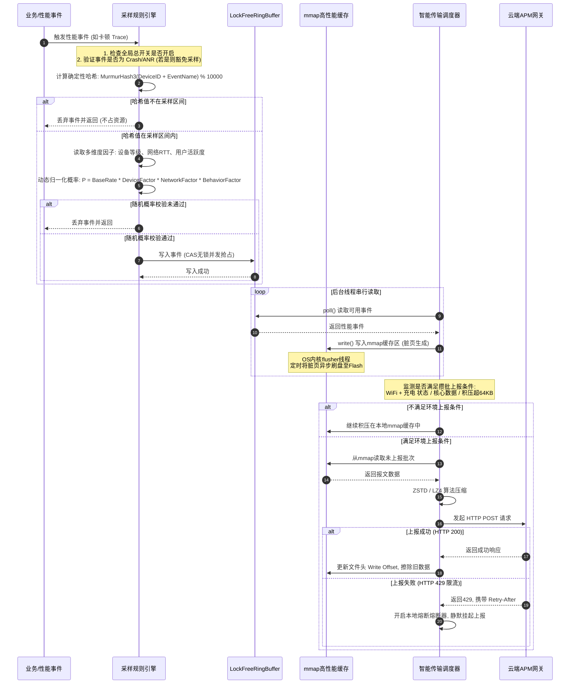

# APM 性能监控与埋点采样深度技术解析

在现代移动应用开发中，APM（Application Performance Monitoring）性能监控与度量体系已经成为保障线上应用稳定性、流畅性与用户体验的基石。随着应用规模的不断扩大 and 用户基数的几何级增长，端侧产生的各类性能指标数据（如 Crash 日志、ANR 异常、卡顿 Trace、慢函数记录、网络请求日志、页面耗时及 FPS 抖动等）也呈爆炸式增长。

然而，数据采集并非毫无代价。全量无差别的数据收集不仅会给端侧设备的 CPU、内存、I/O 以及电池电量带来致命的额外负担，更会在云端产生海量的传输带宽费用与高昂的存储、计算成本。如何在**数据规模的全面性**与**端侧资源的低开销**之间找到黄金平衡点，是每一个大型 Android 团队必须直面的技术挑战。

本文将从底层原理、算法模型、高性能缓存设计、网络传输调优以及工程卡控实践等多维度，深度剖析 Android 性能监控中的**埋点采样与高性能上报**体系。

---

## 1. APM 性能监控埋点分类与端侧开销剖析

端侧性能指标的采集是整个监控度量体系的源头。为了全面捕捉系统的异常与性能瓶颈，业内主要存在两种埋点技术流派：**显式代码埋点**与**无痕插桩 AOP 全埋点**。理解这两者的开销特性以及大数据量采集下的底层系统资源消耗机理，是设计合理采样算法的前提。

### 1.1 埋点技术方案对比与 AOP 插桩底层原理

#### 1.1.1 手动埋点与 AOP 自动插桩的权衡

* **显式代码埋点（手动埋点）**：开发者在特定业务逻辑处显式调用监控 SDK 提供的 API。例如：`Monitor.logEvent("pay_click", params)`。这种方案的优势在于数据精准度极高，能够深度绑定特定的业务上下文（如用户 ID、订单金额、优惠券类型）；且事件边界明确，噪点极低。然而，其研发与维护成本高，容易因为代码重构或人员交接导致漏埋、错埋，且修改埋点规则必须依赖应用发版。
* **无痕插桩 AOP 全埋点（自动埋点）**：利用面向切面编程（AOP）技术，在编译期或运行时动态注入字节码，自动捕获用户的点击、页面生命周期变化、网络请求等事件。其最大优势是免去手动编写，开发成本极低，天然具备“全覆盖”能力，甚至可以通过云端配置动态下发需要关注的控件 ID。

#### 1.1.2 字节码插桩（ASM）的底层工作流

在 Android 平台中，现代 APM 自动插桩普遍基于 **ASM** 框架在编译期修改 Class 字节码。
在 Android Build Toolchain（编译链）中，其核心机制经历过从传统的 Gradle **Transform API** 到 Gradle 7.0 之后被推荐使用的 **Instrumentation API（AsmClassVisitorFactory）** 的演进：

1. **Gradle Task 挂载**：在编译打包阶段，Gradle 插件会拦截所有的 `.class` 文件。编译期插件会在混淆（R8/Proguard）之前插入自定义的 Task。
2. **字节码读写与拦截**：
   - **ClassReader**：读取原始 Class 的字节码二进制流。
   - **ClassVisitor**：通过访问者模式遍历 Class 的结构（包括类声明、字段、方法等）。
   - **MethodVisitor**：专门遍历方法体内的指令。APM 框架在 `visitMethod` 时，会判断当前类是否实现了某个特定的接口（例如 `android/view/View$OnClickListener`），其方法签名是否为 `onClick(Landroid/view/View;)V`。
3. **指令注入**：一旦匹配成功，`MethodVisitor` 会利用 `visitMethodInsn` 在方法入口处（`onMethodEnter`）注入一条静态方法调用指令（例如调用 `APMAgent.onViewClick(View)`），将当前点击的 View 对象作为参数传递出去。
4. **ClassWriter**：将修改后的字节码指令重新输出为二进制流，写入打包的 DEX 文件中。

##### 避免重复注入与循环代理机制

在大型工程中，随着增量编译（Incremental Build）和多工程依赖的引入，防范**重复插桩（Double-Injection）**与**循环代理调用（Circular Delegation）**至关重要：
- **ASM 注解防重**：在对某个类的方法插桩完毕后，ASM 会在该 Class 的常量池或方法区上注入一个自定义的标示注解（例如 `@APMAutowired`）。在后续的编译周期或 Gradle Transform Task 扫描中，ClassVisitor 优先检查是否存在该注解，若存在则立即跳过，避免生成双重代理代码导致运行时 Crash。
- **动态调用屏障**：对于 APM 自身的监控分发类（如 `APMAgent`），在其内部方法中必须建立执行屏障（ThreadLocal 标志位），防止其自身在调用其他三方库（如 OkHttp 记录网络日志）时，再次被 AOP 插桩逻辑捕获，从而陷入无限递归调用最终导致 `StackOverflowError`。

AOP 插桩虽然免去了手动写埋点的繁琐，但会使**编译期耗时显著增加**。同时，由于全量捕获，大量无用数据会占用端侧内存空间，增加后续过滤与传输的 CPU 算力损耗。

| 维度 | 显式代码埋点（手动埋点） | 无痕插桩 AOP 全埋点（自动埋点） |
| :--- | :--- | :--- |
| **定义与实现** | 开发者在特定业务逻辑处显式调用监控 SDK 提供的 API。例如：`Monitor.logEvent("pay_click", params)` | 利用面向切面编程（AOP）技术，在编译期或运行时动态注入字节码，自动捕获特定生命周期或事件。 |
| **底层核心技术** | 普通的方法调用，不涉及编译期干预。 | 动态代理、Gradle Transform 插件、**ASM** 字节码操纵框架、AspectJ 编织。 |
| **运行时额外开销** | 极低。仅在被显式调用时才执行，没有冗余的分发逻辑。 | 相对较高。所有的生命周期或点击事件都要经过一层插桩路由代码的逻辑分发，可能会对内存造成微小抖动。 |
| **研发与维护成本**| 极高。需要开发人员逐个页面、逐个按钮手动编写，难以维护且极易发生漏埋、错埋。 | 极低。一经配置，全量自动收集，无需业务方主动介入，适配成本小。 |
| **编译期影响** | 无任何影响。 | 延长编译耗时。Gradle 构建过程中需要扫描所有 Class 并进行字节码修改，增加构建链负担。 |

---

### 1.2 大数据量采集对端侧系统资源的开销与底层机理

当端侧开始高频、大数据量地采集性能埋点时，设备的系统资源会受到全面挑战。以下深入探讨 CPU、内存、I/O 以及功耗在底层的资源损耗机理。

#### 1.2.1 CPU 额外开销与调用栈获取的性能灾难

在高频性能监控中（例如每帧渲染监控、高频网络请求拦截）， CPU 开销往往来自于两部分：一是框架本身的反射与临时对象创建，二是**调用栈获取（Thread Stacktrace Collection）**。

在检测到线程卡顿、方法执行超时或发生非致命异常时，APM 框架需要获取当前的线程调用栈以定位问题源头。在 Java 层，我们通常调用 `Thread.currentThread().getStackTrace()`。这一行简单的代码在 Android 系统底层的执行过程却极为繁重：

```
[Java 层] Thread.getStackTrace()
       │
       ▼ (JNI 调用)
[Native 层] VMStack.getThreadStackTrace()
       │
       ▼ (进入 ART 虚拟机核心)
[C++ 核心] Thread::DumpJavaStack() 
       │
       ▼ (安全点挂起与栈解绕)
1. 暂停目标线程 (SafePoint / Thread List Lock)
2. 栈帧回溯 (Stack Unwinding)
3. 地址与符号映射 (Symbolication via Dex Debug Info)
```

1. **安全点挂起（SafePoint）**：获取调用栈必须保证栈帧在回溯过程中不发生动态变化，因此虚拟机需要挂起被观察的线程。这涉及线程的上下文切换与同步锁等待。
2. **栈帧回溯（Stack Unwinding）**：ART 虚拟机需要沿着物理栈帧指针（FP）或利用寄存器（SP、LR）在内存中逐级往上查找父栈帧。在 ARM 架构上，如果涉及 Native 栈回溯，还需要读取 `.ARM.exidx` 和 `.ARM.extab` 段的解绕数据，通过 `libunwind` 等库解析出 C++ 函数调用链。

##### ARM-v8 栈回溯硬件指令机制与 Frame-pointer 优化限制

在现代 64 位 ARMv8-A 架构下，函数调用通过 `BL`（Branch with Link）指令跳转，硬件会将下一条指令地址自动存入 `X30` 寄存器（链接寄存器，LR）。而在函数入口处，通常会将当前的 `X29` 寄存器（帧指针，FP）和 `X30` 压入物理堆栈：

```assembly
STP X29, X30, [SP, #-16]!   ; 将 FP 和 LR 压栈，并分配 16 字节空间
MOV X29, SP                 ; 更新 FP 为当前的栈顶指针 SP
```

If 我们在编译 native 库（如 APM 底层回溯模块）时，为了追求极致的寄存器优化而未开启 `-fno-omit-frame-pointer` 选项，编译器就会将 `X29` 挪作他用，不维护标准的帧指针链。这会导致基于 Frame Pointer 的快速回溯算法（只需沿着 FP 链表层层读取即可）彻底失效。回溯器不得不退而求其次，去解析大体积的 `.ARM.exidx` 段，进行耗时极长的二分查找以获取栈帧位置。这进一步加剧了回溯时的 CPU 运算开销。

3. **符号化解析（Symbolication）**：解析出的仅是内存偏移地址或方法索引（Method Index），虚拟机需要读取 DEX 文件的 `DebugInfo` 区域，将这些地址与行号、方法名、类名进行匹配映射，最终在堆中创建大量的 `StackTraceElement` 对象。

实验表明，单次 `Thread.currentThread().getStackTrace()` 在中端 Android 设备上的耗时在 **1ms ~ 15ms** 之间，具体取决于调用栈的深度（Call Stack Depth）。如果在一个每秒执行数百次的循环或高频回调中调用该方法，会瞬间引发 CPU 饥饿（CPU Starvation），使得本来轻微的卡顿直接演变成严重的 UI 冻结（Jank）。

##### 优化方案：基于 Linux 信号（Signal）的异步采样分析

为了解决 Java 调用栈回溯的昂贵开销，前沿的卡顿监控方案引入了基于**信号控制的异步采样分析**：
- APM 注册一个自定义信号处理器（Signal Handler）监听 `SIGPROF` 信号。
- 启动一个独立的后台守护线程，定时（例如每 10ms）向需要监控的主线程发送 `SIGPROF` 信号。
- 主线程接收到信号后，在内核态返回用户态的边界处强行执行信号处理器。在处理器内部，通过 C++ 层面的底层栈指针直接读取物理栈帧，避免了 Java 层 `Thread.getStackTrace()` 产生的反射和海量 Java 临时对象分配，其单次获取开销能降到微秒级。

#### 1.2.2 内存额外开销与 Off-heap 堆外零拷贝方案

APM 框架在运行时需要将各种指标拼装成结构化数据（如 JSON 或 Protocol Buffers 报文）。如果设计不当，这会导致严重的内存问题：

* **频繁 GC 与内存抖动（Memory Churn）**：高频产生的埋点对象生命周期极短（从创建、拼装到写入缓存可能只需数微秒），这会导致 ART 虚拟机的堆内存中充斥着大量的临时短命对象。这会频繁触发虚拟机的垃圾回收动作（如 Concurrent Copying GC）。虽然 ART 优化了并发回收，但高频的 GC 仍会抢占 CPU 时间片，并且在 GC 终期可能存在微小的 Stop-The-World（STW），破坏界面的滑动流畅度。
* **大内存缓冲导致的堆内存溢出（Heap OOM）**：当端侧网络阻塞、埋点积压在内存时，如果直接在 Java 堆内存中开辟大型的 `ByteArrayOutputStream` 或大对象列表进行积压，在应用本身内存吃紧的情况下，这会成为压垮骆驼的最后一根稻草，直接诱发 `java.lang.OutOfMemoryError`。

##### 优化方案：Java Direct Memory 与 Native 零拷贝拼接

为了彻底解放 Java Heap 堆内存，针对超大规模日志（如 Crash 时的多线程栈快照），APM 引入了**堆外直接内存（Direct Memory）**管理：
- 在端侧采用 `ByteBuffer.allocateDirect(capacity)` 分配不受 JVM 垃圾回收器管理的直接物理内存。
- 数据的序列化与字符串拼装通过 JNI 挪到 C++ 层执行，使用 `malloc` 进行堆外物理地址分配。
- 网络发送阶段，通过 Java 的 `FileChannel` 或 JNI 将直接内存地址指针传递给 Socket 套接字（基于 `sendfile` 系统调用），实现数据从物理缓存区到网卡缓冲区映射的“零拷贝发送”。这避免了内存中产生海量的 String 和 `byte[]` 碎片，极大降低了 OOM 发生率。

#### 1.2.3 I/O 与功耗开销：I/O 卡顿与 Modem 电量消耗

* **传统 I/O 的阻塞特征**：将埋点数据持久化到本地时，如果直接采用传统的 Java 文件流或老旧的 SharedPreferences（其 `commit()` 是同步磁盘写入，而 `apply()` 虽然是异步写入，但如果在 Activity 销毁或组件切换时，系统为了保证数据一致性会强行等待 `QueuedWork` 队列清空，从而在主线程发起 `fsync` 系统调用），都会导致磁盘 I/O 线程阻塞。由于 Android 设备闪存（NAND Flash）的随机写性能可能因文件碎片化而极速退化，这会引发主线程的卡顿甚至 ANR。
* **无线电通信模块（Modem）的功耗机理**：Android 设备的蜂窝网络模块是一个拥有独立运行状态的状态机（Radio State Machine）。
  Modem 通常处于三个状态：
  * **IDLE（空闲）**：极低功耗。
  * **DCH（Dedicated Channel，专用信道）**：全速高功耗，无线电发射器满载工作。
  * **FACH（Forward Access Channel，前向接入信道）**：中等功耗。

  当应用发起一次哪怕只有 1KB 的网络请求时，Modem 必须从 IDLE 强行切换到 DCH 状态，这通常需要消耗数百毫秒的电能。请求发送完毕后，Modem 不会立即回到 IDLE，而是会在 DCH 状态维持数秒的守候期（Tail State，通常为 5-10 秒），以防后续有请求。如果 APM 框架采用“实时上报”策略，即使每次数据包极小，频繁的请求也会让 Modem 长期处于 DCH/FACH 状态，导致设备电池电量在短时间内被迅速消耗。

---

## 2. 自适应多维度采样算法与动态配置体系

面对庞大的数据规模与昂贵的端侧/云端开销，**全量采集是不现实且不科学的**。在统计学中，只要样本量足够大，通过合理的随机采样，即可利用部分样本精准反映总体的性能趋势。因此，APM 体系必须引入**自适应多维度采样算法**。

### 2.1 数据规模与统计成本的冲突

基于**大数定律（Law of Large Numbers）**与**中心极限定理（Central Limit Theorem）**，在海量活跃用户的前提下，我们并不需要知道每一个用户每一次页面跳转的精准耗时。只要采样得到的样本量 $N$ 达到统计学要求（例如 $N \ge 10000$ 且分布均匀），样本均值与总体均值的误差就会收敛在极小的置信区间内。

因此，我们的设计目标是：**对于致命的、低频的事件（如 Crash、ANR）实行 100% 采集；而对于高频的、趋势性的性能指标（如 FPS、页面启动耗时、HTTP 耗时）实行低比例动态采样。**

---

### 2.2 自适应多维度采样算法设计

自适应采样算法的核心思想是：**不采用一成不变的采样率，而是根据设备性能、网络状态、用户行为以及云端热下发的规则，动态计算当前设备、当前场景下的最终采样概率。**

自适应采样的核心公式如下：

$$\text{FinalProbability} = \text{BaseRate} \times f(\text{DeviceScore}) \times g(\text{NetworkQuality}) \times h(\text{BehaviorLevel})$$

其中，各个因子的计算与映射逻辑如下：

#### 2.2.1 设备性能分级采样因子 $f(\text{DeviceScore})$

算法首先评估当前设备的硬件配置，计算出设备的综合得分 $\text{DeviceScore} \in [0, 100]$，其具体加权公式如下：

$$\text{DeviceScore} = w_1 \times S_{\text{cpu}} + w_2 \times S_{\text{ram}} + w_3 \times S_{\text{os}} + w_4 \times S_{\text{disk}}$$

加权比重通常为 $w_1 = 0.4$, $w_2 = 0.3$, $w_3 = 0.1$, $w_4 = 0.2$。各项得分计算方式为：
1. **CPU 核心数与最大主频 $S_{\text{cpu}}$**：核心数乘以最高频率，映射到 $[0, 100]$。
2. **运行内存大小 $S_{\text{ram}}$**：获取物理内存总量。对 4GB 及以下、6GB、8GB、12GB+ 进行分段打分。
3. **系统版本 $S_{\text{os}}$**：版本越高通常内存与调度优化越成熟。
4. **存储吞吐性能 $S_{\text{disk}}$**：通过底层 Native 测试闪存的随机读写吞吐量，以区分 UFS 与 eMMC。

根据综合得分，我们将设备划分为三个性能梯队，并映射为不同的设备因子 $f(\text{DeviceScore})$：

* **高端机（Tier 1, Score $\ge 80$）**：系统资源富余，对监控开销不敏感。设置 $f(\text{DeviceScore}) = 1.0$。
* **中端机（Tier 2, $50 \le \text{Score} < 80$）**：设置 $f(\text{DeviceScore}) = 0.5$。
* **低端机（Tier 3, Score $< 50$）**：资源极其紧张，极易卡顿。设置 $f(\text{DeviceScore}) = 0.05$（即只保留 5% 的基础采样率，甚至对耗时高的卡顿 Trace 监控直接设为 $0$）。

#### 2.2.2 网络状态感知因子 $g(\text{NetworkQuality})$

为了防止监控请求在弱网环境下加剧信道拥塞，我们通过 `ConnectivityManager` 监听当前网络类型，并通过应用内请求的 RTT（往返时延）和丢包率进行**平滑指数移动平均（EMA）**计算，得出实时网络质量。

EMA 的数学公式如下：

$$\text{RTT}_{\text{est}}(n) = \alpha \times \text{RTT}_{\text{est}}(n-1) + (1-\alpha) \times \text{RTT}_{\text{curr}}$$

其中 $\alpha$ 通常取 $0.8$，以平滑瞬时的网络波动，保留中长期的网速趋势。根据 $\text{RTT}_{\text{est}}$，我们计算得出网络因子：

* **WiFi 状态 / 5G 高速网（RTT < 100ms）**：无流量担忧，带宽大。设置 $g(\text{NetworkQuality}) = 1.0$。
* **4G 网络（100ms $\le$ RTT < 500ms）**：普通蜂窝流量。设置 $g(\text{NetworkQuality}) = 0.4$。
* **3G/2G 网络 / 弱网（RTT $\ge$ 1500ms）**：网络极度脆弱。设置 $g(\text{NetworkQuality}) = 0.0$。此时客户端会**关闭所有非致命性能数据的上报**，仅在本地缓存中保留最核心的崩溃日志，待网络恢复后再进行补偿。

#### 2.2.3 用户行为与路径级别因子 $h(\text{BehaviorLevel})$

并非所有的页面和操作都具有同等的研究价值。我们根据业务定义，将页面与功能路径划分为不同级别：
* **核心链路（Level 1）**：如收银台支付页、商品详情页、视频播放器页面。这些页面的性能直接关乎转化率。设置 $h(\text{BehaviorLevel}) = 1.0$（无论设备性能如何，均尽可能保持高比例采集）。
* **常规路径（Level 2）**：如首页、消息中心、搜索结果页。设置 $h(\text{BehaviorLevel}) = 0.5$。
* **冷僻页面（Level 3）**：如“关于我们”、“设置隐私条款”等。设置 $h(\text{BehaviorLevel}) = 0.01$。

通过公式计算出最终的 $\text{FinalProbability}$ 之后，在产生监控事件时，端侧生成一个 $[0.0, 1.0)$ 之间的随机数。若该随机数小于 $\text{FinalProbability}$，则此事件被通过并进入采集缓存流；否则，立即就地丢弃，不占用任何端侧处理资源。

---

### 2.3 动态热下发规则引擎与确定性哈希

为了能在无需重新发版的前提下调整线上监控的粒度，必须在端侧构建基于**确定性哈希决策**的动态规则引擎。

#### 2.3.1 确定性哈希分流决策机制（Deterministic Logging）

如果端侧每一次的采样决策都是随机生成的（如直接调用 `Random.nextFloat()`），这会导致同一台设备在同一个运行周期内，数据产生严重的碎片化。例如：用户在一个页面跳转流程中，前两个页面的启动日志被采集了，而第三个页面的启动日志被随机丢弃了。这使得后台无法还原出完整的漏斗分析图。

为了解决这一问题，我们采用**确定性哈希**机制。我们利用设备的唯一标识符（如加密后的 `DeviceID` 或 `UserID`）与监控事件名称（`EventName`）拼接作为哈希键，使用高均匀性、低碰撞率且计算极快的 **MurmurHash3** 算法计算哈希值，然后对 $10000$ 取模：

$$\text{DeviceBucket} = \text{MurmurHash3}(\text{DeviceID} + "\_" + \text{EventName}) \pmod{10000}$$

当云端规则下发“某事件的采样率为 $1\%$”时，云端配置会转化为一个区间值：`[0, 99]`。端侧在判断时，只需校验该设备的 $\text{DeviceBucket}$ 是否落在该区间内：

```kotlin
fun shouldSampleEvent(deviceId: String, eventName: String, sampleRate: Float): Boolean {
    // sampleRate 范围为 0.0f 到 1.0f
    val boundary = (sampleRate * 10000).toInt()
    val hashKey = "${deviceId}_$eventName"
    val bucket = Math.abs(MurmurHash3.hash32(hashKey)) % 10000
    return bucket < boundary
}
```

由于 `DeviceID` 是固定的，同一台设备在规则未改变时，其计算出的 $\text{DeviceBucket}$ 永远一致。这意味着这台设备将被锁定在“采集组”或“过滤组”内，从而保证了单台设备监控行为的连续性与确定性，极大地提高了数据分析的链条完整度。

为了隔离不同维度和事件之间的采样重叠度，我们可以在计算 Hash 时为每个不同的监控事件传入独立的 `Seed`，确保不同指标的分流是正交（Orthogonal）的，防止同一批设备被同时分配到所有重度数据监控的压力中。

#### 2.3.2 规则数据结构设计与热更新机制

动态规则配置采用 **Protocol Buffers** 进行定义，以保障传输体积与解析效率：

```protobuf
syntax = "proto3";

message APMSamplingConfig {
  int64 config_version = 1;      // 配置版本号，用于防止配置回滚
  bool master_switch = 2;        // 全局熔断总开关
  repeated RuleItem rules = 3;   // 各个性能指标的细分规则
}

message RuleItem {
  string event_name = 1;         // 性能指标事件名，如 "fps_monitor", "anr_trace"
  float default_rate = 2;        // 默认采样率 [0.0, 1.0]
  
  // 针对不同维度的重写策略（可选）
  map<string, float> device_tier_rates = 3;  // "tier_1" -> 1.0, "tier_3" -> 0.02
  map<string, float> network_type_rates = 4; // "wifi" -> 1.0, "mobile_3g" -> 0.0
}
```

**热更新与降级机制**：
1. **防回滚校验**：客户端在接收到推送（通过推送通道如 MQTT / Firebase Cloud Messaging，或在 App 启动时通过配置接口拉取）的新配置时，必须比对 `config_version`。只有新配置的版本号大于本地缓存的版本号，才允许覆盖本地存储，防止由于 CDN 缓存抖动导致配置退回旧版本。
2. **本地默认回滚策略**：如果下载的规则文件损坏、解析失败或由于边界校验未通过，规则引擎应立即抛弃坏数据，并回退到打包时预置在 Asset 中的保守“出厂配置”，确保基本安全。

---

## 3. 端侧数据高性能异步缓存体系

当埋点采样算法决定对某个事件进行采集后，下一个核心问题是如何将数据安全、快速地写入本地缓存。
在传统的 Android I/O 写入中，我们面临着一个**高性能（异步、不卡顿）**与**高可靠（Crash 时数据不丢失）**的致命矛盾。
为了解决这一矛盾，现代 APM 架构普遍引入了 **mmap（内存映射）文件缓存**与**无锁并发环形队列（RingBuffer）**。

### 3.1 零等待与高可靠的折中

* **方案 A：直接同步写入文件**。安全可靠，但每次磁盘写入都面临 NAND Flash 的写入延迟与锁竞争，在主线程执行会导致频繁卡顿。
* **方案 B：纯 Java 内存队列缓冲 + 异步线程刷盘**。读写速度极快，完全不阻塞主线程。但致命缺点是，当 App 发生 Crash、OOM 或被系统 Low Memory Killer（LMK）强杀时，内存队列中的数据瞬间灰飞烟灭。而 APM 监控最核心的现场指标（如异常前的用户操作链、性能退化路径），恰恰发生在崩溃的一瞬间。
* **方案 C（完美折中）：mmap 内存映射**。

---

### 3.2 mmap 文件的底层原理与缓存设计

#### 3.2.1 mmap 核心工作原理与虚拟内存映射

`mmap`（Memory Map）是 Linux 系统提供的一种内存映射文件的方法。它将一个文件描述符对应的物理磁盘文件内容，直接映射到进程的虚拟内存空间（Virtual Memory Address Space）中。

```
[用户进程虚拟空间] (通过指针直接读写内存)
       │
       ▼ (由 CPU MMU 页表直接映射)
[Linux 内核 Page Cache] (脏页 Dirty Pages)
       │
       ├─► [App Crash / 进程 OOM / LMK 强杀] -> 内存数据健在！
       │
       ▼ (由 OS 内核 flusher 线程异步刷盘)
[物理存储 (NAND Flash 磁盘)]
```

常规的文件 I/O 写入（通过 `write` 系统调用）需要经历两次数据拷贝：先将数据从用户空间缓冲区拷贝到内核空间的 **Page Cache**，再由操作系统调度将 Page Cache 中的脏页（Dirty Pages）写入物理磁盘。

而使用 `mmap` 时，系统在用户态虚拟内存与内核态 Page Cache 之间建立了直接映射关系：
1. **零拷贝写入**：应用对映射出的内存区域的操作（如通过 C++ 指针赋值，或 Java 的 `MappedByteBuffer` 写入），相当于直接修改了 Page Cache。在硬件层面上，这由 CPU 的内存管理单元（MMU）通过页表直接翻译，省去了用户态到内核态的上下文切换与数据拷贝。
2. **进程崩溃下的零丢失保障**：当 App 遭遇 Java 崩溃（Uncaught Exception）、C++ Native 崩溃（如 Segfault）或由于占用内存过高触发 OOM 被系统强杀时，虽然 App 的进程消亡了，但是 **Linux 内核掌控的 Page Cache 依然存在**。操作系统内核会在后续调度中，通过其守护线程（如 `pdflush` / `flusher`）自动将这些标记为“脏（Dirty）”的物理内存页回写（Writeback）到磁盘文件中。只有在整机断电的情况下，Page Cache 中的数据才会丢失，而在移动端这几乎是不可能发生的。

关于 Android 系统中的 Native 共享内存与底层映射，请参考 [NDK 与 Native](../../../../../AndroidVersionChangeLog.md#L97) 相关背景。

#### 3.2.2 端侧二进制存储协议与文件头结构设计

为了在 mmap 映射区高效写入和读取，必须设计出一套紧凑的二进制协议结构，以最大化利用空间并避免序列化带来的 CPU 开销。

我们的缓存文件整体分为两个区域：**文件头区域（File Header）**与**数据存储区域（Data Area）**。

##### 1. 文件头（Header）结构设计（占 32 字节）

| 字段名 | 字节偏移 | 数据类型 | 说明 |
| :--- | :--- | :--- | :--- |
| **Magic Number** | 0 ~ 3 | `uint32` | 固定魔数（如 `0x41504D53`，代表 "APMS"），用于校验文件是否损坏或被篡改。 |
| **Protocol Version**| 4 ~ 5 | `uint16` | 二进制协议版本，用于未来结构升级兼容。 |
| **Write Offset** | 6 ~ 9 | `uint32` | **最核心字段**。记录当前最新空闲可写位置相对于数据区起点的字节偏移。App 崩溃重启后读取此字段，即可从断点处继续写入，防止覆盖旧数据。 |
| **Data Count** | 10 ~ 13| `uint32` | 当前缓存文件中已写入的性能数据条数。 |
| **Header CRC32** | 14 ~ 17| `uint32` | 整个 Header 前 14 字节 of CRC32 校验和，防范写入中断导致 Header 损坏。 |
| **Reserved** | 18 ~ 31| `byte[14]`| 保留字节，供未来扩展使用。 |

##### 2. 数据存储区（Data Area）数据帧格式

每一条性能埋点数据帧采用紧凑的 `Length-Value` 结构连续排列：

```
┌──────────────────┬─────────────────────────────┬──────────────────┬─────────────────────────────┐
│ Length (2 Bytes) │   Payload (Protobuf Data)   │ Length (2 Bytes) │   Payload (Protobuf Data)   │
└──────────────────┴─────────────────────────────┴──────────────────┴─────────────────────────────┘
```

* **Length**：占 2 字节（`uint16`），表示后续性能报文的实际字节长度。最大支持 $65535$ 字节的单条报文，完全满足绝大部分 APM 指标的记录需求。
* **Payload**：实际被监控的数据内容，使用经过压缩的 Protocol Buffers 结构化数据进行存储。

**写入算法逻辑**：
1. 线程生成埋点，序列化为 Protobuf 字节数组 `dataBytes`。
2. 校验文件剩余空间：`FileLength - (WriteOffset + 32) >= dataBytes.size + 2`。若空间不足，触发强制上报并重置缓存区。
3. 在 `mmapAddress + 32 + WriteOffset` 地址处写入 `dataBytes.size`（2 字节）。
4. 在紧接着的地址处复制 `dataBytes` 数据内容。
5. 更新 Header 中的 `WriteOffset = WriteOffset + 2 + dataBytes.size`。
6. 调用 `msync(MS_ASYNC)` 提示内核进行异步页刷新（可选，依赖操作系统自动刷盘即可）。

##### 3. mmap 本地文件滚动轮转与自愈自清设计

由于 mmap 建立映射时必须指定固定的大小（例如单个数据文件 4MB），无法像普通流式文件那样无限制动态扩容，否则频繁进行 `mremap` 调整映射范围会因虚拟内存碎片化和内核锁等待引发卡顿。因此，端侧需要引入**多文件滚动轮转机制（File Rotation）**：
- **双缓冲文件流**：本地维护 `active.dat` 和 `pending.dat`。
- **轮转切换**：当 `active.dat` 的 `Write Offset` 触及物理边界时，关闭映射。将当前文件更名为包含时间戳的只读报文包放入待上报队列，然后瞬间创建一个干净的 4MB 空间作为新的映射文件。
- **文件自愈机制**：在设备启动初始化 APM 时，系统会读取 Header。如果检测到 `Magic Number` 不符或 `Header CRC32` 校验不通过，说明上次断电或磁盘写入中断造成了头部数据损坏。此时，系统立即对该文件执行 `ftruncate(0)` 清零并完全重置 Header，防范读取和写入指针越界产生的段错误（Segfault）。

以下是使用 C++ 实现的底层核心写入逻辑示例：

```cpp
#include <sys/mman.h>
#include <sys/stat.h>
#include <fcntl.h>
#include <unistd.h>
#include <cstring>
#include <stdint.h>

struct FileHeader {
    uint32_t magic;
    uint16_t version;
    uint32_t write_offset;
    uint32_t data_count;
    uint32_t crc32;
    uint8_t reserved[14];
};

class MmapBuffer {
private:
    int fd;
    uint8_t* map_ptr;
    size_t file_size;
    FileHeader* header;

public:
    bool init(const char* filepath, size_t size) {
        fd = open(filepath, O_RDWR | O_CREAT, S_IRUSR | S_IWUSR);
        if (fd < 0) return false;
        
        file_size = size;
        // 确保物理文件大小与映射大小一致
        ftruncate(fd, file_size);
        
        map_ptr = (uint8_t*)mmap(nullptr, file_size, PROT_READ | PROT_WRITE, MAP_SHARED, fd, 0);
        if (map_ptr == MAP_FAILED) {
            close(fd);
            return false;
        }
        
        header = (FileHeader*)map_ptr;
        if (header->magic != 0x41504d53) { // "APMS"
            header->magic = 0x41504d53;
            header->version = 1;
            header->write_offset = 0;
            header->data_count = 0;
        }
        return true;
    }

    bool write(const uint8_t* data, uint16_t length) {
        size_t header_size = sizeof(FileHeader);
        // 判断映射空间是否溢出
        if (header_size + header->write_offset + sizeof(length) + length > file_size) {
            return false; // 缓冲区已满
        }
        
        // 1. 写入数据长度 (2 字节)
        uint8_t* write_ptr = map_ptr + header_size + header->write_offset;
        std::memcpy(write_ptr, &length, sizeof(length));
        write_ptr += sizeof(length);
        
        // 2. 写入数据载荷
        std::memcpy(write_ptr, data, length);
        
        // 3. 更新文件头偏移量与计数
        header->write_offset += (sizeof(length) + length);
        header->data_count += 1;
        
        return true;
    }

    ~MmapBuffer() {
        if (map_ptr && map_ptr != MAP_FAILED) {
            munmap(map_ptr, file_size);
        }
        if (fd >= 0) {
            close(fd);
        }
    }
};
```

---

### 3.3 无锁并发环形队列 (RingBuffer)与消费者退让策略

虽然有了 mmap 来保障写入过程不卡顿且不丢失，但面临多线程并发生产埋点时，直接在 C++ 层对 mmap 缓冲区进行多线程竞争写入，仍需要加锁（如互斥锁 `std::mutex` 或 Java 层的 `ReentrantLock`）。在高并发下，这会导致主线程因锁等待而发生优先级反转或被阻塞，从而违背了 APM“零介入、零卡顿”的初衷。

为此，我们在内存中设计了一个**无锁并发环形队列（RingBuffer）**作为前置缓冲区。多线程生产者利用 **CAS（Compare-And-Swap）** 原子操作抢占队列指针，实现完全无锁的并发写入，再由单一消费线程串行读取并同步写入 mmap 映射区。

#### 3.3.1 CAS 无锁并发原理与 False Sharing 防范

无锁环形队列具有固定容量（容量 $C$ 必须是 2 的幂次方，如 $1024$），利用两个 `AtomicLong` 指针来控制读写行为：
* `writeCursor`（写指针）：生产者尝试自增占位的位置。
* `readCursor`（读指针）：消费者准备拉取的位置。

**伪共享（False Sharing）与缓存行对齐防范**：
在现代 CPU 架构中，多核心通过缓存行（Cache Line，通常为 64 字节）与内存同步。如果 `readCursor` 与 `writeCursor` 在内存中紧挨着，两个指针极有可能被加载到同一个 CPU 缓存行中。
当生产者核心修改 `writeCursor` 时，会导致消费者核心对应的缓存行整行失效（Cache Invalidation），必须强行从三级缓存或物理内存重新读取。
为了解决这一问题，我们在定义读写指针时，可以在其周围插入填充字段（Padding），或者在 Java 8 中对变量使用 `@sun.misc.Contended`，强制将读写指针隔开到不同的缓存行中。

#### 3.3.2 消费者退让策略选择

单线程读取 RingBuffer 的消费者在队列为空时，如果使用盲目循环 `poll()` 会导致 CPU 占用率 100%（忙等待）。
为了兼顾实时性能与功耗，我们设计了**退让策略（Wait Strategy）**：
- **Yielding 策略**：消费者在连续自旋（如 100 次）未拉取到数据时，在循环体中调用 `Thread.yield()`。这会提示内核放弃当前 CPU 执行权并重新参与调度，适合埋点高频产生的阶段。
- **Blocking 策略**：利用底层的条件变量（`Condition`）。当队列为空时，消费者调用 `await()` 将自身线程挂起，生产者写入数据后调用 `signal()` 唤醒消费者。虽然挂起和唤醒会产生微弱的上下文切换开销，但是在监控指标稀疏生成的正常阶段，这能够让 APM 后台消费线程的 CPU 占用率彻底归零。

#### 3.3.3 核心 Kotlin 代码实现

以下是在端侧运行的高并发无锁 RingBuffer 实现：

```kotlin
import java.util.concurrent.atomic.AtomicLong
import java.util.concurrent.atomic.AtomicReferenceArray

class LockFreeRingBuffer<T : Any>(val capacity: Int) {
    init {
        require(capacity > 0 && (capacity and (capacity - 1)) == 0) {
            "Capacity must be a power of 2"
        }
    }

    private val mask = capacity - 1
    private val buffer = AtomicReferenceArray<T?>(capacity)

    // 使用 PaddedLong 避免伪共享 (False Sharing)
    private open class LhsPadding {
        protected var p1, p2, p3, p4, p5, p6, p7: Long = 0
    }
    private open class ValueHolder : LhsPadding() {
        protected val cursor = AtomicLong(0L)
    }
    private open class RhsPadding : ValueHolder() {
        protected var p8, p9, p10, p11, p12, p13, p14: Long = 0
    }
    
    private val writeCursor = AtomicLong(0L)
    private val readCursor = AtomicLong(0L)

    /**
     * 多生产者并发无锁写入 (MPSC - Multi-Producer Single-Consumer)
     */
    fun offer(element: T): Boolean {
        while (true) {
            val currentWrite = writeCursor.get()
            val currentRead = readCursor.get()
            
            // 队列已满判定
            if (currentWrite - currentRead >= capacity) {
                return false
            }
            
            // CAS 抢占写入序号
            if (writeCursor.compareAndSet(currentWrite, currentWrite + 1)) {
                val index = (currentWrite and mask.toLong()).toInt()
                
                // 自旋等待，直到该位置的旧数据被消费者读取清空
                while (!buffer.compareAndSet(index, null, element)) {
                    Thread.yield()
                }
                return true
            }
            // 抢占失败，继续循环自旋
        }
    }

    /**
     * 单消费者串行读取 (若有多消费者需进一步加锁或修改 CAS)
     */
    fun poll(): T? {
        val currentRead = readCursor.get()
        val currentWrite = writeCursor.get()
        
        // 队列为空判定
        if (currentRead == currentWrite) {
            return null
        }
        
        val index = (currentRead and mask.toLong()).toInt()
        val element = buffer.get(index)
        
        // 如果该位置数据尚未写入完毕，等待
        if (element == null) {
            return null
        }
        
        // 清空当前位置，并更新读指针
        buffer.set(index, null)
        readCursor.set(currentRead + 1)
        return element
    }
}
```

---

## 4. 端侧网络传输调优与攒批策略

解决了高性能采集与本地缓存后，数据的网络传输（上报）则是降功耗、免网络拥塞的最后一公里。端侧必须建立精细的**攒批压缩合并**与**智能上报控制**机制。

### 4.1 攒批机制（Batching & Merging）与多算法压缩对比

为避免上文提到的 Modem 频繁唤醒高功耗问题，性能埋点绝对禁止实时单条上报，必须进行攒批。

#### 4.1.1 攒批触发条件设计

端侧上报引擎引入三维度的复合判断机制：
1. **容量阈值**：当 mmap 缓存区中的未上报报文大小累计达到 **64KB** 时，立即触发网络上报。避免报文过大引起云端网关的内存溢出或数据包截断。
2. **条数阈值**：缓存积压满 **50 条**数据时，触发上报。
3. **时间窗口**：即便数据量和条数都没达到阈值，若距离上一次上报已超过 **15 秒**（仅在 App 处于前台且用户处于活跃交互时），同样触发攒批上报，以保证监控数据的时效性。

#### 4.1.2 高效压缩算法的选择

在数据组装上报前，必须对其进行报文压缩。不同的压缩算法在移动端侧的表现各异：

* **GZIP**：基于 DEFLATE 算法（结合 LZ77 扫描匹配与哈夫曼编码）。压缩率中规中矩（约 3:1），但因为在压缩过程中需要动态构建哈夫曼树，耗费了较多的 CPU 计算周期，在低端机上高频使用极易引发发热和掉帧。
* **LZ4**：专注于极致的扫描与匹配速度。由于其舍弃了繁重的哈夫曼编码，仅进行简单的字面量/偏移对（Literal/Match）编码，使得压缩和解压速度比 GZIP 快数倍甚至数十倍。对 CPU 资源的消耗极低，非常契合移动设备前台运行时的卡顿 Trace 实时压缩。
* **ZSTD (Zstandard)**：由 Facebook 开发的现代高压缩比算法。它结合了 LZ77 算法与 **ANS（Finite State Entropy，有限状态熵）**编码技术。ANS 在数学上比哈夫曼编码更为逼近香农极限，并且解码速度极快。通过配合静态字典，ZSTD 能够以极低的 CPU 开销将大体积性能日志压缩到 1/4 以下，是现代 APM 系统的首选。

##### 内置静态字典优化小报文压缩

对于几百字节的小埋点数据，传统压缩算法由于需要将哈夫曼树等头部元数据（Header Metadata）打包在报文中，经常会导致压缩后的体积反而大于压缩前。
ZSTD 提供了**字典压缩模式**（Dictionary Compression）：
- APM 团队在后台搜集约 10 万条代表性的线上埋点报文，在离线环境下通过 `zstd --train` 训练出一个约 100KB 的“静态字典（Static Dictionary）”。
- 将该字典直接内置在应用安装包的 `assets/` 目录下。
- 客户端在压缩小数据包时，使用 C++ 层的 `ZSTD_compress_usingDict` API，传入该字典。这允许压缩器共享字典中已有的哈希表信息，无需在包头中写入重复的元数据结构，使小报文的压缩比暴增 200% 以上，并大幅缩减了端侧的 CPU 运行时间。如果在特定极端环境（如文件流读取损坏或三方热修复框架干扰）下导致字典读取失败，压缩器会自动退回到标准无字典 ZSTD 模式，保证系统的鲁棒性。

**端侧自适应压缩策略**：
* 当设备被判定为**低端机（Tier 3）**或当前**电池电量低于 20%** 时，为了防范系统卡顿与功耗恶化，框架强制选择 **LZ4** 算法进行轻量级压缩。
* 当处于 **WiFi + 充电** 状态下，为了最大化节省云端网络带宽，框架选用 **ZSTD** 进行深度压缩。

---

### 4.2 智能上报环境卡控与 Jetpack WorkManager 落地

为了对数据上报实施严苛的环境隔离，我们对数据类型进行分级：
* **实时通道 (Real-time)**：Crash、ANR、核心路径支付失败等。不受任何网络与电量限制，一旦发生，调用底层的 Socket 异步连接即时上报，力求第一现场被捕获。
* **延迟通道 (Delayable)**：常规的性能普查指标（如 FPS、冷启动各阶段耗时、图片加载库性能指标）。这类数据**必须配置为仅在“WiFi + 充电”状态下上报**。

#### 4.2.1 状态检测实现

在 Android 系统中，我们可以通过以下 API 进行状态查询与监听：

* **充电状态判定**：
```kotlin
fun isDeviceCharging(context: Context): Boolean {
    val intentFilter = IntentFilter(Intent.ACTION_BATTERY_CHANGED)
    val batteryStatus = context.registerReceiver(null, intentFilter)
    val status = batteryStatus?.getIntExtra(BatteryManager.EXTRA_STATUS, -1) ?: -1
    return status == BatteryManager.BATTERY_STATUS_CHARGING || 
           status == BatteryManager.BATTERY_STATUS_FULL
}
```

* **免流量网络（WiFi）判定**：
```kotlin
fun isWifiConnected(context: Context): Boolean {
    val connectivityManager = context.getSystemService(Context.CONNECTIVITY_SERVICE) as ConnectivityManager
    val network = connectivityManager.activeNetwork ?: return false
    val capabilities = connectivityManager.getNetworkCapabilities(network) ?: return false
    return capabilities.hasTransport(NetworkCapabilities.TRANSPORT_WIFI) ||
           capabilities.hasTransport(NetworkCapabilities.TRANSPORT_ETHERNET)
}
```

#### 4.2.2 WorkManager 的高可靠延迟调度与系统低功耗模式适配

由于在后台运行时受到系统的各种后台执行限制，直接在本地起后台服务极易被系统强杀。我们必须利用 Jetpack **WorkManager** 来托管这部分非核心性能数据的上报任务。

关于 Android 版本对后台执行策略的演进收紧（包括 Android 8.0 的后台执行限制、Android 14 的前台服务类型强制规范等），请详细参见 [Android 后台与服务限制](../../../../../AndroidVersionChangeLog.md#L318)。

WorkManager 底层具备优秀的平台自适应特性，在不同版本的 Android 系统中选用最合适的内核机制：
- **API 23+ (Android 6.0+)**：底层自动适配系统的 **JobScheduler**，能够完美遵循系统在低电量或屏幕熄灭时的 **Doze Mode（低电耗模式）** 约束。当系统进入 Doze Mode 时，任务被自动挂起并合并到统一的 **Maintenance Window（维护窗口）** 中批量执行，极大限度地配合了系统的节电逻辑。
- **API 21-22 (Android 5.x)**：自动退回到基于 `AlarmManager` 和 `BroadcastReceiver` 的自定义轮询调度器，规避系统 API 兼容性缺陷。

以下是基于 WorkManager 实现的智能上报核心逻辑：

```kotlin
import android.content.Context
import androidx.work.*
import java.util.concurrent.TimeUnit

class ApmUploadWorker(context: Context, workerParams: WorkerParameters) : Worker(context, workerParams) {
    override fun doWork(): Result {
        // 执行底层的 mmap 缓存读取、拼装、ZSTD 压缩及 HTTP 上报逻辑
        val success = ApmTransporter.uploadDeferredData()
        return if (success) Result.success() else Result.retry()
    }
}

object ApmScheduler {
    private const val WORK_TAG = "APM_DEFERRED_UPLOAD_WORK"

    fun scheduleUpload(context: Context) {
        // 1. 设置极其严苛的执行约束条件：免流量网络 (WiFi) + 处于充电状态
        val constraints = Constraints.Builder()
            .setRequiredNetworkType(NetworkType.UNMETERED) // 仅限 WiFi / 以太网
            .setRequiresCharging(true)                    // 必须处于充电状态
            .setRequiresBatteryNotLow(true)               // 电池电量不能过低
            .build()

        // 2. 构造定期执行任务（例如每 2 小时执行一次）
        val uploadRequest = PeriodicWorkRequestBuilder<ApmUploadWorker>(2, TimeUnit.HOURS)
            .setConstraints(constraints)
            .setBackoffCriteria(
                BackoffPolicy.EXPONENTIAL, // 失败后采用指数退避重试策略
                10, TimeUnit.MINUTES       // 初始退避延迟时间 10 分钟
            )
            .addTag(WORK_TAG)
            .build()

        // 3. 提交给系统 WorkManager 执行
        WorkManager.getInstance(context).enqueueUniquePeriodicWork(
            WORK_TAG,
            ExistingPeriodicWorkPolicy.KEEP, // 若任务已存在则保留，不重复创建
            uploadRequest
        )
    }
}
```

---

### 4.3 网络重试与带随机抖动的指数退避算法

当后台服务器因突发流量过载或机房断电发生网络故障时，端侧数据上报会大面积失败。如果客户端在失败后立即高频发起重试，会瞬间在网关恢复时形成庞大的“流量洪峰”，造成**重试雪崩（Thundering Herd Problem）**，导致网关再次瘫痪。

为此，重试策略必须引入**带随机抖动的指数退避算法（Exponential Backoff with Jitter）**。

#### 4.3.1 算法公式推导

重试等待时间 $T_{\text{wait}}$ 随着失败重试次数 $i$ 呈指数递增，并加上随机的噪声扰动：

$$T_{\text{wait}}(i) = \text{Random}(0, \min(T_{\text{max}}, T_{\text{base}} \times 2^i))$$

或者更科学地，为了防止随机数抖动过大导致重试间距过短，我们给重试时间设定一个“安全下限”（通常为计算结果的一半）：

$$\text{Half} = \frac{\min(T_{\text{max}}, T_{\text{base}} \times 2^i)}{2}$$
$$T_{\text{wait}}(i) = \text{Half} + \text{Random}(0, \text{Half})$$

where:
* $T_{\text{base}}$：基础重试时间，如 $15$ 秒。
* $T_{\text{max}}$：最大等待上限，如 $3600$ 秒（1小时）。防止无限退避导致等待时间过长。
* $i$：连续失败次数。

#### 4.3.2 Kotlin 核心算法代码

```kotlin
import kotlin.math.min
import kotlin.random.Random

object RetryBackoffCalculator {
    private const val BASE_DELAY_MS = 15_000L  // 基础延迟 15 秒
    private const val MAX_DELAY_MS = 3_600_000L // 最大延迟 1 小时

    /**
     * 计算第 i 次重试的安全退避延迟时间 (单位：毫秒)
     */
    fun calculateDelay(attempt: Int): Long {
        // 防止溢出：当 attempt 较大时，2^attempt 会溢出 Long.MAX_VALUE
        val shift = min(attempt, 30) 
        val rawDelay = BASE_DELAY_MS * (1L shl shift)
        val cappedDelay = min(MAX_DELAY_MS, rawDelay)
        
        // 引入随机抖动 (Full Jitter 策略)
        val half = cappedDelay / 2
        val jitter = Random.nextLong(0, half)
        
        return half + jitter
    }
}
```

---

## 5. 大型应用性能指标埋点采样控制实战与卡控流程

在实际的大型 App 中，如何将上述所有理论和算法融会贯通，形成一套标准的端侧埋点采样配置方案？以下给出具体的配置矩阵与运行控制流程。

### 5.1 线上性能指标采样与上报策略配置矩阵

针对 DAU 亿级的高日活 App，为平衡性能与成本，我们制定了如下细粒度的采样控制规则表：

| 监控指标类型 | 核心捕获目标 | 高端机采样率 ($Tier_1$) | 低端机采样率 ($Tier_3$) | 端侧缓存大小限制 | 上报传输通道特征 |
| :--- | :--- | :--- | :--- | :--- | :--- |
| **Crash 日志** | Java / Native 崩溃 | 100% | 100% | 不受限 (写入专属区) | 实时通道，即时重试上报。 |
| **ANR 异常** | 主线程阻塞栈 | 100% | 100% | 不受限 | 实时通道，优先上报。 |
| **卡顿 Trace** | 方法调用耗时树 | 2.0% | 0.0%（彻底关闭） | 最大 2MB | 延迟通道，仅在 WiFi+充电时上报。 |
| **冷/热启动耗时**| 关键节点生命周期 | 5.0% | 1.0% | 最大 500KB | 攒批通道，每 50 条或 15 秒触发。 |
| **网络请求日志**| URL / 状态码 / RTT | 1.0% | 0.1% | 最大 1MB | 攒批通道，使用 LZ4 压缩。 |
| **FPS / 帧率监控**| 界面滑动丢帧率 | 1.0% | 0.0% | 最大 500KB | 延迟通道，仅在 WiFi 充电时。 |

---

### 5.2 客户端防超流熔断与服务端反向限流机制

1. **客户端单日流量硬拦截与细分控制**：
   在设备端为了防范因为 APM 监控框架自身出现 Bug 从而将用户手机流量全部扣光，端侧引入了**本地单日流量卡控**。我们使用本地加密的 SharedPreferences 分别记录 Cellular（蜂窝流量）与 WiFi（无限局域网）下的单日已上报数据总量。一旦当天蜂窝网络累计上报字节数超过 **2MB**，或 WiFi 上报超过 **15MB**，客户端采样引擎立即强行启动“本地流量阈值熔断”，**全面关闭所有非实时性能指标的采集与上报**，直至次日零点自动重置。
2. **服务端 HTTP 429 熔断与静默**：
   当云端服务器集群遭受大范围网络攻击、数据库过载或计算网关过载时，服务端可以在响应 APM 上报请求时返回 **HTTP Status 429 (Too Many Requests)**。客户端的网络传输拦截器在捕捉到 429 状态码后，会解析响应头中的静默时长字段（如 `Retry-After: 7200`，表示静默 2 小时）。拦截器在本地全局上下文中开启“熔断器”，在此静默期间，本地所有产生的非核心埋点一律积压 in mmap 中，拒绝向网络发起任何请求。

#### 熔断机制状态机拓扑

APM 上报组件在端侧内部维持一个熔断状态机，其转换逻辑如下：

- **CLOSED（闭合状态，正常上报）**：性能指标在攒批满足后发起上报。如果发生网络连接成功且状态码为 200，则重置连续错误计数。若发生 HTTP 429 或是 5xx 服务器内部异常，则触发计数累加。
- **OPEN（断开状态，熔断挂起）**：当连续请求失败达到 5 次，或者接收到 HTTP 429 携带的 `Retry-After` 头时，状态机立即跃迁到 OPEN 状态。此时，上报定时器挂起，所有非致命性能数据只准写入 mmap 缓存，不得发起网络调用。
- **HALF-OPEN（半开状态，恢复期试探）**：当静默时长（由服务端下发，通常为 2 小时）结束后，状态机自动跃迁至 HALF-OPEN 状态。客户端在下一次上报周期时，会释放一个非常小的数据包（如仅含 1 条轻量性能数据）去试探网关是否恢复。如果上报返回 HTTP 200 成功，则状态机复位回 CLOSED，数据缓存清空；若试探数据包依旧失败，则重新跌回 OPEN 状态，并让下一次的静默期乘以 2，以防重试再次雪崩。

---

### 5.3 核心控制流程可视化解析

#### 5.3.1 自适应采样决策与埋点生命周期时序图

以下 Mermaid 流程图清晰勾勒出一个性能事件从端侧触发，经过自适应采样判定、哈希桶分流、缓存并最终智能上报的生命周期：



#### 5.3.2 缓存与上报控制架构图

为了进一步理解高性能异步缓冲与存储刷盘的层次关系，以下拓扑架构图展示了多线程生产者如何无锁写入 RingBuffer，如何与底层 C++ 的 mmap 交互，以及操作系统内核在其中扮演的角色：

```mermaid
graph TD
    %% 生产端
    subgraph 生产端多线程 (App Proccess)
        T1["主线程 (UI Thread)"]
        T2["异步线程 A"]
        T3["异步线程 B"]
    end

    %% 无锁环形缓冲区
    subgraph 内存零等待层 (JVM/Native RAM)
        RB["无锁环形队列 LockFreeRingBuffer<br/>(基于 CAS 指针自增/防伪共享 Padding)"]
    end

    %% 缓存写入器
    subgraph 数据串行落盘层 (C++ mmap 空间)
        Writer["单线程消费写入器<br/>(Single-threaded Writer)"]
        PageCache["Linux Page Cache<br/>(内存映射 mmap 区 - 脏页)"]
    end

    %% 操作系统与硬件
    subgraph 操作系统内核与硬件层 (OS Kernel & Flash)
        OS["OS 内核 flusher 线程<br/>(自动脏页回写 - writeback)"]
        Disk[("物理闪存 NAND Flash<br/>(APM 缓存文件 *.dat)")]
    end

    %% 上报通道
    subgraph 智能上报与传输
        Worker["WorkManager 智能上报调度器"]
        Net{"环境卡控<br/>(充电 & WiFi ?)"}
        Server["云端 APM 数据接收网关"]
    end

    %% 拓扑连接
    T1 & T2 & T3 == CAS无冲突写入 ==> RB
    RB -- 串行 poll 读取 --> Writer
    Writer -- C++ 指针拷贝 --> PageCache
    PageCache -- "Crash/OOM 时内核依然管理" --> OS
    OS -- 异步刷盘 (msync/fsync) --> Disk
    Worker -- 定期拉取并读取数据 --> Disk
    Worker --> Net
    Net -- 是 --> Server
    Net -- 否 (暂不上报) --> Disk
    Server -- HTTP 429 反向限流 --> Worker

    classDef orange fill:#f96,stroke:#333,stroke-width:2px;
    classDef blue fill:#bbf,stroke:#333,stroke-width:1px;
    classDef green fill:#9f9,stroke:#333,stroke-width:1px;
    class RB orange;
    class PageCache blue;
    class OS green;
```

---

## 6. 典型误区与方案权衡的总结

在搭建和落地埋点采样体系时，常见的架构设计误区如下：

1. **误区一：盲目追求 100% 数据完整性**。为了不错过任何性能抖动，对所有用户全量采集。其结果是后台存储费用呈指数级攀升，且低端机用户的卡顿率因为 APM 本身的开销而大幅上升，最终数据被自身框架引入的卡顿污染（即所谓的“观测者效应”）。
2. **误区二：在 Java 堆内存中维持高容量缓冲区**。认为使用异步线程上报就可以避免磁盘 I/O 开销，把数兆数据常驻在 Java 的 ArrayList 或 `LinkedBlockingQueue` 中。这样极易造成内存泄漏，并且在 App 异常崩溃时，这些数据连带崩溃前的宝贵上下文数据一同消失。因此，**必须强制在底层使用 C++ 实现的 mmap 缓存**。
3. **误区三：重试间隔固定化**。在网络不好时直接循环调用重试，导致服务器在恢复瞬间遭遇高并发压垮。**带抖动的指数退避（Exponential Backoff with Jitter）是工业级网络传输的标配**。

通过将自适应采样、CAS 无锁队列、mmap 内存映射以及带电量/网络监测的 WorkManager 巧妙融合，Android 端侧的性能监控体系即可在线上运行中达到**“静默无感、高吞吐、强可靠、低成本”**的工业级运行水平。
