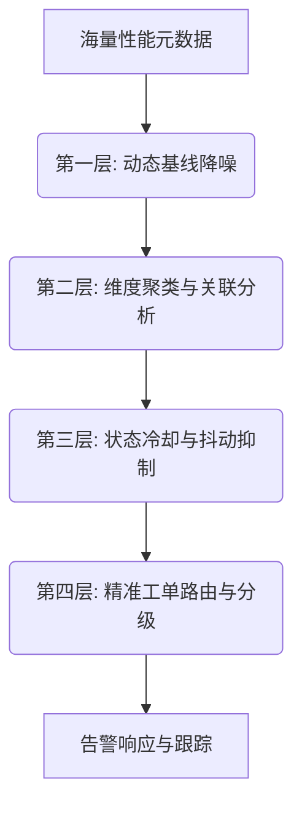
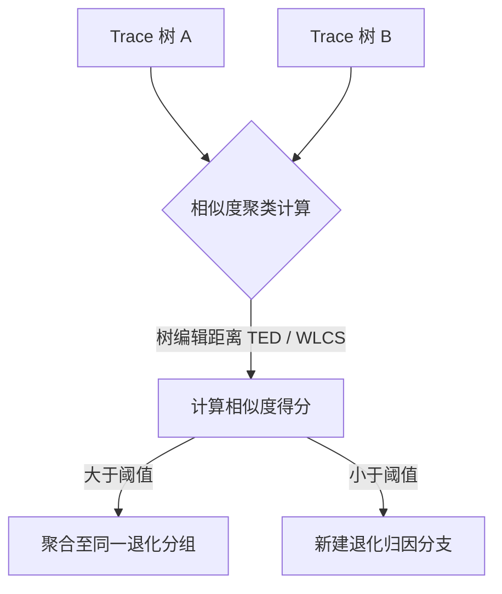
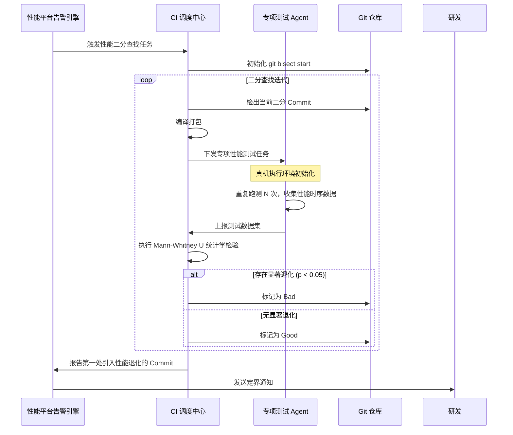
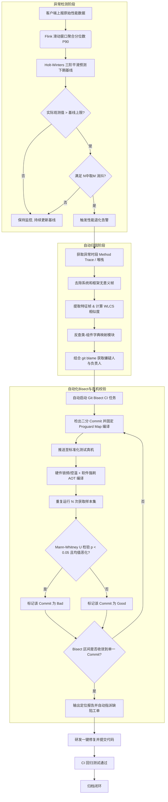

# 5.4.7.3 告警回归

在移动互联网进入存量博弈的时代，Android 客户端的性能（如冷启动时间、主线程卡顿率、内存占用、掉帧率等）直接关乎用户的留存率与转化率。然而，在复杂的大型多人协同项目或组件化架构中，性能退化（Performance Regression）往往呈现“温水煮青蛙”的特征——每一次合并仅引入微小的性能损耗，累积多个版本后却导致性能严重恶化。

传统的性能保障依赖于线下人工跑测和线上“硬阈值”告警。然而，静态阈值极易引发告警风暴或漏报，且人工定位性能退化源头的成本极高。为了彻底解决这一痛点，现代 Android 性能保障体系已演进为**“线上异常检测告警 -> 堆栈/树相似度自动归因 -> CI 自动化性能回归定位（Git Bisect） -> 研发闭环修复”**的“告警回归”全链路闭环体系。本文将从指标度量痛点、动态基线算法、堆栈树归因、自动化 Bisect 定位以及工程闭环看板等维度，对这一体系进行深度剖析。

---

## 一、 性能退化告警痛点与体系

### 1.1 性能告警的定义与核心诉求
性能告警是指监控系统在收集到客户端性能指标（Metrics）后，通过特定的判定算法，及时发现指标发生异常恶化，并向相关研发或运维人员发送通知的过程。

在 Android 客户端的日常迭代中，性能告警的核心诉求可概括为三个方面：
1. **及时性**：在性能退化发生的第一时间（如新版本灰度发版、核心功能上线）发出告警，将影响范围控制在最小。在灰度发布阶段，每一小时的延迟都意味着受影响的用户规模呈指数级上升，因此告警系统必须具备近实时的处理能力。
2. **准确性**：不漏过真正的性能恶化（低假阴性，Low False Negative），也不被正常的网络抖动、流量波动或机型分布变化所误导（低假阳性，Low False Positive）。由于客户端运行环境的复杂性，网络丢包、系统广播风暴、温度限频都会导致单个用户的性能指标出现极端异常，算法必须能够从高噪声的大盘数据中提炼出真实的代码劣化信号。
3. **可解释性与可定位性**：告警不仅要报出“启动变慢了”，更需要直接指明“是什么原因变慢的”或“是谁的变更导致的”，从而指导修复。无法直接定位到责任人或修改处的告警是研发眼中的垃圾信息，只会增加心智负担。

### 1.2 告警风暴的成因与危害
在监控系统建设初期，最常见的乱象就是“告警风暴”（Alert Fatigue）。每天有成百上千条告警邮件或工作群消息发送给研发，但其中 99% 都是无害的噪声，导致研发人员对告警产生“狼来了”效应，最终使监控流于形式。

告警风暴的成因通常包括：
* **静态阈值设计缺陷**：粗暴地针对全局指标设置单一静态阈值。例如，设定“冷启动时间 > 2.5 秒则告警”。实际上，Android 设备的性能极其分裂（从百元低端机到万元折叠屏），若以低端机为基准，中高端机发生严重退化也无法触发告警；若以高端机为基准，低端机的大幅波动会导致告警泛滥。此外，当有大批低端用户在特定节假日（如春节）涌入时，大盘平均性能指标会发生结构性下滑，这并非代码退化导致，静态阈值此时会引发全线误报。
* **维度爆炸与无效分发**：监控平台往往会对地域、机型、系统版本、网络类型等多个维度进行交叉细分。当某一底层网络运营商出现大面积抖动时，平台会对每个细分维度都触发一条告警，瞬间产生上万条冗余告警。同时，缺乏有效的通知路由机制，导致告警被群发给所有开发，每个人都认为别人会处理，最终无人处理。
* **时序数据天然波动**：App 的日常活跃用户（DAU）及其使用行为存在明显的周期性（如工作日与周末的差异、午峰与晚峰的流量突增）。例如，工作日的早上 8-9 点是通勤高峰，地铁等弱网环境下网络请求耗时激增，这会导致与网络强相关的启动耗时指标飙升。若未考虑时间维度上的基线变化，正常的周期性流量波动会被系统误判为性能退化。

### 1.3 告警风暴的深度治理策略
治理告警风暴需要从“降噪、聚合、抑制、路由”四个环节建立防御堤坝：



1. **动态基线化（Dynamic Baselining）**：彻底废弃全局静态阈值，改用基于历史时间序列数据动态计算的置信区间（Confidence Intervals）。基线会随着时间、星期以及长期趋势自我修正，从而滤除环境波动带来的假阳性。
2. **多维告警聚合（Multi-dimensional Alert Aggregation）**：引入聚类算法（如启发式关联分析、Apriori 算法），将由于同一根因引发的多个细分维度告警（如不同地域但同一厂商的冷启动超时）聚合为一条“母告警”，只向研发呈现根因大图。例如，如果发现所有机型在特定接口的耗时都在增加，系统应自动将机型维度的告警折叠为针对该接口服务端的单一告警。
3. **告警冷却与消抖（Cool-down & Deduplication）**：引入“N 中取 M”消抖机制（例如，连续 5 个采样窗口中有 3 个以上超过基线才触发告警），以及告警触发后的冷却静默期（如 2 小时内不重复发送同一指标告警），防止指标在临界点上下反复摩擦导致的告警轰炸。
4. **智能降级与抑制（Alert Inhibition）**：当系统检测到基础环境（如第三方云服务崩溃、大面积网络故障）出现异常时，自动抑制其上层依赖业务指标的性能告警，避免次生告警淹没核心告警。
5. **告警分级策略（Alert Severity Leveling）**与组织分工机制：
   * **P0（致命退化）**：核心主路径（如冷启动、主交易链路）指标劣化超过 20% 且置信区间显著被打破。此类告警会触发 CI 阻断，挂起当前版本的灰度发布，并直接拨打值班研发电话。
   * **P1（严重退化）**：劣化在 10% 到 20% 之间，触发即时通信工具（如飞书、企业微信）的群内高亮机器人通知，并自动建立 Bug 工单。
   * **P2（一般波动）**：劣化在 5% 到 10% 之间，仅记录在每日/每周的性能简报中，由团队负责人定期认领。
   * *组织保障*：建立常态化的“轮值性能 SRE”角色，专门负责初筛每日告警，避免开发人员直接面对原始告警。SRE 负责确认系统自动归因的准确性，并将无法自动归因的复杂异常手动指派给对应业务方。

### 1.4 假阳性（误报）与假阴性（漏报）的权衡
在异常检测领域，假阳性（False Positive, FP，即误报）与假阴性（False Negative, FN，即漏报）是天然对立的。
若判定条件过于敏感（如容忍度极小的动态基线），能够捕获到所有微小的性能退化（极低 FN，高召回率 Recall），但代价是产生大量的误报（高 FP，低精确率 Precision）。反之，若判定条件过于宽松，虽然告警信噪比极高（极低 FP），但很多微小但致命的性能退化会被漏掉，导致性能“温水煮青蛙”式的恶化（高 FN）。

为了度量这两者，监控平台需要建立精确率（Precision）与召回率（Recall）的评估模型，并结合 F1-Score 进行参数调优：

$$\text{Precision} = \frac{\text{TP}}{\text{TP} + \text{FP}}$$

$$\text{Recall} = \frac{\text{TP}}{\text{TP} + \text{FN}}$$

$$\text{F1-Score} = 2 \cdot \frac{\text{Precision} \cdot \text{Recall}}{\text{Precision} + \text{Recall}}$$

在 Android 性能监控 of 工程实践中，通常采取分级与链路级协同策略：
* **对于核心主流程（如冷启动时间、主线程卡顿率）**：应偏向**高召回率（高 Recall，允许一定程度的假阳性）**。因为这类退化直接影响大盘留存，必须通过后续的“自动归因与 CI 自动化 Bisect 校验”机制在后台过滤掉假阳性，而不能漏掉任何真正的恶化。由于线下有自动化 Bisect 进行二次真机验证，即使线上出现算法误报，也可以在 CI 阶段被自动判定为“无显著差异”并予以关闭，不会造成研发人员的心智损耗。
* **对于非核心辅助指标（如某个子页面渲染耗时）**：应偏向**高精确率（高 Precision，避免假阳性）**，降低对研发日常迭代的打扰，只有在发生持续且显著的退化时才触发告警。

---

## 二、 异常检测与动态基线算法

要摆脱静态阈值的束缚，必须引入时序数据的异常检测算法，为 Android 性能指标构建动态、自适应的基线。

### 2.1 基于滑动窗口的数据聚合
在进行异常检测之前，首先需要将客户端上报的秒级/分钟级海量离散性能指标进行窗口化聚合。
常用的窗口形式包括：
* **滚动窗口（Tumbling Window）**：窗口之间无重叠。如每隔 5 分钟，聚合过去 5 分钟内所有上报用户的冷启动耗时第 90 分位数（P90）。
* **滑动窗口（Sliding Window）**：窗口之间有重叠。如每隔 1 分钟，计算过去 10 分钟内的性能指标均值或分位数。滑动窗口能够更平滑地捕捉指标的突变，但计算开销相对较大。

在 Android 性能平台中，通常对冷启动时间、帧率等采用**滑动窗口分位数（Percentile, 如 P90、P95）**进行计算。因为均值极易受到少数超级低端机长尾数据的干扰，而分位数能更客观地反映大部分用户的真实体验。对于极其关键的核心路径，建议同时关注 P50（中位数）以监控普通用户的变化趋势，以及 P90（长尾表现）以发现针对特定机型或系统版本的局部退化。

### 2.2 经典 3-Sigma 原理及其工程局限性
#### 2.2.1 数学原理
3-Sigma（三倍标准差）是一种经典的静态时序异常检测算法。它假设时序数据在大盘稳定时符合正态分布（Gaussian Distribution）：

$$X_t \sim N(\mu, \sigma^2)$$

其中 $\mu$ 为均值，$\sigma$ 为标准差。根据正态分布的数学性质，数值分布在 $(\mu - 3\sigma, \mu + 3\sigma)$ 区间的概率为 99.73%。

因此，3-Sigma 算法将基线区间设定为：

$$[\text{Baseline}_{\text{lower}}, \text{Baseline}_{\text{upper}}] = [\mu - 3\sigma, \mu + 3\sigma]$$

当新观测值 $X_{t} > \mu + 3\sigma$ 时，判定为发生性能恶化。

#### 2.2.2 工程局限性与改进方法
在 Android 性能监控的工程实践中，直接套用 3-Sigma 存在严重局限：
1. **非正态分布（长尾/偏态）**：Android 的性能指标（如冷启动时间、响应延迟）通常呈明显的**长尾分布（Lognormal Distribution）**，存在大量由于机型老旧、网络极差导致的极大值。这导致均值被拉高，并且标准差 $\sigma$ 变得极大。直接计算会导致标准差 $\sigma$ 偏大，从而使基线区间过宽，漏掉许多中端机型的真实退化（假阴性高）。
   * *改进方案（对数转换）*：在应用 3-Sigma 之前，先对数据进行对数转换（Log Transformation），令 $Y_t = \ln(X_t)$，将偏态数据映射为近似正态分布，在对数空间内计算均值 $\mu_y$ 与标准差 $\sigma_y$，最后再进行指数反向映射还原基线：
     $$\text{Baseline}_{\text{upper}} = e^{\mu_y + 3\sigma_y}$$
2. **时序非平稳性（Trend & Seasonality）**：大盘数据具有长期的趋势性（随着用户量增长或版本优化）和周期性（周内波动、日内波动）。若直接用过去 30天 的全局均值和标准差，会导致基线完全失效。例如，当新版本整体优化了启动耗时后，旧数据的高耗时基线将无法发现新版本出现的轻微退化。

### 2.3 Holt-Winters 三阶指数平滑异常基线过滤
为了解决时序数据的趋势与季节性波动，工程界广泛采用 **Holt-Winters 三阶指数平滑算法**。该算法通过引入水平项（Level）、趋势项（Trend） and 季节项（Seasonality），实现对时序数据的精准预测与基线建立。

#### 2.3.1 数学推导与公式详解
对于具有周期长度为 $L$（例如，若以天为窗口，周周期 $L=7$）的时序数据序列 $Y_t$，加法模型下的 Holt-Winters 公式如下：

1. **水平平滑（Level）**，代表时序的基线高度：
   $$S_t = \alpha (Y_t - I_{t-L}) + (1 - \alpha)(S_{t-1} + b_{t-1})$$
   其中，$\alpha$ 为水平平滑常数（$0 < \alpha < 1$）。此公式将当前实际值去除季节分量后，与前一时刻的预测水平（上期水平 + 上期趋势）进行加权平均。

2. **趋势平滑（Trend）**，代表时序的增长或下降斜率：
   $$b_t = \beta (S_t - S_{t-1}) + (1 - \beta)b_{t-1}$$
   其中，$\beta$ 为趋势平滑常数（$0 < \beta < 1$）。此公式将当前水平的变化量与前一时刻的趋势预测值进行加权平均。

3. **季节平滑（Seasonality）**，代表周期的季节偏差：
   $$I_t = \gamma (Y_t - S_t) + (1 - \gamma)I_{t-L}$$
   其中，$\gamma$ 为季节平滑常数（$0 < \gamma < 1$）。此公式将当前实际值与当前水平的差值（即当前观测到的季节性影响），与上一周期的季节性预测值进行加权平均。

4. **未来的预测值（Forecast）**：对于向后预测 $m$ 个步长的值 $\hat{Y}_{t+m}$：
   $$\hat{Y}_{t+m} = S_t + m \cdot b_t + I_{t-L+m}$$

若数据波动随时间值成比例增加，则应采用**乘法模型（Multiplicative Model）**。其三个核心平滑公式调整为：
$$S_t = \alpha \frac{Y_t}{I_{t-L}} + (1 - \alpha)(S_{t-1} + b_{t-1})$$
$$b_t = \beta (S_t - S_{t-1}) + (1 - \beta)b_{t-1}$$
$$I_t = \gamma \frac{Y_t}{S_t} + (1 - \gamma)I_{t-L}$$
$$\hat{Y}_{t+m} = (S_t + m \cdot b_t) \cdot I_{t-L+m}$$

在 Android 大盘启动耗时等场景下，通常采用**加法模型**，因为冷启动耗时的季节性波动绝对值在周期内相对稳定，不随均值的暴增而暴增。

#### 2.3.2 动态基线区间构建
在获得预测值 $\hat{Y}_t$ 后，我们利用历史预测误差的平均绝对偏差（Mean Absolute Deviation, MAD）来动态估计波动的标准差，从而构建基线：

$$\text{MAD}_t = \lambda |Y_t - \hat{Y}_t| + (1 - \lambda)\text{MAD}_{t-1}$$

$$\text{Baseline}_{\text{upper}} = \hat{Y}_t + K \cdot \text{MAD}_t$$

$$\text{Baseline}_{\text{lower}} = \hat{Y}_t - K \cdot \text{MAD}_t$$

其中，$\lambda$ 是偏差平滑因子（通常设为 0.1），$K$ 是灵敏度系数（通常设置在 2.5 到 3.5 之间）。当实际观测值连续超出该区间时，系统即触发异常退化告警。

#### 2.3.3 超参数调优与初始化工程经验
* **初始化设置**：
  * 初始水平 $S_L$：通常设为第一个周期内所有数据的平均值。
  * 初始趋势 $b_L$：设为第二周期与第一周期对应点差值的平均值，即 $b_L = \frac{1}{L}\sum_{i=1}^L \frac{Y_{L+i} - Y_i}{L}$。
  * 初始季节性因子 $I_i$（$i=1\dots L$）：设为前几个周期中各对应点与周期均值差值的平均。
* **超参数调节（$\alpha, \beta, \gamma$）**：
  * **$\alpha$（水平）**：值越大说明系统越信任近期的突变。Android 大盘流量变化较快时，可设在 0.2 - 0.3；若希望基线极度平滑，则设在 0.05 - 0.1。
  * **$\beta$（趋势）**：Android 大盘性能一般处于渐变状态，趋势项的变化不应过于剧烈，因此 $\beta$ 推荐设在较低范围（如 0.05 - 0.1）。
  * **$\gamma$（季节）**：由于 App 流量周内波动极大，季节项对拟合周末低谷和工作日高峰至关重要，推荐设在 0.1 - 0.2。
  * *参数寻优方法*：在实际工程中，常通过历史 30 天的大盘数据进行离线重演仿真，以**平均绝对百分比误差（MAPE）**为损失函数进行网格搜索（Grid Search），使基线在未发生代码退化的日常时段拟合误差最小：
    $$\text{MAPE} = \frac{100\%}{n}\sum_{t=1}^n \left| \frac{Y_t - \hat{Y}_t}{Y_t} \right|$$

#### 2.3.4 Holt-Winters 动态基线计算 Python 伪代码
为了便于在流处理系统（如 Flink / Python 后台）中实现这套算法，下面给出一份自适应基线计算的参考实现：

```python
class HoltWintersAdditive:
    def __init__(self, alpha, beta, gamma, period, k=3.0, lmbda=0.1):
        self.alpha = alpha
        self.beta = beta
        self.gamma = gamma
        self.period = period
        self.k = k
        self.lmbda = lmbda
        
        self.level = None
        self.trend = None
        self.seasonals = []
        self.mad = 0.0
        
    def initialize(self, initial_series):
        # 至少需要2个周期的数据来初始化
        L = self.period
        self.level = sum(initial_series[:L]) / L
        
        # 初始趋势
        trend_sum = 0.0
        for i in range(L):
            trend_sum += (initial_series[L + i] - initial_series[i]) / L
        self.trend = trend_sum / L
        
        # 初始季节性因子
        self.seasonals = [0.0] * L
        for i in range(2 * L):
            cycle = i // L
            idx = i % L
            val_no_trend = initial_series[i] - (self.level + (i - L) * self.trend)
            self.seasonals[idx] += val_no_trend / 2.0
            
        # 初始MAD
        self.mad = 0.05 * self.level

    def update(self, y_actual, t):
        L = self.period
        idx = t % L
        
        # 1. 预测当前时刻的值
        y_pred = self.level + self.trend + self.seasonals[idx]
        
        # 2. 动态计算绝对误差和MAD
        error = y_actual - y_pred
        self.mad = self.lmbda * abs(error) + (1.0 - self.lmbda) * self.mad
        
        # 计算基线上限和下限
        upper_limit = y_pred + self.k * self.mad
        lower_limit = y_pred - self.k * self.mad
        
        # 3. 更新水平、趋势和季节分量
        new_level = self.alpha * (y_actual - self.seasonals[idx]) + (1.0 - self.alpha) * (self.level + self.trend)
        new_trend = self.beta * (new_level - self.level) + (1.0 - self.beta) * self.trend
        new_seasonal = self.gamma * (y_actual - new_level) + (1.0 - self.gamma) * self.seasonals[idx]
        
        self.level = new_level
        self.trend = new_trend
        self.seasonals[idx] = new_seasonal
        
        # 4. 异常判定
        is_anomaly = y_actual > upper_limit or y_actual < lower_limit
        return y_pred, upper_limit, lower_limit, is_anomaly
```

### 2.4 应对周内规律性波动的自适应检测
App 的活跃用户画像在工作日与周末存在根本性差异。例如，办公社交类 App 在工作日使用频繁，网络环境多为企业 Wi-Fi（网速快、延迟低），而周末则多为移动蜂窝网络（延迟高、丢包率升）；而娱乐、游戏类 App 正好相反。这导致性能指标（如冷启动的网络分段耗时）呈现出极强的“周内规律性波动”。

除了 Holt-Winters 算法外，另一种强大的工业级方案是 **STL 时序分解法（Seasonal and Trend decomposition using Loess）**。
STL 算法将时间序列 $Y_t$ 拆解为：

$$Y_t = T_t + S_t + R_t$$

* $T_t$（Trend Component）：长期趋势分量，用于捕获 App 因版本迭代、系统升级带来的长期性能变化。
* $S_t$（Seasonal Component）：周期分量（固定为 7 天周期），用以拟合工作日/周末效应。
* $R_t$（Remainder Component）：残差分量，即剥离趋势和周期后的随机波动与真实异常。

**STL 的局部加权回归（Loess）原理**：
在每个拟合点 $x_0$ 附近，选择一个局部窗口，赋予窗口内的邻近数据点权重。距离 $x_0$ 越近的点权重越高。其经典的核函数（Tricube Weight Function）形式为：

$$W(x) = (1 - |x|^3)^3 \quad \text{for } |x| < 1$$

通过局部加权最小二乘法进行多项式拟合，从而平滑地剥离出长期趋势。

**自适应异常检测工作流**：
1. **时序分解**：每天凌晨，调度系统对过去 28 天的分钟级大盘性能数据执行 STL 分解。
2. **残差建模**：对分解出的残差序列 $R_t$ 计算稳健统计量，如**四分位距（Interquartile Range, IQR）**。设定异常上限：
   $$\text{Threshold} = T_t + S_t + K \cdot \text{IQR}(R_t)$$
3. **实时匹配**：白天实时收集的聚合性能点直接扣除当前预测的 $T_t + S_t$，若残差极其显著，且在滑动窗口内持续出现，则判定为发生真正的性能退化，成功屏蔽了周末效应引起的误报。

---

## 三、 性能退化自动归因（Root Cause Analysis）

当动态基线算法告警触发，指出“某版本冷启动时间在某机型大盘上退化了 150ms”后，下一步的核心挑战是**自动归因**：在成千上万个 Class 和 Method 中，到底是谁的代码变动拖慢了速度？

### 3.1 自动归因的难点
在 Android 端进行性能归因，主要面临以下痛点：
* **数据高噪性**：客户端上报的堆栈往往包含大量的系统系统调用（如 `BinderProxy.transact`、`Handler.dispatchMessage`）或第三方 SDK 的内部逻辑，干扰真实业务逻辑的识别。
* **混淆与符号化**：线上 Release 版本经过了混淆（Proguard/R8），上报的原始堆栈是无意义的字符，必须在后台进行 Mapping 还原。若行号在混淆中被擦除，多处代码折叠会引发严重的符号化漂移，使得堆栈聚类极不准确。
* **堆栈膨胀与相似性混淆**：同一个卡顿问题，在不同的系统版本、不同的用户操作路径下，上报的堆栈深度和叶子节点可能略有不同，导致系统产生重复告警。
* **异步与协程断层**：Kotlin 协程在 Android 项目中广泛应用，其底层的线程切换机制导致传统的 Thread 调用栈在挂起点（Suspension Point）发生断裂，向上追溯只能看到协程调度器的线程池栈，而丢失了发起请求的核心业务栈。

### 3.2 堆栈指纹分发与降噪
为了实现精准的分发，必须对收集到的卡顿/慢函数堆栈进行清洗和特征化。

1. **递归与重复调用折叠**：
   在堆栈中，经常出现递归调用（如 View 树深度遍历、数据序列化）导致的重复帧，需要将其折叠，保留单一帧。
2. **黑名单过滤（系统帧与无意义帧去除）**：
   引入包名黑名单列表，自动过滤掉对归因无帮助的系统调用及通用基础库帧：
   * `android.os.*`, `java.lang.*`, `com.android.internal.*`
   * `kotlinx.coroutines.*`（协程调度框架层）
   * `com.google.gson.*`（通用解析框架）
3. **特征帧提取（Fingerprinting）**：
   清洗后，从栈顶（最靠近执行端）向下搜索，找到**第一个不属于黑名单的、且属于项目自身包名（如 `com.example.app.*`）的业务类与方法**。以此作为该堆栈的“特征帧（Feature Frame）”或“堆栈指纹（Stacktrace Hash）”。

### 3.3 基于 Method Trace 调用树路径相似度算法
静态的堆栈哈希虽然简单，但对于冷启动这种包含成百上千个并发/串行任务的复杂阶段，其退化往往体现在整个 Method Trace 调用树的结构变化上。为此，我们需要引入**调用树路径相似度算法**对 Trace 数据进行聚类匹配。



#### 3.3.1 树编辑距离（Tree Edit Distance, TED）
Method Trace 在内存中是一棵以主线程或特定工作线程为根的调用树（每个节点代表一个函数，子节点代表其调用的下层函数，边代表调用关系，节点包含耗时权值）。

计算两棵调用树 $T_1$ 和 $T_2$ 的相似度，最严谨的数学模型是 **Tree Edit Distance（基于 Zhang-Shasha 算法）**。它定义了将树 $T_1$ 通过以下三种操作转换为 $T_2$ 所需的最小代价：
* **节点删除（Delete）**：删除一个节点，并将其子节点连接到其父节点上。
* **节点插入（Insert）**：在父节点和子节点之间插入一个新节点。
* **节点重命名/替换（Rename）**：修改节点的方法签名。

对于有序树，Zhang-Shasha 算法的递推关系如下：
设 $L(v)$ 表示节点 $v$ 关联的子树中最左侧的叶子节点。若 $i$ 和 $j$ 分别是 $T_1$ 和 $T_2$ 树中的后序遍历索引，则森林的编辑距离定义为：

$$\delta(\emptyset, \emptyset) = 0$$

$$\delta(F_1[L(i)..i], \emptyset) = \delta(F_1[L(i)..i-1], \emptyset) + \gamma(i \to \lambda)$$

$$\delta(\emptyset, F_2[L(j)..j]) = \delta(\emptyset, F_2[L(j)..j-1]) + \gamma(\lambda \to j)$$

$$\delta(F_1[L(i)..i], F_2[L(j)..j]) = \min \begin{cases} 
\delta(F_1[L(i)..i-1], F_2[L(j)..j]) + \gamma(i \to \lambda) \\
\delta(F_1[L(i)..i], F_2[L(j)..j-1]) + \gamma(\lambda \to j) \\
\delta(F_1[L(i)..i-1], F_2[L(j)..j-1]) + \gamma(i \to j) & \text{if } L(i) = L(j) \\
\delta(F_1[L(i)..L(k)-1], F_2[L(j)..L(l)-1]) + \text{ted}(T_1(k), T_2(l)) & \text{if } L(i) \neq L(j)
\end{cases}$$

其中 $\gamma$ 表示操作代价函数，$\lambda$ 表示空节点。
在工程落地中，节点的“重命名/替换”代价值可以通过**方法签名相似度**来计算。例如，若方法名因 R8/Proguard 混淆发生改变但包名一致，可以给予较低的惩罚系数；若完全不同，则给予最高代价值。
然而，在 Method Trace 动辄几千个节点的情况下，标准 Zhang-Shasha 算法的复杂度过高，必须进行剪枝或降维。

#### 3.3.2 优化后的加权最长公共路径相似度（Weighted LCS）
为了在工程上实现高并发的 Trace 匹配，我们通常将树结构降维为多条“最长关键路径（Critical Paths）”，并基于**加权最长公共子序列（Weighted Longest Common Subsequence, WLCS）**进行匹配。

1. **关键路径提取**：从调用树的根节点出发，每次选择耗时占比最大（如占父节点耗时 80% 以上）的子节点，直至叶子节点。这代表了该时段的“性能主瓶颈路径”。
2. **深度与耗时加权**：对于两条路径 $P_1 = [f_1, f_2, \dots, f_n]$ 和 $P_2 = [g_1, g_2, \dots, g_m]$，定义节点 $i$ 的权重为其在整条路径中的深度权重与耗时权重的结合：
   $$W(f_i) = \alpha \cdot \text{DepthWeight}(i) + \beta \cdot \text{SelfTimeRatio}(f_i)$$
   * 越靠近叶子节点的函数，往往越是具体的业务逻辑（如具体的 JSON 解析、数据库查询），其深度权重越高。
   * 自研耗时比例（Self Time）越高，权重越高。
3. **WLCS 相似度计算**：
   利用动态规划计算 $P_1$ 和 $P_2$ 的加权相似度得分：
   $$\text{Score}(P_1, P_2) = \frac{2 \cdot \sum_{k \in \text{WLCS}} W(k)}{\sum_{i \in P_1} W(i) + \sum_{j \in P_2} W(j)}$$
   当 $\text{Score} > 0.85$ 时，判定两个 Trace 属于同一种性能退化表现，将其归为同一类告警，避免重复分发。

#### 3.3.3 Kotlin 协程 Trace 缝合技术
针对协程导致的堆栈断裂问题，业界通常引入编译期插桩或自定义 CoroutineStackFrame 还原技术。在编译时，拦截所有 `suspend` 关键字函数，自动在方法的局部变量表中注入当前协程的 `Continuation` 上下文。在性能监测点触发时，若栈顶存在协程调度器调用，则沿着 `Continuation.completion` 链向上回溯，提取出挂起之前的真实调用链路，将“碎片化”的线程栈“缝合”为物理意义上连续的业务逻辑调用树。这对于自动归因的准确度至关重要。

#### 3.3.4 基于 R8/Proguard 映射文件的内联还原
在 Release 编译中，R8 编译器会为了极致的体积与性能，将大量小函数甚至中等大小的函数强制内联（Inlining）到调用者方法中，同时混淆方法名和行号。如果直接解析线上原始 Trace 堆栈，会发现大量的业务函数“消失”了，直接导致树相似度匹配失败。
为了解决这一难题，归因引擎必须在还原时解析编译产出的 Mapping 文件中的内联项（Inline Map）。映射表通常包含以下结构：
```text
com.example.app.utils.CipherUtil -> com.example.app.a.a:
    12:15:void decrypt(java.lang.String):34:37 -> a
com.example.app.ad.AdManager -> com.example.app.b.b:
    45:45:void init(android.content.Context):100 -> b
    46:46:void init(android.content.Context):12 -> b
```
其中，`46:46:void init(android.content.Context):12 -> b` 物理行号为 46，但括号后的 12 揭示了此处的真实代码原为 `CipherUtil.decrypt` 的第 12 行。
还原算法在解析时，需要深度遍历混淆堆栈的每一帧，读取混淆行号，并在映射字典中进行区间映射。如果匹配到内联条目，则在该位置**虚拟“裂变”出被内联的函数栈帧**。通过这种方式，内联优化导致的方法调用栈断层将被彻底重构还原，保证了线上 Trace 树与线下开发期代码结构的完全一致。

### 3.4 快速定位业务模块属主（Business Owner Mapping）
在计算出导致退化的特征帧或相似 Trace 路径后，监控平台需要将其转化为具体的“责任人”。

在大型组件化 Android 项目中，工程实践通常如下：
1. **模块依赖字典构建**：在 CI 编译期，通过自定义 Gradle 插件，扫描每个 Module 下的包名路径及生成的 Class，并在打包时输出一份 `class-to-module.json` 的字典映射表。
2. **Git Blame 联合属主字典**：
   * 系统提取退化 Trace 中的特征帧，反查 `class-to-module.json` 定位到具体的 Gradle 模块（如 `:feature:user_profile`）。
   * 平台通过 Git 仓库的 `CODEOWNERS` 文件，或者读取 Module 根目录下的主研发责任人配置，自动获取该模块的开发小组负责人。
   * 结合 `git blame` 扫描最近 3 天该模块下变更特征帧对应类文件的 Commit Author，将其判定为第一嫌疑人。
   * 自动在项目协同平台创建缺陷单，将 Bug 指派给第一嫌疑人，并抄送模块负责人。

---

## 四、 自动化性能回归定位（Git Bisect 闭环）

即便有了堆栈和 Trace 相似度聚类，很多时候性能退化是由于全局配置变更（如 Gradle 插件升级、混淆规则改变、依赖库版本升级）或非堆栈可见的资源竞争导致的。此时，必须启动**自动化性能回归定位机制**，通过二分查找锁定具体的 Git Commit。

### 4.1 自动化性能退化 Git Commit 定位架构
自动化回归的本质是：将研发手工执行的 `git bisect` 与自动化测试框架结合，部署在 CI 专用测试机集群上。

下面是自动化回归的全链路二分决策交互流程：



#### 4.2.1 自动化二分查找脚本设计
CI 调度中心底层通常运行一个 Python 控制脚本，包装 `git bisect`。以下是一个典型的回归驱动脚本核心结构：

```python
import subprocess
import sys
import requests

def run_cmd(cmd, cwd=None):
    result = subprocess.run(cmd, shell=True, stdout=subprocess.PIPE, stderr=subprocess.PIPE, text=True, cwd=cwd)
    if result.returncode != 0:
        raise Exception(f"Command failed: {cmd}\nError: {result.stderr}")
    return result.stdout.strip()

def test_performance_on_device(commit_hash):
    # 1. 编译 APK
    run_cmd("./gradlew :app:assembleRelease")
    
    # 2. 安装、锁频并触发测试
    # 此处调用测试柜 Agent API，下发包名并重复测试 20 次
    response = requests.post("http://device-farm.local/run_test", json={
        "apk_path": "app/build/outputs/apk/release/app-release.apk",
        "package_name": "com.example.app",
        "iterations": 20
    })
    data = response.json()
    
    # 3. 返回测试样本集，例如 [1820, 1850, 1810, ...]
    return data["results"]

def perform_u_test(good_samples, current_samples):
    from scipy import stats
    # 采用 Mann-Whitney U 检验
    u_stat, p_val = stats.mannwhitneyu(good_samples, current_samples, alternative='less')
    # 若 p-value < 0.05，拒绝原假设，说明当前样本值显著大于Good样本（性能退化了）
    return p_val < 0.05

def main():
    good_commit = sys.argv[1]
    bad_commit = sys.argv[2]
    
    repo_path = "/path/to/project"
    
    # 获取基准 Good 版本的跑测样本数据
    run_cmd(f"git checkout {good_commit}", cwd=repo_path)
    good_samples = test_performance_on_device(good_commit)
    
    run_cmd(f"git bisect start", cwd=repo_path)
    run_cmd(f"git bisect bad {bad_commit}", cwd=repo_path)
    run_cmd(f"git bisect good {good_commit}", cwd=repo_path)
    
    while True:
        status = run_cmd("git bisect visualize", cwd=repo_path)
        if "first bad commit" in status or "is the first bad commit" in status:
            print(f"Regression Commit Locked:\n{status}")
            break
            
        # 获取当前被 bisect 选中的 commit
        current_commit = run_cmd("git rev-parse HEAD", cwd=repo_path)
        
        try:
            current_samples = test_performance_on_device(current_commit)
            is_bad = perform_u_test(good_samples, current_samples)
            
            if is_bad:
                run_cmd("git bisect bad", cwd=repo_path)
            else:
                run_cmd("git bisect good", cwd=repo_path)
        except Exception as e:
            # 编译失败等异常情况，跳过该 commit
            run_cmd("git bisect skip", cwd=repo_path)

if __name__ == "__main__":
    main()
```

### 4.2 本地真机自动化专项测试的标准化控制
在 CI 流程中，如果测试机器环境存在噪声，性能测试数据的波动（Variance）甚至会大于性能退化的幅度（例如，编译波动为 50ms，而性能退化仅为 30ms），这会导致二分定位方向完全错误。因此，**专项测试真机环境的标准化控制**是决定该方案成败的关键。

#### 4.2.1 物理与硬件环境标准化
1. **CPU 锁频（Thermal & Frequency Locking）**：
   Android 系统的 CPU 调度器（Governor）会根据温度和负载动态调整核心频率。必须在测试开始前，通过 root 权限将 CPU 核心频率锁定在固定值，并设置为 `userspace` 或 `performance` 模式。
   如果不进行锁频，系统可能会在多次冷启动测试后因发热而自动降频，导致排在后面的测试版本耗时被人为拉长，从而干扰 U 检验的判断。
2. **设备降温与恒温控制**：
   频繁的编译安装和冷启动测试会导致手机迅速发热，进而触发系统限频（Thermal Throttling）。测试机柜必须配备主动散热风扇，且在每次启动测试前，读取手机电池与 CPU 温度传感器，只有温度低于设定阈值（如 32°C）时才允许开始下一次跑测：
   ```bash
   while [ $(cat /sys/class/power_supply/battery/temp) -gt 320 ]; do
       sleep 5 # 电池温度大于32°C则等待降温
   done
   ```
3. **固定屏幕亮度与充电状态**：
   固定屏幕亮度，屏蔽光线传感器导致的 GPU 渲染波动；测试时断开常规慢充，改用程控电源或无线恒流供电，防止充电带来的发热。

#### 4.2.2 软件与系统运行状态清洗
1. **禁用自动更新与后台同步**：
   彻底卸载或禁用 Google Play 服务、系统自带的云同步、应用商店自动升级等后台常驻进程。
2. **排除 GC（垃圾回收）噪声干扰**：
   在冷启动测试中，垃圾回收机制的突然触发会导致主线程出现几十毫秒的暂停，直接污染测试样本。除了在测试前置阶段执行垃圾回收强行清理内存外，测试框架还需采集测试过程中的 GC 时长数据（GCTime）。如果发现某次跑测中 GC 耗时占启动总时间的比例超过了 10%，则自动剔除该次跑测样本，防止极端随机噪声破坏统计显著性检验。
3. **前置清理与预热（Warm-up & Garbage Collection）**：
   在每次拉起测试 App 之前，执行命令强行杀死所有后台非系统进程：
   ```bash
   adb shell am force-stop com.example.app
   ```
   启动测试前，先进行 2 - 3 次“预热启动”，让系统完成 JIT 编译以及相关资源缓存，使后续测试处于稳定的热机状态。

#### 4.2.3 机柜高可用与容错恢复机制
在真机测试柜（Device Farm）中，由于频繁进行编译构建包的安装、强杀进程及长时间高负荷运转，测试手机经常会出现 ADB 掉线（Offline）、设备卡死（Freeze）、电量耗尽或系统异常弹窗阻断测试的问题。如果缺乏容错机制，CI 二分查找任务会在中途直接卡死崩溃。
为了保证回归任务 100% 成功执行，测试 Agent 必须建立多重高可用防御：
* **ADB 掉线恢复机制**：Agent 实时监控手机连接状态。一旦发现 `adb devices` 输出 `offline` 或 `unauthorized`，Agent 自动调用程控 USB 集线器（USB Hub）接口，对该端口进行断电并重新供电（Power Cycle），强行触发手机与主机的握手重置。
* **设备冻结检测与强制重启**：当冷启动跑测时，若单次拉起测试超时（如超过 30 秒无任何打点数据上报），Agent 会判定手机处于卡死状态。此时，Agent 通过控制程控开关模拟拔掉手机电源，或通过特定的硬件控制器强行模拟物理按键“电源键 + 音量下键” 10 秒进行硬重启，恢复系统状态后继续断点跑测。
* **应用 Crash/ANR 自动熔断与重试**：在测试执行期间，若被测应用发生 Crash 或系统弹出 ANR 弹窗，Agent 必须通过 `logcat` 捕获异常堆栈，自动清除该次损坏的样本，并在重装后从断点处自动重新跑测，从而确保即使中间某个 Commit 存在编译破损或严重崩溃缺陷，二分流程也能顺利通过 `skip` 命令跳过当前节点，使查找链不发生中断。

### 4.3 统计学显著性检验在二分决策中的应用
由于性能指标天然存在波动，我们不能通过单次跑测的均值直接判定当前 Commit 是 "Good" 还是 "Bad"。必须在每个编译版本上**重复跑测 $N$ 次（建议 $N \ge 20$）**，收集到两个样本集合，然后通过统计学方法进行显著性检验。

我们对两个样本集 $X$（基准Good）和 $Y$（当前测试Commit）进行 **Mann-Whitney U 检验**：
1. 合并样本集 $X$ 和 $Y$，共 $n_x + n_y$ 个数据，并将它们从小到大进行统一排序，独立赋予秩（Rank）。数值最小的排名第 1，次之第 2，以此类推。若有相同数值，则取它们排名的平均值。
2. 计算样本集 $X$ 的秩和 $R_x$。
3. 计算 $U$ 统计量：
   $$U_x = n_x n_y + \frac{n_x(n_x + 1)}{2} - R_x$$
   $$U_y = n_x n_y - U_x$$
   $$U = \min(U_x, U_y)$$
4. 当样本数 $n_x, n_y > 20$ 时，U 分布近似于正态分布，其均值和标准差为：
   $$\mu_U = \frac{n_x n_y}{2}$$
   $$\sigma_U = \sqrt{\frac{n_x n_y (n_x + n_y + 1)}{12}}$$
   以此计算标准正态得分 $Z$：
   $$Z = \frac{U - \mu_U}{\sigma_U}$$
5. 根据 $Z$ 值在标准正态分布表中查得 $p$-value。若 $p < 0.05$，则判定为两样本中位数存在显著差异，接受当前 Commit 性能发生真实退化的结论。

### 4.4 防编译波动干扰处理
在 CI 自动化二分查找中，最容易遇到的隐蔽敌人是**编译产生的性能波动**而非代码逻辑改变。

#### 4.4.1 R8/Proguard 随机内联与混淆不一致
在不同的 Git 节点上编译时，R8 编译器会基于当前类的数量和结构，做出不同的内联（Inlining）和混淆决策。这会导致原本没有逻辑改变的类，其函数调用层级发生了变化，从而引发启动耗时波动。
* *解决方案*：在进行二分测试编译时，**锁定混淆映射文件（Keep Map）**。使用基准版本生成的 Proguard Mapping 文件作为 R8 编译的输入，强制约束所有 Commit 在编译时采用完全相同的混淆命名与内联策略，从而实现“差分逻辑比对”。

#### 4.4.2 编译类型（JIT vs AOT）的干扰
Android 运行时（ART）在不同的系统版本上对于代码编译的策略大不相同（详情可阅读 [AndroidVersionChangeLog.md](../../../../AndroidVersionChangeLog.md) 了解 ART 的演进脉络）。
* 在 Android 7.0+ 之后，ART 采用混合编译模式（JIT + AOT + Profile-guided optimization）。当 APK 新安装时，代码完全处于解释执行（Interpreter）或轻度 JIT 阶段。如果此时立即跑测，会发现耗时极长；而在系统空闲充电时，系统会自动执行 `dex2oat` 将热点代码编译为本地机器码（AOT），耗时骤减。
* *解决方案*：在安装完测试 APK 后，必须手动触发完整的 AOT 编译，消除 JIT 解释执行的性能波动：
  ```bash
  adb shell cmd package compile -m speed -f com.example.app
  ```
  *(注：`-m speed` 模式会强制将所有 Class 的方法都编译为 AOT 机器码，确保在不同 Commit 下，方法的执行效率仅取决于代码逻辑本身，而不受 JIT 实时编译抖动的影响。)*

---

## 五、 案例与闭环看板

### 5.1 案例分析：冷启动退化 180ms 的自动化定位过程
**背景**：某国民级 App 在灰度发版后，动态基线检测系统发现其冷启动时间 P90 指标由原来的 1850ms 恶化至 2030ms，恶化幅度达 180ms，触发黄色告警。

**处理流程**：
1. **自动归因**：
   * 归因引擎提取线上卡顿用户的 Method Trace。
   * 经过系统帧降噪后，提取出特征路径：`com.example.app.main.MainActivity.onCreate` -> `com.example.app.ad.AdManager.init` -> `com.example.app.ad.utils.CipherUtil.decrypt`。
   * 匹配相似度算法计算，发现该退化 Trace 的相似度在多起卡顿事件中高于 92%，判定为同一类性能退化事件。
   * 系统通过 `class-to-module.json` 反查，该类属于广告 SDK 模块 `:library:advertisement`。
2. **自动化 Bisect 立项**：
   * 性能平台自动创建工单，并调用 Jenkins 触发自动化 `git bisect` 回归流水线。
   * 输入 Good Commit (版本 A，2天前提交) 和 Bad Commit (版本 B，当前灰度版本)。
3. **CI 自动化二分比对历史记录**：
   * *第 1 次迭代*：中间 Commit `c1a2e3f`，跑测均值 1848ms，U检验 $p=0.48 \ge 0.05$。标记为 **Good**。
   * *第 2 次迭代*：中间 Commit `d5b6c7a`，跑测均值 2028ms，U检验 $p=0.002 < 0.05$。标记为 **Bad**。
   * *第 3 次迭代*：中间 Commit `e8f9a0b`，跑测均值 1852ms，U检验 $p=0.35 \ge 0.05$。标记为 **Good**。
   * *第 4 次迭代*：中间 Commit `a5c2d19`，跑测均值 2015ms，U检验 $p=0.003 < 0.05$。标记为 **Bad**。
   * *第 5 次迭代*：中间 Commit `f8e3a2b`，跑测均值 1845ms，U检验 $p=0.42 \ge 0.05$。标记为 **Good**。二分收敛。
   * 最终锁定罪魁祸首 Commit `a5c2d19`。
4. **定界与修复**：
   * 该 Commit 开发者在 `AdManager` 初始化中，为了解密一段本地广告缓存配置，误将原在工作线程执行的 `CipherUtil.decrypt` 改为了在主线程同步调用，导致主线程被解密算法（I/O 与 CPU 密集型）阻塞 160+ms。
   * 系统自动将此结论（包含二分测试耗时跳变折线图、关联 of Commit 差异对比、责任人名单）写入 Jira 工单，并自动 @ 开发者。
   * 开发者在收到工单后 1 小时内提交修复 Commit（将解密任务放回协程 IO 线程池），经 CI 自动化验证通过，指标恢复至 1842ms，完成闭环。

### 5.2 性能退化治理闭环流程图

以下是异常检测与 `git bisect` 自动化回归全链路的 Mermaid 流程图：



### 5.3 闭环看板的设计原则
为保证性能治理的高效落地，企业通常会搭建专门的**性能退化闭环看板**。看板设计应遵循以下五大原则：

1. **核心大盘与异常 high-light**：
   看板首页应直观展示 App 核心性能指标（启动时间、卡顿率、ANR率、OOM数）的大盘走势，并用不同颜色（绿：正常；黄：波动告警；红：严重退化）标识当前各指标相较于动态基线的状态。
2. **告警卡片与自动归因详情**：
   每个告警应以“卡片”形式呈现，卡片内包含：
   * 退化指标名称与异常开始时间。
   * 均值跳变幅度（如：冷启动时间 +180ms，跳变幅度 9.7%）。
   * 自动归因出的特征堆栈（直接展示最可疑的业务函数）。
   * 锁定的业务属主与第一嫌疑人（支持一键发起 Jira 缺陷）。
3. **Bisect 回归进度与可视化**：
   提供专门的“二分定位调试台”，实时展示当前正在执行的 `git bisect` 任务进度（当前在第几步、剩余几步、正在跑测哪个 Commit）。测试完成后，以折线图形式直观展示二分路径上各个 Commit 的性能测试均值与置信区间，让研发对退化的引入点一目了然。
4. **工单生命周期追踪与效能指标**：
   看板应与企业内部协同系统（如 Jira / Bugzilla）双向打通，追踪每个性能退化 Bug 从“待分发 -> 修复中 -> 待回归 -> 已验证 -> 关闭”的生命周期。
   除了展示单个 Bug 状态，还应统计以下关键治理效能指标：
   * **MTTA (平均响应时间，Mean Time to Acknowledge)**：从动态基线告警触发到责任研发确认认领的平均时长。
   * **MTTR (平均修复时间，Mean Time to Repair)**：从告警触发到最终修复 Commit 在 CI 回归通过的平均时长。
   * **拦截率**：在灰度发版阶段通过告警拦截、未流向全量大盘的性能退化比例。
5. **版本对比与灰度防线看板**：
   设立“灰度拦截墙”专区，对比新旧版本在灰度阶段的性能差异。只有通过了“新旧版本性能无显著退化”的统计学检验，系统才允许发布全量版本，从源头上杜绝带有性能缺陷的构建上线。

---

## 延伸阅读与参考

* 关于不同 Android 系统版本对后台启动限制、编译模式等性能底层机制的演变，请参阅根目录下的 [AndroidVersionChangeLog.md](../../../../AndroidVersionChangeLog.md)。
* 关于卡顿监控的底层原理（如 Choreographer 机制、Stack 采样频率），请参阅本目录下的 `5.4.7.1.指标定义.md`。
