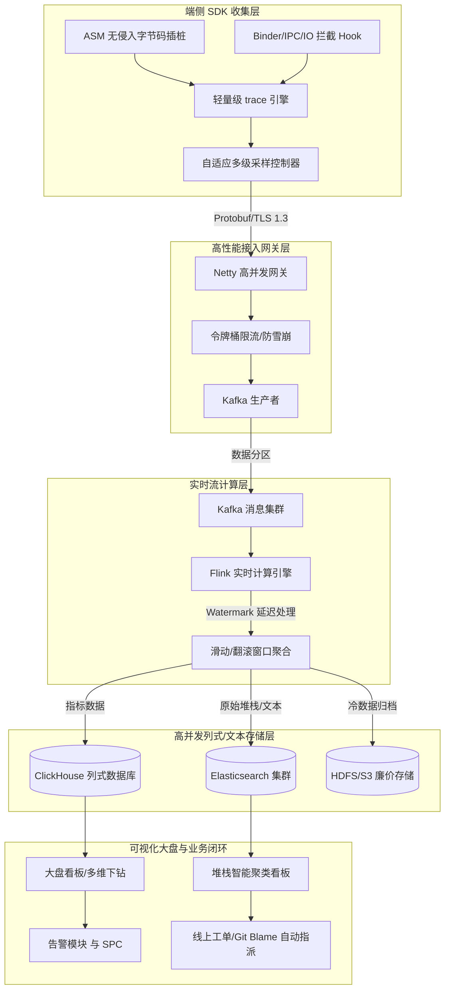
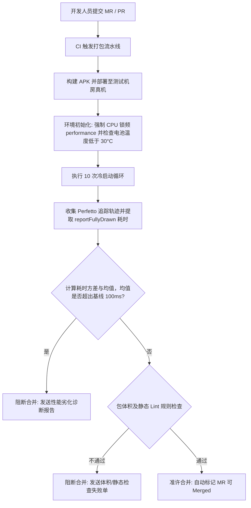
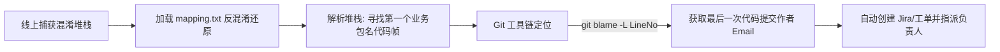

# 性能平台：企业级 APM 建设与全链路技术实践

在移动互联网的深水区，Android 应用的性能表现（如流畅度、启动耗时、内存消耗、电量损耗和崩溃率）直接决定了用户的留存率、商业转化率和产品的最终生命线。为了在复杂多变的线上环境中系统化地感知、量化、分析和治理性能问题，企业必须构建一套覆盖“端侧高精度收集 -> 高并发实时清洗 -> 智能聚类存储 -> 多维可视化分析 -> 研发门禁卡控 -> 线上工单流转”的闭环式应用性能监控（Application Performance Monitoring, APM）平台。

本文将从学术与深度工程实践的双重维度，系统性剖析企业级 APM 性能平台的底层原理、架构设计、核心算法、CI/CD 门禁建设、线上工单治理闭环以及未来的云原生与端侧智能演进方向。

---

## 第一部分：企业级 APM 性能平台价值与全链路架构

### 1. 企业级性能平台的双重价值

一个成熟的 APM 性能平台不仅是排查线上故障的“灭火器”，更是驱动技术演进与保障业务平稳运行的“方向盘”。其核心价值可归纳为两方面：
1. **技术质量保障（QA & Engineering Excellence）**：提供全天候的线上运行状态透视能力。将主观的“卡顿”、“慢”量化为客观的方法耗时、丢帧率、系统调用延迟、内存分配速率等硬性指标，帮助研发人员在亿级活跃用户（MAU）级别上实现微秒级瓶颈的快速归因。
2. **商业价值转化（Business & User Experience ROI）**：性能退化直接导致商业漏斗中流失率的攀升。性能平台通过建立性能指标与业务核心 KPI（如付费转化率、广告曝光率、日活留存率）的关联性模型，能够科学地量化“性能优化能带来多少商业收益”，从而获得公司层面持续性的研发投入。

### 2. APM 性能平台全链路架构设计

一个支撑海量数据的 APM 平台，其整体架构必须具备极高的可伸缩性、低损耗性以及极强的数据实时性。全链路数据流向可分为五大核心层级：



#### 2.1 端侧 SDK 收集层

作为性能数据的源头，端侧 SDK 既要抓得准、抓得全，又要保证自身损耗极低，绝不能发生“为了监控性能而导致性能劣化”的本末倒置现象。

##### 2.1.1 无侵入式插桩原理与 ASM 优化细节
为了对应用的方法调用栈进行耗时监控，平台不能依赖开发人员手动埋点，必须使用 AOP（面向切面编程）技术。在 Android 的编译链中，最主流的实现是在 Gradle 构建阶段的 Transform（或在新版 Gradle 中的 AppExtension / Instrumentation）插入自定义的字节码修改逻辑。
通常使用 **ASM 库** 对 Class 文件进行操作。ASM 是一个底层的 Java 字节码操控框架，它通过访问者模式（Visitor Pattern）来读取、修改和生成二进制 Class 字节码。
在编译期间，插桩插件会扫描所有的类文件，针对符合过滤规则的方法，在其方法的入口（OnMethodEnter）和出口（OnMethodExit）动态织入耗时统计指令：

```java
// 编译前的源代码
public void executeTask() {
    doSomething();
}

// 经过 ASM 插桩后的字节码对应代码
public void executeTask() {
    long traceId = MethodTraceEngine.enter("com/example/Task.executeTask");
    try {
        doSomething();
    } finally {
        MethodTraceEngine.exit(traceId);
    }
}
```

- **底层插桩字节码设计**：
  ASM 通过 `ClassVisitor` 访问类结构，利用 `MethodVisitor` 访问具体的方法体。在 `MethodVisitor.visitCode()` 处插入方法进入的代码，在 `visitInsn()` 遇到 `IRETURN`, `LRETURN`, `FRETURN`, `DRETURN`, `ARETURN`, `RETURN` 或 `ATHROW`（异常抛出）时，插入方法退出的代码。
  在具体的字节码指令层面，进入方法时，插桩插件会在操作数栈上压入当前方法的唯一标识符（MethodID，通常是一个由编译期插件分配的 `int` 型常量），并调用静态的监控入口方法。退出方法时，利用 `System.nanoTime()` 或 `SystemClock.elapsedRealtimeNanos()` 计算时间差。
  为了减少本地变量表（Local Variable Table）的槽位占用冲突，Trace 引擎通常会利用一个全局的轻量级长整型栈结构来保存进入时间戳，或者直接将 MethodID 和当前时间戳追加写入线程私有的内存数组中，实现完全无对象分配的耗时统计。
- **栈图（Stack Map Frames）计算优化**：
  在生成字节码时，JVM/ART 要求 Class 文件的 Java 7 及以上版本必须包含 Stack Map Table（栈图），以便于类加载时的字节码验证（Bytecode Verification）。在 ASM 的 `ClassWriter` 中，我们通常使用 `ClassWriter.COMPUTE_FRAMES` 标志位让 ASM 自动计算所有的栈帧图。然而，自动计算栈帧图需要 ASM 在内存中解析完整的类继承拓扑结构，这会导致大型项目的编译时间延长 30% 到 50%。
  为了解决这一工程瓶颈，先进的 APM 插桩框架会自行解析控制流，仅对被插桩插入了 `try-catch` 块（用于捕获异常退出帧）的代码片段进行局部的栈图计算与更新，或者通过 Hook Gradle 构建脚本中的类依赖缓存来避免重复解析，从而在保证字节码安全性的同时，极大缩短了编译等待时间。
- **过滤冗余的桥接与 Synthetic 方法**：
  在 Java 编译后，编译器为了实现泛型擦除、内部类访问等特性，会生成大量的桥接方法（Bridge Method）和 Synthetic 方法。如果对这些方法也进行插桩，会导致冗余的方法调用链和性能损耗。插桩插件必须通过读取方法的 `access` 标志位（如 `Opcodes.ACC_BRIDGE` 或 `Opcodes.ACC_SYNTHETIC`），精准跳过这些由编译器生成的辅助方法，确保收集到的 Trace 只有纯粹的业务调用。

##### 2.1.2 采样策略设计与自适应设备分级
在线上亿级日活的环境下，全量收集方法调用 Trace 是不可接受的，它会导致极其恐怖的存储开销与网络带宽占用。因此，平台必须建立精密的自适应多级采样策略。
采样控制器在端侧会根据“设备分级模型”来动态决定数据收集的深度。设备分级是利用设备的 CPU 核心数、主频、运行内存大小进行加权打分，将设备划分为高、中、低三档：

$$Score = 0.4 \times CoreNum + 0.3 \times Frequency(GHz) + 0.3 \times RamSize(GB)$$

- **冷启动采样**：由于冷启动属于低频高价值事件，通常设定相对较高的采样率（如 1% ~ 5%），在应用前几次启动时开启完整的方法级 Trace 收集，当启动稳定后自动降级。对于低端设备，冷启动采样率会进一步缩减，以防监控本身加剧低端手机的卡顿。
- **自适应阈值采样（Adaptive Sampling）**：在日常运行时，默认仅开启粗粒度的指标监控（如 Choreographer 帧率、内存水位）。一旦检测到指标跨越异常阈值（例如单帧耗时突然大于 700ms 触发 Freeze，或者主线程 Looper 连续阻塞 3 秒以上），端侧 SDK 立即从 RingBuffer 中导出最近几秒的详细方法级 Trace 链并打包上报，实现“无卡顿不收集，有异常保现场”。
- **分级下发配置**：平台应支持基于云端配置（Config Service）按设备级别、系统版本、业务渠道、用户白名单等维度动态调整采样率，以便于定向排查特定群体的性能问题。

#### 2.2 高性能接入层网关设计

接入网关作为接收全国数亿设备性能上报数据的“桥头堡”，其设计核心在于高并发吞吐、低延迟响应和抗网络冲击能力。

##### 2.2.1 抗高并发流量与限流防雪崩机制
在突发事件（如线上活动、大版本更新）发生时，网关流量可能瞬时翻倍。网关底层通常基于 **Netty** 异步事件驱动网络框架构建，使用非阻塞 I/O（NIO）模型，以极少的线程池支撑数十万的并发连接。
为了防止后端计算和存储队列被瞬间压垮，网关必须实现**限流与熔断防雪崩机制**：
- **分布式令牌桶算法（Token Bucket）**：网关集群借助 Redis 实现全局令牌桶，当单位时间内的请求数超出网关处理能力上限时，按照一定的降级策略直接对客户端返回 `HTTP 429 Too Many Requests`，或者要求客户端延长上报间隔。
- **客户端本地退避机制（Backoff Strategy）**：当网关限流或网络异常时，端侧 SDK 必须遵循指数退避（Exponential Backoff with Jitter）原则，逐步拉长重试周期（如 5s, 10s, 30s, 60s），并将数据本地暂存（SQLite 或 MMAP 映射文件），防止客户端的无脑重试加剧网关的雪崩状态。

##### 2.2.2 数据压缩与序列化协议选择
性能监控数据通常具有高度的结构化特点（如时间戳、方法 ID 序列、数值指标），因此在数据序列化上，**Protocol Buffers (Protobuf)** 具有无可比拟的优势，明显优于 JSON。

| 特性维度 | JSON 协议 | Protocol Buffers 协议 | 性能表现及原理对比 |
| :--- | :--- | :--- | :--- |
| **数据大小** | 较大（纯文本，带有大量的字段 key 和双引号等冗余字符） | 极小（紧凑二进制编码，不传输字段名，只传 Tag） | Protobuf 采用 Varint 和 Zigzag 编码，能将小整数和负数压缩至极少字节，网络流量开销减少 60% ~ 80%。 |
| **编解码速度** | 慢（需要频繁的字符查找、反斜杠转义和动态内存分配） | 极快（直接的二进制位移、指针偏移和预置内存结构填充） | 移动端 CPU 执行反序列化消耗减少 70% 以上，显著降低端侧功耗和网关 CPU 压力。 |
| **兼容性** | 弱（依靠硬编码解析或动态反射，容易发生类型转换异常） | 极强（严格定义的 `.proto` schema，向下和向上完全兼容） | 新增指标字段不会导致旧版本客户端崩溃或旧解析器解析失败。 |

此外，对于打包上报的 Trace 大文本，网关前置支持 `GZIP` 或更先进的 `ZSTD`（Zstandard）算法进行压缩，压缩比通常可达 5:1 以上，极大节省了网络带宽。

#### 2.3 实时流计算层 Flink/Kafka

从网关进来的数据是有序与乱序交织的洪流，必须经过实时流处理，转化为大盘看板所需的汇总指标。

##### 2.3.1 Flink 实时算子与乱序数据处理（Watermark 机制）
移动端由于网络环境极不稳定（例如用户进入电梯后信号中断，出电梯后批量补发），数据到达网关的时间（System Time）往往严重偏离事件实际发生的时间（Event Time）。如果基于系统时间进行窗口统计，会导致统计图表严重失真。
Flink 采用 **Event Time 语义** 并配合 **Watermark（水位线）** 机制来解决乱序数据的问题。Watermark 是一个随数据流流动的特殊时间戳，它表示：“此时间戳之前的数据已经全部到达，不再等待”。
假设设定 Watermark 允许的乱序延迟时间为 5 分钟（$\Delta t_{allowed} = 300\text{s}$）。当 Flink 算子收到一个事件时间为 $T$ 的数据时，当前的水位线将被更新为：

$$\text{Watermark} = \max(EventTime) - 300\text{s}$$

只有当 Watermark 越过窗口的结束时间（Window End Time）时，Flink 才会触发该窗口的计算。对于超出 Watermark 限制的“迟到太久”的数据，Flink 可通过 `allowedLateness` 机制进行侧输出流（Side Output）收集，单独补刷到冷存储中，确保统计结果的最终一致性。

在大规模分布式计算中，当 Flink 接收多个 upstream partition 的数据时，窗口的 Watermark 是由所有分区中 Watermark 最小的那个决定的（即“木桶效应”）。如果某个分区因为某些原因（例如没有新上报的数据输入）处于静默状态，会导致整个窗口的 Watermark 停止前进，从而使得所有窗口都无法触发计算。为解决这一工程难题，Flink 引入了 `withIdleness` 机制。当某个分区超过一定时间（例如 10 秒）没有新数据流入时，该分区将被标记为 "Idle"（空闲），其 Watermark 不再参与全局最小值的计算，直到该分区重新有数据流入为止。

##### 2.3.2 实时滑动窗口（Sliding Window）与聚合指标计算
为了让运维人员实时观察到系统性能的波动，APM 平台需要计算高频的滑动汇总指标（如“过去 5 分钟内，每 10 秒滑动的 P99 卡顿率”）。
Flink 内部对于滑动窗口，会将数据划分为更小的 Bucket（如将 5 分钟滑动窗口切分为 10 秒一个的微型片），在数据进入时只更新对应分片的预聚合状态。当滑动发生时，仅需对重叠的分片执行 Merge操作，极大地节省了内存并降低了延迟。
对于分位数（如 P90, P99）的实时计算，传统的全排序算法在流式计算中极度消耗内存，因为必须在内存中保留窗口内的所有样本。Flink APM 系统通常采用 **T-Digest** 或 **HdrHistogram** 算法。这些算法通过动态构建质心（Centroids）来近似模拟分布，能够在占用极少内存（通常不到 10KB）的情况下，以低于 1% 的相对误差实时输出任意百分位数。

#### 2.4 高并发列式存储层 ClickHouse/ES

对于性能平台而言，高吞吐的写入能力和超高维度的即时检索能力是存储引擎的核心考核点。为此，业界通常采用**混合存储架构**：**ClickHouse 承载指标数据，Elasticsearch（ES）承载文本堆栈，HDFS/S3 用于冷数据备份**。

##### 2.4.1 ClickHouse 的列式存储与向量化执行
ClickHouse 之所以成为 APM 指标存储的首选，源于其极致的读写性能设计：
- **列式存储**：与传统行式数据库将整行数据存在一起不同，ClickHouse 将同一列的数据物理存储在一起。在 APM 分析中，用户经常执行 `SELECT AVG(startup_time) FROM performance_table WHERE app_version = '5.1.0'` 这样的聚合查询。在列式存储下，ClickHouse 仅需读取 `startup_time` 和 `app_version` 两列的物理文件，其他成百上千列（如设备信息、网络类型、IP 地址等）无需从磁盘加载，大幅度降低了磁盘 I/O。
- **MergeTree 引擎与稀疏索引**：ClickHouse 采用类似 LSM-Tree 架构的 MergeTree 引擎，数据以追加写（Append-only）的方式批量写入磁盘，后台定期执行 Merge 合并。它的主键索引是稀疏索引（例如每隔 8192 行才记录一个索引点），这使得索引能够完全装载在内存中，配合主键快速定位到物理数据块。
- **向量化执行（Vectorized Execution）**：ClickHouse 在计算聚合函数时，不会像传统数据库那样对每行数据逐个调用函数，而是利用 CPU 的 SIMD（单指令多数据）指令集，一次性对内存中的一整组数据向量（Vector）进行批量计算。这彻底压榨了 CPU 的物理算力，将查询延迟拉低到毫秒级。

##### 2.4.2 Elasticsearch 的堆栈检索与倒排索引
虽然 ClickHouse 适合做结构化的多维分析，但面对长达数千字节的卡顿、异常堆栈（Java/Native CallStack），ClickHouse 的模糊搜索（`LIKE`）效率会急剧下降。
此时，**Elasticsearch (ES)** 派上了用场。ES 基于 Lucene构建，利用**倒排索引（Inverted Index）**，对文本堆栈进行分词和全文检索。当开发人员在线上查找含有特定业务类名（如 `com.example.payment.PayActivity`）的所有卡顿记录时，ES 可以在亿级文档中实现毫秒级的精确定位。
此外，ES 的动态 Schema 结构非常契合 APM 经常发生变更的自定义扩展参数（Meta Data），能够方便地支撑临时增加的临时日志字段。

##### 2.4.3 混存架构与冷热分离策略
为了平衡存储成本与查询性能，平台通常制定精细的冷热分离策略：
- **热数据区（0 - 7天）**：ClickHouse 承载全量维度指标，ES 存储全量详细堆栈。该区域数据写入频繁、读请求多，部署在 SSD 硬盘的高配服务器上。
- **温数据区（7 - 30天）**：对 ES 中的详细堆栈进行高比例采样保留，ClickHouse 中的指标数据通过 Flink 预先聚合（Rollup）为分钟级/小时级汇总数据，删除原始明细数据，从而降低 80% 的存储空间。
- **冷数据归档区（30天以上）**：将 ClickHouse 的历史明细和 ES 的全量堆栈以 `ORC` 或 `Parquet` 列式文件格式，导出存储至廉价的 **HDFS** 或云端对象存储（如 AWS S3），作为历史追溯和离线机器学习训练的源数据。

---

## 第二部分：核心大盘报表及展示设计

可视化大盘是性能平台与研发团队沟通的“第一界面”。如何科学、公允地呈现复杂的性能数据，决定了治理工作的效率。

### 1. 启动耗时漏斗图归因

冷启动由于涉及的系统组件和业务逻辑极为错综复杂，必须通过“漏斗图”将全局耗时逐层细分，才能实现精准的瓶颈归因。

```mermaid
gantt
    title 冷启动耗时漏斗阶段划分
    dateFormat  X
    axisFormat %s
    section 系统阶段
    进程创建 (Zygote fork) :active, 0, 150
    ClassLoader 加载 与 Linker 装载so : 150, 300
    section 框架阶段
    Application.init 与 ContentProvider 初始化 : 300, 500
    Application.onCreate 执行 : 500, 850
    section UI渲染与业务
    Activity 生命周期 (onCreate/onStart/onResume) : 850, 1100
    主线程首帧 Measure-Layout-Draw : 1100, 1300
    网络数据请求与业务首屏渲染 (reportFullyDrawn) : 1300, 2000
```



性能大盘根据上述漏斗模型，为每个阶段定义监控指标和分析维度：
- **进程创建（Zygote fork）阶段**：系统接收到启动指令后由 Zygote 进程进行 fork。在底层，这个过程包含内核分配进程标识符（PID）、复制页表以及建立虚拟内存空间映射。由于 Zygote 采用写时复制（Copy On Write, COW）技术，如果应用在历史进程中占用了极大的共享内存，或者在 fork 期间系统内存压力大导致频繁触发页面换入换出（Page In/Out），此阶段的耗时会发生异常增加。
- **ClassLoader 加载与 dynamic linker 装载 so 阶段**：系统动态链接器（`/system/bin/linker` 或 `/system/bin/linker64`）执行 `dlopen()`，将应用所需的 ELF 动态链接库装载入内存。在此阶段，APM 大盘会记录每个 so 文件的大小、装载时长以及其静态初始化块（`clinit`）的执行时长。
- **Application 初始化与 ContentProvider 加载阶段**：这是 Android 独有的初始化架构。所有的 ContentProvider 都会在 `Application.onCreate()` 之前被实例化，并执行它们的 `onCreate()` 回调。如果应用中引入了多个三方 SDK，每个 SDK 都利用 ContentProvider 进行静默初始化（如 WorkManager、Glide、各种统计 SDK），会导致该阶段耗时呈线性累加。APM 大盘通过 Hook `ActivityThread` 中的 `installProvider`，能够精准度量并排行每个 ContentProvider 的初始化用时。
- **SharedPreferences（SP）阻塞与主线程异步转同步机制**：由于 SP 的加载是在单独的线程中读取 XML 文件，但如果在主线程调用 `SP.getString()` 或者是主线程的 Activity 销毁时遇到系统 `QueuedWork` 等待未写入磁盘的 `apply`，会导致严重卡顿。
  在 Android 的底层机制中，当调用 `SharedPreferences.Editor.apply()` 时，系统会将修改任务提交到异步线程执行，但同时会将一个等待锁（Mover/Finisher）挂载到 `QueuedWork` 中。每当 Activity 切换生命周期（如 `onStop()`）、Service 执行停止动作或者 BroadcastReceiver 接收处理完毕时，系统会跨进程调用 `QueuedWork.waitToFinish()`，这会强制挂起主线程，直到异步写入磁盘的任务彻底执行完毕。这直接导致了线上大量的“主线程被 IO 阻塞引发的 ANR”。
  APM 平台在大盘中会通过字节码插桩追踪所有的 `QueuedWork` 锁定时间，并提供主动治理策略（例如在非关键场景下，编译期拦截 `apply()` 并替换为底层的 MMAP 键值存储方案）。
- **Android 15 AppStartInfo API 适配**：
  在最新的高版本 Android 系统中，系统提供了 `AppStartInfo` 来标准化获取冷启动各阶段耗时。这相比过去通过读取 Linux 伪文件系统 `/proc/self/stat` 获得的数据更为丰富。`/proc/self/stat` 字段 22 只能反映进程物理启动的 jiffies 时间，而 `AppStartInfo` 则包含了更为精细的系统级打点（如 Zygote 启动起点、Binder 加载完成点等）。APM 大盘会根据系统版本自适应对齐这两类指标，以保证趋势展示的平滑性和准确度。

### 2. 卡顿堆栈聚类看板及聚类算法底层逻辑

当线上数十万台设备发生卡顿并上报堆栈时，平台不可能将这数十万条原始堆栈平铺给研发，必须将相似的堆栈聚类成一个“卡顿问题”，并按照影响人数进行降序排列。

#### 2.1 经典 MD5 聚类的缺陷
许多基础 APM 直接将堆栈字符串进行 MD5 哈希作为唯一标识。但这在工程实践中会遇到以下严重问题：
- **行号敏感性**：业务代码稍作修改，方法行号发生改变，MD5 就会彻底失效，导致同一个卡顿问题被分裂成无数个新工单。
- **混淆字典变更**：每一次发版，ProGuard 的混淆结果不同，即使代码没有任何变动，类名方法名的变化也会导致 MD5 改变。
- **系统库帧干扰**：堆栈顶部往往是系统底层的 `MessageQueue.nativePollOnce`、`View.layout` 或系统 Framework 的方法。如果仅按栈顶 MD5 聚类，所有卡顿都会被错误地聚类成同一个“系统卡顿”。

#### 2.2 高精度堆栈聚类算法底层逻辑

为了克服上述缺陷，现代 APM 平台引进了基于**相似度**的聚类算法，核心基于 **SimHash** 与 **Levenshtein 编辑距离** 进行设计。

##### 2.2.1 SimHash 算法与海明距离
SimHash 是一种局部敏感哈希（Locality Sensitive Hash, LSH）算法，其最大特点是：**两个文本的相似度越高，它们生成的 SimHash 值的二进制海明距离（Hamming Distance）就越近**。
其工作流程如下：
1. **分词与提取特征**：对于一条堆栈，将其逐行拆解。由于堆栈是有层级结构的，我们对每一帧（Frame）赋予不同的权重（Weight）。越靠近业务层的帧，权重越高；系统帧和第三方不相关的公共库帧（如 OkHttp, Glide）赋予极低权重或直接过滤。
   例如，设定栈顶前 5 层非系统帧的权重分别为：$[10, 8, 6, 4, 2]$。
2. **哈希计算**：对每一帧的字符串（去除行号，仅保留包名 + 类名 + 方法名）使用标准的 MD5 或 Murmur3 哈希函数，生成一个 64 位的二进制序列（由 0 和 1 组成）。
3. **加权合并**：设生成的 64 位哈希值为 $V$。对于第 $i$ 位二进制：
   - 如果该位为 1，则在该位上加上该帧的权重 $W$。
   - 如果该位为 0，则在该位上减去该帧的权重 $W$。
   将所有帧的加权结果累加，得到一个含有 64 个数值的向量。
4. **降维成二进制值**：遍历该 64 位向量，若第 $j$ 位的值大于 0，则最终 SimHash 的第 $j$ 位记为 1；否则记为 0。最终得到一个 64 位的二进制数。

```text
原始堆栈帧列表:
Frame 1: com.example.pay.PayActivity.pay(PayActivity.java:120)    [权重 W=10] -> Hash: 1 0 1 1...
Frame 2: com.example.net.HttpEngine.send(HttpEngine.java:45)      [权重 W=8]  -> Hash: 0 1 1 0...
-----------------------------------------------------------------------------------------
计算每一位加权:
第1位: +10 (Frame 1为1) - 8 (Frame 2为0) = +2  -> 大于0 -> 最终第1位为 1
第2位: -10 (Frame 1为0) + 8 (Frame 2为1) = -2  -> 小于0 -> 最终第2位为 0
...
最终生成 64 位 SimHash
```

5. **海明距离比对**：
   海明距离表示两个二进制数异或（XOR）后二进制中“1”的个数。设两个堆栈的 SimHash 分别为 $S_1$ 和 $S_2$。
   海明距离计算公式为：
   
   $$d(S_1, S_2) = \text{popcount}(S_1 \oplus S_2)$$
   
   在海量数据检索中，通常设定阈值 $d \le 3$。即在 64 位二进制中，如果只有 3 位及以内不同，则判定这两条堆栈代表同一个卡顿根因，合并入同一个卡顿看板中。

##### 2.2.2 Levenshtein 编辑距离算法与动态规划矩阵推导
对于需要极高精度归类以用于自动化分配的场景，可以配合使用 **Levenshtein 编辑距离算法**。
设堆栈 $A$ 有 $M$ 帧，堆栈 $B$ 有 $N$ 帧。将堆栈 $A$ 转化为堆栈 $B$ 所需的最少单步操作（插入一帧、删除一帧、修改一帧）次数称为编辑距离，记为 $ED(A, B)$。
其动态规划的转移方程如下：
设 $dp[i][j]$ 表示将堆栈 $A$ 的前 $i$ 帧转化为堆栈 $B$ 的前 $j$ 帧的最小编辑距离。

$$dp[i][j] = \min \begin{cases} 
dp[i-1][j] + 1 & \text{(删除 A 的第 i 帧)} \\ 
dp[i][j-1] + 1 & \text{(向 A 中插入 B 的第 j 帧)} \\ 
dp[i-1][j-1] + \text{cost} & \text{(替换操作)} 
\end{cases}$$

其中：

$$\text{cost} = \begin{cases} 0, & \text{if } A[i-1] == B[j-1] \\ 1, & \text{otherwise} \end{cases}$$

两堆栈相似度（Similarity）计算公式为：

$$\text{Similarity}(A, B) = 1 - \frac{dp[M][N]}{\max(M, N)}$$

下面以两个简单的简化堆栈为例，演示 Levenshtein 距离矩阵的推导过程：
- 堆栈 A：`[A1: click, A2: draw, A3: measure]` ($M=3$)
- 堆栈 B：`[B1: click, B2: layout, B3: measure]` ($N=3$)

初始化边界条件：$dp[i][0] = i$ 且 $dp[0][j] = j$。
动态规划计算矩阵如下：

| $dp[i][j]$ | 0 (空) | 1 (click) | 2 (layout) | 3 (measure) |
| :--- | :--- | :--- | :--- | :--- |
| **0 (空)** | 0 | 1 | 2 | 3 |
| **1 (click)** | 1 | 0 | 1 | 2 |
| **2 (draw)** | 2 | 1 | 1 | 2 |
| **3 (measure)**| 3 | 2 | 2 | 1 |

*推导解析*：
- 在 $dp[1][1]$：$A[0] == B[0]$ ('click' == 'click')，所以 $\text{cost} = 0$，则 $dp[1][1] = \min(dp[0][1]+1, dp[1][0]+1, dp[0][0]+0) = \min(2, 2, 0) = 0$。
- 在 $dp[2][2]$：$A[1] \neq B[1]$ ('draw' $\neq$ 'layout')，$\text{cost} = 1$，则 $dp[2][2] = \min(dp[1][2]+1, dp[2][1]+1, dp[1][1]+1) = \min(2, 2, 1) = 1$。
- 最终 $dp[3][3] = 1$，表示仅需将 'draw' 替换为 'layout' 这一步操作即可完成转换。
- 相似度为：$\text{Similarity}(A, B) = 1 - \frac{1}{\max(3,3)} = 1 - \frac{1}{3} = 0.67$。

当 $\text{Similarity} \ge 0.85$ 时，平台判定其为同类卡顿。由于动态规划的时间复杂度为 $\mathcal{O}(M \times N)$，在海量实时计算中开销较大，因此在工程上，通常会对堆栈进行**深度剪枝**（例如只保留最上面的 15 层 non-system 帧），并在 Flink 计算节点中利用 LRU 缓存避免重复的编辑距离计算。

##### 2.2.3 基于 AST 与拓扑距离的聚类演进
在极大型的移动应用中，ProGuard 混淆每次产生的字典差异会导致大量名称变更。虽然 SimHash 和编辑距离可以剔除行号，但如果类名方法名被混淆成无规律的单字母（如 `a.b.c.a.d()`），聚类精确度将大幅滑坡。
为了克服这一局限性，先进的 APM 平台采用**基于调用图拓扑结构（Control Flow Graph Topology）** 的相似度检测。该算法不再依赖具体的类名和方法名文本，而是将还原反混淆后的方法调用关系抽象为一个有向无环图（DAG），利用图同构算法或树树距离（Tree-to-Tree Correction Distance）来评估两个调用链的结构相似度。只要两段代码的执行逻辑拓扑一致，哪怕混淆名字面差异极大，依然能够精确聚类为同一个卡顿事件。

### 3. 异常崩溃率波动：3-Sigma 与 SPC 检测

性能平台的稳定性看板不仅要展示大盘 Crash 率，还要在崩溃率发生“异常突变”时主动发出告警。这就需要利用统计学中的 **SPC（Statistical Process Control，统计过程控制）** 和 **3-Sigma 原则**。

```text
崩溃率 (%)
  ^
  |      ----------------------- 极上限 UCL (μ + 3σ)
  |            *
  |           / \
  |          /   \
  |   *-----*     \             均值 CL (μ)
  |  /             \     *
  | /               \   / \
  |*                 *-*   *
  |      ----------------------- 极下限 LCL (μ - 3σ)
  +---------------------------------------------> 时间
```

算法逻辑如下：
1. **收集历史基线**：取过去 $N$天（如 14 天）的正常历史崩溃率数据，计算其均值（Mean，记为 $\mu$）和标准差（Standard Deviation，记为 $\sigma$）：

$$\sigma = \sqrt{\frac{1}{N} \sum_{i=1}^{N} (x_i - \mu)^2}$$

2. **确立控制界限**：
   - **中心线 (CL)** = $\mu$
   - **控制上限 (UCL)** = $\mu + 3\sigma$
   - **控制下限 (LCL)** = $\max(0, \mu - 3\sigma)$
3. **实时检测规则**：当实时滑动的崩溃率 $X_{current}$ 触发以下条件之一时，大盘自动亮红灯并向值班群发送高优先级告警：
   - 条件一：单点数值超越控制上限（$X_{current} > UCL$），说明发生了大面积的崩溃爆发。
   - 条件二：连续 9 个点落在中心线 $\mu$ 的同一侧，说明虽然没有破 3-Sigma 阈值，但系统崩溃基线发生了整体漂移（通常见于引入了带有隐患的新 SDK 或后端服务接口变更）。

在更为灵敏的质量保障体系中，还可以引入**西点控制规则（Western Electric Rules）**来识别统计上的非随机波动：
- 规则一：连续 3 个点中有 2 个点落在中心线同侧的 $2\sigma$ 警戒线以外。
- 规则二：连续 5 个点中有 4 个点落在中心线同侧的 $1\sigma$ 警戒线以外。
- 规则三：连续 8 个点落在中心线两侧的 $1\sigma$ 范围之外，呈宽幅震荡态势。
通过引入这些统计学判据，平台可以从每日波动的杂音中自动过滤出真正的异动，避免由于研发人员人肉盯盘带来的迟滞或漏告警。

### 4. 内存泄露树与系统资源热力图展示机制

- **内存泄露树（Leak Tree）**：基于开源 LeakCanary 原理的线上化改造。平台通过在端侧动态采集 `WeakReference` 队列，当发现 Activity 泄露时，静默生成减裁版的 `Hprof` 文件（裁剪掉所有具体数据值，只保留对象引用拓扑关系，以减小体积并保护用户隐私），并在后台自动执行 `heap analyzer`。在看板上将泄露链以**支配树（Dominator Tree）** 的形式展示，直接高亮最可能导致泄露的业务节点。
- **系统资源热力图（System Resource Heatmap）**：多维矩阵式热力图，横轴为时间，纵轴为 CPU 核心使用率、内存 RSS、I/O 读写速度、网络吞吐量和设备温度。通过颜色的深浅直观地揭示出当卡顿/ANR 发生时，设备是否处于系统整体资源“严重超载（Overhead）”的状态，从而避免误判是单一应用的问题。

---

## 第三部分：CI/CD 研发门禁阻断控制

仅仅依靠线上治理是疲于奔命的，必须在编译打包和研发流程（CI/CD）中建立防线，将低劣的代码和有性能隐患的文件拦截在发布之前。

### 1. 包体积卡线算法与扫描机制

APK 文件的包体积直接影响到应用在各大应用商店的下载转化率以及安装成功率。CI/CD 的包体积检测绝不仅仅是对比一次 `.apk` 的大小，必须进行解构与多维深度审计：
- **无损与有损解构**：CI 系统每次打包完成后，利用工具（如 `ApkParser` 或 `android-tools` 中的 `apkanalyzer`）将 APK 进行解压，计算其三大关键体积：
  1. **原始文件体积（File Size）**：物理存储占用。
  2. **下载体积（Download Size）**：经过 Google Play 或应用商店压缩算法传输时的大小。
  3. **安装释放体积（Installed Size）**：在手机上解压并经过 DEX 优化（OAT/ODEX 文件）后的实际磁盘占用。
- **增量卡线规则**：
  设置全局阻断阈值：**“单次 MR/PR 引入的增量大小不得超过 100KB；新增第三方 SDK 引入的增量不得超过 500KB”**。
  为了防止开发人员通过修改代码行导致混淆变动、DEX 字典变化产生的伪增量干扰，CI 卡控插件会过滤由于混淆重分配导致的类名大小波动，而专注于**资源增量（新增 PNG/WebP/XML 差异）**、**so 文件动态库差异**以及**新引入库的依赖项分析**。

在更细粒度的包体积扫描中，CI 系统还会运行以下规则以防止隐性退化：
- **无用资源发现**：静态扫描 `resources.arsc` 和 DEX 文件的关联树，寻找没有被任何代码引用的 drawable、layout 和 raw 资源，在构建报告中提供删除建议。
- **重复资源哈希对比**：计算所有资源文件的 MD5，找出内容完全相同但被赋予了不同文件名的冗余文件，并在 CI 阶段予以阻断或发出警告。

### 2. 自动化启动耗时卡控流水线

为了在线下精确拦截由于代码改动导致的启动变慢，CI 系统必须搭建一套高可信度的自动化冷启动测试流水线。

#### 2.1 硬件降噪与控制方差
在线下用真机测试启动时间，最大的痛点是**数据不稳（方差极大）**。为解决设备温度、CPU 频率波动对测试结果的干扰，CI 机房必须执行以下策略：
1. **CPU 降频锁频控制**：
   Android 系统的 CPU 为了节能，会启用动态调频机制（DVFS）。在测试冷启动前，测试脚本必须通过 `adb shell` 往 CPU 节点注入参数，锁定 CPU 的运行策略（Governor）：
   
   ```bash
   # 需设备拥有 root 权限
   adb shell "echo performance > /sys/devices/system/cpu/cpu0/cpufreq/scaling_governor"
   adb shell "echo performance > /sys/devices/system/cpu/cpu4/cpufreq/scaling_governor"
   ```
   
   通过锁定 CPU 为 `performance`（高性能模式），强制所有核心处于恒定主频，排除 CPU 动态升降频产生的数百毫秒温差误差。
2. **充电状态降噪**：
   手机连接 USB 充电线时，充电发热会导致电池及主板温度上升，从而引发 CPU 热降频保护，且充电电路的电流扰动也可能改变系统的物理功耗和硬件中断响应。测试脚本在启动测试前应执行以下 ADB 命令断开系统的充电行为：
   
   ```bash
   adb shell dumpsys battery set status 1
   ```
   
   这能让手机在有线连接时处于放电状态，彻底消除物理充电产热带来的测量误差。
3. **温控强制降温与环境控制**：测试机房需配备散热风扇。在每次冷启动开始前，读取系统内置的温度传感器：
   
   ```bash
   adb shell dumpsys battery | grep temperature
   ```
   
   当且仅当机身温度低于 30°C（300）时，才允许启动新一轮测试，防止 CPU 因为过热触发系统的温控守护进程（Thermal Daemon）自动进行降频限制。
   在大型真机机房中，通常会有成百上千台测试手机。由于手机长期插电运转，电池老化严重，易发生“电池膨胀”的安全隐患，同时系统容易发生“ADB 离线（ADB offline）”问题。为保障流水线的高可用，机房管控端会定期调用 `adb reconstruct` 重新拉起守护进程，并配备电流断路器，根据测试任务状态动态切断/接通电源，在防范硬件损坏的同时，尽可能降低测量时的环境背景噪声。
4. **消除网络变数**：CI 自动化冷启动测试全程必须置于 Mock 网络环境下。客户端所有 HTTP/HTTPS 网络请求必须被拦截导向本地局域网的 Mock 服务器，或者直接使用预埋的本地响应数据，彻底排除真实公网延迟和抖动。

#### 2.2 启动卡门禁流程图



#### 2.3 门禁拦截工作流说明
1. **触发与部署**：当研发提交 Merge Request 时，CI 流水线拉取最新分支代码编译生成测试 APK，并自动下发部署指令到 CI 真机测试集群。
2. **环境预备**：脚本检查电池电量必须在 80% 以上（防止低电量节能模式介入），写入 `/sys/` 节点锁定 CPU 运行频率，并等待电池温度冷却。
3. **多次测试均值判定**：执行 10 到 15 次完全冷启动，每次冷启动前执行 `am force-stop` 并清理系统缓存（`drop_caches`），防止 PageCache 的热启动干扰。计算测试耗时的平均值 $\mu_{test}$ 与方差 $\sigma^2$。如果方差超出阈值，判定该轮测试污染，重新测试；如果均值 $\mu_{test}$ 大于当前基线版本均值 $\mu_{base} + 100\text{ms}$，直接阻断 MR 并自动标记为红灯状态。

### 3. 新增三方 SDK 及依赖冲突拦截

很多团队的性能退化源于“野蛮引入三方 SDK”。一个未经评估的 SDK 可能会在内部偷偷启动前台服务、创建大量线程池、无约束地调用网络或读取敏感文件。
CI 门禁在编译阶段增加 Gradle Dependency Analyzer 插件：
- **静态权限扫描**：分析依赖库的 `AndroidManifest.xml`。一旦检测到引入了危险的隐私权限（如获取地理位置、IMEI）或敏感系统广播接收器，立即阻断。
- **线程池规范性拦截**：使用 ASM 扫描新引入 SDK 的所有字节码指令。若发现其直接调用了 `new Thread().start()` 或 `Executors.newCachedThreadPool()` 等不受控线程创建行为，门禁予以红牌警告，要求其改写为使用应用全局的统一线程池调度器。

---

## 第四部分：线上性能工单流转与治理看板闭环机制

性能治理不是一次性的专项行动，必须将其制度化、常态化。这需要建立一整套“发现 -> 指派 -> 定位 -> 修复 -> 校验 -> 关闭”的工单流转系统。

### 1. 自动指派：混淆还原与 Git Blame 联合归因

当 APM 平台聚合出了一个新的 P0 级卡顿或 Crash 问题时，工单系统应该在几秒钟内将其自动派发给相应的责任研发。



其底层自动化机制如下：
1. **反混淆处理（De-obfuscation）**：系统在打包发布时，会自动将混淆产生的 `mapping.txt` 文件上传到 APM 的 Mapping 服务器。当线上上报类似 `at com.a.b.c.a(Unknown Source:5)` 的堆栈时，反混淆服务读取对应的 Mapping 文件，将其还原为 `at com.example.pay.PayActivity.initView(PayActivity.java:82)`。
2. **定位业务层第一帧**：工单解析器从堆栈最顶部向下过滤掉所有的系统 Framework 类（如 `android.os.`、`java.lang.`）和第三方开源库（如 `io.reactivex.`、`okhttp3.`），定位到含有本公司核心业务包名（如 `com.example.`）的第一帧。
3. **Git Blame 联合查询**：工单引擎通过 API 远程向 Git 仓库发起查询，执行类似如下命令：
   
   ```bash
   git blame -L 82,82 --porcelain com/example/pay/PayActivity.java
   ```
   
   从命令返回的 JSON 结构中提取作者邮箱（Author Email）以及最近一次修改的 Commit ID，直接锁定“写下这行代码的人”，并自动在 Jira 或企业内部办公软件中创建工单，指派给他。

#### 1.4 复杂 Git 提交特征及格式化噪点过滤
在大型工程团队中，代码经常由代码格式化插件（如 Ktlint 或 Spotlight）进行批量重构与样式统一。如果在 Git Blame 联合查询中，这一行代码最后一次修改记录是一个“代码格式化”或“全局重构”的 Commit，那么工单将会被错误分发给格式化工具的执行者。
为规避此弊端，工单分配引擎会在后台读取该 Commit 的 Message：
- 若包含关键词如 `reformat`、`format code`、`import optimization`，则自动启用 Git 工具链的追溯退避逻辑。
- 系统会使用 `git log -S` 跟踪该行的关键变量或函数名变更历史，或者在执行 Git Blame 时自动带上自定义的 `--ignore-rev` 文件（例如 `.git-blame-ignore-revs`），将这些全局无意义格式化提交从主线上过滤掉，直到追踪到真正修改业务逻辑的那次真实历史提交为止，从而保证指派精准率不被重构污染。

### 2. 优先级评估与严重等级分类公式

不可能所有的卡顿和异常都要求当天修复，工单系统必须有一套计算**严重程度分值（Severity Score）** 的公式，来决定工单的优先级（P0、P1、P2、P3）。
设某个性能事件 $E$：
- $N_{uv}$：过去 24 小时受影响的独立用户数（UV）。
- $N_{pv}$：过去 24 小时该事件发生的总次数（PV）。
- $R_{weight}$：受影响页面在漏斗中的权重值（例如首页和收银台页面权重设为 10.0，而设置、关于页面权重设为 1.0）。
- $F_{severity}$：性能指标的偏离程度值（例如严重卡顿 Freeze 取 3.0，一般卡顿 Jank 取 1.0）。

严重程度分值 $S(E)$ 的计算公式可定义为：

$$S(E) = \left( \alpha \cdot \log_{10}(N_{uv}) + \beta \cdot \log_{10}(N_{pv}) \right) \times R_{weight} \times F_{severity}$$

其中，$\alpha$ 和 $\beta$ 为调节系数（通常取值 $\alpha = 0.7, \beta = 0.3$）。
工单系统根据 $S(E)$ 的分值，将工单自动归入不同的响应级别：
- **$S(E) \ge 100$**：**P0 级**。必须在 24 小时内提修复 MR 并在最近的灰度版本中发版。
- **$50 \le S(E) < 100$**：**P1 级**。需要在本研发周期（Sprint）内修复完成。
- **$10 \le S(E) < 50$**：**P2 级**。允许排期修复。
- **$S(E) < 10$**：**P3 级**。挂起或仅归档，暂不占用研发精力。

### 3. 修复校验与二次复发闭环

研发人员提交修复代码后，工单并不是立即关闭的，必须经历**线上版本灰度验证**：
1. **修复标记**：研发在工单管理界面关联对应的修复分支 commit，并将状态置于“待校验”。
2. **灰度期验证**：当包含该 commit 的新灰度版本发版后，APM 平台会针对该新版本的上报数据进行定向筛查。若在灰度版本（受影响用户数 $> 10000$）中，该聚类堆栈的发生频次降为 0，则该工单自动转为“已修复”状态。
3. **二次复发（Regressed）**：如果在灰度或全量发版后，相同堆栈在“已修复”的工单项下再次冒出，系统会自动将该工单重新激活，状态变更为“复发”，并发出警告消息，防止无效修复（如仅加了 `try-catch` 但导致了其他空指针或流程卡死）。

### 4. APM 考核红线设计

为了强力推进性能治理工作，企业通常需要将 APM 大盘数据与业务线绩效挂钩。以下为最常见的核心考核红线设计：

| 指标英文名称 | 中文指标定义 | 核心物理计算标准 | 研发考核红线要求 |
| :--- | :--- | :--- | :--- |
| **Crash Rate** | 线上崩溃率 | $\frac{\text{崩溃次数}}{\text{启动次数}} \times 100\%$ | $\le 0.05\%$ (万分之五) |
| **ANR Rate** | ANR 发生率 | $\frac{\text{ANR 影响用户数}}{\text{活跃用户数}} \times 100\%$ | $\le 0.01\%$ (万分之一) |
| **SFR (Sliding Fluency)** | 滑动流畅度比率 | 丢帧 $\le 1$ 且耗时 $< 2 \cdot T_{vsync}$ 的帧占比 | $\ge 95\%$ (优良比率) |
| **P90 Cold Startup** | P90 冷启动耗时 | 90% 的用户冷启动完全可用耗时分位数 | $\le 2000\text{ms}$ (慢设备 $\le 3000\text{ms}$) |
| **OOM Rate** | 内存溢出崩坏率 | $\frac{\text{由于 OOM 导致的崩溃数}}{\text{总活跃设备数}}$ | $\le 0.005\%$ (十万分之五) |

---

## 第五部分：架构演进与未来趋势

技术的发展日新月异，APM 平台也正在向着标准化、云原生以及端侧智能化方向大步迈进。

### 1. 云原生 APM 与 OpenTelemetry 的标准化整合

历史上，各家 APM 厂商和企业内部自研平台的 SDK 接口都是割裂的。如今，**OpenTelemetry（OTel）** 已经成为云原生时代可观测性（Observability）的工业标准。
- **三位一体的语义规范**：OpenTelemetry 将 **Trace**（分布式链路追踪）、**Metric**（多维指标度量） and **Log**（日志/堆栈文本）进行了统一规范定义。在 Android 端，未来的演进是全面接入 OpenTelemetry Android SDK。
- **跨平台打通**：通过标准的 OTel 协议，Android 端的性能 Trace（如一次慢网络请求）可以直接与后端的服务链路 Trace（后端微服务的 Spring Cloud Trace）无缝拼接到一起，形成真正的**端到端全链路 Trace 视图**。研发人员在客户端点击发生的慢操作，可以直接下钻追溯到是哪台后端服务器的数据库查询发生了死锁，极大拓宽了排障视野。

### 2. 端侧智能异常分析与归因

未来的 APM 不仅是“事后感知”，而是要在端侧具备“事前预测与智能归因”的能力。
- **基于轻量级决策树/SVM 的 ANR 预警**：
  端侧 SDK 在主线程 Looper 中嵌入轻量级哨兵线程。当检测到主线程当前正在执行的消息耗时即将越过 2 秒，并且伴随设备温度骤升和可用内存降至 10% 以下的临界状态时，SDK 会智能预测有极高概率在 3 秒后爆发 ANR。此时，SDK 自动在端侧做一次高精度的方法快照（Method Profiling），并导出当前系统核心的 `Binder` 状态和线程死锁拓扑图。这一预测性采集机制，避免了全量采集导致的严重损耗，又为难复现的线上长尾卡死保留了最精准的“第一现场”。
- **多维归因智能推导（Correlation Analysis）**：
  在线上大盘，当检测到冷启动时间变长时，后台智能分析引擎会自动运用统计学的相关系数分析（如 Pearson Correlation），自动发现性能退化与“特定 ROM 版本（如 Android 10/11 的 MAC 地址/进程限制导致设备唯一标识符计算降级）”或“特定基带芯片”存在强相关性，免去人工排查的繁琐。

---

> **版本兼容注意事项**
>
> 随着 Android 系统的演进，安全与隐私限制日益严格。在 Android 10/11+ 以后，系统针对非系统应用获取 IMEI、MAC 等设备硬件标识符做出了严厉限制，这直接导致了 APM 性能平台在计算“受影响人数（UV）”时面临多维去重困难。同时，系统对 `/proc/net/` 的访问限制也使得监控细粒度网络流量变得更为棘手。关于这些系统层 API 的变更与适配标准，请参考：
> [Android 版本变更兼容日志](../../../../../AndroidVersionChangeLog.md) 了解具体的行为改变。
