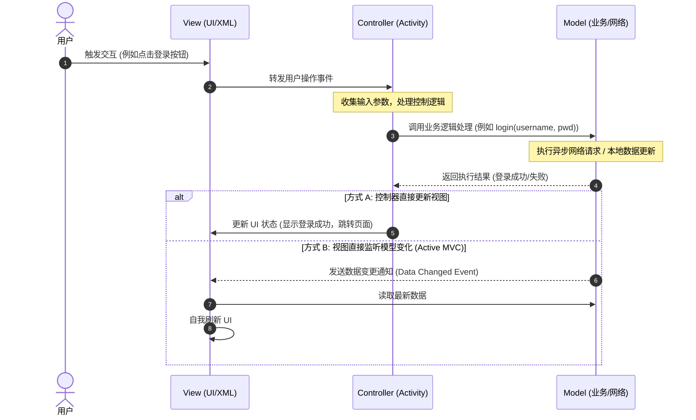

# 5.5.1.1 常见架构模式

在 Android 应用开发的发展历程中，应用架构模式的演进不仅是一部开发者对抗“代码混乱度”的奋斗史，也是伴随 Android SDK 平台 API 演进以及硬件性能提升的必然结果。选择或设计一个合理的架构模式，其本质是为了在系统复杂度、开发效率、代码可维护性、团队协作流畅度以及自动化测试便利性之间寻找最佳的平衡点。

---

## 第一部分：Android 架构演进背景与 MVC 模式

### 1. 为什么 Android 开发迫切需要架构模式？

软件工程的核心目标之一是应对系统的复杂度。在早期的桌面端或传统的 Web 开发中，架构模式（如 MVC）早已深入人心。然而，在 Android 平台初期，许多应用几乎处于“无架构”的野蛮生长状态。这与 Android 独特的系统运行机制以及 API 设计有着密切的关系。

#### 1.1 系统托管的生命周期与组件入口
在传统的 Java 桌面端或 Web 后台程序中，程序的启动入口通常是确定的 `main` 函数，对象的生命周期完全由开发者通过代码显式控制。但 Android 系统的设计打破了这一常规：
- **四大组件（Activity, Service, BroadcastReceiver, ContentProvider）**是应用的入口点，它们的实例化和生命周期完全由 Android 系统的系统服务（如 `ActivityManagerService`, 简称 AMS）通过 Binder 跨进程通信进行托管。
- 开发者无法通过简单的 `new Activity()` 来创建界面，必须依赖系统的回调（如 `onCreate`、`onStart`、`onResume` 等）。
- 这种“控制反转”导致开发者必须把几乎所有的初始化逻辑、UI 绑定逻辑、业务请求逻辑、甚至线程切换逻辑，全部塞进系统留给开发者的回调函数中（主要是 `Activity` 或 `Fragment` 的生命周期方法）。

#### 1.2 高内聚低耦合与易测试性的缺失
由于缺乏明确的架构约束，早期的 Android 页面极易演变为“上帝类（God Object）”：一个 Activity 类中可能同时包含了数千行代码，混杂着 XML 控件的获取与操作、网络请求的异步回调、数据库的读写、JSON 数据的解析、页面的跳转路由等。这带来了以下致命的后果：
- **极难维护**：修改一个 UI 样式的改动，可能会意外破坏网络请求的解析逻辑，引发难以预测的 Regression（回归 Bug）。
- **无法进行单元测试（Unit Test）**：Android 系统的 Activity 强依赖于系统的运行时环境（即 `android.content.Context` 及其底层的 Window 机制）。在没有架构解耦的情况下，如果想要测试一段纯粹 of 业务计算逻辑，开发者不得不编写复杂的 Robolectric 测试，或者运行耗时的 Instrumentation 运行时测试，而无法直接在 JVM 上通过轻量级的 JUnit 进行毫秒级的验证。

---

### 2. MVC 模式的底层原理与时序调用流

MVC（Model-View-Controller）是经典的架构模式，它的核心思想是将应用划分为三个核心部分，以达到关注点分离（Separation of Concerns）的目的。

```
                    ┌─────────────────────────┐
                    │       Controller        │
                    │ (接收用户输入, 控制逻辑) │
                    └────────────┬────────────┘
                                 │
                   1. 用户操作   │   2. 驱动更新
                                 ▼
    ┌────────────────┐                      ┌────────────────┐
    │      View      │◄─────────────────────┤     Model      │
    │  (展示 UI)     │     3. 数据变化监听  │ (数据与业务逻辑)│
    └────────────────┘                      └────────────────┘
```

#### 2.1 MVC 三要素的学术职责划分
- **Model（模型）**：负责维护应用的核心业务数据、数据状态以及业务逻辑。它不关心数据是如何展示的，也不关心用户是通过什么操作触发的数据改变。Model 通常由本地数据库（Room/SQLite）、网络请求（Retrofit/OkHttp）以及内存缓存等数据源组成。
- **View（视图）**：负责将 Model 的数据渲染成用户可见的界面。在标准的 MVC 学术定义中，View 应该是“活跃的（Active）”，即 View 可以直接向 Model 注册数据变化的监听器，一旦 Model 中的数据发生改变，View 会自发地拉取最新数据并更新自己。
- **Controller（控制器）**：充当 View 和 Model 之间的粘合剂。它负责接收来自 View 层的用户输入（例如按钮点击、屏幕滑动、文本输入等），将这些输入转化为业务意图，然后调用 Model 的相关业务接口来更新 Model 的状态。

##### Active MVC 与 Passive MVC 的本质区别
根据 View 与 Model 的交互方式，MVC 可以分为两个流派：
- **Active MVC（主动式）**：View 能够直接访问 Model 并注册观察者。当 Model 发生改变时，它直接向 View 发送广播，View 接收到通知后主动去拉取 Model 中的最新数据进行自我刷新。在这种模式下，Controller 仅仅负责处理输入操作，不参与数据的传递。
- **Passive MVC（被动式）**：View 不持有 Model 的任何引用，甚至不知道 Model 的存在。Controller 充当完全的中间件，不仅接收用户的输入并修改 Model，还要主动将修改后的数据从 Model 读出并推给 View。View 完全被动地接受 Controller 的指挥。

在 Android 早期设计中，官方并没有给出明确的指导，很多开发者误以为可以套用 Active MVC。但实际上，Android 平台的原生布局系统并不支持 View 自主去订阅外部数据源，所以开发者被迫采用了 Passive MVC 的变种。

##### 为什么 Web 端能完美运行 MVC，而客户端不行？
MVC 模式在传统的 Web 后台开发（如 Spring MVC）中运转得极其完美，但在 Android 客户端开发中却水土不服，这归因于两者在“状态管理”上的底层差异：
1. **Web 端的无状态性（Stateless）**：传统的 Web 请求是瞬时且无状态的。每次 HTTP 请求到达服务器，系统都会实例化一个新的 Controller，调用 Model 执行业务，组装出一个静态的 HTML View 直接返回给浏览器，然后该 Controller 实例就被垃圾回收。生命周期极短，不存在跨生命周期的数据同步问题。
2. **客户端的强状态性（Stateful）**：Android 客户端页面是长期存活的。Activity 实例不仅要承载 UI 的初始绘制，还必须在内存中持续维护页面的临时交互状态（如输入框文本、滚动条位置、展开/折叠状态）。当发生横竖屏旋转、低内存系统强制回收再重建时，Activity 还必须通过 `onSaveInstanceState` 手动做数据持久化和恢复。这使得 Activity 作为 Controller 时，其内部的代码状态管理极其沉重，极易崩溃。

#### 2.2 标准 MVC 时序调用流
在一个标准的 MVC 架构中，用户交互、数据更新和界面刷新形成一个典型的循环。我们可以通过以下 Mermaid 时序图来了解其调用流程：



---

### 3. MVC 在 Android 中的“硬套用”缺陷与臃肿现状

当开发者尝试在 Android 中直接套用 MVC 时，会遇到极其尴尬的“平台水土不服”问题。这种设计方案在大型项目中往往会迅速退化，导致代码高度臃肿。

#### 3.1 Activity 既是 View 又是 Controller
这是 Android 中硬套 MVC 最致命的缺陷。
- **XML 布局的局限性**：Android 的 XML 布局文件（在不使用 DataBinding 的情况下）只是声明式的结构描述，它本身不具备任何逻辑处理能力。它不能接收用户点击，也不能直接向 Model 注册监听。
- **Activity 强行包揽一切**：由于 View（XML）无法直接接收事件，所有的 UI 事件（如 `setOnClickListener`）必须在 Activity 中进行注册。同时，所有的 UI 控件获取（`findViewById`）、UI 属性修改（`setText`, `setVisibility`）也必须在 Activity 中执行。这使得 Activity 在本质上承担了 **View** 的角色。
- **双重身份的恶性循环**：Activity 同时被AMS（系统服务）作为应用的控制中心和生命周期回调处，开发者又不得不把大量的业务分发、线程切换、控制器逻辑写在 Activity 里，使其又承担了 **Controller** 的角色。这种 View 和 Controller 的职责高度混淆，使得 Activity 成为了一个“巨型容器”，完全违背了单一职责原则。

#### 3.2 View 与 Model 的直接耦合
在标准的 MVC 结构中，为了让 View 展现最新的数据，允许 View 持有 Model 的引用或者监听 Model。
- 在 Android 中，如果让 Activity（作为 View 的载体）直接去访问和持有 Model（如直接在 Activity 里写 SQL 查询、拼装 Retrofit Call、解析网络 JSON），将导致 Activity 与底层的数据存储结构、网络请求框架产生极强的耦合。
- 当数据格式发生微调，或者底层网络库需要从 HttpClient 升级到 OkHttp 时，开发者不得不深入到 Activity 的各个生命周期方法中去修改业务代码。
- **测试的灾难**：因为 View 和 Model 之间存在着直接的依赖，我们在没有沙盒环境或者没有模拟整个 Android Activity 生命周期的情况下，几乎不可能单独对 Model 层的业务规则进行纯 JVM 单元测试。一旦 Model 出错，定位问题需要穿过层层 UI 渲染逻辑，定位成本极高。

#### 3.3 历史上的挣扎：Loader 机制的兴衰
为了解决 Activity（Controller）在执行异步加载任务时与生命周期不同步的问题，Google 曾在 Android 3.0 (Honeycomb) 时代引入了 `Loader`（加载器）机制（例如 `CursorLoader`）。
- **设计初衷**：Loader 能够在 Activity 配置改变（如屏幕旋转）导致重建时，自动关联到新的 Activity 实例，并继续执行未完成的异步查询。它还具有对底层数据源（如 ContentProvider）的自动监听能力，类似于 Active MVC 中的数据通知。
- **夭折的原因**：Loader 机制的生命周期绑定极度繁琐，回调接口（`LoaderManager.LoaderCallbacks`）过于繁重，使得代码可读性极差。随着 RxJava、Kotlin 协程以及 Jetpack Architecture Components 的兴起，Loader 机制最终在 Android 9.0 (API 28) 中被废弃（Deprecated）。

---

## 第二部分：MVP 模式的极致解耦与代价

为了解决 MVC 模式中 View 与 Model 严重耦合、Activity 职责过于混乱、以及业务逻辑无法进行纯 JVM 单元测试的致命缺陷，Android 社区在 2014-2017 年间广泛推行了 **MVP（Model-View-Presenter）** 架构模式。MVP 模式可以被看作是面向接口编程思想在 Android 领域的极致体现。

### 1. MVP 模式设计原理与双向协议契约接口机制

MVP 将 MVC 中的 Controller 演进为了 **Presenter（发布者/主持者）**，并对三者的依赖关系进行了重新定义：

```
    ┌────────────────┐              ┌──────────────────┐              ┌────────────────┐
    │   View (Activity)  │◄────────────►│    Presenter     │◄────────────►│     Model      │
    │  (实现 IView 接口) │ (持有 IView) │(不持有Context/UI)│ (持有 IModel)│(数据与业务逻辑) │
    └────────────────┘              └──────────────────┘              └────────────────┘
```

#### 1.1 核心特征：切断 View 与 Model 的直接联系
在 MVP 架构中，View 与 Model 之间是完全被隔离的。View 不知道 Model 的存在，Model 也不知道 View 的存在。所有的交互、数据流动、控制逻辑全部必须通过 Presenter 这个中介者进行中转。

#### 1.2 双向协议契约接口机制（Contract）
MVP 的灵魂在于“接口契约”。为了规范 View 和 Presenter 之间的通信，Android 开发者通常会使用一个 `Contract` 接口，将某一个界面的所有视图操作和业务操作定义在同一个文件中。这极大地提高了代码的阅读体验，使得任何一个开发者只要打开 Contract 文件，就能一眼看清该界面的所有交互逻辑。

一个典型的 Contract 设计如下：

```kotlin
interface LoginContract {
    // 定义 View 的行为（通常由 Activity / Fragment 实现）
    interface View {
        fun showLoading()
        fun hideLoading()
        fun onLoginSuccess(user: User)
        fun onLoginFailed(errorMsg: String)
    }

    // 定义 Presenter 的行为（通常由相应的 Presenter 类实现）
    interface Presenter {
        fun attachView(view: View)
        fun detachView()
        fun executeLogin(username: String, passport: String)
    }
}
```

在具体的类实现中：
- `LoginActivity` 实现了 `LoginContract.View` 接口，它内部持有一个 `LoginContract.Presenter` 的具体实例。
- `LoginPresenter` 实现了 `LoginContract.Presenter` 接口，它内部持有一个 `LoginContract.View` 的弱引用或直接引用。
- 当用户点击登录按钮时，`LoginActivity` 调用 `Presenter.executeLogin(...)`。
- `LoginPresenter` 在后台执行网络请求，拿到结果后，通过持有的 `View` 接口引用，调用 `onLoginSuccess(...)` 或 `onLoginFailed(...)`，从而驱动 `LoginActivity` 刷新界面。

---

### 2. 为什么 MVP 能解决 View-Model 耦合？

MVP 通过引入“依赖倒置原则（Dependency Inversion Principle）”，实现了彻底的解耦，为自动化测试和团队协作带来了诸多优势：

#### 2.1 彻底的接口化抽象
- **Presenter 不感知具体的 UI 组件**：Presenter 持有的是 `IView` 接口，它根本不知道这个接口的实现类是一个 `Activity`、一个 `Fragment`、一个自定义的 `ViewGroup`，还是一个单纯的 Mock 单元测试类。
- **Activity 退化为纯 View 容器**：Activity 的职责被精简为极其纯粹的 UI 操作。它只负责执行 `showLoading()`、`hideLoading()` 等无脑的渲染指令。Activity 中不再含有任何“如果用户未登录则跳转A，已登录且是VIP则跳转B”这种业务判断逻辑，这些逻辑全部收拢到了 Presenter 中。

#### 2.2 单元测试的便利性
in 在 MVP 架构下，针对业务逻辑的单元测试变得无比轻松。因为 Presenter 内部没有任何 Android SDK 相关的依赖（如 Context、Looper 等），它是一个纯粹的 Java/Kotlin 对象。
在编写 JUnit 单元测试时，我们只需要：
1. Mock 一个 `IView` 接口。
2. 实例化被测的 Presenter。
3. 调用 Presenter 的业务方法。
4. 使用测试框架（如 Mockito）验证 `IView` 接口的方法（如 `showLoading`、`onLoginSuccess`）是否在正确的时机被调用，以及传入的参数是否符合预期。

这种测试完全可以在 PC 的本地 JVM 上运行，无需启动任何模拟器，极大地提高了 CI/CD 流程的效率。

---

### 3. MVP 模式的致命痛点与治理

尽管 MVP 在解耦方面做到了极致，但随着项目规模的逐步扩大，其自身设计的缺陷也逐渐暴露出来，成为开发者的沉重负担。

#### 3.1 接口与类爆炸，研发效率低下
MVP 的解耦方案是建立在大量接口定义之上的。
- 每一个简单的页面，都至少需要创建：一个 `Contract` 接口、一个 `IView` 接口、一个 `IPresenter` 接口、一个 `PresenterImpl` 实现类、一个 `Activity` 实现类。
- 在实际工程中，当业务需求发生变更（例如需要在界面上多展示一个“用户积分”字段）时，开发者需要同时修改：
  1. `Contract.View` 中新增 `showUserPoints(points: Int)` 接口方法。
  2. `Activity` 实现类中覆写并实现这个新方法。
  3. `PresenterImpl` 中调用该方法。
- 这种高额的模板代码开销（Boilerplate Code），在业务迭代迅速的团队中，会严重拖慢开发节奏。

#### 3.2 生命周期失步与 NullPointerException 崩溃
这是 MVP 架构在实际运行中最臭名昭著的崩溃痛点。
- **生命周期的不对等**：Presenter 中经常需要进行异步操作（如 OkHttp 发起网络请求，或者 RxJava 执行耗时计算）。这些异步操作的生命周期与 Activity 系统的生命周期是不同步的。
- **NPE 的产生机制**：当用户进入一个 Activity，发起网络登录请求。在请求尚未返回时，用户突然按了返回键关闭了页面，或者屏幕发生了旋转（触发了 Activity 的销毁与重建）。此时，底层的 Activity 实例已经被销毁并等待 GC 回收，但网络请求仍在后台执行。当网络请求成功返回后，后台线程回调 Presenter，Presenter 毫无防备地调用了 `mView.onLoginSuccess(...)`。如果此时 `mView` 引用为 `null`，或者该 View 对应的 Activity 已经处于不可用状态，就会导致严重的 `NullPointerException` 崩溃或内存非法访问。

#### 3.3 内存泄露（Memory Leak）的底层成因与治理方案
在 MVP 中，Presenter 必须持有 View 的引用才能驱动 View 更新。
- **GC Root 引用链的形成**：未完成的异步后台任务（例如未中断的 RxJava 观察链、正在运行的后台子线程、或者保存在 Handler 消息队列中的延迟消息）在 JVM 中被视为活跃的 **GC Root**。这些后台任务持有了 Presenter 实例的引用，而 Presenter 实例又强引用持有了 Activity 实例。
- **后果**：即使 Activity 已经执行了 `onDestroy()`，由于它被 Presenter 间接强引用，垃圾回收器（GC）也无法对其进行内存回收。这会导致严重的内存泄露，经过多次页面跳转和旋转屏幕后，极易触发 `OutOfMemoryError`（OOM）。

##### 引用链拓扑图：
```
GC Root (后台线程 / 消息队列)
      └──> [未结束的异步任务 / 匿名内部类回调]
                └──> [Presenter 实例] (强引用)
                          └──> [Activity 实例 (已被系统销毁)] ===> 内存泄漏产生！
```

##### 弱引用的局限性：
有些开发者尝试通过 Java 的 `WeakReference` 弱引用来包装 View 实例以躲避内存泄漏。但需要指出的是，弱引用虽然不会阻止 Activity 被 GC 回收，但它会在回调时由于垃圾回收的时机不确定带来以下**逻辑断流与异常**：
1. **持有已经销毁的残留实例**：即使 Activity 的 `onDestroy()` 已经执行完毕，若此时 GC 尚未被系统触发，弱引用 `WeakReference.get()` 仍然可能返回该 Activity 实例。
2. **非法状态执行崩溃**：如果 Presenter 在该 Activity 已经销毁但尚未被 GC 时，通过弱引用获取了 Activity 对象，并强行调用 `showToast(resources.getString(R.string.success))`，将因为 Activity 内部底层的 `mResources` 已经被置空而抛出 `IllegalStateException` 或 `NullPointerException`，反而导致程序异常退出。

##### 治理方案 A：显式生命周期解绑与依赖打断
在 BasePresenter 中设计统一的解绑逻辑，同时使用 RxJava 的 `CompositeDisposable` 来管理和注销所有的后台观察订阅，确保在 Activity 销毁时，所有后台的 GC Root 引用链能够从源头被打断：

```kotlin
open class BasePresenter<V : Any> {
    protected var mView: V? = null
    
    // 用于收集当前 Presenter 所有的 RxJava 订阅关系
    protected val compositeDisposable = CompositeDisposable()

    fun attachView(view: V) {
        this.mView = view
    }

    fun detachView() {
        // 1. 切断 Presenter 对 View 的引用，使得 Activity 能够被正常 GC 回收
        this.mView = null
        // 2. 取消所有未完成的异步订阅，打断后台线程的 GC Root 引用链
        compositeDisposable.clear()
    }
}
```

在 Activity 的生命周期中必须严格执行配套调用：

```kotlin
class LoginActivity : AppCompatActivity(), LoginContract.View {
    private var presenter: LoginContract.Presenter = LoginPresenter()

    override fun onCreate(savedInstanceState: Bundle?) {
        super.onCreate(savedInstanceState)
        setContentView(R.layout.activity_login)
        presenter.attachView(this)
    }

    override fun onDestroy() {
        super.onDestroy()
        // 必须在 onDestroy 中解绑，防止内存泄露
        presenter.detachView()
    }
}
```

##### 治理方案 B：弱引用（WeakReference）包裹与安全代理
另一种防御性方案是让 Presenter 内部通过弱引用来持有 View 引用：

```kotlin
open class BasePresenter<V : Any> {
    private var viewRef: WeakReference<V>? = null

    fun attachView(view: V) {
        viewRef = WeakReference(view)
    }

    fun detachView() {
        viewRef?.clear()
        viewRef = null
    }

    protected val view: V?
        get() = viewRef?.get()

    protected val isViewAttached: Boolean
        get() = viewRef != null && viewRef?.get() != null
}
```

在 Presenter 回调 View 时，必须进行安全判空检查：

```kotlin
if (isViewAttached) {
    view?.onLoginSuccess(user)
}
```

然而，弱引用并不能完全解决异步回调时 View 已经失效导致的“逻辑断流”问题。为了从根本上摆脱“手动绑定/解绑生命周期”的繁琐，Android 社区亟需一种能够自动感知生命周期、且能实现数据自动分发的全新架构模式。

---

## 第三部分：MVVM 模式与数据绑定

随着 Google 官方在 2017 年前后推出 **Jetpack 架构组件（Architecture Components）**，尤其是 `ViewModel`、`LiveData` 和 `DataBinding`，**MVVM（Model-View-ViewModel）** 迅速成为了 Android 官方推荐的黄金标准架构。它彻底改变了传统的“命令式”UI 编写习惯，带入了“响应式/数据驱动”的新时代。

### 1. MVVM 核心设计与 ViewModel 角色

MVVM 模式的核心思想是通过双向或单向的“数据绑定”机制，让 View 的状态自动与 ViewModel 的状态保持一致。

```
    ┌────────────────┐              ┌──────────────────┐              ┌────────────────┐
    │   View (UI)    ├─────────────►│    ViewModel     │◄────────────►│     Model      │
    │(观察LiveData/  │ 观察数据流  │ (持状态/不含View) │ 读写业务数据 │ (业务逻辑/数据) │
    │ 订阅 StateFlow)│◄─────────────┤ (生命周期安全存活)│              └────────────────┘
    └────────────────┘              └──────────────────┘
```

#### 1.1 三要素职责的现代定义
- **Model**：与之前类似，提供最底层的数据支持。
- **View**：由 Activity/Fragment/XML 或者是 Jetpack Compose 组成。在 MVVM 中，View 拥有极度轻量化的逻辑，它只做两件事：
  1. 将用户的操作（事件）无脑地发送给 ViewModel。
  2. 观察 ViewModel 暴露出来的可观察数据流，一旦数据发生变化，UI 自动跟随刷新。
- **ViewModel**：它是 MVVM 的核心纽带。ViewModel 不持有任何有关 View、Context、或者具体 UI 控件的引用。它只做数据的加工处理，并将处理后的状态以一种“可观察（Observable）”的形式向外暴露（如 LiveData, StateFlow）。

#### 1.2 Android Jetpack 中 ViewModel 的独特底层机制
在 Android 平台中，Jetpack 提供的 `androidx.lifecycle.ViewModel` 具有非同寻常的生命周期感知能力。它完美地解决了一个历史难题：**如何在 Activity 发生配置变更（如横竖屏旋转）重建时保留数据？**

##### 宿主重建时存活的原理剖析
当设备发生旋转时，底层的 Activity 实例会被系统销毁（`onDestroy`），紧接着创建一个新的 Activity 实例（`onCreate`）。如果使用 MVP，Presenter 必须在此时解绑并销毁，或者通过非常复杂的手段进行跨 Activity 实例保存。而 ViewModel 却能神奇地跨越这两个 Activity 实例存活。

其底层工作流程如下：
1. **ViewModelStore**：每个 Activity 宿主（继承自 `ComponentActivity`）内部都持有一个 `ViewModelStore` 实例，它本质上是一个简单的 `HashMap<String, ViewModel>`，用于保存当前页面所有的 ViewModel 实例。
2. **保留机制**：当 Activity 重建时，系统在销毁前会触发 Activity 的 `retainNonConfigurationInstances()` 机制。这个方法会把内部的 `ViewModelStore` 实例打包保存起来，存放在系统的 `ActivityClientRecord` 中。
3. **获取与恢复**：当新的 Activity 实例在重建期间执行到构造函数和 `onCreate` 时，它会通过 `getLastCustomNonConfigurationInstance()` 重新拿到之前保存的那个 `ViewModelStore`。
4. **自清理销毁**：只有当 Activity 不是因为配置变更而销毁（例如用户主动按返回键，或者调用了 `finish()` 退出页面），宿主的 `Lifecycle` 才会发送 `ON_DESTROY` 事件，并触发 `ViewModelStore.clear()`，进而调用每个 ViewModel 的 `onCleared()` 方法，执行最后的资源释放工作。

这个底层原理机制确保了 ViewModel 中正在执行的协程、LiveData 中持有的临时状态，完全不会因为屏幕旋转而丢失或中断。更详细的兼容信息和生命周期历史变化，可以参考根目录的 [AndroidVersionChangeLog.md](../../../../../AndroidVersionChangeLog.md#android-3xapi-11--12--13)。

##### 进程杀死状态下的数据恢复：SavedStateHandle
除了配置重建，当 Activity 因为系统内存不足被“进程查杀（Process Death）”时，常规的 ViewModel 也会被随之销毁。
- **SavedStateHandle** 机制则是专门为了解决此问题而设计的。
- 它在内部利用了系统的 `onSaveInstanceState(Bundle)` 流程。当页面被系统杀死时，ViewModel 中被保存在 `SavedStateHandle` 里的状态值会被自动序列化写入系统的 System Server 进程中。
- 当用户再次启动应用重新恢复该页面时，`ViewModelProvider` 会通过 `SavedStateRegistry` 自动将这些被保留的 Bundle 恢复并重新注入给新实例化出的 ViewModel 中，从而保障了冷启动下的状态连续性。

##### ViewModelProvider 底层实例化源码机制
在我们获取 ViewModel 时，通常会调用如下代码：
```kotlin
val viewModel = ViewModelProvider(activity).get(LoginViewModel::class.java)
```
其底层的核心机制如下：
1. **获取 ViewModelStoreOwner**：`ViewModelProvider` 接收一个 `ViewModelStoreOwner`（通常 Activity 或 Fragment 已实现此接口）。
2. **检查缓存**：它首先尝试根据类的全路径类名（例如 `LoginViewModel` 的全类名）从传入的 `ViewModelStore` 的 `Map` 缓存中检索实例。
3. **反射构建（Factory）**：如果在缓存中没有找到，它会调用传入的 `Factory` 的 `create` 方法。默认使用的是 `SavedStateViewModelFactory`，该 Factory 能够访问 Activity 携带的 `Intent.extras` 和宿主的 `SavedStateRegistry`，利用反射构造并实例化出支持状态保存的 `LoginViewModel`，并将其塞进 Map 缓存中。

---

### 2. 数据驱动 vs 事件驱动 的范式转移

要彻底理解 MVVM 相比于 MVP 的先进性，必须理清“数据驱动”与“事件驱动（或命令式）”的本质区别。

| 维度 | 事件驱动 / 命令式 (MVP) | 数据驱动 / 响应式 (MVVM) |
| --- | --- | --- |
| **思维逻辑** | **UI 动作导向**：“网络成功返回了，我现在命令 View 去显示文本，命令 View 隐藏进度条。” | **状态导向**：“View 只需要展示 ViewModel 中的对应状态。ViewModel 的 State 是什么，界面就长成什么样。” |
| **控制方向** | Presenter 强行调用 View 暴露的显式接口（如 `view.showProgressBar()`）。 | ViewModel 仅修改数据源（如 `state.value = Loading`），View 收到通知自发去响应。 |
| **耦合程度** | Presenter 知道 View 有哪些方法。 | ViewModel 完全不需要知道 View 的存在。 |
| **对齐开销** | 页面状态繁多时，需要写大量的逻辑代码去控制哪些控件显隐，极易出现 UI 状态不对齐（如 loading 和 error 同时显示）。 | 状态是单一的、连续的数据流，天生保证了界面的唯一确定性。 |

---

### 3. 数据绑定的利弊剖析

在 Jetpack MVVM 中，Google 推出的 `DataBinding` 库曾经风靡一时，它允许开发者直接在 XML 布局文件中通过 `@{viewModel.userName}` 的语法实现视图与数据的自动关联。然而，在大规模工程应用中，DataBinding 暴露出了一系列难以忽视的硬伤。

#### 3.1 DataBinding 的显性优势
- **减少模板代码**：基本消灭了 `findViewById()`，也不再需要写无数的 `textView.text = user.name`。
- **UI 状态同步自动化**：通过双向数据绑定（`@={viewModel.userInput}`），用户在 `EditText` 中输入的每一字符都能实时同步到 ViewModel 中，省去了文本监听器的编写。

#### 3.2 编译原理与工程痛点
DataBinding 属于重型的代码生成方案：
- **编译机制**：在编译期间，APT（或 KSP）工具扫描 XML 中的 `<layout>` 标签，并将其从常规的布局解析流程中抽离。编译器会生成一个对应的 `ViewDataBinding` 具体实现类，该实现类中负责静态控件的检索和属性的流式赋值。
- **编译期校验差**：一旦 XML 里的绑定语法（例如错写了变量属性或者发生了不匹配的类型转换）写错，编译器给出的报错信息通常指向自动生成的 ViewDataBinding 派生类。这些报错难以直观阅读，排查调试成本极高。
- **XML 成为“逻辑黑盒”**：有些开发者甚至在 XML 中编写复杂的逻辑分支（例如：`android:visibility="@{viewModel.isVip && viewModel.score > 100 ? View.VISIBLE : View.GONE}"`）。这直接打破了“XML 仅负责视图渲染”的底线，使得控制逻辑分散在 XML 和 Kotlin 代码中，严重破坏了代码的单一职责与封装性。
- **无法通过打断点进行 Debug**：写在 XML 中的表达式逻辑被编译成了底层自动生成类中的一行长代码，开发者无法在其上设置断点。当 UI 展现出错时，排查是哪一步类型转换或逻辑运算出错，耗时极大。
- **编译耗时增加**：由于涉及频繁的类扫描和生成，会导致项目编译时长显著增长。

> [!TIP]
> 针对 DataBinding 的以上工程痛点，现代 Android 开发（非 Compose 项目）更推荐使用轻量级的 **ViewBinding**。ViewBinding 仅提供安全的控件引用，而不提供 XML 逻辑绑定，数据绑定和驱动逻辑依然在 Kotlin 代码中通过 LiveData 或 Flow 手动订阅执行。

---

### 4. 观察者选择：LiveData 与 Kotlin Flow 的抉择

在 MVVM 架构中，如何选择合适的“可观察数据持有者（Observable Data Holder）”是关系到系统稳定性和代码质量的关键问题。

#### 4.1 LiveData 的运行机制与生命周期感知原理
LiveData 是一款为 Android 开发者量身定做的组件，其核心特点是**感知生命周期**。
- **底层注册流**：当在 Activity 中调用 `liveData.observe(owner, observer)` 时，其底层会构建一个实现了 `LifecycleEventObserver` 的 `LifecycleBoundObserver` 包装对象，将其挂载到宿主的 `Lifecycle` 状态管理树中。
- **生命周期自清理**：当系统判定宿主的生命周期状态流转到 `Lifecycle.State.DESTROYED` 时，包装类会自动收到通知，调用 `removeObserver` 将订阅者从 LiveData 中彻底清除，完美防堵内存泄漏。
- **活性分发判定**：LiveData 只在宿主处于活跃状态（即 `STARTED` 或 `RESUMED`）时才会对数据进行分发。若宿主退居后台，LiveData 会暂停派发。等宿主重回前台时，会通过生命周期回调自动派发最新状态。
- **资源生命周期管理（onActive / onInactive）**：LiveData 提供了 `onActive()` 和 `onInactive()` 两个生命周期回调。这两个回调构成了极其精妙的资源管理器。例如，当 LiveData 没有任何活跃的订阅者时（例如页面处于后台），系统会触发 `onInactive()`，我们可以在其中注销底层的高昂监听器（如 GPS 位置传感器监听、Socket 网络连接、数据库变化监听）；当有订阅者重返前台时，系统触发 `onActive()`，我们在其中恢复监听，从而达到极致的系统能耗节省。

##### LiveData 的工程局限
虽然 LiveData 在防泄露和前台分发上极具优势，但在现代 Kotlin 优先的开发体系中，它有以下不足：
1. **强耦合 Android 平台**：LiveData 的底层高度依赖 `android.arch.lifecycle`，使得它无法在纯 Kotlin/JVM 的多平台（KMP）项目或通用的 Domain 业务层中运行。
2. **线程隔离能力差**：LiveData 只能在主线程（Main Thread）中进行值变更订阅（`setValue` 必须在主线程，`postValue` 虽可任意线程但底层依然是主线程排队分发），不方便在后台做复杂的数据流操作。
3. **操作符匮乏**：LiveData 仅有基本的 `map` 和 `switchMap`，无法像响应式流一样进行复杂的多源合并、防抖过滤（debounce）、异常捕获（catch）等流式操作。

#### 4.2 Kotlin Flow 的崛起与选型：StateFlow vs SharedFlow
随着 Kotlin 协程的普及，Kotlin 官方推出了 `Flow` 响应式流，它完美地替代了 RxJava 并超越了 LiveData。

```
                ┌────────────────────────────────────────────────────────┐
                │                       Kotlin Flow                      │
                └───────────────────────────┬────────────────────────────┘
                                            │
                     ┌──────────────────────┴──────────────────────┐
                     ▼                                             ▼
       ┌───────────────────────────┐                 ┌───────────────────────────┐
       │         StateFlow         │                 │        SharedFlow         │
       │  (代表状态 / 状态驱动流)   │                 │  (代表事件 / 事件分发流)   │
       ├───────────────────────────┤                 ├───────────────────────────┤
       │ • 必须有初始值            │                 │ • 无需初始值              │
       │ • 具有粘性 (Replay = 1)   │                 │ • 可定制粘性 (Replay = 0) │
       │ • 自动防抖 (值相同时不发)  │                 │ • 不防抖，发送即触发      │
       └───────────────────────────┘                 └───────────────────────────┘
```

##### 4.2.1 StateFlow（状态持有流）
- **定位**：用于替代 LiveData。它是一个热流，持有一个具体的当前值（通过 `value` 访问），并且任何新的订阅者都会在订阅的第一时间收到当前状态的推送（类似于 RxJava 中的 `BehaviorSubject`）。
- **特点**：天生自带防抖过滤（如果新写入的值与旧值 `equals` 相等，则不会向下游发射数据）。
- **适用场景**：页面的 UI State。例如：用户信息、计数器数值、加载状态。

##### 4.2.2 SharedFlow（共享事件流）
- **定位**：用于发送“一次性事件”。它是一个热流，默认没有初始值，且默认 `replay = 0`（新订阅者不会收到订阅之前发出的事件，类似于 RxJava 的 `PublishSubject`）。
- **特点**：不会防抖，每次调用 `emit` / `tryEmit` 都会真实触发下游的消费。
- **适用场景**：页面的单次动作。例如：弹出 Toast 提示、导航页面跳转、弹窗确认事件。

##### 4.2.3 冷流转热流的关键桥梁：stateIn 与 shareIn
普通的 Flow 是“冷流”，只有在被收集（Collect）时才启动计算，且多个订阅者之间不共享计算状态。若要在 ViewModel 中将其转化为线程安全、且可在 UI 层共享状态的“热流”，我们可以使用 `stateIn` 或 `shareIn`：
```kotlin
val hotStateFlow = coldFlow.stateIn(
    scope = viewModelScope,
    started = SharingStarted.WhileSubscribed(5000), // 重点！
    initialValue = LoginState()
)
```
- **SharingStarted.WhileSubscribed(5000)** 的妙处：当所有的 UI 订阅者都取消了订阅（例如用户按了 Home 键让 Activity 退到后台），上游的冷流并不会被瞬间取消。由于配置了 5000 毫秒（5秒）的缓冲时间，如果在 5 秒内用户重新返回页面（或者配置改变重建完成导致短暂断开订阅又重连），上游冷流将无缝续接，而不会触发冷流的销毁与重新初始化，这极大优化了冷热过渡时的性能与体验。

#### 4.3 UI 层收集 Flow 的安全范式：为什么 `repeatOnLifecycle` 是必须的？
如果在 UI 层（Activity/Fragment）直接使用普通的 `lifecycleScope.launch` 收集 Flow：

```kotlin
// 🔴 错误/不推荐的写法
lifecycleScope.launch {
    viewModel.uiState.collect { state ->
        renderUI(state)
    }
}
```

这会导致极大的性能浪费和隐患。因为即使 Activity 走到了后台（`onStop`），这个 launch 启动的协程依然处于活跃状态，它依然在不断收集上游发送的数据，导致不必要的 CPU 和内存消耗，甚至在后台刷新 UI 导致非法状态异常。

##### repeatOnLifecycle 与 launchWhenStarted 的本质区别
- **launchWhenStarted (已被弃用)**：当 Activity 处于后台时，该协程会**暂停（Suspend）**。暂停并不意味着协程被取消了，上游的数据流依然会继续工作，并把未处理的元素积压在协程底层的 Channel 缓冲区中，这依然会消耗后台资源。
- **repeatOnLifecycle(STARTED)**：当 Activity 处于后台时，该协程会**完全被取消（Cancel）**。这意味着上游的数据订阅被彻底释放，完全切断了与上游的连接。当 Activity 重返前台时，协程会**重新启动（Restart）**，并重新发起订阅。这从根本上保障了生命周期的绝对安全。

```kotlin
// 🟢 推荐的安全写法
lifecycleScope.launch {
    // 只有当生命周期至少处于 STARTED 时，传入的 Block 才会执行并开始收集 Flow
    // 一旦生命周期低于 STARTED (例如退到后台进入 STOPPED)，该 Block 中的协程会自动被取消 (Cancel)
    // 当宿主重新回到 STARTED (从后台返回前台)，协程会重新启动并重新订阅上游 Flow
    repeatOnLifecycle(Lifecycle.State.STARTED) {
        viewModel.uiState.collect { state ->
            renderUI(state)
        }
    }
}
```

通过这种设计，Flow 在 Android 平台中具备了与 LiveData 完全一致的生命周期安全特性，同时保留了协程丰富的操作符与强大的多平台开发能力。关于 Android 各个版本中关于 Lifecycle 控制的后台限制策略，可查看根目录的 [AndroidVersionChangeLog.md](../../../../../AndroidVersionChangeLog.md#android-80--81-api-26--27)。

---

## 第四部分：MVI 模式与单向数据流 (UDF)

尽管 MVVM 在业界被广泛采用，但随着应用的进一步演进，开发者发现 MVVM 依然存在着局限性。尤其是当一个页面变得非常复杂，包含数十个 LiveData/Flow，且多个 LiveData 之间存在依赖关系时，UI 的最终状态变得难以预测。为了彻底规范数据流动，**MVI（Model-View-Intent）** 架构应运应而生。

### 1. MVI 核心原理与单向数据流 (UDF) 闭环

MVI 模式极大地借鉴了前端框架（如 React + Redux / Cycle.js）的设计思想。它的核心命题是：**将应用的数据流约束为完全单向且闭环的流动**。

```
              ┌──────────────────────────────────────────────┐
              │                                              │
              ▼                                              │
    ┌────────────────┐              ┌──────────────────┐     │
    │   View (UI)    ├─────────────►│      Intent      ├─────┤
    │(渲染State/Effect│ 转换用户操作 │  (声明式行为意图) │     │
    └────────────────┘              └──────────────────┘     │
            ▲                                                ▼
            │                                      ┌──────────────────┐
            │                                      │    ViewModel     │
            │           更新 UI 状态               │ (Reducer 处理机) │
            └──────────────────────────────────────┤ (更新State/Effect│
                                                   └──────────────────┘
```

#### 1.1 MVI 运转的三要素环路
1. **Intent（意图）**：代表用户或系统发起的**单次动作**。例如点击登录按钮、下拉刷新、页面初始化。在 MVI 中，View 不能直接去修改 ViewModel 的任何属性，必须将用户的交互行为统一包装成一个声明式的 `Intent`，发送给 ViewModel。
2. **Model / State（状态）**：这是 MVI 最具特色的一点。在 MVI 中，View 的呈现状态被彻底合并为一个统一的、不可变的 **State（状态对象）**。这个 State 是该页面的唯一可信数据源（Single Source of Truth, SSOT）。
3. **View（视图）**：一个纯函数式的界面接收器。它接收一个 `State`，然后根据这个 `State` 的值直接把界面渲染出来。在理想的 MVI 中，`View = render(State)`。

#### 1.2 单向流动（UDF）的闭环时序与 Reducer 思想
在 MVI 中，数据的状态流转严格遵循响应式的**状态机模式（Finite State Machine）**。ViewModel 扮演着 **Reducer** 的角色。
- **什么是 Reducer**：Reducer 是一个纯数学函数式的转换函数，数学表达为：`f(oldState, Intent) = newState`。
- **纯函数约束**：Reducer 接收当前的旧 State 和新输入的 Intent，依据这两个确定参数，运算后派生出绝对确定的新 State。在此过程中不允许产生任何不可预期的异步副作用，保障了页面的状态演进是可预测、可追溯且完全线程安全的。

---

### 2. State 状态爆炸治理与唯一可信源 (SSOT)

在 MVI 实战中，最常见的设计是为每个页面定义一个巨大的不可变 Data Class 作为 UI State：

```kotlin
data class LoginUiState(
    val isLoading: Boolean = false,
    val username: String = "",
    val passport: String = "",
    val errorMsg: String? = null,
    val isLoginSuccess: Boolean = false
)
```

#### 2.1 状态爆炸与不必要渲染的灾难
将所有的页面状态打包到一个对象中，虽然带来了状态的唯一性，但也带来了重大的工程挑战：
- **状态修改的开销**：在 Kotlin 中，为了修改 Data Class 中的一个值，我们必须使用 `.copy()` 复制出一个新的对象实例。若 State 极其庞大且包含复杂的嵌套结构，高频的 `.copy()` 复制操作会增加垃圾回收（GC）的压力。
- **刷新风暴（Redraw Storm）**：如果 View 只是简单地在每次收到 `LoginUiState` 时就对所有的 UI 控件进行重新赋值（例如每次都重新 `textView.text = state.username`），这会导致严重的绘制浪费，甚至会破坏 EditText 的输入光标位置、触发不必要的动画重启。

#### 2.2 SSOT 的精细化治理方案
为了防止刷新风暴，必须在 View 订阅 State 时，进行字段级的去重和拆分。

##### 方案 A：在 Flow 收集层使用 `distinctUntilChanged`
通过 Kotlin Flow 强大的操作符，我们可以让 View 仅在关心的具体字段发生改变时才执行对应的 UI 更新：

```kotlin
// 仅在 isLoading 改变时触发渲染
viewModel.uiState
    .map { it.isLoading }
    .distinctUntilChanged() // 如果新值和旧值相同，则拦截，不向下游发送
    .collect { isLoading ->
        progressBar.isVisible = isLoading
    }
```

##### 方案 B：拆分 UI 状态子树
当页面复杂到一定程度时，不要强行将整个 Activity/Fragment 的所有模块都杂糅进一个巨大的单体 State。应当根据页面的功能区域（如：顶部导航区、中部表单区、底部评论区）进行**状态切片**，每个子模块拥有自己独立的子 State 树，以减少单次更新波及的视图范围。

---

### 3. Side Effect（副作用）的拦截与冷流/热流处理机制

在应用中，除了“页面持久状态”（如显示的用户信息）之外，还存在着大量的“一次性动作”，例如：弹出一次 Toast 提示、弹出一个确认对话框、路由跳转到新页面。这些在函数式编程中被称为 **Side Effect（副作用）**。

#### 3.1 为什么 Side Effect 不能直接存在于 State 中？
如果我们将 `errorMsg` 或 `toastMessage` 作为常规的 State 存储在 `LoginUiState` 中：
1. 用户登录失败，ViewModel 发送 `state.copy(errorMsg = "密码错误")`。
2. View 收到状态，弹出了 Toast "密码错误"。
3. 用户此时发生了屏幕旋转重建，新的 Activity 重新订阅 `LoginUiState`。
4. 由于 `LoginUiState` 中仍然保留着 `errorMsg = "密码错误"` 的旧值，新重建的 Activity 会在启动时**再次弹出一个 Toast "密码错误"**。这就是“粘性事件重复消费”问题。

#### 3.2 Side Effect 的正确处理方式
Side Effect 必须是一次性的、消费即焚的。在 MVI 中，ViewModel 应该为 Side Effect 开辟一条专属的事件分发通道，通常使用基于协程的 `Channel` 或 `SharedFlow(replay = 0)` 来承载。

##### 3.2.1 Channel 的安全方案
在 ViewModel 中定义事件通道：

```kotlin
sealed class LoginSideEffect {
    data class ShowToast(val message: String) : LoginSideEffect()
    object NavigateToHome : LoginSideEffect()
}

class LoginViewModel : ViewModel() {
    // 使用 Channel 来发送一次性副作用。Channel 是热流，且天生具有排他消费性质
    private val _effect = Channel<LoginSideEffect>(Channel.BUFFERED)
    val effect: Flow<LoginSideEffect> = _effect.receiveAsFlow()

    fun handleIntent(intent: LoginIntent) {
        when (intent) {
            is LoginIntent.Submit -> {
                // 模拟登录失败，发送副作用
                viewModelScope.launch {
                    _effect.send(LoginSideEffect.ShowToast("登录失败，网络异常"))
                }
            }
        }
    }
}
```

在 UI 层进行订阅收集：

```kotlin
lifecycleScope.launch {
    repeatOnLifecycle(Lifecycle.State.STARTED) {
        viewModel.effect.collect { effect ->
            when (effect) {
                is LoginSideEffect.ShowToast -> {
                    Toast.makeText(this@LoginActivity, effect.message, Toast.LENGTH_SHORT).show()
                }
                is LoginSideEffect.NavigateToHome -> {
                    startActivity(Intent(this@LoginActivity, HomeActivity::class.java))
                }
            }
        }
    }
}
```

##### 3.2.2 为什么选用 Channel 而非 SharedFlow 处理副作用？
- **SharedFlow**：如果有多个订阅者同时监听，SharedFlow 会把事件广播给所有的订阅者。但在 UI 场景中，一次性事件通常只需要一个宿主（Activity）去处理。如果使用了 SharedFlow，并且在页面重建的瞬间没有订阅者处于活跃状态，这个事件可能会丢失（漏事件）。
- **Channel**：Channel 内部带有缓冲区。如果在发送副作用时，Activity 恰好处于退到后台的不可用状态（没有进行 collect 消费），Channel 会将事件安全地缓存在内存中。一旦 Activity 重新回到前台并开始 collect，缓存在 Channel 里的事件会立刻被取出并消费，且消费后立即清除，完美地解决了“漏事件”与“重复消费”的矛盾。

---

## 第五部分：四大架构模式综合取舍与案例对比

### 1. 四大架构模式综合对比矩阵

为了直观地展示 MVC、MVP、MVVM、MVI 在各个维度的优劣，我们总结出以下多维度对比表格：

| 对比维度 | MVC (传统 Android) | MVP | MVVM (现代 Jetpack) | MVI (单向流 UDF) |
| --- | --- | --- | --- | --- |
| **核心交互纽带** | Controller (Activity) | Presenter (接口契约) | ViewModel (不可观察数据流) | ViewModel + State (单向环路) |
| **数据流动方向** | 双向/网状流，混乱度高 | 双向线性交互 (View ◄═► Presenter) | 单向/双向绑定，数据观察流 | 绝对闭环单向流 (Intent ➔ State ➔ View) |
| **UI 状态一致性** | 极差，全凭手动同步，极易冲突 | 较差，逻辑分散在各个 Presenter 回调中 | 良好，数据驱动 UI，局部状态可对齐 | 极佳，SSOT 唯一数据源，状态天然物理唯一 |
| **解耦程度** | 极低，Activity 承载多重职责 | 极高，View 与 Model 彻底隔绝 | 极高，ViewModel 不含有任何 View 依赖 | 极致解耦，UI 完全退化为纯渲染函数 |
| **模板代码量** | 最少，代码直接堆积在 Activity | 极大，接口、契约类文件爆炸 | 适中，利用 Jetpack 可大幅缩减代码 | 较多，需定义大量的 Intent、State 和 Effect |
| **单元测试难度** | 极难，高度依赖 Android 平台运行时 | 极易，Presenter 可进行纯 JVM 测试 | 极易，ViewModel 可轻松做纯数据流测试 | 极其友好，测试输入(Intent)和输出(State)即可 |
| **适用场景** | 小型、生命周期极短的个人 Demo 页面 | 中型、对单元测试有严格要求的传统项目 | 绝大多数中大型工程、现代 Android 推荐选型 | 逻辑极其复杂、对状态一致性有严苛要求的页面 |

---

### 2. Mermaid 架构数据流与控制流对比图

我们可以通过以下直观的对比图，清晰地观察到数据流（Data Flow）和控制流（Control Flow）在这四种架构中是如何流转的。

```mermaid
graph TD
    %% 定义样式
    classDef mvcStyle fill:#f9f,stroke:#333,stroke-width:2px;
    classDef mvpStyle fill:#bbf,stroke:#333,stroke-width:2px;
    classDef mvvmStyle fill:#bfb,stroke:#333,stroke-width:2px;
    classDef mviStyle fill:#ffb,stroke:#333,stroke-width:2px;

    subgraph MVC ["1. MVC 模式 (网状依赖与双向流动)"]
        MVC_V["View: XML/UI"] ---|直接监听数据改变| MVC_M["Model: 业务数据"]
        MVC_C["Controller: Activity"] -->|1. 接收输入| MVC_V
        MVC_C -->|2. 操作业务| MVC_M
        MVC_V -.->|转发事件| MVC_C
    end

    subgraph MVP ["2. MVP 模式 (Presenter 双向中介)"]
        MVP_V["View: Activity/IView"] <-->|双向接口通信| MVP_P["Presenter"]
        MVP_P <-->|读写数据| MVP_M["Model"]
        style MVP_V fill:#bbf
        style MVP_P fill:#bbf
        style MVP_M fill:#bbf
    end

    subgraph MVVM ["3. MVVM 模式 (响应式数据驱动)"]
        MVVM_V["View: Activity/XML"] -->|1. 触发操作| MVVM_VM["ViewModel"]
        MVVM_VM -->|2. 请求数据| MVVM_M["Model"]
        MVVM_M -.->|3. 返回数据| MVVM_VM
        MVVM_VM -.->|4. 暴露 LiveData/Flow (观察者机制)| MVVM_V
        style MVVM_V fill:#bfb
        style MVVM_VM fill:#bfb
        style MVVM_M fill:#bfb
    end

    subgraph MVI ["4. MVI 模式 (闭环单向流动 UDF)"]
        MVI_V["View: Activity/Compose"] -->|1. 发送 Intent| MVI_I["Intent"]
        MVI_I -->|2. 驱动处理| MVI_VM["ViewModel/Reducer"]
        MVI_VM -->|3. 生成不可变 State/Effect| MVI_S["State / Effect"]
        MVI_S -.->|4. 渲染/消费| MVI_V
        style MVI_V fill:#ffb
        style MVI_VM fill:#ffb
    end
```

#### 控制流与数据流向具体分析：
1. **MVC** 的拓扑关系是一个**不稳定的三角网状结构**。因为 View 和 Model 之间存在着直接或间接的连接（Active MVC 中 View 直接监听 Model），这导致当业务数据结构变更时，UI 渲染层容易被波及，且 Activity 夹在中间，难以实现彻底的单一职责。
2. **MVP** 呈现出**清晰的双向线性流动**。控制流由 View 发起到 Presenter，再到 Model；数据流沿相反方向一步步退回。Presenter 在这中间充当了强力中介者，左右手各拉着一个接口，虽然实现了解耦，但导致其自身成为了维护成本高昂的硬性逻辑管道。
3. **MVVM** 建立了**基于观察者模式的松耦合流动**。View 依赖于 ViewModel，但 ViewModel 根本不关心谁来订阅它的数据。数据从 Model 流向 ViewModel 后，被包装为 LiveData/Flow 的响应式流，View 自发去观察这些流，消除了 MVP 中 Presenter 对 View 实例生命周期的强硬依赖。
4. **MVI** 则实现了**完美的闭环单向回环 (UDF)**。在 MVI 中，不仅数据是单向流动的，连用户的所有操作和页面所有的事件都被抽象成了离散的“意图（Intent）”。整个页面就像一个状态机：`State(n) + Intent ➔ State(n+1)`。这给调试和回溯带来了无可比拟的优势，我们可以将每次收到的 Intent 依次保存，在需要时在沙盒中进行“重放（Replay）”，从而完美复现用户的 Bug。

---

### 3. 实战案例：用户登录流程在四种模式下的核心实现

为了直观地说明每种架构在代码层面上的巨大差异，下面以一个标准的**“用户输入用户名密码，点击登录，展示 Loading，登录成功跳转首页，登录失败弹出 Toast 提示”**为场景，展示四种模式的核心实现伪代码。

#### 3.1 MVC 模式的核心实现
在 MVC 中，Activity 既要处理 UI 控件的寻找和更新，又要直接处理登录的网络请求。

```kotlin
// MVC 模式下的 Activity (兼具 View 与 Controller 职责)
class MvcLoginActivity : AppCompatActivity() {
    private lateinit var usernameEditText: EditText
    private lateinit var passwordEditText: EditText
    private lateinit var loginButton: Button
    private lateinit var progressBar: ProgressBar

    // 持有 Model 层引用
    private val loginModel = LoginModel() 

    override fun onCreate(savedInstanceState: Bundle?) {
        super.onCreate(savedInstanceState)
        setContentView(R.layout.activity_login)

        usernameEditText = findViewById(R.id.et_username)
        passwordEditText = findViewById(R.id.et_password)
        loginButton = findViewById(R.id.btn_login)
        progressBar = findViewById(R.id.pb_loading)

        loginButton.setOnClickListener {
            // Controller 逻辑：收集数据，启动业务
            val username = usernameEditText.text.toString()
            val password = passwordEditText.text.toString()
            
            progressBar.visibility = View.VISIBLE
            
            // 直接调用 Model 执行网络操作，并就地处理回调
            loginModel.performLogin(username, password, object : LoginCallback {
                override fun onSuccess(user: User) {
                    progressBar.visibility = View.GONE
                    // 直接跳转 View
                    startActivity(Intent(this@MvcLoginActivity, HomeActivity::class.java))
                }

                override fun onFailure(errorMsg: String) {
                    progressBar.visibility = View.GONE
                    // 直接弹 UI 提示
                    Toast.makeText(this@MvcLoginActivity, errorMsg, Toast.LENGTH_SHORT).show()
                }
            })
        }
    }
}
```

---

#### 3.2 MVP 模式的核心实现
在 MVP 中，Activity 不再持有 `LoginModel`，所有的业务判断和回调跳转，都交给 `LoginPresenter`。

```kotlin
// 1. 定义契约
interface LoginContract {
    interface View {
        fun showLoading()
        fun hideLoading()
        fun navigateToHome()
        fun showToast(message: String)
    }
    interface Presenter {
        fun attachView(view: View)
        fun detachView()
        fun login(username: String, passport: String)
    }
}

// 2. Presenter 实现 (不含有任何 Android SDK UI 依赖，利于单元测试)
class LoginPresenter(private val model: LoginModel) : LoginContract.Presenter {
    private var view: LoginContract.View? = null

    override fun attachView(view: LoginContract.View) {
        this.view = view
    }

    override fun detachView() {
        this.view = null // 切断强引用，防止内存泄漏
    }

    override fun login(username: String, passport: String) {
        view?.showLoading()
        model.performLogin(username, passport, object : LoginCallback {
            override fun onSuccess(user: User) {
                // 安全防空判断，防止 Activity 销毁后回调导致 NPE
                view?.let {
                    it.hideLoading()
                    it.navigateToHome()
                }
            }

            override fun onFailure(errorMsg: String) {
                view?.let {
                    it.hideLoading()
                    it.showToast(errorMsg)
                }
            }
        })
    }
}

// 3. View 实现 (Activity 沦为纯粹的 UI 渲染器)
class MvpLoginActivity : AppCompatActivity(), LoginContract.View {
    private lateinit var presenter: LoginContract.Presenter
    private lateinit var progressBar: ProgressBar

    override fun onCreate(savedInstanceState: Bundle?) {
        super.onCreate(savedInstanceState)
        setContentView(R.layout.activity_login)
        progressBar = findViewById(R.id.pb_loading)

        // 注入 Presenter (实际项目中通常配合 Hilt/Dagger 注入)
        presenter = LoginPresenter(LoginModel())
        presenter.attachView(this)

        findViewById<Button>(R.id.btn_login).setOnClickListener {
            val username = findViewById<EditText>(R.id.et_username).text.toString()
            val password = findViewById<EditText>(R.id.et_password).text.toString()
            // 纯转发操作给 Presenter
            presenter.login(username, password)
        }
    }

    override fun showLoading() { progressBar.visibility = View.VISIBLE }
    override fun hideLoading() { progressBar.visibility = View.GONE }
    override fun navigateToHome() {
        startActivity(Intent(this, HomeActivity::class.java))
    }
    override fun showToast(message: String) {
        Toast.makeText(this, message, Toast.LENGTH_SHORT).show()
    }

    override fun onDestroy() {
        super.onDestroy()
        presenter.detachView() // 显式解绑
    }
}
```

---

#### 3.3 MVVM 模式的核心实现
在 MVVM 中，使用 `LiveData`（或者 `StateFlow`）实现数据驱动，页面销毁后 LiveData 会自动停止分发，不需要手动做解绑操作。

```kotlin
// 1. ViewModel (不持有任何 View 引用)
class LoginViewModel(private val model: LoginModel) : ViewModel() {
    
    // 暴露可观察的数据状态给 UI
    private val _isLoading = MutableLiveData<Boolean>()
    val isLoading: LiveData<Boolean> = _isLoading

    private val _loginResult = MutableLiveData<Boolean>()
    val loginResult: LiveData<Boolean> = _loginResult

    private val _errorToast = MutableLiveData<String>()
    val errorToast: LiveData<String> = _errorToast

    fun executeLogin(username: String, passport: String) {
        _isLoading.value = true
        model.performLogin(username, passport, object : LoginCallback {
            override fun onSuccess(user: User) {
                _isLoading.postValue(false)
                _loginResult.postValue(true)
            }

            override fun onFailure(errorMsg: String) {
                _isLoading.postValue(false)
                // ⚠️ 隐患：LiveData 具有粘性，若 Activity 重建，该 Toast 会在重建后重复弹出
                _errorToast.postValue(errorMsg) 
            }
        })
    }
}

// 2. View 实现 (Activity)
class MvvmLoginActivity : AppCompatActivity() {
    private val viewModel: LoginViewModel by viewModels { LoginViewModelFactory(LoginModel()) }
    private lateinit var progressBar: ProgressBar

    override fun onCreate(savedInstanceState: Bundle?) {
        super.onCreate(savedInstanceState)
        setContentView(R.layout.activity_login)
        progressBar = findViewById(R.id.pb_loading)

        // 绑定用户输入事件
        findViewById<Button>(R.id.btn_login).setOnClickListener {
            val username = findViewById<EditText>(R.id.et_username).text.toString()
            val password = findViewById<EditText>(R.id.et_password).text.toString()
            viewModel.executeLogin(username, password)
        }

        // 订阅 LiveData 驱动 UI 变化
        viewModel.isLoading.observe(this) { loading ->
            progressBar.visibility = if (loading) View.VISIBLE else View.GONE
        }

        viewModel.loginResult.observe(this) { success ->
            if (success) {
                startActivity(Intent(this, HomeActivity::class.java))
            }
        }

        viewModel.errorToast.observe(this) { errorMsg ->
            Toast.makeText(this, errorMsg, Toast.LENGTH_SHORT).show()
        }
    }
}
```

---

#### 3.4 MVI 模式的核心实现
在 MVI 中，整个页面的持久显示状态收拢为一个 `LoginState`，而 Toast 等一次性动作收拢为 `LoginEffect`，所有的用户操作都通过 `LoginIntent` 发送。

```kotlin
// 1. 定义 MVI 的核心契约
data class LoginState(
    val isLoading: Boolean = false,
    val usernameText: String = "",
    val passportText: String = ""
)

sealed class LoginIntent {
    data class UsernameChanged(val username: String) : LoginIntent()
    data class PassportChanged(val passport: String) : LoginIntent()
    object SubmitLogin : LoginIntent()
}

sealed class LoginEffect {
    data class ShowToast(val message: String) : LoginEffect()
    object NavigateToHome : LoginEffect()
}

// 2. ViewModel 实现 (包含唯一状态源与 Reducer 逻辑)
class MviLoginViewModel(private val model: LoginModel) : ViewModel() {

    // 唯一状态流 (StateFlow)
    private val _state = MutableStateFlow(LoginState())
    val state: StateFlow<LoginState> = _state.asStateFlow()

    // 副作用流 (Channel 管道，消费即焚)
    private val _effect = Channel<LoginEffect>(Channel.BUFFERED)
    val effect: Flow<LoginEffect> = _effect.receiveAsFlow()

    // 唯一的意图输入口
    fun sendIntent(intent: LoginIntent) {
        when (intent) {
            is LoginIntent.UsernameChanged -> {
                // 更新不可变状态。这里利用原子 update 函数，确保多线程并发更新时的安全性
                _state.update { it.copy(usernameText = intent.username) }
            }
            is LoginIntent.PassportChanged -> {
                _state.update { it.copy(passportText = intent.passport) }
            }
            is LoginIntent.SubmitLogin -> {
                executeLogin()
            }
        }
    }

    private fun executeLogin() {
        _state.update { it.copy(isLoading = true) }
        val currentUsername = _state.value.usernameText
        val currentPassport = _state.value.passportText

        model.performLogin(currentUsername, currentPassport, object : LoginCallback {
            override fun onSuccess(user: User) {
                viewModelScope.launch {
                    _state.update { it.copy(isLoading = false) }
                    // 发送一次性副作用事件
                    _effect.send(LoginEffect.NavigateToHome)
                }
            }

            override fun onFailure(errorMsg: String) {
                viewModelScope.launch {
                    _state.update { it.copy(isLoading = false) }
                    // 发送 Toast 副作用，防止重建粘性触发
                    _effect.send(LoginEffect.ShowToast(errorMsg))
                }
            }
        })
    }
}

// 3. View 实现 (Activity 接收 State 渲染，接收 Effect 消费)
class MviLoginActivity : AppCompatActivity() {
    private val viewModel: MviLoginViewModel by viewModels { MviLoginViewModelFactory(LoginModel()) }
    
    private lateinit var usernameEditText: EditText
    private lateinit var passwordEditText: EditText
    private lateinit var loginButton: Button
    private lateinit var progressBar: ProgressBar

    override fun onCreate(savedInstanceState: Bundle?) {
        super.onCreate(savedInstanceState)
        setContentView(R.layout.activity_login)

        usernameEditText = findViewById(R.id.et_username)
        passwordEditText = findViewById(R.id.et_password)
        loginButton = findViewById(R.id.btn_login)
        progressBar = findViewById(R.id.pb_loading)

        // 1. 将 UI 输入转换为声明式 Intent 发送给 ViewModel
        loginButton.setOnClickListener {
            viewModel.sendIntent(LoginIntent.SubmitLogin)
        }

        usernameEditText.doAfterTextChanged { text ->
            viewModel.sendIntent(LoginIntent.UsernameChanged(text.toString()))
        }

        passwordEditText.doAfterTextChanged { text ->
            viewModel.sendIntent(LoginIntent.PassportChanged(text.toString()))
        }

        // 2. 收集 State 流 (采用生命周期安全的 repeatOnLifecycle)
        lifecycleScope.launch {
            repeatOnLifecycle(Lifecycle.State.STARTED) {
                viewModel.state.collect { state ->
                    renderUI(state)
                }
            }
        }

        // 3. 收集 Effect 流
        lifecycleScope.launch {
            repeatOnLifecycle(Lifecycle.State.STARTED) {
                viewModel.effect.collect { effect ->
                    handleEffect(effect)
                }
            }
        }
    }

    // View 沦为一个纯粹根据 State 决定界面的纯函数
    private fun renderUI(state: LoginState) {
        progressBar.visibility = if (state.isLoading) View.VISIBLE else View.GONE
        
        // 避免不必要的 setText，防止破坏用户输入光标并消除重复刷新
        if (usernameEditText.text.toString() != state.usernameText) {
            usernameEditText.setText(state.usernameText)
        }
        if (passwordEditText.text.toString() != state.passportText) {
            passwordEditText.setText(state.passportText)
        }
    }

    private fun handleEffect(effect: LoginEffect) {
        when (effect) {
            is LoginEffect.NavigateToHome -> {
                startActivity(Intent(this, HomeActivity::class.java))
                finish()
            }
            is LoginEffect.ShowToast -> {
                Toast.makeText(this, effect.message, Toast.LENGTH_SHORT).show()
            }
        }
    }
}
```

---

## 总结：关于选择架构模式的思考

世界上没有十全十美的完美架构，所有的架构设计都是一场**针对研发痛点的权衡游戏（Trade-off）**。

1. **MVC** 模式虽有“双重崩溃和高度耦合”的问题，但它在快速验证原型、生命周期简单页面的研发吞吐率是极高的，因为它没有任何模板代码。
2. **MVP** 模式实现了彻底的关注点分离与接口解耦，但接口文件爆炸、生命周期绑定繁杂的问题，使其在大型工程中往往成为研发敏捷度的阻碍。
3. **MVVM** 借助 Jetpack 组件完美解决了生命周期宿主重建的痛点，通过“数据驱动”极大简化了 UI 对齐的逻辑，是当前 Android 生态中最稳健、覆盖面最广的选择。
4. **MVI** 通过“单向数据流 UDF”和“不可变 State”，在状态可预测性、可测试性上走到了极致，特别适合多人维护、交互极其复杂的页面，同时它也完美契合了 Jetpack Compose 这类声明式 UI 框架的运行逻辑。但不可避免地，它需要开发者定义大量的 Intent、State 以及处理 Side Effect 的缓冲通道。

在实际项目开发中，架构的设计应该**因地制宜**。我们应当根据界面的复杂度、团队对协程与响应式流的熟练度、以及项目的维护寿命，在 MVVM 与 MVI 之间灵活切换或相互融合，构建出最适合当前项目生命周期的架构方案。
