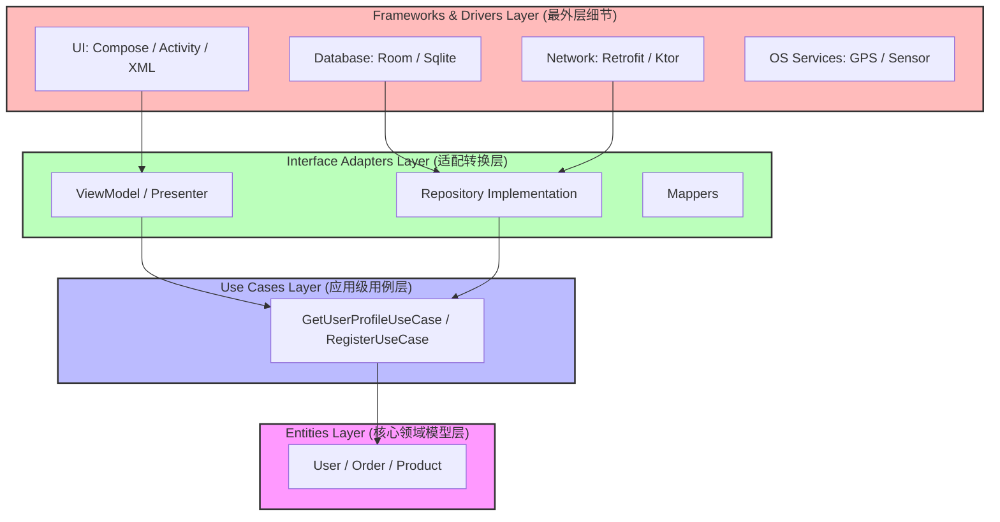
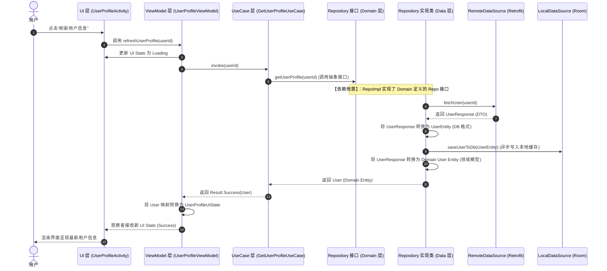

# 5.5.1.2. Clean Architecture (干净架构)

在 Android 开发的发展进程中，软件架构保持演进，经历了一条漫长且曲折的道路。从早期的“野蛮生长”时代（Activity/Fragment 承载一切的 MVC 模式，导致难以维护的“上帝类”），到中期以解耦 UI 和业务为目标的 MVP 模式，再到如今官方力推、结合 Jetpack 组件的 MVVM / MVI 架构。然而，随着项目规模的持续扩大和业务逻辑复杂度的急剧上升，开发者们逐渐发现，仅仅依靠 presentation（表现）层的架构模式，并不能彻底解决系统逻辑混乱、模块间强耦合、测试困难等核心痛点。

为了从根本上隔离技术细节与商业逻辑，提升软件系统的生命周期和健壮性，软件工程大师 Robert C. Martin（Uncle Bob）于 2012 年提出了 **Clean Architecture（干净架构/清洁架构）**。干净架构并不是一种局限于某种特定平台（如 Android 或 Web）的框架，而是一种**架构设计思想**。它的核心目的在于将系统的“商业规则”（核心业务逻辑）与“技术细节”（如数据库、网络库、UI 框架、操作系统特有服务等）进行彻底隔离，确保商业价值不随外界技术环境的摇摆而受损。

本篇文档将针对 Android 平台开发场景，对 Clean Architecture 进行深度系统性的剖析，涵盖底层设计哲学、四层拓扑结构与职责边界、跨层数据流向与依赖倒置（DIP）应用、多模块落地规范、工程实战案例以及常见误区权衡。

---

## 第一部分：Clean Architecture 干净架构核心概念

### 1. Robert C. Martin 的洋葱圈模型 (Onion Model)

Clean Architecture 通常用一个类似洋葱推出的多层同心圆结构来展示，每一层都代表软件系统中的不同职责和抽象等级。洋葱模型的中心是最核心、最稳定的业务规则，越往外侧，其技术细节的特异性和易变性就越高。



洋葱圈的四层拓扑从内到外依次为：
1. **Entities（实体层）**：最核心的商业逻辑和数据结构。
2. **Use Cases（用例层）**：应用特定的业务逻辑，负责协调实体来完成具体的应用流程。
3. **Interface Adapters（接口适配器层）**：负责内外层数据的桥接与转译，包括表现层、数据仓库层。
4. **Frameworks & Drivers（外部框架与驱动层）**：数据库、网络库、UI、操作系统 API 等具体底层实现细节。

### 2. 依赖规则 (Dependency Rule)

洋葱圈模型最核心、最不容侵犯的铁律是**依赖规则（Dependency Rule）**：

> **依赖只能由外向内单向倾斜，内圈的代码对圈外的任何东西都一无所知。**

这意味着：
- 位于内层圈的代码，绝对不能引用、提及或依赖外层圈中声明的任何类、方法、变量、库或框架。例如，最内层的 `Entities` 绝对不能知道任何关于网络请求（如 Retrofit）、数据库（如 Room）或者 UI 元素（如 View、ViewModel、Compose）的存在。
- 数据格式的定义同样受此规则约束。外层的数据格式（例如网络返回的 JSON 对象、数据库的 Table 实体）在跨越边界进入内层时，必须被转译为内层可理解的纯净格式（Domain Model）。
- 内层拥有极高的“抗震性”。当最外层的框架发生剧烈变动时（比如数据库由 Room 迁移到 SQLDelight，或者网络库由 Retrofit 更换为 Ktor），只要内层的契约保持稳定，核心业务逻辑就完全不需要做任何修改，实现了对“变化”的完美隔离。

### 3. 核心领域模型的纯洁性

在传统的 Android 开发模式中，很多团队习惯于采用“数据驱动”的思维：先设计本地 Room 数据库的 Entity，或者直接拿网络请求返回的 Data Transfer Object (DTO) 贯穿整条业务线，从底层 DataSource 一路传到 Activity 渲染。这种做法虽然在项目早期“高效省事”，但埋下了巨大的技术债：
- 当后端接口字段发生变更，或者本地数据库表结构进行迁移时，改动会瞬间像多米诺骨牌一样传递到 UI 展现层，引发全链路的破坏性修改。
- 业务逻辑和第三方库的注解（如 Room 的 `@Entity`，Moshi/Gson 的 `@SerializedName`）强绑定。如果未来项目要向 Kotlin Multiplatform (KMP) 跨平台演进，由于 Domain 模型混入了大量的 Android 平台独占依赖或 JVM 特定注解，跨平台迁移将变得举步维艰。

在 Clean Architecture 中，**领域模型（Domain Model/Entity）必须保持绝对的纯洁性**。它应该由纯 Kotlin/Java 基础类构建，不夹杂任何特定平台 SDK 的痕迹，也不受任何持久化或序列化框架的污染。它只服务于业务逻辑本身，是一套只在领域内部流动、高度自治的商业资产。

### 4. 干净架构与相似架构模式的深度比对

软件设计史上诞生过数种围绕“领域核心”展开的解耦架构模式，虽然它们命名不同，但其本质思想高度共鸣。我们可以将其进行横向对比，以更好地掌握 Clean Architecture 的通用性：

- **六边形架构 (Hexagonal Architecture / Ports and Adapters)**：
  由 Alistair Cockburn 提出。该架构将应用分为“内部”（应用与领域核心）和“外部”（外部工具与机制）。内外之间通过“端口（Ports）”和“适配器（Adapters）”进行桥接。
  - *对应关系*：干净架构中的 Domain 接口契约（如 Repository 接口）即为六边形中的“端口（Input/Output Ports）”，而最外层的 Retrofit、Room 实现则是“适配器（Adapters）”。两者都强调通过定义清晰的协议边界，阻止底层具体细节侵入上层核心逻辑。

- **洋葱架构 (Onion Architecture)**：
  由 Jeffrey Palermo 提出。它明确指出数据库和外部框架是软件架构的细节，它们必须位于最外层，核心领域模型应当位于最中心且完全不依赖任何外部层。洋葱架构的“控制反转（IoC）”特征更为显式。
  - *对应关系*：Robert C. Martin 的干净架构基本上吸纳了洋葱架构的层次模型，并用“依赖规则（Dependency Rule）”将其规范化，二者对于最内层 Domain 的稳定性和纯度要求完全一致。

- **尖叫架构 (Screaming Architecture)**：
  这同样是 Uncle Bob 提出的一个架构概念。它强调“**架构应当大声喊出你的应用的业务本质，而不是它所使用的技术框架**”。如果一个新开发者打开项目目录，第一眼看到的全部是 `controllers`、`views`、`adapters`、`db` 这样的文件夹，那么这套架构只喊出了“我是一个 Web 或 Android 应用”；而如果看到的是 `booking`、`payment`、`user`、`checkout` 这样的业务领域目录，它就清晰地尖叫出“我是一个打车或电商系统”。
  - *对应关系*：干净架构的 package-by-feature（按特性分包）物理设计与尖叫架构一脉相承，强调业务优先、商业逻辑优先，技术细节应当被退化为配角。

### 5. SOLID 原则在干净架构中的映射关系

Clean Architecture 实质上是面向对象设计的 **SOLID 原则**在系统架构维度的具象化呈现。我们能够清晰地在洋葱圈模型中找到这五大原则的对应关系：

- **单一职责原则 (SRP - Single Responsibility Principle)**：
  在干净架构中，每一个 UseCase 类都代表一个单一的、具体的用户场景（用例），例如 `LoginUseCase` 仅负责登录逻辑的编排。展示层的 ViewModel 仅负责 UI 状态的生成与交互意图的处理。数据层的 Repository 仅负责数据的持久化与存取。每一层、每一个类的职责边界都划定得极为清晰，极大地避免了传统架构中由于类功能重叠而导致的修改涟漪。
  
- **开闭原则 (OCP - Open/Closed Principle)**：
  当我们需要为应用增加一个新的功能用例时，我们只需要增加一个新的 UseCase 及其对应的 ViewModel 和 UI State，而完全不需要修改现有的 UseCase 逻辑。内层通过依赖外层定义的抽象接口来实现扩展性，系统对扩展开放，对修改关闭。
  
- **里氏替换原则 (LSP - Liskov Substitution Principle)**：
  Domain 层仅持有 Repository 的接口。这意味着，不论我们在 Data 层注入的是 `RoomUserRepositoryImpl`（本地数据库存储实现）、`RetrofitUserRepositoryImpl`（网络请求实现），还是用于单元测试的 `FakeUserRepositoryImpl`（内存伪实现），这些具体子类都必须能够无缝替换，且绝对不能破坏 Domain 层的任何前置和后置业务条件。
  
- **接口隔离原则 (ISP - Interface Segregation Principle)**：
  在 Domain 层中设计数据仓库（Repository）契约时，应避免设计一个包含几十个无关方法的巨型接口。更好的做法是按照业务领域的边界将其拆分为更细粒度接口。例如，不要把用户的资料管理、支付流水管理、消息通知接收全部堆砌在一个 `UserRepository` 中，而是应当拆分为 `UserProfileRepository`、`UserPaymentRepository` 和 `NotificationRepository`。这样可以保证 UseCase 在依赖 Repository 时，只关注自己确实需要的方法，从而解除不必要的编译关联。
  
- **依赖倒置原则 (DIP - Dependency Inversion Principle)**：
  高层模块（Domain 层的 UseCases）不应依赖低层模块（Data 层的持久化或网络），两者都应该依赖其抽象（Domain 层的 Repository 接口）。这不仅是洋葱圈模型的核心实现方式，也是保证 Domain 层免受具体框架污染、实现高内聚的核心技术手段。

---

## 第二部分：四层拓扑结构与职责边界

为了在 Android 实际工程中落地 Clean Architecture，我们必须明确每一层所承载的具体职责，以及层与层之间不可逾越的边界。

### 1. Entities（核心领域业务模型层）

Entities 层处于洋葱模型的最内层，是整个应用中**最稳定、生命周期最长**的部分。
- **职责**：Entities 代表的是企业级的核心商业规则或应用中最基础的数据模型。它不仅包含了基础的属性字段，还应当包含最通用的核心业务逻辑函数（例如：验证邮箱格式是否合法、计算折扣后的最终价格、评估账户是否处于冻结状态等）。
- **语言约束**：这一层必须是纯 Kotlin 或纯 Java 代码。
- **依赖限制**：
  - **绝对禁止**引入 Android SDK 的任何依赖（如 `android.os.Bundle`、`android.content.Context`、`android.view.View`）。
  - **绝对禁止**实现 Android 平台的 `Parcelable` 接口（若需要在 Activity 间通过 Intent 传递数据，该职责应当由 UI 层的 UI State 模型或 Data Class 承担，或使用 Kotlin 标准序列化 `@Serializable` 进行处理，而不应污染 Domain）。
  - **绝对禁止**引入任何特定的序列化框架（如 Gson, Jackson, Moshi）或 ORM 持久化框架（如 Room, Realm）的注解。
- **常见产物**：核心领域对象（如 `User`、`Account`、`Transaction`）、基础规则校验器。

### 2. Use Cases（用例 / 交互器 Interactor 层）

Use Cases 层围绕着 Entities，描述了应用特有的业务流程，是具体“用户场景”的实现载体。
- **职责**：It 负责编排数据流向 Entities，并指示 Entities 运用其核心商业规则来实现用例的业务目标。例如，“获取用户的个人资料，若用户是 VIP 则额外加载其专属特权列表，并根据本地配置决定是否下发首屏推荐”。在这个过程中，如何获取数据、如何进行 VIP 特权校验、如何编排推荐算法，都是 Use Cases 层的职责。
- **设计范式**：
  - **单一职责**：一个 Use Case 类应当且仅应当负责一个特定的业务动作。类名通常以动词+名词+UseCase（或 Interactor）结尾，如 `GetUserProfileUseCase`、`SubmitOrderUseCase`。
  - **无状态设计（Stateless）**：Use Case 应该是无状态的。它不应持有任何用于控制运行状态的可变成员变量。当被多个线程或协程并发调用时，应当保证线程安全。所有的上下文、入参都应通过方法调用传入，并直接返回结果。
  - **隐藏数据源细节**：Use Case 只面向抽象的 Repository 接口编程，它既不知道数据是从网络获取的，也不知道数据是从本地 Room 缓存中读取的。
- **依赖限制**：禁止引入 UI 相关的任何组件（如 ViewModel、Activity/Fragment 等）及底层的具体实现框架。

### 3. Interface Adapters（接口适配器层）

Interface Adapters 层处于外层技术细节和内层业务逻辑之间，扮演着“翻译官”的角色。它负责将用例和实体所使用的易于操作的数据格式，与外部框架（如 UI 或数据源）所使用的数据格式进行双向转换。
- **职责**：
  - **表现层适配（Presentation）**：在 Android 中最典型的实现就是 MVVM 中的 **ViewModel**。ViewModel 属于表现层（Presentation），它接收 UI 发送过来的事件或意图，将其转换为启动具体 Use Case 的指令；在获取到 Use Case 返回的 Domain 实体后，再将其转换为适合当前 UI 界面直接渲染的 UI State（如 `UserProfileUiState`），并以 `StateFlow` 或 `LiveData` 的形式暴露给 UI 观察。
  - **数据层适配（Data Repositories）**：**Repository 的实现类（RepositoryImpl）** 也坐落在此层。虽然 Repository 的接口声明（Interface）定义在内层的 Domain 中，但其具体的存取策略和实现逻辑却放在此层。RepositoryImpl 负责根据业务策略，决定是调用网络源还是本地数据库源，并将这些外层数据模型（DTO / Entity）翻译为 Domain 层通用的 Entity 实体。
  - **Mappers（映射器）**：实现 UI 模型与领域模型、领域模型与数据层模型之间的双向映射转换。

### 4. Frameworks & Drivers（外部框架与驱动层）

这是系统中最不稳定的一层，所有的“脏活累活”和具体的底层技术细节都堆积在这里。
- **职责**：
  - **UI 界面**：Activity、Fragment、Compose Composable 视图组件、XML 布局。它们唯一的任务就是渲染界面和捕获用户输入，绝对不应包含任何业务逻辑。
  - **持久化驱动**：Room Database、Dao 实现、SharedPreferences、DataStore、文件系统读写器。
  - **网络客户端**：Retrofit Service、OkHttpClient 实例、Ktor HTTP 客户端。
  - **系统级服务（Platform SDK）**：在 Android 平台中，诸如 GPS 定位获取、Sensor 陀螺仪监听、蓝牙连接、通知管理（NotificationManager）、后台任务调度（WorkManager）等，全部被归为外层的 Details（细节）。
- **边界隔离**：由于 Android SDK 版本变化非常频繁（关于权限、前台服务、启动限制等的不断收紧，详见 [AndroidVersionChangeLog.md](../../../../../AndroidVersionChangeLog.md)），如果直接在业务代码中调用这些系统服务，每次 Android 版本升级都会导致业务层大面积受灾。将这些系统 API 隔离在 Frameworks 层，并通过 Domain 定义的接口对外暴露，是确保应用能够平滑适配新 Android 版本的关键基石。

### 5. 跨层核心业务逻辑与技术细节的深度剖析

为了更好理解“什么属于业务，什么属于细节”，我们用两个实际开发中极具争议的场景进行技术剖析：

#### 场景一：数据缓存（Caching）逻辑应该落在何处？
- *争议*：既然要实现离线缓存，什么时候读本地、什么时候拉网络，这难道不是业务规则（UseCase）吗？
- *架构解法*：
  干净架构认为：决定**是否应当展示缓存**（例如：“因金融合规原因，展示的数据绝对不能过期超过 5 秒”）是商业规则，应当由 UseCase 负责判定。但是，**如何执行缓存的读取与写入**（例如：是通过 Room 写进 tb_cache 表，还是通过内存里的 LruCache 存取），则是纯粹的技术细节。
  在 Data 层，`UserRepositoryImpl` 具体实现 Cache-Aside 等缓存策略，利用 Room 数据库完成这一技术运作。

#### 场景二：用户 Token 刷新机制应该落在何处？
- *争议*：当网络请求返回 401 Unauthorized 时，需要触发刷新 Token 流程。这是否应当作为 UseCase 处理？
- *架构解法*：
  网络鉴权和 OAuth 握手在协议层面属于纯粹的外层通信细节。因此，自动刷新 Token 的逻辑应当在 Frameworks 层的网络组件中闭环处理（例如：在 OkHttp 的 `Authenticator` 或 `Interceptor` 中静默完成 401 拦截并调用 Refresh 接口）。
  然而，如果刷新 Token 失败，需要**强行退出登录并清空本地全部用户账号状态**，这一“登出决策”则是绝对的商业逻辑。此时，底层的 Interceptor 应当抛出一个特定的安全异常（如 `SessionExpiredException`），该异常被 Repository 捕获并向上传递至 UseCase。最终由专门的 `LogoutUseCase` 去编排清理核心领域模型、通知通知管理器发布离线广播，实现全局退出的商业规约。

---

## 第三部分：跨层数据流向与模型映射 (Data Flow & Dependency Inversion)

在干净架构中，理解**运行时数据流（Runtime Data Flow）**与**物理依赖方向（Static Dependency Flow）**的差异至关重要。

### 1. 数据流向与依赖倒置原则 (DIP)

在典型的业务调用中，数据在运行时的流向是从用户操作开始，穿过各层直达底层数据源，再反向折返回 UI 界面。然而，在编译期，物理依赖关系绝对不能像运行时数据流那样“直来直去”，否则就会造成严重的双向耦合。

我们必须借助面向对象设计原则中的**依赖倒置原则（Dependency Inversion Principle, DIP）**，通过接口（Interface）来反转物理依赖的方向。

```
【运行时数据流】
[UI (Activity)] ──> [ViewModel] ──> [UseCase] ──> [Repository 接口] ──> [RepositoryImpl] ──> [RemoteDataSource]
                                                             
【静态编译依赖流】
[UI (Activity)] ──> [ViewModel] ──> [UseCase] ──> [Repository 接口] 
                                                         ▲
                                                         │ (实现/依赖)
                                                  [RepositoryImpl] ──> [RemoteDataSource]
```

- **Domain 层的资产**：在 Domain 层中，我们定义了 `UserRepository` 接口。这个接口是 Domain 层的资产，完全根据业务逻辑的需要来设计方法定义（例如：`suspend fun getUserInfo(id: String): User`）。
- **Data 层的实现**：Data 层中的 `UserRepositoryImpl` 类实现了 `UserRepository` 接口。因为要实现这个接口，Data 模块必须在物理依赖上依赖 Domain 模块，而不是 Domain 模块去依赖 Data 模块。
- **DIP 的威力**：如此一来，Use Case 只需要调用 `UserRepository` 的抽象方法，而无需关注具体的实现细节。在运行时，依赖注入框架（如 Hilt/Dagger）会将 Data 层的 `UserRepositoryImpl` 实例注入到 Use Case 中。物理依赖方向与运行时的控制流方向完全相反，这就是“依赖倒置”的精髓。

### 2. 三大模型隔离机制

为了彻底断绝各层级之间的强耦合，必须对数据模型进行严格的隔离。在 Clean Architecture 下，一个标准 Feature 通常包含三种相互隔离的数据模型：

| 模型类型 | 所在层次 | 职责目的 | 特点与约束 |
| :--- | :--- | :--- | :--- |
| **Domain Model (领域模型)** | Domain 层 | 表达最纯粹的业务实体与规则。 | 纯 Kotlin 类，无任何第三方库注解（如 Room/Gson），包含业务校验或计算方法。 |
| **Data Entity (数据实体/DTO)** | Data 层 | 对应特定的持久化存储格式或网络契约。 | 包含 `@Entity` (Room)、`@SerializedName` / `@Serializable` 等注解，字段结构受服务器 API 或本地表结构约束。 |
| **UI State / UI Model (视图状态)** | UI / Presentation 层 | 针对特定屏幕的 UI 渲染和交互定制。 | 包含格式化后的字符串、控件的显示/隐藏状态（Boolean）、加载状态（LCE：Loading/Content/Error）等。 |

### 3. 模型相互转化 (Mapper) 的性能与代码臃肿取舍

由于引入了三大模型隔离机制，必然带来一个无法回避的工程痛点：**Mapper 膨胀**。每次获取数据，都需要进行 `Data Entity -> Domain Model -> UI State` 的多级转换。

#### 为什么必须写 Mapper？
如果不做 Mapping，直接在 UI 层或者 Domain 层复用 Room Entity 或 Retrofit Response DTO：
- 后端接口一旦微调（例如某个字段由 `int` 变为 `string`，或者字段重命名），编译器无法在编译期捕获这一变化对 UI 层的影响，极易引发线上崩溃。
- 本地 Room 数据库升级迁移时，UI 层的渲染逻辑必须停工等待表结构改造完毕，严重违背了“并行开发”和“低耦合”的初衷。

#### 性能开销分析与 Android 运行时演进
频繁的对象创建与 Mapping 转换，会在 JVM/ART 堆内存中产生大量生命周期极其短暂的临时对象。
- 在早期的 **Dalvik 虚拟机** 时代，频繁的短命对象分配容易快速撑满年轻代内存，从而触发 Stop-the-world 的 Garbage Collection (GC) 垃圾回收。这会导致主线程被频繁挂起，引起 UI 显著的掉帧和卡顿。
- 在现代的 **ART 运行时** 下（自 Android 5.0 启用 ART，并在 Android 8.0 引入并发拷贝 GC 算法，详见 [AndroidVersionChangeLog.md](../../../../../AndroidVersionChangeLog.md)），垃圾回收机制得到了极大优化。ART 采用的 Generational CC（分代并发拷贝收集器）和局部短生命周期对象分配（TLAB）使得微小的对象映射开销在绝大多数普通业务中已经微乎其微。

虽然现代 ART 极大地缓解了临时对象分配的压力，但针对一些特殊场景，优化转换逻辑仍然是开发人员需要关注的重点。

*性能优化建议*：对于列表高频滚动、视频弹幕渲染、传感器高频数据回调等对响应时间极其敏感的场景，应当避免进行深度的多层 Mapping 转换。此时，可以考虑使用 Kotlin 的 `value class`（内联类）来减少包装对象的生成，或者在数据层提供直接针对特定展现格式的局部过滤通道。

#### Mapping 策略深度比对

在 Android 实际工程中，模型转换通常有三种实现路线，团队在架构设计时可以按需权衡：

1. **手写 Kotlin 扩展函数 (Extension Functions)**：
   - *实现方式*：如 `fun UserResponse.toDomain() = User(...)`。
   - *优点*：简单直接，完全由静态编译解析，运行性能极高；类型安全，重构极其友好。
   - *缺点*：需要手动编写大量字段一一对应的映射代码，容易产生乏味的体力活。
   - *适用场景*：绝大多数中大型 Android 项目的首选方式（**强烈推荐**）。

2. **使用编译期生成库 (如 MapStruct)**：
   - *实现方式*：通过定义注解和接口，利用注解处理器（APT/KSP）在编译期间自动生成对应的映射实现字节码。
   - *优点*：大幅减少样板代码，规避人工编写出错的可能性。
   - *缺点*：引入了额外的编译期开销，KSP 配置有时较为琐碎，对 Kotlin 的扩展函数支持不及纯 Java 友好。
   - *适用场景*：字段规模极其庞大、表结构与领域模型字段大面积雷同的项目。

3. **基于反射的动态映射 (如 ModelMapper)**：
   - *实现方式*：在运行时通过反射（Reflection）动态读取字段并进行同名拷贝。
   - *优点*：几乎零代码量，极其省心。
   - *缺点*：严重耗费运行时性能，反射在 Android ART 下执行缓慢，且极易因混淆配置（ProGuard）导致同名匹配在混淆后失效而抛出 NullPointerException。
   - *适用场景*：**Android 平台绝对禁用**。

#### 线程分配与渲染性能（Jank）避免
Android 的 Main 线程（UI 线程）负责页面的测量、布局和绘制（刷新频率为 60Hz~120Hz，即单帧耗时必须限制在 16ms~8.3ms 以内）。如果在 UI 线程上对包含上千条数据的数据集进行大范围的模型转换（Mapping），势必会导致严重的掉帧（Jank）。

因此，必须利用 Kotlin 协程对转换计算进行合理的调度：
- **数据源获取与初期 Mapping**：在数据层中，将 I/O 操作及网络 DTO 向持久化实体的转换约束在 `Dispatchers.IO` 中执行。
- **业务领域编排与复杂计算**：在 UseCase 层中，处理核心业务规则和数据过滤映射时，统一使用 `withContext(Dispatchers.Default)`。`Dispatchers.Default` 背后是一个针对多核 CPU 优化的线程池，能最大化榨取硬件性能，同时避免阻塞 UI 线程。
- **表现层转换**：在 ViewModel 内部将 Domain 实体转换成特定 UI State 时，若数据集较大，同样应当将其抛入 `Dispatchers.Default` 中异步处理，确保 Main 线程仅负责将最终生成的 Immutable UI State 渲染至屏幕上。

#### 团队工程学权衡
在实际落地过程中，开发者可以根据项目的实际体量选择不同的转换策略：
- **全隔离策略（严格 Clean）**：严格执行三套 Model。虽然模板代码多，但能够提供最极致的解耦，适合大型团队协作、业务复杂度高、生命周期长（3 年以上）的战略级 App 项目。
- **部分复用策略（务实 Clean）**：如果业务非常简单（例如纯 CRUD 录入系统），且本地数据库表设计完全由客户端主导，可以允许 Domain Model 和 Data Entity 在一定程度上合并，但在 UI 层依然强制使用独立的 UI State 进行隔离。这是一种在开发效率和架构整洁度之间的折中方案。

---

## 第四部分：模块化与依赖方向规范 (Multi-Module in Android)

在单模块（Single-Module）工程中，架构规约往往只能停留在“口头约定”或“文档规范”上。即使规定了 `Domain` 不能依赖 `Data`，在赶业务进度时，开发者依然可以轻易地在 Domain 包下调用 Data 层的实现类，因为编译器对此绿灯通行。

为了让架构规则具备**强制约束力**，在 Android 中落地 Clean Architecture 时，最佳实践是推行**物理多模块化（Multi-Module）**。

### 1. 物理依赖单向链路图

对于大型组件化 Android 项目，典型的 Feature 模块结构设计如下：

```
                    ┌────────────────────────┐
                    │       :app 模块        │ (全局组装与依赖注入)
                    └──────────┬──────────┬──┘
                               │          │
        ┌──────────────────────▼──┐    ┌──▼──────────────────────┐
        │    :feature:user:ui     │    │    :feature:user:data    │ (包含 Room/Retrofit)
        └──────────────┬──────────┘    └──┬──────────────────────┘
                       │                  │
                       │   ┌──────────────▼───────────┐
                       └───►   :feature:user:domain   │ (纯 Kotlin 模块, 无 Android 依赖)
                           └──────────────────────────┘
```

- **`:feature:user:domain`**：最底层的物理模块。它是一个纯 JVM/Kotlin 模块（在 `build.gradle` 中应用 `plugins { id("java-library"); id("org.jetbrains.kotlin.jvm") }`），**绝对禁止**应用 `com.android.library` 插件。这意味着在编译期它就完全无法访问任何 Android SDK API 和外部三方网络/数据库库，从物理上隔绝了污染的可能。
- **`:feature:user:data`**：依赖 `:feature:user:domain`。由于需要调用网络和数据库，它可以是一个 Android Library 模块，在这里实现 domain 定义的 Repository 接口。
- **`:feature:user:ui`**：依赖 `:feature:user:domain`。它是 Android Library 模块，包含 ViewModel、Fragment、Activity 或 Compose 视图，用于展现界面。
- **`:app` 模块**：作为全局配置的“粘合剂”，同时依赖 UI 与 Data 模块。它负责运行 Hilt/Dagger 依赖注入，将 Data 层的 RepositoryImpl 注入给 UI 层或用例层所声明的依赖项。

### 2. 物理模块工程配置文件实例

为了能够清晰展现这种物理隔离的强制拦截方式，我们来看一下这三个模块分别对应的 `build.gradle.kts` 骨架配置：

**1) Domain 模块 (`:feature:user:domain:build.gradle.kts`)**
```kotlin
plugins {
    id("java-library")              // 声明为纯 Java/Kotlin 标准库，不涉及 Android 平台
    id("org.jetbrains.kotlin.jvm")  // 仅使用 JVM 编译插件
}

java {
    sourceCompatibility = JavaVersion.VERSION_17
    targetCompatibility = JavaVersion.VERSION_17
}

dependencies {
    // 仅依赖 Kotlin 标准库与语言级并发协程库，完全没有 Android 平台及 Room/Retrofit 依赖
    implementation("org.jetbrains.kotlin:kotlin-stdlib:1.9.0")
    implementation("org.jetbrains.kotlinx:kotlinx-coroutines-core:1.7.3")
}
```

**2) Data 模块 (`:feature:user:data:build.gradle.kts`)**
```kotlin
plugins {
    id("com.android.library")       // 声明为 Android Library，可以使用 Android 组件
    id("org.jetbrains.kotlin.android")
    id("kotlin-kapt")
}

android {
    namespace = "com.example.feature.user.data"
    compileSdk = 34
    // ... 其他 Android 基础配置
}

dependencies {
    // 1. 物理上依赖 domain 模块，用来实现其接口并获取 Entity
    implementation(project(":feature:user:domain"))

    // 2. 引入具体的实现细节类库：Room 和 Retrofit
    implementation("androidx.room:room-runtime:2.6.1")
    kapt("androidx.room:room-compiler:2.6.1")
    implementation("com.squareup.retrofit2:retrofit:2.9.0")
    implementation("org.jetbrains.kotlinx:kotlinx-serialization-json:1.5.1")
}
```

**3) UI 表现层模块 (`:feature:user:ui:build.gradle.kts`)**
```kotlin
plugins {
    id("com.android.library")
    id("org.jetbrains.kotlin.android")
}

android {
    namespace = "com.example.feature.user.ui"
    compileSdk = 34
    // ...
}

dependencies {
    // 1. 物理上依赖 domain 模块，用于调用 UseCase 和 Domain Model
    implementation(project(":feature:user:domain"))
    
    // 2. 注意：这里绝对不能依赖 :feature:user:data，从而在编译期杜绝直接调用 Repository 具体的实现类

    // 3. 引入 UI 渲染相关的特定框架
    implementation("androidx.lifecycle:lifecycle-viewmodel-ktx:2.6.2")
    implementation("androidx.compose.ui:ui:1.5.4")
    implementation("androidx.compose.material3:material3:1.1.2")
}
```

### 3. 多模块架构下的依赖注入 (Dependency Injection) 设计

在一个彻底解耦的 Clean Architecture 多模块体系下，我们必然会遇到一个经典的设计挑战：
> 既然 UI 模块（`:feature:user:ui`）在编译期完全无法引用 Data 模块（`:feature:user:data`），那么在运行时，UI 层的 ViewModel 到底该如何拿到 Data 层所实现的 `UserRepositoryImpl` 实例呢？

我们无法直接在 `:feature:user:ui` 模块中写出类似 `bind UserRepositoryImpl` 的代码，因为在编译期这行代码根本找不到具体的实现类。

解决这个问题的标准做法是**依赖注入的分流与汇聚设计**。这里以官方主推的 **Hilt (Dagger)** 为例：

1. **接口使用与声明**：
   在 `:feature:user:domain` 中声明抽象接口 `UserRepository`。在 `:feature:user:ui` 中的 `UserProfileViewModel` 中，其构造函数声明依赖抽象接口 `UserRepository`（或 `GetUserProfileUseCase`）。
   
2. **实现与装配**：
   在 `:feature:user:data` 模块中实现 `UserRepositoryImpl`。同时，在 Data 模块内部编写一个 Dagger Module，用于声明具体的绑定契约。但请注意，由于 Hilt 采用全局依赖树组装机制，所有的注入关系最终需要在 `:app`（壳工程）中完成最终的依赖图整合（Codegen 编译期代码生成）。
   
3. **DI 注入配置（由壳模块或独立的 :di 模块聚合）**：
   在 `:feature:user:data` 中配置注入的绑定模块：
   ```kotlin
   package com.example.feature.user.data.di

   import com.example.feature.user.data.repository.UserRepositoryImpl
   import com.example.feature.user.domain.repository.UserRepository
   import dagger.Binds
   import dagger.Module
   import dagger.hilt.InstallIn
   import dagger.hilt.components.SingletonComponent
   import javax.inject.Singleton

   @Module
   @InstallIn(SingletonComponent::class)
   abstract class UserDataModule {

       @Binds
       @Singleton
       abstract fun bindUserRepository(
           userRepositoryImpl: UserRepositoryImpl
       ): UserRepository
   }
   ```
   由于 `:app` 模块在 `build.gradle.kts` 中同时通过 `implementation(project(":feature:user:ui"))` 和 `implementation(project(":feature:user:data"))` 引入了两个模块，Hilt 的编译器在扫描整个项目的类路径时，会自动将 `UserDataModule` 的绑定规则读取，并在 `:app` 编译时生成最终的依赖注入装配类。在运行时，当 Activity 启动需要 ViewModel 时，Hilt 就会跨越物理边界，将 Data 模块中实例化的 `UserRepositoryImpl` 成功传递给 UI 模块的 ViewModel。

### 4. 物理分模块对构建速度与依赖图维护的工程红利

实行干净架构的物理多模块化，除了在代码规范上提供了编译器强制拦截外，对于大型 Android 团队的**构建性能（Build Performance）**和**代码审查（Code Review）**同样具有里程碑式的意义：

- **增量编译加速（Gradle Build Caching）**：
  在大型工程中，编译速度是开发体验的头等大事。由于我们将 `:domain` 拆分为了纯 JVM 库，它编译时不需要拉起耗时的 Android 编译框架（AAPT2 资源编译、R 类生成、Dex 转换等），且内部无外部依赖，其构建耗时极低。当 UI 层发生排版修改或新增 UI 页面时，由于依赖流是单向的，Gradle 编译引擎可以完美命中 `:domain` 和 `:data` 的缓存（Cache Hit），仅对发生改动的 UI 模块进行增量编译。这相较于传统的单 Module 大包编译，能节省 50% 以上的日常开发编译耗时。
  
- **精细化 Gradle 依赖树维护**：
  因为各模块分工明确，我们可以利用 Gradle 的 `implementation` 替代 `api` 关键字。这能确保底层类库的修改不会向上层进行“变动泄露”。同时，这降低了依赖图的复杂度，使得在解决三方库版本冲突（如 `protobuf` 或 `kotlinx-coroutines` 的版本不一致）时，可以通过局部的模块依赖声明轻松闭环解决，不必担心牵一发而动全身。

### 5. CI 静态检测与依赖拦截机制

如果项目没有拆分得如此彻底，或者由于历史原因无法做深度的物理模块拆分，我们可以通过静态分析工具在 CI/CD 流程中对越权依赖进行强制拦截。

#### 方案 A：使用 ArchUnit 进行架构单元测试

[ArchUnit](https://www.archunit.org/) 是一个免费、简单且功能强大的 Java/Kotlin 架构测试库。它可以通过编写特殊的“单元测试”来分析项目编译后的字节码，从而验证包与包、模块与模块之间的依赖规则。

首先，在工程的测试模块 `build.gradle.kts` 中引入依赖：

```kotlin
testImplementation("com.tngtech.archunit:archunit:1.2.0")
```

然后，编写一个专门验证 Clean Architecture 依赖规则的单元测试类：

```kotlin
import com.tngtech.archunit.core.importer.ClassFileImporter
import com.tngtech.archunit.lang.syntax.ArchRuleDefinition.classes
import org.junit.Test

class ArchitectureRulesTest {

    @Test
    fun `domain_layer_should_not_depend_on_data_or_ui_layers`() {
        // 导入编译后的类文件进行分析
        val importedClasses = ClassFileImporter().importPackages("com.example.myapp")

        // 定义规则：所有位于 domain 包下的类，绝对不能依赖 data 或 presentation(ui) 包下的任何类
        val rule = classes()
            .that().resideInAPackage("..domain..")
            .should().onlyDependOnClassesThat()
            .resideInAnyPackage(
                "..domain..",         // 自身领域层
                "java..",             // JDK 标准类库
                "kotlin..",           // Kotlin 标准类库
                "kotlinx.coroutines.." // 允许的协程库（作为语言级并发扩展）
            )

        // 验证规则
        rule.check(importedClasses)
    }

    @Test
    fun `usecases_should_only_be_accessed_by_presentation_or_other_usecases`() {
        val importedClasses = ClassFileImporter().importPackages("com.example.myapp")

        // 规则：UseCase 只能被 presentation 表现层或其他的 UseCase 调用，底层 Data 模块禁止直接反向调用 UseCase
        val rule = classes()
            .that().resideInAPackage("..domain.usecase..")
            .should().onlyBeAccessed().byAnyPackage("..presentation..", "..domain.usecase..", "..di..")

        rule.check(importedClasses)
    }
}
```

在 CI 构建流程中，我们只需执行命令 `./gradlew test`。一旦有开发人员破坏了干净架构的单向依赖链，上述单元测试就会报错，CI 流程被阻断，从而有效防止了架构退化。

#### 方案 B：Gradle 依赖约束拦截

在根目录的 `build.gradle.kts` 中，可以编写一个自定义 Task 或在 `gradle.projectsEvaluated` 阶段进行全局校验，检测各子模块之间的依赖声明是否违规。例如，如果发现某个包含 `domain` 字样的子项目，在其 `dependencies` 依赖配置中引入了 `data` 模块，或者引入了类似 `com.squareup.retrofit2` 的外部库，直接使 Gradle 配置阶段失败并抛出异常，在最前端阻止违规代码的合并。

---

## 第五部分：工程实战案例与避坑指南

为了更直观地展现 Clean Architecture 在 Android 项目中的具体形态，我们将以一个经典的业务场景——“获取用户信息并展示”为例，呈现完整的工程包结构、运行时时序以及核心 Kotlin 代码。

### 1. 包结构设计 (Package Structure)

在干净架构中，推荐采用**按特性分包（Package by Feature）**与**按层分包（Package by Layer）**结合的混合结构。以下是 `:feature:user` 模块下的推荐目录组织：

```
com.example.feature.user
│
├── domain                  // 1. 领域层（纯 Kotlin，高内聚业务逻辑）
│   ├── model
│   │   └── User.kt         // 核心业务模型
│   ├── repository
│   │   └── UserRepository.kt // 数据仓库契约接口
│   └── usecase
│       └── GetUserProfileUseCase.kt // 单一职责用例
│
├── data                    // 2. 数据层（网络、数据库实现细节）
│   ├── model
│   │   ├── UserResponse.kt // Retrofit 网络 DTO
│   │   └── UserEntity.kt   // Room 数据库 Entity
│   ├── source
│   │   ├── UserLocalDataSource.kt
│   │   └── UserRemoteDataSource.kt
│   ├── mapper
│   │   └── UserMapper.kt   // 数据模型转换器
│   └── repository
│       └── UserRepositoryImpl.kt // 仓库的具体实现
│
└── presentation            // 3. 表现层（UI 渲染与视图状态控制）
    ├── model
    │   └── UserProfileUiState.kt // 页面视图状态
    ├── viewmodel
    │   └── UserProfileViewModel.kt // 状态机与业务调度
    └── view
        └── UserProfileActivity.kt // 纯 UI 页面容器
```

### 2. 运行时数据流时序 (Runtime Sequence)

在上述结构下，当用户触发“刷新个人资料”的操作时，系统各层级之间的交互和数据流向如下所示：



### 3. 核心 Kotlin 代码实现

以下是该业务场景下，各个核心类的完整 Kotlin 代码实现。

#### 3.1 Domain（领域层）

**领域实体类：`User.kt`**
```kotlin
package com.example.feature.user.domain.model

/**
 * 核心领域模型：代表用户实体。
 * 保持纯净，没有任何 Android 依赖或第三方序列化注解。
 */
data class User(
    val id: String,
    val username: String,
    val email: String,
    val avatarUrl: String,
    val vipLevel: Int,
    val registrationTimestamp: Long
) {
    // 包含最纯粹的核心业务判定逻辑，不依赖外界环境
    val isVip: Boolean
        get() = vipLevel > 0

    val isAccountMature: Boolean
        get() = (System.currentTimeMillis() - registrationTimestamp) > 365L * 24 * 60 * 60 * 1000
}
```

**仓库接口：`UserRepository.kt`**
```kotlin
package com.example.feature.user.domain.repository

import com.example.feature.user.domain.model.User
import kotlinx.coroutines.flow.Flow

/**
 * 数据仓库接口定义。
 * 它属于 Domain 层的资产，具体实现在 Data 层。
 */
interface UserRepository {
    suspend fun getUserProfile(userId: String): Result<User>
    fun getCachedUserProfile(userId: String): Flow<User?>
}
```

**核心用例：`GetUserProfileUseCase.kt`**
```kotlin
package com.example.feature.user.domain.usecase

import com.example.feature.user.domain.model.User
import com.example.feature.user.domain.repository.UserRepository
import kotlinx.coroutines.Dispatchers
import kotlinx.coroutines.withContext

/**
 * 单一职责用例：获取用户信息。
 * 注入 Repository 抽象接口，实现依赖倒置。
 */
class GetUserProfileUseCase(
    private val userRepository: UserRepository
) {
    /**
     * 重载 invoke 运算符，使 UseCase 实例可以像函数一样被直接调用。
     * 在 Dispatchers.Default 协程调度器上执行计算密集型的业务编排，保证 UI 线程不卡顿。
     */
    suspend operator fun invoke(userId: String): Result<User> = withContext(Dispatchers.Default) {
        if (userId.isBlank()) {
            return@withContext Result.failure(IllegalArgumentException("用户 ID 不能为空"))
        }
        
        // 编排数据获取逻辑
        userRepository.getUserProfile(userId)
    }
}
```

#### 3.2 Data（数据层）

**网络 DTO 模型：`UserResponse.kt`**
```kotlin
package com.example.feature.user.data.model

import kotlinx.serialization.SerialName
import kotlinx.serialization.Serializable

/**
 * 网络请求返回的数据传输对象 (DTO)。
 * 字段完全由后端 API 契约决定。
 */
@Serializable
data class UserResponse(
    @SerialName("uid") val uid: String,
    @SerialName("user_name") val userName: String,
    @SerialName("email_address") val emailAddress: String,
    @SerialName("avatar_path") val avatarPath: String,
    @SerialName("vip_status_code") val vipStatusCode: Int,
    @SerialName("create_time") val createTime: Long
)
```

**本地数据库 Entity：`UserEntity.kt`**
```kotlin
package com.example.feature.user.data.model

import androidx.room.ColumnInfo
import androidx.room.Entity
import androidx.room.PrimaryKey

/**
 * 本地 Room 数据库存储模型。
 * 字段受本地持久化和检索性能要求约束。
 */
@Entity(tableName = "tb_user_profile")
data class UserEntity(
    @PrimaryKey val id: String,
    @ColumnInfo(name = "username") val username: String,
    @ColumnInfo(name = "email") val email: String,
    @ColumnInfo(name = "avatar_url") val avatarUrl: String,
    @ColumnInfo(name = "vip_level") val vipLevel: Int,
    @ColumnInfo(name = "created_at") val createdAt: Long
)
```

**模型转换器：`UserMapper.kt`**
```kotlin
package com.example.feature.user.data.mapper

import com.example.feature.user.data.model.UserEntity
import com.example.feature.user.data.model.UserResponse
import com.example.feature.user.domain.model.User

/**
 * Mappers：实现各种数据模型之间的纯静态单向转译函数。
 */
fun UserResponse.toDomain(): User {
    return User(
        id = this.uid,
        username = this.userName,
        email = this.emailAddress,
        avatarUrl = this.avatarPath,
        vipLevel = this.vipStatusCode,
        registrationTimestamp = this.createTime
    )
}

fun UserResponse.toEntity(): UserEntity {
    return UserEntity(
        id = this.uid,
        username = this.userName,
        email = this.emailAddress,
        avatarUrl = this.avatarPath,
        vipLevel = this.vipStatusCode,
        createdAt = this.createTime
    )
}

fun UserEntity.toDomain(): User {
    return User(
        id = this.id,
        username = this.username,
        email = this.email,
        avatarUrl = this.avatarUrl,
        vipLevel = this.vipLevel,
        registrationTimestamp = this.createdAt
    )
}
```

**仓库具体实现：`UserRepositoryImpl.kt`**
```kotlin
package com.example.feature.user.data.repository

import com.example.feature.user.data.mapper.toDomain
import com.example.feature.user.data.mapper.toEntity
import com.example.feature.user.data.source.UserLocalDataSource
import com.example.feature.user.data.source.UserRemoteDataSource
import com.example.feature.user.domain.model.User
import com.example.feature.user.domain.repository.UserRepository
import kotlinx.coroutines.flow.Flow
import kotlinx.coroutines.flow.map

/**
 * 仓库层的具体实现。
 * 决定具体的数据获取策略：优先读网络，成功后写入本地 Room，最后向上输出 domain 模型。
 */
class UserRepositoryImpl(
    private val remoteDataSource: UserRemoteDataSource,
    private val localDataSource: UserLocalDataSource
) : UserRepository {

    override suspend fun getUserProfile(userId: String): Result<User> {
        return try {
            val response = remoteDataSource.fetchUserProfile(userId)
            if (response.isSuccessful && response.body() != null) {
                val dtoString = response.body()!!
                
                // 数据转换与本地落库缓存（只在数据层内部流动外层数据模型）
                localDataSource.saveUserProfile(dtoString.toEntity())
                
                // 向上返回 Domain Model，实现外部接口阻断
                Result.success(dtoString.toDomain())
            } else {
                // 网络失败，尝试降级读取本地缓存
                val cached = localDataSource.getUserProfile(userId)
                if (cached != null) {
                    Result.success(cached.toDomain())
                } else {
                    Result.failure(Exception("获取用户信息失败且本地无缓存"))
                }
            }
        } catch (e: Exception) {
            Result.failure(e)
        }
    }

    override fun getCachedUserProfile(userId: String): Flow<User?> {
        return localDataSource.observeUserProfile(userId).map { entity ->
            entity?.toDomain()
        }
    }
}
```

#### 3.3 Presentation & UI（表现层与视图层）

**表现层状态模型：`UserProfileUiState.kt`**
```kotlin
package com.example.feature.user.presentation.model

/**
 * UI State：承载视图渲染的唯一可信数据源。
 * 区分 Loading, Success, Error 各种状态，专门为界面排版设计。
 */
sealed interface UserProfileUiState {
    object Loading : UserProfileUiState
    
    data class Success(
        val displayUsername: String,
        val formattedEmail: String,
        val avatarUrl: String,
        val shouldShowVipBadge: Boolean,
        val registrationDays: String
    ) : UserProfileUiState
    
    data class Error(val errorMessage: String) : UserProfileUiState
}
```

**表现层 ViewModel：`UserProfileViewModel.kt`**
```kotlin
package com.example.feature.user.presentation.viewmodel

import androidx.lifecycle.ViewModel
import androidx.lifecycle.viewModelScope
import com.example.feature.user.domain.model.User
import com.example.feature.user.domain.usecase.GetUserProfileUseCase
import com.example.feature.user.presentation.model.UserProfileUiState
import kotlinx.coroutines.flow.MutableStateFlow
import kotlinx.coroutines.flow.StateFlow
import kotlinx.coroutines.flow.asStateFlow
import kotlinx.coroutines.launch
import java.util.concurrent.TimeUnit

/**
 * 表现层 ViewModel：接收交互事件，触发 Use Case，并将 Domain Model 转化为 UI State。
 */
class UserProfileViewModel(
    private val getUserProfileUseCase: GetUserProfileUseCase
) : ViewModel() {

    private val _uiState = MutableStateFlow<UserProfileUiState>(UserProfileUiState.Loading)
    val uiState: StateFlow<UserProfileUiState> = _uiState.asStateFlow()

    fun loadUserProfile(userId: String) {
        viewModelScope.launch {
            _uiState.value = UserProfileUiState.Loading
            getUserProfileUseCase(userId)
                .onSuccess { domainUser ->
                    _uiState.value = mapDomainToUiState(domainUser)
                }
                .onFailure { exception ->
                    _uiState.value = UserProfileUiState.Error(exception.message ?: "未知错误")
                }
        }
    }

    // 将纯业务的 Domain 实体翻译为对 UI 极度友好的 UI State
    private fun mapDomainToUiState(user: User): UserProfileUiState.Success {
        val days = TimeUnit.MILLISECONDS.toDays(
            System.currentTimeMillis() - user.registrationTimestamp
        )
        return UserProfileUiState.Success(
            displayUsername = "@${user.username}",
            formattedEmail = "联系方式: ${user.email}",
            avatarUrl = user.avatarUrl,
            shouldShowVipBadge = user.isVip,
            registrationDays = "已注册入驻 ${days} 天"
        )
    }
}
```

#### 3.4 Dependency Injection（依赖注入）

**DI 配置模块：`UserModule.kt`**
```kotlin
package com.example.feature.user.di

import com.example.feature.user.data.repository.UserRepositoryImpl
import com.example.feature.user.data.source.UserLocalDataSource
import com.example.feature.user.data.source.UserRemoteDataSource
import com.example.feature.user.domain.repository.UserRepository
import com.example.feature.user.domain.usecase.GetUserProfileUseCase

/**
 * 依赖注入声明（示意性质，可使用 Hilt/Koin）。
 * 将外层的具体实现绑定到内层定义的抽象契约上。
 */
object UserModule {

    fun provideUserRepository(
        remoteDataSource: UserRemoteDataSource,
        localDataSource: UserLocalDataSource
    ): UserRepository {
        // 返回接口类型，其实际实例为具体的实现类
        return UserRepositoryImpl(remoteDataSource, localDataSource)
    }

    fun provideGetUserProfileUseCase(
        userRepository: UserRepository
    ): GetUserProfileUseCase {
        return GetUserProfileUseCase(userRepository)
    }
}
```

---

## 避坑指南与常见误区

### 误区一：过度设计与“空壳用例” (Anemic UseCase)

**问题现象**：
很多团队在推广 Clean Architecture 时陷入原条主义的陷阱，强制要求“不管业务再简单，哪怕只是本地查个配置、做一个基本的 CRUD，也必须层层嵌套编写 Use Case”。导致工程中出现了海量的空壳类：
```kotlin
class GetConfigUseCase(private val configRepository: ConfigRepository) {
    suspend operator fun invoke() = configRepository.getConfig()
}
```
这导致项目结构冗杂不堪，徒增开发和代码跟踪成本，却没有实现任何实质上的逻辑隔离。

要处理这种由于架构洁癖带来的代码膨胀问题，团队应当在开发初期就制定出务实的规则约束。

*核心策略建议*：
架构应当为生产力服务。如果某个页面的数据读取纯属无脑透传（如纯静态展示的配置项），无任何合并、计算、分支判断、以及状态编排，可以允许表现层 ViewModel 绕过 Use Case，直接调用 Repository。
但是，一旦业务逻辑中出现任何逻辑分支（如：“如果本地缓存过期则请求网络，并根据请求结果触发本地告警通知”），就**必须**将其沉淀在 Use Case 中，不可写在 ViewModel 里。

### 误区二：在 Domain 领域层中混入响应式框架 (如 LiveData)

**问题现象**：
由于习惯了 Jetpack 组件的使用，有些开发者在定义 Domain 层的 Repository 接口或 Use Case 时，使用了 `LiveData<User>` 作为返回值类型。

**原因剖析**：
`LiveData` 是一个典型的具有 **Android 平台生命周期感知性** 的架构组件。它属于最外圈的 Presentation 细节产物。一旦将其带入 Domain，Domain 模块就必须引入 Android SDK 依赖，违背了将核心领域隔离在技术细节之外的依赖原则。

**解决方案**：
Domain 层若需要响应式数据流支持，必须使用**纯语言级**的响应式解决方案——Kotlin 内置的 **Flow / StateFlow**。Flow 是纯 Kotlin 类库的一部分，它可以在不需要任何 Android 运行时环境的情况下在普通的 Java/Kotlin JVM 虚拟机上进行脱机单元测试，完全符合干净架构的设计约束。

### 误区三：UseCase 相互嵌套导致的循环依赖

**问题现象**：
随着用例的复杂化，为了复用业务逻辑，开发者喜欢将一个 UseCase 注入到另一个 UseCase 中。例如 `VerifyUserStatusUseCase` 注入了 `RefreshProfileUseCase`，而 `RefreshProfileUseCase` 为了完成某种权限判定又反向注入了 `VerifyUserStatusUseCase`。在应用启动时，依赖注入容器（如 Hilt）会因为检测到循环依赖（Circular Dependency）而直接抛出异常崩溃。

**解决方案**：
1. **用例分层**：将用例分为“原子用例”（最细粒度、无依赖）与“组合用例”（负责编排原子用例）。“原子用例”绝对不能注入“组合用例”。
2. **业务逻辑下沉**：如果两个用例高度互锁，说明提取的用例颗粒度有误。应当将这部分核心校验逻辑进一步下沉到 Entities 层的业务函数中，而不是在 UseCases 层中做状态套娃。

### 误区四：UseCase 变为有状态单例 (Stateful Singleton)

**问题现象**：
在 Use Case 类中声明了一个可变的成员变量：
```kotlin
class LoginUseCase(private val repo: LoginRepository) {
    private var loginAttempts = 0 // 状态变量
    
    suspend fun execute(...) {
        // ...
    }
}
```
当多线程并发执行该用例，或用户在退出后再次登录时，该成员变量会造成数据交叉污染和线程安全隐患。

**解决方案**：
Use Case 的定位是纯粹的“控制流动机制”，必须保持**无状态（Stateless）**。任何临时的运行状态变量均不应在 UseCase 内部作为属性持有，应将其作为方法传参在线程栈内部传递，或将其生命周期绑定到特定调用的作用域内。

### 误区五：在 Domain 层直接捕获外部网络框架的异常

**问题现象**：
很多开发者直接在 Domain 层的 UseCase 里编写如下代码：
```kotlin
try {
    userRepository.getUserProfile(userId)
} catch (e: retrofit2.HttpException) { // 严重违反依赖规则！
    // 处理 HTTP 异常
}
```
这严重违反了干净架构的依赖规则。Domain 层怎么能依赖并导入外层的 `retrofit2.HttpException`？一旦网络库更换，或者后端通信协议变化，UseCase 里的异常处理直接编译报错。

**解决方案**：
数据源（DataSource）和实现类（RepositoryImpl）必须在 Data 层捕获所有的第三方框架异常，并将其映射为 Domain 层定义的通用异常。
例如，在 Data 层将 `HttpException` 或 `IOException` 捕获并封装为 Domain 自定义的 `NetworkException` 或 `ServerException`（继承自纯 JVM 的 `Exception` 即可）。UseCase 仅仅对 Domain 级的异常进行拦截或响应，彻底断绝网络实现细节对业务决策的渗透。

---

## 架构方案对比与权衡

在决定是否采用 Clean Architecture 时，项目管理者和系统架构师应当对各种常见架构方案进行理性的对比评估，从而根据项目当下的痛点作出最合时宜的抉择：

```
                      【架构重度与维护成本演进】
                      
 [ 简单 CRUD 业务 ] ─────────────────────────► [ 巨型超大型业务 ]
     │                                            │
     ▼                                            ▼
 纯 MVVM 架构                                 Clean Architecture
 (开发快, 见效速)                              (前期代码繁重, 长期可测试、可维护)
 
 ├── 优点: 极低模板代码, 快速验证商业想法        ├── 优点: 各层极致解耦, 技术栈可平滑替换
 └── 缺点: 业务复杂后, ViewModel 剧烈膨胀       └── 缺点: 新增一个简单字段要改动 5~8 个类
```

### 1. 传统 MVVM 架构（不区分 Domain）
- **核心逻辑**：ViewModel 直接调用 Repository，数据流中只有 API DTO 和本地 Table Entity。
- **优点**：开发速度极快，类数量较少，特别适合初创期、团队体量小于 5 人、需要迅速迭代原型验证商业模式的项目。
- **缺点**：当项目进入中后期、业务深度嵌套时，大量的逻辑会向 ViewModel 中堆积，导致 ViewModel 沦为几千行的“新上帝类”。同时，底层 DTO 的任何修改都会直接震荡至最前端的 UI 渲染。

### 2. Clean Architecture（干净架构）
- **核心逻辑**：严守四层结构，强制引入 Domain 层、UseCase 层以及高密度的 Mapper。
- **优点**：
  - **极致的测试便利性**：由于 Domain 层完全无平台、无外部库依赖，针对业务核心的单元测试（JUnit）可以在几毫秒内执行完毕，无需启动任何 Android 模拟器，测试覆盖率提升变得轻松自如。
  - **平行协作能力强**：领域接口一旦定义完毕，负责 UI 的开发与负责数据存储的开发可以完全并行，各自编写 Mapping 转换，互不阻塞。
  - **平滑的技术演进**：当 Android 平台发布重大框架重构（如从 XML View 彻底转向 Jetpack Compose，或者未来向 KMP 迁移）时，核心业务层可以做到“零改动”，迁移风险极低。
- **缺点**：
  - **开发开销高（样板代码多）**：对于最基础的“添加一个展示字段”的改动，开发者往往需要修改 API Response、Data Mapper、Domain Model、UI State、UI Mapper 以及对应的布局渲染，这在前期的日常开发中可能会让人觉得极其繁重。
  - **团队认知成本大**：干净架构要求团队全员必须具有清晰的架构边界意识。如果有人为了贪图方便，偷偷绕过用例或将数据层逻辑写入 UI，整个架构单向流就会瞬间崩溃。

### 总结建议

Clean Architecture 不是银弹，它是一套以“**牺牲前期的开发效率**”来换取“**中后期的可测试性、可维护性和高解耦性**”的架构方案。
- 对于**生命周期短、业务模式多变、团队小**的项目，建议采用轻量级的传统 MVVM 方案，快速迭代。
- 对于**生命周期在 3 年以上、核心业务逻辑极其复杂、开发人员超 20 人且有频繁架构维护要求**的大型中大型 Android App 项目，落地 Clean Architecture 是对抗软件熵增、确保项目不坍塌的唯一良方。
