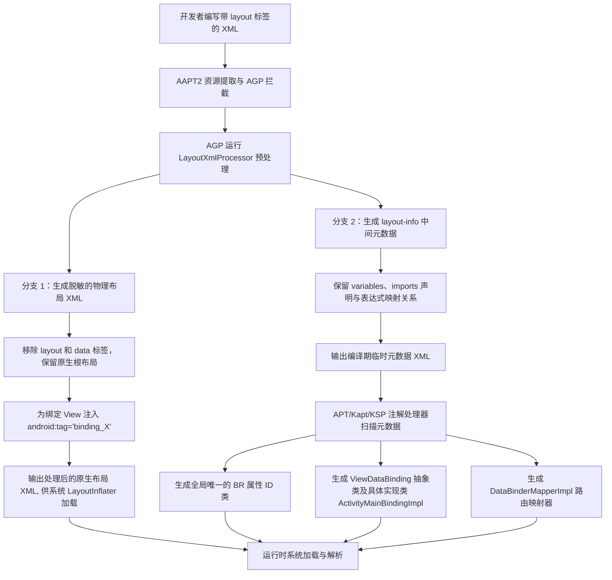
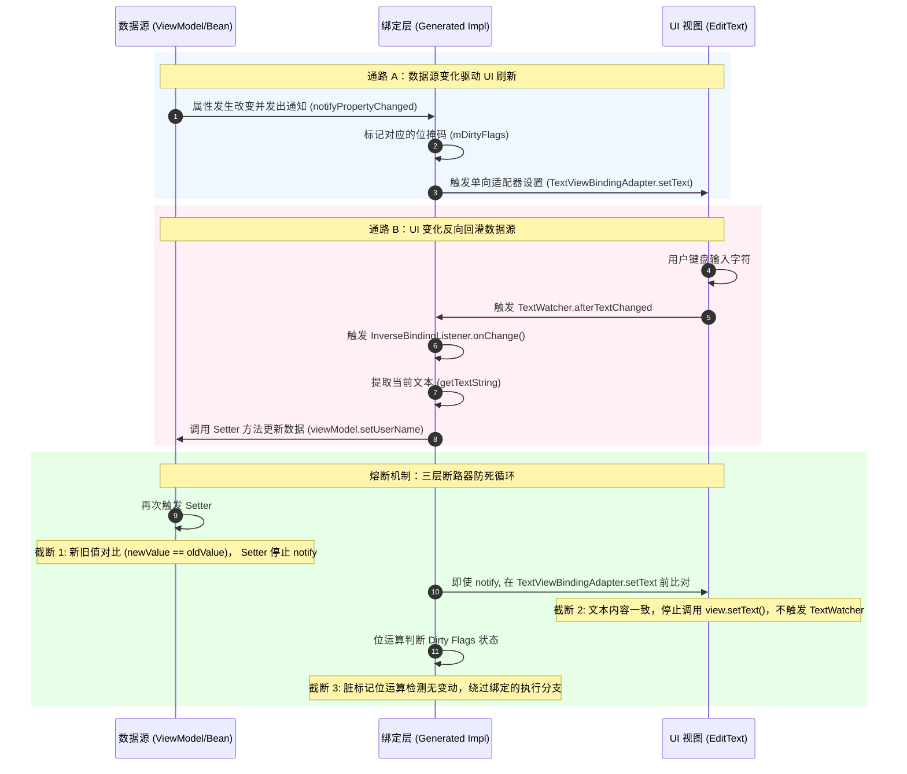

# 5.5.2.1 DataBinding

在 Android 的历史发展与 Jetpack 架构的演进过程中，如何高效、安全地在视图（UI）与数据（Data）之间建立同步通道，一直是一个核心的研究课题。从最原始的 `findViewById`，到后来的注解式注入框架 ButterKnife，再到 Kotlin 独有的 Synthetic 视图引用方案，开发者们尝试了多种方式来消除繁琐的样板代码。然而，这些方案大多只停留在“如何获取视图引用”这一命令式 UI 的层面，未能触及“如何让数据驱动视图”的本质变革。

为了在传统的 Android View 体系中引入声明式 UI 的设计哲学，谷歌推出了 DataBinding 库。作为 Jetpack 架构组件中承上启下的核心纽带，DataBinding 实现了数据与视图的双向绑定，为 MVVM（Model-View-ViewModel）架构 of 落地提供了强有力的支持。本文将对 DataBinding 的设计哲学、编译期代码生成流程、运行时初始化与类加载机制、单双向绑定的底层微观机制、BindingAdapter 静态解析、内存泄漏隐患以及未来的迁移之路进行全方位、源码级别的深度剖析。

---

## 1. DataBinding 的设计哲学与架构对比

### 1.1 命令式 UI 与声明式 UI 的冲突与演进
在传统的 Android 命令式 UI 开发中，UI 的更新是高度依赖于开发者的手动操作。当底层数据发生改变时，开发者必须显式地获取对应的 View 引用，并调用相应的 Setter 方法（如 `setText()`, `setVisibility()`）来同步状态。这种模式存在着以下不可避免的架构缺陷：
1. **状态不一致风险**：由于所有的状态同步都需要手动编写代码，在复杂的业务逻辑下，开发者极易遗漏某处 UI 刷新，或者因逻辑顺序错误导致内存中的数据状态与屏幕上的视图状态不一致。
2. **Controller 代码膨胀**：Activity 或 Fragment 承担了过多的视图操纵逻辑，充斥着大量的样板代码，违背了“单一职责原则”。
3. **安全隐患**：`findViewById` 机制本身缺乏类型安全与空安全保障。如果某个布局在特定配置下（如横屏模式）移除了某个组件，而代码中依然对其进行了调用，就会在运行时直接触发 `NullPointerException`。

声明式 UI 的核心思想则是“UI 是状态的函数”（$UI = f(State)$）。开发者只需定义视图与状态之间的映射关系，而状态的变化会自动引起视图的重绘与刷新。DataBinding 正是这一思想在传统 Android XML 视图系统下的折中与实现。它通过预编译的手段，将数据变量和表达式声明在 XML 布局文件中，由编译器自动生成负责同步状态的绑定类，将开发者的关注点从“如何修改 UI”提升到“如何管理状态”。

### 1.2 ViewBinding、DataBinding 与 Compose 的深度技术对比
在目前的 Android 生态中，存在着 ViewBinding、DataBinding 以及下一代声明式 UI 框架 Jetpack Compose。理解它们之间的技术边界和底层设计差异，对于技术选型至关重要：
- **ViewBinding**：
  - **定位**：一种类型安全、Null 安全的“视图引用获取”方案。
  - **实现机制**：在编译期，AGP 会为每一个 XML 布局文件生成一个绑定类，该类直接持有布局中所有带有 `android:id` 属性的 View 的直接强引用。它没有任何数据绑定的能力，也不支持在 XML 中编写表达式。
  - **性能损耗**：其编译开销非常小，仅进行简单的 XML 扫描与类生成，不会改变 XML 的结构，运行时没有任何反射，是 `findViewById` 的完美替代品。
- **DataBinding**：
  - **定位**：完整的“数据与视图双向绑定”解决方案。
  - **实现机制**：通过两阶段编译（AGP 拦截预处理与 APT 扫描生成），不仅生成 View 引用，还生成负责绑定数据与视图、注册数据监听器的 ViewDataBinding 具体子类。它允许在 XML 中编写逻辑表达式（如三元运算符、属性访问等）。
  - **性能损耗**：编译期开销大，需要解析 XML 的数据绑定表达式并生成复杂的绑定代码，对增量编译和构建速度有一定影响。在运行时，它由于需要维护注册的观察者列表和执行脏标记计算，会有微小的内存和性能开销，但由于其内部采用了优秀的重绘合并算法，这种损耗在大部分应用中是可以忽略的。
- **Jetpack Compose**：
  - **定位**：彻底的、全新的声明式 UI 工具包。
  - **实现机制**：不再使用传统的 XML 布局系统，而是使用 Kotlin 编译器插件在编译期对标有 `@Composable` 的函数进行重构，通过运行时 Runtime 维护一棵虚拟的 Layout 树，并在状态改变时触发特定节点的“重组（Recomposition）”。
  - **演进路线**：DataBinding 是传统 View 框架下的声明式改良，而 Compose 是对传统 View 系统的彻底颠覆。

---

## 2. 编译期代码生成流程的黑盒拆解

DataBinding 的核心魔法在于编译期的代码生成。这一流程由 Android Gradle Plugin (AGP) 的特定构建任务与注解处理器（APT/Kapt/KSP）协同完成。如果不了解编译期的具体处理步骤，在面对各种诡异的编译错误时往往会无从下手。

### 2.1 编译期核心步骤解析
下面是 DataBinding 编译期代码生成流程的完整闭环步骤：

1. **开发者编写 XML 布局**：
   开发者在最外层声明 `<layout>` 标签，并在内部定义 `<data>` 标签、`<variable>` 声明以及绑定表达式（如 `android:text="@{user.name}"`）。
2. **AAPT 资源收集与 AGP 拦截**：
   在 Gradle 编译资源的过程中，AGP 的 DataBinding 插件会拦截对包含 `<layout>` 标签的布局文件的处理。这是因为系统的 `LayoutInflater` 无法识别非标准的 XML 标签与自定义属性（例如 `android:text="@{user.name}"` 会导致系统解析失败）。
3. **XML 布局预处理与拆分**：
   编译器会利用 `LayoutXmlProcessor` 类对原始 XML 进行扫描。该过程分为两个平行的输出分支：
   - **移除 DataBinding 专属标签**：将 `<layout>` 标签去除，把直接子布局提升为布局文件的根节点；同时，完全剔除 `<data>` 标签及其子节点。
   - **去除绑定表达式并注入 Tag**：移除所有 View 节点上的绑定表达式（如 `android:text="@{...}"`）。为了在运行时能够定位这些被移除表达式的 View 节点，编译器会自动为包含表达式的 View 以及定义了 `android:id` 的 View 添加一个唯一的 `android:tag` 属性。通常，根 View 如果没有 tag，会被赋予 `android:tag="layout/layout_name_0"`，而其他包含绑定表达式的 View 则会被自动分配 `android:tag="binding_1"`, `android:tag="binding_2"` 等属性。
4. **生成中间元数据文件（Layout Info）**：
   被剥离出来的变量定义、类型导入（Import）、View 与绑定表达式的映射关系以及 tag 信息，会被写入到 build 目录下的中间 XML 文件中（通常位于 `build/intermediates/incremental/mergeDebugResources/stripped-resources/layout-info`）。
5. **APT/Kapt/KSP 注解处理器扫描**：
   当编译器进入 Java/Kotlin 代码编译阶段，DataBinding 专属的注解处理器（如 `DataBindingProcessor`）会被激活。它会读取并解析前面步骤中生成的 `layout-info` 文件夹中的所有元数据。
6. **生成 ViewDataBinding 抽象类与具体实现类**：
   注解处理器根据元数据生成如下 Java 类：
   - **抽象类（如 `ActivityMainBinding`）**：继承自 `ViewDataBinding`。它包含了与布局中定义的 `<variable>` 对应的 setter/getter 方法声明，以及通过 ID 直接引用的各个 View 变量。
   - **具体实现类（如 `ActivityMainBindingImpl`）**：该类包含了具体的视图绑定逻辑。它拥有一个长整型的二进制脏标记掩码 `mDirtyFlags`，用于记录哪些数据发生了改变。它的构造函数内部会触发视图树遍历以绑定各个 View，同时重写了核心的 `executeBindings()` 方法，该方法中包含了所有数据设置到 View 属性的 Java 代码。
7. **生成 BR 类与 DataBinderMapperImpl 映射器**：
   - **BR 类**：类似于系统的 `R` 类，BR 类将所有标记了 `@Bindable` 的属性以及布局中的 `<variable>` 变量名映射为全局唯一的整数 ID（例如 `BR.user`, `BR.name`）。
   - **DataBinderMapperImpl 类**：这是一个针对当前 module 的路由映射器。在运行时，它可以通过布局 ID（如 `R.layout.activity_main`）或根 View 的 tag（如 `layout/activity_main_0`），通过 `switch-case` 语句快速定位并实例化对应的 `ViewDataBinding` 具体实现类（如 `ActivityMainBindingImpl`）。在多模块项目中，每个子模块都会生成一个独立的 Mapper 类，主模块的编译期会将所有子模块的 Mapper 进行合并，生成一个 `MergedDataBinderMapper` 实例。

### 2.2 编译期代码生成流程图
下面是这一复杂链路的直观流向图：



---

## 3. 运行时初始化与类加载机制的源码剖析

编译期完成了所有静态代码的准备工作，而运行时则负责将这些生成的代码与真实的 Android View 树进行绑定，并建立起高效的观察与分发关系。

### 3.1 运行时绑定流程分析
在 Activity 中，我们通常使用 `DataBindingUtil.setContentView(activity, R.layout.activity_main)` 来初始化布局。下面我们顺着源码来看看这行代码背后隐藏的执行轨迹：

1. **进入 `DataBindingUtil.setContentView()`**：
   ```java
   public static <T extends ViewDataBinding> T setContentView(@NonNull Activity activity, int layoutId) {
       return setContentView(activity, layoutId, sDefaultComponent);
   }
   ```
2. **布局的实际渲染与根 View 的获取**：
   ```java
   public static <T extends ViewDataBinding> T setContentView(@NonNull Activity activity, int layoutId,
           @Nullable DataBindingComponent bindingComponent) {
       // 1. 调用系统的 Activity.setContentView 填充布局
       activity.setContentView(layoutId);
       // 2. 获取系统的 ContentParent 容器，通常是 DecorView 下的 content 容器
       ViewGroup contentParent = activity.findViewById(android.R.id.content);
       int count = contentParent.getChildCount();
       // 3. 取出渲染出来的根 View
       View decorView = contentParent.getChildAt(0);
       // 4. 将根 View 绑定到生成的 ViewDataBinding 实例上
       return bind(bindingComponent, decorView, layoutId);
   }
   ```
3. **调用 `bind()` 进行类映射与加载**：
   ```java
   static <T extends ViewDataBinding> T bind(DataBindingComponent bindingComponent, View view, int layoutId) {
       // sMapper 即为编译期合并生成的 MergedDataBinderMapper 实例
       return (T) sMapper.getDataBinder(bindingComponent, view, layoutId);
   }
   ```
   在生成的 `DataBinderMapperImpl.getDataBinder()` 方法中，会根据传入的 `layoutId` 进行判断：
   ```java
   @Override
   public ViewDataBinding getDataBinder(ViewDataBindingComponent component, View view, int layoutId) {
       int localizedLayoutId = INTERNAL_LAYOUT_ID_LOOKUP.get(layoutId);
       if(localizedLayoutId > 0) {
           final Object tag = view.getTag();
           if(tag == null) {
               throw new RuntimeException("view must have a tag");
           }
           switch(localizedLayoutId) {
               case  LAYOUT_ACTIVITYMAIN: {
                   if ("layout/activity_main_0".equals(tag)) {
                       // 实例化编译生成的实现类
                       return new ActivityMainBindingImpl(component, view);
                   }
                   throw new IllegalArgumentException("The tag for activity_main is invalid. Received: " + tag);
               }
           }
       }
       return null;
   }
   ```
   这里的 `ActivityMainBindingImpl` 构造函数接收 `decorView` 作为根 View 传入。

### 3.2 View 树的递归遍历与映射：`mapBindings()` 算法详解
在 `ActivityMainBindingImpl` 的构造函数中，并不会像传统代码那样调用多次 `findViewById()`，而是会调用父类 `ViewDataBinding` 中极其重要的静态辅助方法 `mapBindings()` 来完成 View 的一次性匹配。

```java
protected static Object[] mapBindings(DataBindingComponent bindingComponent, View root,
        int numBindings, IncludedLayouts includes, SparseIntArray viewsWithIds) {
    Object[] bindings = new Object[numBindings];
    mapBindings(bindingComponent, root, bindings, includes, viewsWithIds, true);
    return bindings;
}
```
其内部的重载核心递归逻辑步骤为：
- **深度优先递归（DFS）与单次扫描**：
  `mapBindings` 会递归遍历整个 View 树。对于传入的 `View` 节点，方法首先检查其 `tag` 属性。
  - **判断 Tag 格式**：如果 `tag` 字符串不为空，且符合 `binding_` 格式（如 `binding_3`），说明该 View 是在编译期被剥离了绑定表达式的目标 View。方法会截取 tag 后面的数字，作为索引值，直接将当前 View 引用存入 `bindings` 数组中，即 `bindings[3] = view`。
  - **判断 ID 映射**：如果 View 带有 `android:id` 属性，且该 ID 存在于编译期生成的 `viewsWithIds`（存放了所有带 ID 且没有绑定表达式 of View 的 R.id -> bindings 索引的映射关系）中，则根据映射关系中的索引，将 View 存入 `bindings` 数组的对应位置。
  - **处理 `<include>` 标签**：如果遇到了一个 `<include>` 布局，且该子布局同样配置了 DataBinding，`mapBindings` 会根据编译期元数据 `includes` 找到对应的子 ViewDataBinding 并进行递归绑定，随后将子 ViewDataBinding 实例存入 `bindings` 数组。
  - **递归遍历子 View**：如果是 `ViewGroup`，则会遍历其所有的子 View，依次调用 `mapBindings(..., child, ...)` 进行递归。

通过这种“单次 View 树递归遍历（时间复杂度 $O(N)$）”的机制，DataBinding 在一次遍历中完成了所有 View 的搜集，并将其直接存入一个 Object 数组中。之后，生成的 `ActivityMainBindingImpl` 构造函数只需要将 `bindings` 数组中对应位置的 View 强转并赋值给它所声明的成员变量即可。这种方式避免了多次在复杂的布局树中调用耗时的 `findViewById()`（其在大型 View 树中可能导致大量的重复递归查找），在性能上是非常卓越的。

### 3.2.1 ViewDataBindingImpl 中 executeBindings 的位运算拓扑求值机制
每一个生成的 `ViewDataBinding` 实现类（如 `ActivityMainBindingImpl`）中，其核心的绑定逻辑都封装在 `executeBindings()` 方法内。在这个方法中，DataBinding 抛弃了任何动态反射求值的低效策略，转而采用了由位图脏标记（`mDirtyFlags`）控制的静态局部变量分配与拓扑排序求值逻辑。

假设我们在布局中定义了一个变量 `user`，并在 TextView 中绑定了 `user.name` 属性，且 `user` 是一个 `BaseObservable`：
1. **脏标记位定义**：编译器会在内部为每个可绑定属性分配一个独立的二进制位掩码。例如，`user` 被分配为 `0x2L`，而全局刷新标记被定义为 `0x1L`（代表所有属性刷新）。
2. **锁保护与快照复制**：在 `executeBindings()` 的头部，方法首先会通过同步代码块复制脏标记并立即重置它：
   ```java
   long dirtyFlags = 0;
   synchronized(this) {
       dirtyFlags = mDirtyFlags;
       mDirtyFlags = 0; // 重置全局标记位
   }
   ```
3. **拓扑排序的局部缓存计算**：
   为了防范级联空指针异常，求值过程是按照拓扑依赖关系一步步向前推导的。局部变量被定义在栈内存中：
   ```java
   java.lang.String userName = null;
   com.example.User user = mUser;

   if ((dirtyFlags & 0x6L) != 0) { // 检查 user 属性对应的标记位（0x2L | 0x4L）
       if (user != null) {
           userName = user.getName(); // 拓扑求值：只有在 user 不为 null 时，才获取其下属属性
       }
   }
   ```
4. **位过滤属性赋值**：
   在拓扑链条计算结束后，通过位与（`&`）运算决定是否调用绑定的 Adapter：
   ```java
   if ((dirtyFlags & 0x6L) != 0) {
       // 当且仅当 user 发生改变时，才进行 TextView 的设置
       TextViewBindingAdapter.setText(this.mboundView1, userName);
   }
   ```
这种在编译期计算好表达式依赖拓扑、并在运行时使用线程安全的二进制长整型（`long`）位掩码进行状态过滤的逻辑，完全摒弃了运行时的动态表达式求值引擎，使得其执行速度极其逼近手写的原生命令式代码。

### 3.3 `requestRebind()` 与重绘合并机制
当被观察的数据发生变化并需要刷新 UI 时，会触发 `ViewDataBinding.requestRebind()` 方法。为了避免在一帧时间（比如 60Hz 屏幕下的 16.6 毫秒，或者 120Hz 屏幕下的 8.3 毫秒）内，因多个属性频繁改变而导致页面被重复绘制（即多次调用 `setText()`, `invalidate()` 等），DataBinding 引入了类似 VSYNC 同步的“重绘合并”机制。

我们来看看 `requestRebind()` 的底层源码逻辑：
```java
protected void requestRebind() {
    synchronized (this) {
        if (mPendingRebind) {
            // 如果已经在当前帧中投递了重绘请求，则直接返回，防范同一帧内的重复绘制
            return;
        }
        mPendingRebind = true;
    }
    if (mLifecycleOwner != null) {
        // 配合 LifecycleOwner，如果当前生命周期不活跃，则推迟刷新
        Lifecycle.State state = mLifecycleOwner.getLifecycle().getCurrentState();
        if (!state.isAtLeast(Lifecycle.State.STARTED)) {
            return;
        }
    }
    // 使用 Choreographer 机制对齐屏幕刷新脉搏
    if (USE_CHOREOGRAPHER) {
        Choreographer.getInstance().postFrameCallback(mFrameCallback);
    } else {
        // 如果不支持，退化为 Handler 机制
        mUIThreadHandler.post(mRebindRunnable);
    }
}
```
在下一帧的 VSYNC 信号到来时，系统会触发 `mFrameCallback.doFrame()`，进而执行 `mRebindRunnable`，它内部最核心的执行逻辑是：
```java
private final Runnable mRebindRunnable = new Runnable() {
    @Override
    public void run() {
        synchronized (this) {
            mPendingRebind = false;
        }
        // 执行挂起的绑定更新
        executePendingBindings();
    }
};
```
在 `executePendingBindings()` 内部，如果当前绑定的生命周期状态满足条件，会最终调用生成类中的 `executeBindings()`。
这种机制确保了在 16.6ms 内，无论数据被修改了多少次，也无论触发了多少次属性改变通知，最终在下一帧屏幕刷新到来时，只会执行一次 `executeBindings()` 刷新 UI 视图，极大地优化了渲染性能。

---

## 4. 单向数据绑定机制与数据流分析

单向数据绑定是 DataBinding 的基本数据流向通路，它负责在数据源（如 ViewModel 中的字段、LiveData、Flow）发生更新时，自动推送到对应的 UI 控件上。

### 4.1 `Observable`、`BaseObservable` 与 `BR` 类的工作机理
- **`Observable` 接口**：定义了观察者模式的核心契约，允许添加与移除 `OnPropertyChangedCallback` 回调。
- **`BaseObservable`**：这是 `Observable` 的标准实现类。它内部封装了一个 `PropertyChangedRegistry`（属性改变注册表）对象。
  ```java
  public class BaseObservable implements Observable {
      private transient PropertyChangedRegistry mCallbacks;
      
      @Override
      public synchronized void addOnPropertyChangedCallback(OnPropertyChangedCallback callback) {
          if (mCallbacks == null) {
              mCallbacks = new PropertyChangedRegistry();
          }
          mCallbacks.add(callback);
      }
      
      public synchronized void notifyPropertyChanged(int fieldId) {
          if (mCallbacks != null) {
              // 触发注册的所有回调
              mCallbacks.notifyCallbacks(this, fieldId, null);
          }
      }
  }
  ```
- **`BR` 类与属性字段绑定**：
  当我们为 Model 中的属性定义了 Getter 并添加了 `@Bindable` 注解时：
  ```kotlin
  class User : BaseObservable() {
      @get:Bindable
      var name: String = ""
          set(value) {
              if (field != value) {
                  field = value
                  // 当值改变时，调用父类方法传入编译生成的 BR 对应 ID
                  notifyPropertyChanged(BR.name)
              }
          }
  }
  ```
  注解处理器会收集带有 `@Bindable` 的 Getter 方法，并在全局 `BR` 类中注册一个对应的整型常量 `BR.name`。当调用 `notifyPropertyChanged(BR.name)` 时，注册的 `PropertyChangedRegistry` 会收到属性变更的通知，并将该事件分发给绑定的 `ViewDataBinding` 实例。

### 4.2 `ObservableField` 的内部封装
对于不希望继承 `BaseObservable` 的类，可以使用包装类 `ObservableField<T>`（以及基本类型封装如 `ObservableInt`, `ObservableBoolean`）。
`ObservableField<T>` 继承自 `BaseObservable`。它内部包含的核心逻辑十分简明：
```java
public class ObservableField<T> extends BaseObservable implements Serializable {
    private T mValue;

    public T get() {
        return mValue;
    }

    public void set(T value) {
        if (value != mValue) { // 引用级对比防范
            mValue = value;
            notifyChange(); // 相当于 notifyPropertyChanged(BR._all)
        }
    }
}
```
每当开发者调用 `set()` 方法写入新值时，只要值发生了变化，就会自动发出全局属性通知，触发依赖该 `ObservableField` 的所有 UI 重绘。

### 4.3 `PropertyChangedRegistry` 线程安全与并发回调机制
`PropertyChangedRegistry` 的底层是基于抽象类 `CallbackRegistry` 实现的。在 Android 复杂的多线程环境中，当一个线程正在分发回调通知（执行 `notifyCallbacks`）时，另一个线程可能正在调用 `remove` 移除监听器，或者调用 `add` 注册新的监听器。如果直接使用一个非线程安全的 `ArrayList` 进行遍历分发，这极易引发 `ConcurrentModificationException` 崩溃，或者导致在迭代时发生死锁。

为了防范这一问题，`CallbackRegistry` 在内部并没有采用简单的锁机制或者直接的 `ArrayList` 拷贝复制，而是设计了一套精妙的**二进制位图标志位与双数组映射机制**：
- **延迟注销与标记**：在遍历回调列表时，如果检测到有注销请求，它不会立刻从列表中删除该元素，而是利用一个长整型数组或位标记，将该索引标记为“已注销”状态。
- **快照复制**：如果在分发过程中发生了列表结构的变更，它会触发一次快速的“写时复制”（Copy-On-Write），克隆当前的监听器状态，使得正在进行的遍历逻辑可以在一个只读的“历史快照”中安全地继续执行，这保证了底层事件分发机制的绝对安全与健壮。

### 4.4 弱引用监听器 `WeakListener` 的多模块及垃圾回收策略
为了让 `ViewDataBinding` 可以监听来自长生命周期数据源（例如一个单例的数据中心 Model，或者拥有长生命周期作用域的 ViewModel）的改变，而又不引发内存泄漏，DataBinding 引入了 `WeakListener`（弱引用监听器）设计模式。

`WeakListener` 是 `ViewDataBinding` 内部定义的一个实现了相应监听接口（如 `Observable.OnPropertyChangedCallback`, `Observer` 等）的泛型静态内部类。它的生命周期极其精妙：
1. **持有弱引用**：`WeakListener` 内部仅持有对外部 `ViewDataBinding` 对象的 `WeakReference`。
2. **长生命周期源持有强引用**：长生命周期的被观察数据源（如 `BaseObservable` 或是 `LiveData`）持有了 `WeakListener` 对象的强引用。
3. **自清理机制**：
   - 当数据源的数据发生更新并调用其回调时，`WeakListener` 会被触发。
   - 在其 `onPropertyChanged` 或 `onChanged` 回调中，`WeakListener` 会尝试调用 `WeakReference.get()` 提取对应的 `ViewDataBinding` 实例。
   - 如果此时 `ViewDataBinding` 关联的 Activity 或 View 已经被销毁并且已被垃圾回收器（GC）回收，`get()` 方法将返回 `null`。
   - 此时，`WeakListener` 会意识到绑定对象已经失效，它会立刻调用数据源的 `remove` 方法将自身从数据源的监听列表中摘除（例如调用 `observable.removeOnPropertyChangedCallback(this)`）。
   - 这样不仅防止了 `ViewDataBinding` 无法被 GC 回收的内存泄漏问题，而且保证了监听器能够进行“自我寿命终结”与自动清理，不会常驻内存。

### 4.5 LiveData 与 StateFlow 的生命周期感知挂载：`LiveDataListener` 原理
在实际的 Jetpack 推荐架构中，我们极少直接使用 `ObservableField`，而是选用具备生命周期感知的 `LiveData` 或者 Kotlin 的 `StateFlow`。
当我们在布局 XML 中声明一个 `LiveData` 并在 Activity 中设置了 `binding.setLifecycleOwner(lifecycleOwner)` 时，DataBinding 是通过什么机制实现生命周期挂载的呢？

它的底层原理是：
1. **动态注册**：在生成的 `executeBindings()` 代码中，系统发现绑定数据源是一个 `LiveData`。它会调用 `registerTo()` 注册数据源。
2. **构建 LiveDataListener 桥接**：系统会实例化一个 `LiveDataListener` 对象（同样由上述的 `WeakListener` 包装）。这个 `LiveDataListener` 实现了底层的 `LifecycleBoundObserver` 或者是传统的 `Observer` 接口。
3. **生命周期对齐**：当调用 `LiveDataListener.setLifecycleOwner(lifecycleOwner)` 时，它内部会使用传入的 `lifecycleOwner` 对 `LiveData` 进行订阅观察：
   ```java
   // 源码核心桥接：将 ViewDataBinding 转换为 Lifecycle 感知的 Observer 订阅到 LiveData
   liveData.observe(lifecycleOwner, this);
   ```
4. **生命周期感知的防抖**：当 Activity 处于后台处于非活跃状态（如 `ON_STOP`）时，`LiveData` 本身的生命周期机制会暂停分发通知，DataBinding 的 `executePendingBindings()` 也随着暂停被调用；直到 Activity 返回前台（`ON_START`），`LiveData` 会将最新的状态一次性推送给 `LiveDataListener`，进而触发 `requestRebind()` 进行一次性重绘制。这不仅保证了刷新操作只发生在可见状态，也保证了绝对的内存安全。

### 4.6 多模块工程下的 DataBinderMapperImpl 路由架构与混淆避坑
在大型企业级 Android 开发中，应用往往按照业务逻辑拆分为数十个子模块（Library Modules），每一个子模块都可能独立开发并包含属于自己的 DataBinding 布局文件。这种复杂的工程结构给编译期和运行时带来了一个棘手的问题：**如何在主模块运行时全局路由这些分布在各个子模块中的 ViewDataBinding 子类？**

DataBinding 解决这个难题的底层机制是**层级 Mapper 合并路由架构**：
1. **局部 Mapper 生成**：编译期，APT 注解处理器会在每个子模块的包名下生成一个 `DataBinderMapperImpl`（如 `com.example.moduleA.DataBinderMapperImpl`）。这个局部 Mapper 只负责映射当前模块内部定义的布局 ID（例如 `R.layout.modulea_item`）。
2. **主模块汇聚与合并**：当 App 主模块进行最终的编译打包时，主模块的注解处理器会扫描依赖树中所有子模块的元数据，并在主模块的构建目录下生成一个全局唯一的合并映射器类——`MergedDataBinderMapper`。
3. **动态添加路由**：在主模块生成的 `DataBinderMapperImpl` 构造函数内部，系统会自动将所有发现的子模块局部 Mapper 注册到其内部的路由列表中：
   ```java
   public DataBinderMapperImpl() {
       addMapper(new com.example.moduleA.DataBinderMapperImpl());
       addMapper(new com.example.moduleB.DataBinderMapperImpl());
   }
   ```
4. **双向回溯查找**：当运行时调用 `DataBindingUtil.bind()` 触发绑定映射时，`MergedDataBinderMapper` 会遍历注册的 Mapper 列表，依次查找是否能处理当前 View 对应的标签或 Layout ID。只要有一个模块成功解析并返回了正确的实现类实例，分发路由就立刻返回。

#### 反射加载与 ProGuard 混淆避坑
需要特别警惕的是，`MergedDataBinderMapper` 在加载并注册这些子模块的 `DataBinderMapperImpl` 时，为了解耦多模块之间的物理编译期引用关系，其底层是通过**反射**进行实例化的：
`Class.forName("com.example.moduleA.DataBinderMapperImpl").newInstance()`。

这就意味着，在项目开启 R8 / ProGuard 混淆压缩后，如果混淆器认为这些实现类“没有被代码静态显式调用过”，就会直接将其裁剪掉，或者将其包名和类名混淆为无规律的代码，从而导致运行时抛出致命的 `ClassNotFoundException` 导致应用闪退。

为此，DataBinding 会在编译时为 Gradle 自动生成一套 ProGuard `keep` 规则。如果我们自己编写自定义规则，也必须强制保留各个模块包名下的 Mapper 类：
```proguard
# 强制保留所有生成的 DataBinderMapperImpl，防范反射实例化崩溃
-keep public class * extends android.databinding.DataBinderMapper {
    public <init>();
}
-keep class android.databinding.MergedDataBinderMapper { *; }
```
这一混淆防范机制是多模块项目顺利上线的关键物理保障。

---

## 5. 双向数据绑定与防死循环深度剖析

单向绑定解决了数据更新 UI 的问题，而在涉及输入框（`EditText`）、选择框（`CheckBox`）等交互组件时，我们需要实现 UI 的改变能够自动写回到数据源。这就是双向数据绑定的应用场景。

### 5.1 双向绑定的双向数据流闭环分析
双向绑定的语法为 `@={viewModel.userName}`（相比单向绑定多了一个等号）。
在编译期，当注解处理器识别到 `@=` 语法后，它会生成一个双向数据流闭环通路：
1. **单向通道（数据源 -> UI）**：在 `executeBindings()` 中生成代码，获取数据源最新值，并调用 `TextViewBindingAdapter.setText()` 更新视图。
2. **反向通道（UI -> 数据源）**：在生成的具体实现类（如 `ActivityMainBindingImpl`）中，编译器会自动生成一个 `InverseBindingListener` 的实现：
   ```java
   private android.databinding.InverseBindingListener mboundView1androidTextAttrChanged = 
       new android.databinding.InverseBindingListener() {
           @Override
           public void onChange() {
               // 1. 获取 UI 视图的当前值
               java.lang.String newValue = android.databinding.adapters.TextViewBindingAdapter.getTextString(mboundView1);
               // 2. 获取数据源中的旧值
               java.lang.String oldValue = viewModel.getUserName();
               // 3. 将新值反向写入数据源
               viewModel.setUserName(newValue);
           }
       };
   ```
   同时，编译器会在绑定初始化时，为该 View 注册一个事件监听器。对于 `EditText` 而言，它会调用 `TextViewBindingAdapter.setTextWatcher()` 注册一个 `TextWatcher` 监听器，并在其 `afterTextChanged()` 中触发上面的 `mboundView1androidTextAttrChanged.onChange()`。

### 5.2 死循环是如何形成的？
在缺乏防御机制的情况下，双向绑定会导致不可控制的 StackOverflow 崩溃：
```
数据源发生变化 -> 触发 notifyPropertyChanged 
  -> 触发 requestRebind() -> 调用 executeBindings()
  -> 调用 TextViewBindingAdapter.setText() 设置文本 
  -> 触发 EditText 的 TextWatcher 的 afterTextChanged() 
  -> 触发 InverseBindingListener.onChange() 
  -> 调用 viewModel.setUserName() 修改数据源 
  -> 触发 notifyPropertyChanged ...... (无限恶性循环)
```

### 5.3 三层断路防护机制源码级拆解
为了截断上述死循环，DataBinding 在各个层级上设计了三层坚固的断路器（Break Loops）机制：

#### 第一层断路器：Java Bean Setter 层面的新旧值比对
这是第一道防线，也是最基本的防线。在数据源的 Setter 方法中，必须有防抖检查：
```kotlin
fun setUserName(newName: String) {
    if (this.userName != newName) { // 关键比对：只有在值确实不同时才进行更新与分发
        this.userName = newName
        notifyPropertyChanged(BR.userName)
    }
}
```
如果用户在 `EditText` 中输入了一个字符，通过 `InverseBindingListener` 写入 Setter，此时 Setter 接收到的 `newName` 与已经存在的 `this.userName` 是相等的，在此处直接 `return`，不再抛出属性改变的通知，从而终止了向 UI 刷新的二次回流。

#### 第二层断路器：BindingAdapter 视图渲染层面的比对
如果由于某些逆向原因（例如数值精度转换），Setter 层的相等判断失效了，或者数据源不是简单的 Setter（例如数据源每次都会返回一个新创建的包装类实例），那么还有第二道防线：`BindingAdapter`。

我们来看 DataBinding 官方提供的 `TextViewBindingAdapter.setText()` 的源码：
```java
@BindingAdapter("android:text")
public static void setText(TextView view, CharSequence text) {
    final CharSequence oldText = view.getText();
    // 1. 如果新旧 CharSequence 引用相同，或者内容为空且一致，则直接返回
    if (text == oldText || (text == null && oldText.length() == 0)) {
        return;
    }
    // 2. 进行内容细节对比
    if (text instanceof Spannable) {
        if (text.equals(oldText)) {
            return; // 带有富文本样式的 String 内容相同，直接返回
        }
    } else if (!haveContentsChanged(text, oldText)) {
        return; // 纯文本内容完全一致，在此被拦截截断！
    }
    // 3. 仅在内容确实改变时才调用底层的 View 原生 setText()
    view.setText(text);
}

private static boolean haveContentsChanged(CharSequence str1, CharSequence str2) {
    if ((str1 == null) != (str2 == null)) {
        return true;
    }
    if (str1 == null) {
        return false;
    }
    final int length = str1.length();
    if (length != str2.length()) {
        return true;
    }
    for (int i = 0; i < length; i++) {
        if (str1.charAt(i) != str2.charAt(i)) {
            return true;
        }
    }
    return false;
}
```
这道防线极其巧妙：当 `executeBindings()` 试图向 `EditText` 设置新值时，只要文本内容没有实际变化，`setText()` 就会拦截它，根本不调用底层 View 的 `view.setText()`。由于没有发生真实的 View 文字状态变化，系统的 `TextWatcher` 也就不会被触发，从而成功在视图层截断了死循环的递归。

#### 第三层断路器：ViewDataBinding 内部生成的 Dirty Flags 脏标记位运算
在生成的 `ActivityMainBindingImpl` 实现类中，编译器为每一个属性和变量生成了专属的二进制位标记（如 `0x1L`, `0x2L`, `0x4L` 等），并汇总为长整型字段 `mDirtyFlags`。

在执行 `executeBindings()` 的过程中，会优先对 `mDirtyFlags` 进行位操作判定。如果是 UI 回灌导致的数据源更新，在下一帧被调度到时，由于位计算逻辑已经计算出当前的视图表现（EditText 上的内容）本身就是本次更新的触发源，当前的 `mDirtyFlags` 位会被复位为干净状态（Clean），从而在生成的代码逻辑中直接绕过 `executeBindings()` 的重新赋值分支，在最底层的位掩码层面上防御了无效的页面重绘。

### 5.4 双向绑定防死循环数据流向时序图
下图直观地演示了双向绑定中，正反两条数据通路是如何交汇的，以及那三层断路器是在什么位置对死循环实施“强行熔断”的：



---

## 6. BindingAdapter 与 BindingConversion 机制的静态解析原理

在开发中，我们可以利用 `@BindingAdapter` 或是 `@BindingConversion` 扩展传统的 XML 属性。这些注解在编译期有着非常有趣的翻译与替换逻辑。

### 6.1 `@BindingAdapter` 静态方法的底层匹配与翻译逻辑
当我们在 Kotlin 中声明一个自定义属性的静态绑定适配器时：
```kotlin
object ImageBindingAdapter {
    @JvmStatic
    @BindingAdapter("app:imageUrl", "app:placeholder", requireAll = false)
    fun loadImage(view: ImageView, url: String?, placeholderDrawable: Drawable?) {
        // 利用 Glide 或 Coil 加载图片
        Glide.with(view.context)
            .load(url)
            .placeholder(placeholderDrawable)
            .into(view)
    }
}
```
注解处理器在扫描到这段代码后，会建立一张自定义属性匹配表。
当在布局 XML 中编写了 `<ImageView app:imageUrl="@{user.avatarUrl}"/>` 时，注解处理器在生成 `ActivityMainBindingImpl` 的 `executeBindings()` 时，会进行如下的直接代码替换：
```java
// 编译生成的 executeBindings 内部逻辑
if ((mDirtyFlags & 0x3L) != 0) {
    // 翻译为直接对自定义静态 BindingAdapter 方法的调用，传入绑定的 View 引用与变量值
    com.example.ImageBindingAdapter.loadImage(this.mboundView2, userAvatarUrl, (android.graphics.drawable.Drawable)null);
}
```
这解释了为什么 `@BindingAdapter` 方法在本质上**必须是 public 且是静态的**（在 Kotlin 中需要添加 `@JvmStatic` 标记）。因为这样生成的具体绑定实现类才能不需要实例化该适配器类，直接通过全路径静态调用该方法。

#### 6.1.1 实例绑定适配器与单测 Mock 注入
如果你的适配器方法不是静态的，例如需要依赖注入（如图片加载器需要由 Hilt 动态注入）：
```kotlin
class ImageLoaderAdapter @Inject constructor(private val imageLoader: ImageLoader) {
    @BindingAdapter("imageUrl")
    fun loadImage(view: ImageView, url: String?) {
        imageLoader.load(url).into(view)
    }
}
```
由于该方法是一个实例方法，生成的 `executeBindings()` 无法通过静态方式调用它。
此时，编译器会要求你传入或生成一个 `DataBindingComponent` 接口的实现，该接口中包含了获取当前适配器实例的方法：
```java
// 编译生成的 executeBindings 内部逻辑
this.mComponent.getImageLoaderAdapter().loadImage(this.mboundView2, userAvatarUrl);
```
在运行时，开发者需要使用 `DataBindingUtil.setDefaultComponent(component)` 注入对应的 Component 实例，否则在初始化绑定类时会抛出未找到 Component 的运行时异常。

这套实例组件化设计，对于**单元测试（Unit Testing）的 Mock** 而言具有极高的架构价值：在运行 JVM 本地单元测试时，由于缺乏真实的 Android View 环境和网络环境，我们可以通过向 `DataBindingUtil` 注入一个 Mock 的 `DataBindingComponent` 实例，将其中的 `ImageLoaderAdapter` 替换为一个空实现的 Mock 桩。这样不仅阻断了网络请求的发出，而且能精准地验证参数绑定拓扑树的正确性，极大地改善了视图层代码的测试友好度。

### 6.2 多参数 BindingAdapter 的组合与依赖计算
在上面的 `loadImage` 示例中，我们声明了两个属性 `app:imageUrl` 和 `app:placeholder`，且指定了 `requireAll = false`。
这意味着这两个参数可以同时提供，也可以只提供其中一个。
在生成的 `executeBindings()` 代码中，编译器会为每一个参数进行单独的脏状态标志位计算。如果用户仅在 XML 中配置了 `app:imageUrl` 而未配置 `app:placeholder`，编译生成的代码依然会调用该静态方法，但对于没有提供表达式的参数，编译期会自动填入默认值（例如引用类型传入 `null`，基本数值类型传入 `0`）。
如果将 `requireAll` 设为 `true`，则只要有一个属性缺失，编译器就会抛出编译期错误，提示未能找到匹配的 BindingAdapter。

### 6.3 `@BindingConversion` 的类型强转生成机制
`@BindingConversion` 用于在编译期将一种数据类型自动转换为 View 目标属性所需要的类型。
例如，把布局文件中的一个颜色整型数字自动转换为底层的 `Drawable`：
```kotlin
object ColorConversion {
    @JvmStatic
    @BindingConversion
    fun convertColorToDrawable(color: Int): ColorDrawable {
        return ColorDrawable(color)
    }
}
```
当我们在 XML 中编写了 `android:background="@{user.favoriteColor}"` 且该颜色变量是 `Int` 类型时，编译器会扫描已有的转换方法，发现 `favoriteColor`（Int）可以通过 `convertColorToDrawable` 转换为 `android:background` 所期望的 `Drawable` 类型。
在编译生成的 `executeBindings()` 代码中，编译器会自动在表达式外围包上转换方法：
```java
// 编译生成的代码直接嵌套调用转换方法
this.mboundView1.setBackground(com.example.ColorConversion.convertColorToDrawable(userFavoriteColor));
```
这种类型适配是在编译期静态织入的，因此它没有任何运行时反射所带来的开销，保证了布局在加载时的流畅性。

### 6.4 自定义双向绑定：@InverseBindingAdapter 与反向通知的后缀监听机制
在企业开发中，我们常常需要自定义一些高级 UI 控件（例如自定义滑块 `SeekBar`、环形进度条或自定义的颜色选择盘 `ColorPickerView`）。如果想让这些自定义控件同样支持完美的双向数据绑定，我们需要同时编写 Getter、Setter 以及事件监听逻辑，这需要用到 `@InverseBindingAdapter` 和它的后缀通知机制。

下面我们以一个自定义颜色选择器 `ColorPicker` 的双向颜色绑定（属性名为 `color`）为例，揭示其底层的代码合成细节：

1. **正向通道 Setter**：定义常规的属性修改适配器。
   ```kotlin
   @BindingAdapter("color")
   fun setColor(picker: ColorPicker, newColor: Int) {
       if (picker.getColor() != newColor) {
           picker.setColor(newColor)
       }
   }
   ```
2. **反向通道 Getter**：使用 `@InverseBindingAdapter` 将 View 状态读取为数据类型。我们需要定义绑定的属性（`attribute`），以及触发这一反向读取的事件（`event`）：
   ```kotlin
   @InverseBindingAdapter(attribute = "color", event = "colorAttrChanged")
   fun getColor(picker: ColorPicker): Int {
       return picker.getColor()
   }
   ```
   *注意：如果这里不显式指定 `event`，DataBinding 编译器会默认在属性名后追加 `AttrChanged` 后缀，自动生成并寻找名为 `colorAttrChanged` 的属性变更通知事件。*
3. **桥接事件监听器**：为触发反向更新的事件注册底层的 Listener。这是最关键的一环。编译器要求我们必须提供一个专门的 `@BindingAdapter`，用于挂载当属性变化时的通知回路：
   ```kotlin
   @BindingAdapter("colorAttrChanged")
   fun setColorListener(picker: ColorPicker, listener: InverseBindingListener?) {
       if (listener == null) {
           picker.setOnColorChangeListener(null)
       } else {
           picker.setOnColorChangeListener {
               // 核心桥接点：当 View 状态改变时，主动通知 DataBinding 框架重新计算反向读取
               listener.onChange()
           }
       }
   }
   ```
当用户在界面上手动调节 `ColorPicker` 时，控件触发我们设置的回调，执行 `listener.onChange()`。
DataBinding 收到该 onChange 信号后，会立即去执行被 `@InverseBindingAdapter` 修饰的 `getColor(picker)` 静态方法提取最新值，然后将其传给数据源的 Setter 方法，从而完成了在非系统自带控件上建立起安全、闭环的双向绑定通路。

---

## 7. 性能损耗、内存泄漏与企业级最佳实践

尽管 DataBinding 带来了前所未有的声明式开发体验，但在复杂、高并发的企业级应用中，如果不遵循正确的开发准则，会引入严重的性能抖动与内存泄漏隐患。

### 7.1 Fragment 中的内存泄漏隐患与避坑方案
在 Activity 中使用 DataBinding 通常是绝对安全的，因为 Activity 的 View 层生命周期与其组件实例的生命周期完全同步。但在 Fragment 中，情况大不相同。
- **生命周期错配**：Fragment 的生命周期与其包含的 View 树生命周期是不一致的。当 Fragment 切换时（例如被 `replace` 并且加入了返回栈 `addToBackStack`），Fragment 实例并不会被销毁（其生命周期依然活跃在内存中），但其底层的 View 树会因为进入后台而被完全销毁并重建。
- **泄漏机制**：如果在 Fragment 中定义了一个长生命周期的成员变量 `private lateinit var binding: FragmentMainBinding`，即使在 `onDestroyView()` 之后，这个成员变量依然持有对 `binding` 的强引用。而 `binding` 内部又持有对整个 View 树中所有子 View 的直接强引用。这就直接导致了已被销毁的旧 View 树无法被垃圾回收器（GC）回收，引发严重的内存泄漏。如果用户在该页面反复来回切换，内存中的旧 View 树会不断堆积，最终导致 `OutOfMemoryError` 奔溃。
- **最佳实践写法**：
  在 Fragment 中必须使用可选类型，并在 `onDestroyView()` 中将其置为 `null` 以断开引用链：
  ```kotlin
  class MainFragment : Fragment() {
      private var _binding: FragmentMainBinding? = null
      // 仅在 onCreateView 到 onDestroyView 之间可用的只读属性
      private val binding get() = _binding!!

      override fun onCreateView(
          inflater: LayoutInflater, container: ViewGroup?,
          savedInstanceState: Bundle?
      ): View {
          _binding = FragmentMainBinding.inflate(inflater, container, false)
          return binding.root
      }

      override fun onDestroyView() {
          super.onDestroyView()
          // 核心步骤：必须在此处将其置为 null，释放对 View 树的强引用，防范内存泄漏
          _binding = null
      }
  }
  ```

### 7.2 RecyclerView 中 executePendingBindings() 的性能防抖与闪烁优化
在 RecyclerView 的适配器中绑定 DataBinding 是非常普遍的操作，但很多开发者经常会遗漏一行极为关键的代码：`binding.executePendingBindings()`。
- **问题的表现**：如果不调用这行代码，在列表滑动时，用户会观察到 Item 的视图在快速滚动时出现剧烈的“数据闪烁”现象（例如旧的数据在 Item 呈现出来的最初几毫秒依然可见，随后才突兀地变成新数据）；同时，如果 Item 的高度设置为自适应（`wrap_content`），会导致子 View 的高度在数据变动时发生二次测量抖动，产生卡顿。
- **底层原因**：正如第 3 节所述，当我们在 `onBindViewHolder` 中执行 `holder.binding.user = list[position]` 时，DataBinding 并不会立即刷新 UI，而是将更新请求推迟到下一帧（由 Choreographer 在下一帧 VSYNC 信号到来时执行）。而 RecyclerView 的列表测量与绘制是同步执行的。在 `onBindViewHolder` 完成返回时，当前 Item 的 View 依然持有旧的数据，RecyclerView 会直接以此旧状态对当前 Item 进行 Layout 排版和大小测量。直到下一帧到来时，View 才会变更为新数据，这就导致了同一条目在极短时间内以两种不同的高度和内容进行了两次绘制，从而导致了可见的闪烁与掉帧卡顿。
- **解决方案**：
  在绑定数据后，手动强制立即执行挂起的绑定操作，将异步更新转化为同步更新：
  ```kotlin
  override fun onBindViewHolder(holder: UserViewHolder, position: Int) {
      val currentUser = userList[position]
      holder.binding.user = currentUser
      // 核心要求：强行让挂起的绑定立即同步执行
      holder.binding.executePendingBindings()
  }
  ```
  这行代码会让生成的实现类立即执行 `executeBindings()`，在 RecyclerView 完成对该条目的 layout 和测量之前，UI 上的值就已经被安全、准确地替换为了当前 Item 的最新值，彻底消除了页面的闪烁与抖动。

### 7.2.1 DataBinding 的额外性能开销度量
虽然 DataBinding 可以减少手写代码，但企业级工程团队也必须认识到其背后隐藏的额外技术债与开销成本：
1. **编译期开销与构建速度的红利流失**：
   DataBinding 会深度干预 Gradle 的资源合并与编译流水线。在增量构建时，一旦布局 XML 发生了微小改变，注解处理器（Kapt）往往需要重新生成对应的 Bind 类。在拥有上百个布局的大型模块中，这会直接导致项目的增量编译时间上升 15% 到 30%。
2. **包体积的隐性膨胀**：
   因为 DataBinding 会为每一个含有绑定语法的 XML 生成一个抽象类与一个具体的实现类（通常包含大量的位计算和中间桥接方法），这会导致最终生成的 Class 文件数量翻倍。对于一个有 500 个布局的中型 App，DataBinding 额外生成的类就多达 1000 个，这可能会为混淆后的 APK 包体积增加 1MB 到 2MB。
3. **运行时内存与 GC 抖动**：
   每个 `ViewDataBinding` 实例在运行时都需要分配一个 bindings 数组，以及针对每个绑定的 `WeakListener` 对象。在 RecyclerView 快速滑动的极端场景中，大量的 Item 被绑定和复用，会在瞬间触发数以千计的 WeakListener 对象的创建与销毁。这不仅占用了 JVM 堆内存，而且会显著增加垃圾回收器（GC）的运行频次，从而引起微小的帧率抖动。

### 7.3 拒绝 XML 中的业务逻辑与崩溃调试排障技巧
DataBinding 允许在 XML 中编写部分表达式，但这同时也是一把双刃剑。
- **XML 逻辑膨胀的灾难**：
  如果在 XML 中编写了复杂的业务逻辑，例如：
  `@{user.isAdmin ? (user.age > 18 ? @string/admin_adult : @string/admin_child) : @string/user_normal}`
  这不仅破坏了 MVVM 架构中“视图只负责展示，不负责决策”的职责分工，使得业务逻辑难以被单元测试覆盖，更导致了调试的噩梦。
- **调试与排障**：
  当 XML 中的复杂逻辑出错并在运行时发生 Crash 时，异常堆栈通常不会指向你的原始 Kotlin/Java 代码，而是直接指向编译生成的具体实现类（如 `ActivityMainBindingImpl.java` 的某一行）。这些生成的类中充满了大量的二进制位移操作和逻辑分支判断，难以快速定位出是 XML 中的哪个属性出错了。
- **黄金法则**：
  **XML 必须保持绝对纯净**。任何涉及逻辑判断、格式转换、字符串拼接的运算，都应当在 ViewModel 或 ViewModel 暴露的 State 中作为只读属性或 LiveData 预先处理好。XML 应当只做直接的“一对一”属性赋值。

### 7.4 DataBinding 常见编译及运行期错误排查手册
在日常开发中，DataBinding 的编译报错往往由于其“双向依赖编译”的特征而显得非常隐晦。下表总结了最常见的三个编译/运行期错误及其具体的排查路径：

| 错误信息的表现 | 发生的根本技术原因 | 标准的解决方案 |
| :--- | :--- | :--- |
| `Cannot resolve symbol 'ActivityMainBinding'` | 1. 布局 XML 的最外层没有被 `<layout>` 标签包裹。<br>2. 模块级别的 `build.gradle` 中没有开启 `dataBinding` 编译特征。 | 1. 确保 XML 以 `<layout>` 为根标签。<br>2. 检查 gradle 配置中是否声明了 `buildFeatures { dataBinding = true }` 并同步项目。 |
| `Cannot find the setter for attribute 'app:imageUrl' with parameter type ...` | 编译期在当前的类路径下无法找到与 XML 属性名称和参数类型完全匹配的 `@BindingAdapter` 静态方法。 | 1. 确保适配器方法被声明为 `public static`（Kotlin 中使用 `@JvmStatic` 标记）。<br>2. 校验 XML 绑定的参数类型与 BindingAdapter 的方法参数类型是否完全一致，如果不一致需进行类型转换。 |
| `BR 类找不到或 BR.xxx 常量未生成` | 1. 之前发生过其他 Java 编译期报错，导致注解处理器被提前终止，没能顺利生成 BR 类。<br>2. 变量属性未声明 `@get:Bindable`，或者没有成功进行一次 Build 编译。 | 1. 不要关注 BR 报错，先解决项目中普通的 Java/Kotlin 编译期错误。<br>2. 对项目执行 `Rebuild Project`，强制触发注解处理器重新扫描生成。 |

---

## 8. Android 版本变更与未来迁移之路

随着 Android 架构理念和编译技术的演进，DataBinding 也在经历着重大的变迁。

### 8.1 DataBinding 在 Android 演进史中的技术变化
在早期 Android 中，传统的后台限制与系统权限随着 Android 各个大版本的发布逐步收紧（详情请参见根目录下的 [AndroidVersionChangeLog.md](../../../../AndroidVersionChangeLog.md)）。在这种系统趋于封闭与规范化的背景下，应用架构组件化、工程化的要求越来越高。

- **AGP 3.2 V2 编译架构的引入**：
  在 AGP 3.2 之前，DataBinding 的编译极其繁杂，容易因为一个 XML 的拼写错误导致全工程的 Class 无法生成。在 AGP 3.2 之后，谷歌重构了其底层，推出了 DataBinding V2 架构。它极大地优化了多模块（Multi-module）工程项目下的增量编译性能，避免了各模块因为重复生成 R 类而引发 R.id 资源冲突问题。
- **增量编译与 Kapt/KSP 的演进**：
  随着 Kotlin 的全面普及，Kapt 注解处理器的引入导致包含 DataBinding 的项目编译耗时陡增。为此，AGP 团队在后续的版本更新中对 DataBinding 的代码生成任务进行了大量的增量化（Incremental Task）改造。在现代构建系统下，虽然 DataBinding 对 KSP（Kotlin Symbol Processing）的完美原生支持略显迟滞，但其通过 Gradle 缓存以及增量编译的不断打磨，编译期卡顿问题已经得到了极大的缓解。

### 8.2 现代化架构：向 Jetpack Compose 的平滑迁移
在 2026 年的今天，Android 的主推方向无疑是 Jetpack Compose。官方已经将 DataBinding 标记为维护状态，这意味着其将不再获得重大的新特性更新，仅进行安全和稳定性的常规维护。然而，在大中型存量项目中，彻底用 Compose 重构是一个高风险、长周期的工程。因此，采取平滑的混合栈过渡是企业级升级的最佳通路。

#### 在 Compose 中使用传统的 DataBinding 布局：`AndroidViewBinding`
如果某些复杂的页面（如大型图表控件或特定的三方播放器）依然需要使用已有的 DataBinding 布局，我们可以通过 Compose 提供的 `AndroidViewBinding` 桥接组件将其完美嵌入到 `@Composable` 的结构中：
```kotlin
@Composable
fun UserProfileScreen(viewModel: UserViewModel) {
    Box(modifier = Modifier.fillMaxSize()) {
        // 利用 AndroidViewBinding 将传统 DataBinding 布局无缝嵌入 Compose 树
        AndroidViewBinding(LayoutUserProfileBinding::inflate) {
            // 在此持有传统的绑定类实例，可以对其进行变量注入与监听设置
            this.user = viewModel.userState.value
            this.lifecycleOwner = LocalLifecycleOwner.current
        }
    }
}
```
通过这种方式，团队可以先用 Compose 重构外层框架，内层依然复用已有的 DataBinding 模块，实现积木式的渐进式替换。

#### 在 DataBinding 布局中嵌入 Compose 组件：`ComposeView`
相反地，如果要在现有的 DataBinding 页面中尝试开发新的 Compose 组件，可以直接在 XML 布局中声明一个原生的 `ComposeView`，并在 Activity/Fragment 中通过 Binding 进行获取和挂载：
```xml
<!-- activity_main.xml -->
<layout xmlns:android="http://schemas.android.com/apk/res/android">
    <LinearLayout android:layout_width="match_parent" android:layout_height="match_parent" android:orientation="vertical">
        
        <TextView android:id="@+id/titleText" android:layout_width="wrap_content" android:layout_height="wrap_content"/>
        
        <!-- 传统布局中嵌入的 ComposeView 容器 -->
        <androidx.compose.ui.platform.ComposeView
            android:id="@+id/composeContainer"
            android:layout_width="match_parent"
            android:layout_height="0dp"
            android:layout_weight="1"/>
            
    </LinearLayout>
</layout>
```
在 Activity 中：
```kotlin
override fun onCreate(savedInstanceState: Bundle?) {
    super.onCreate(savedInstanceState)
    val binding = DataBindingUtil.setContentView<ActivityMainBinding>(this, R.layout.activity_main)
    binding.titleText.text = "Hello, Traditional View!"
    
    // 获取绑定的 ComposeView 并编写 Compose 声明式内容
    binding.composeContainer.setContent {
        MaterialTheme {
            ModernComposeList()
        }
    }
}
```
这种融合方案让新旧技术栈可以毫无壁垒地并存，是企业存量架构现代化升级的黄金法则。

---

## 9. 总结

DataBinding 是 Android View 时代最具野心的声明式架构探索。它通过两阶段编译技术（XML 预处理与注解处理器扫描），突破了系统 `LayoutInflater` 的原生约束，并在运行时利用 `mapBindings()` 以 $O(N)$ 复杂度实现视图节点的一次性收集。

其设计的双向绑定体系通过 **Java Bean 校验断路、BindingAdapter 内部防抖、以及 ViewDataBinding 内存脏标记（Dirty Flags）位计算** 三道大关，巧妙地熔断了在传统 View 系统上非常棘手的双向数据流死循环难题。同时，利用基于生命周期感知与 `WeakListener` 的弱观察者代理，实现了高安全、自清理的防内存泄漏机制。

尽管在 Compose 成为大势所趋的当下，DataBinding 的历史使命正在慢慢移交，但在浩瀚的存量架构世界中，它所蕴含的高性能重绘合并方案、位图状态控制和代码生成架构，依然是每一位 Android 高级架构师必须精通并沉淀的必修内功。
